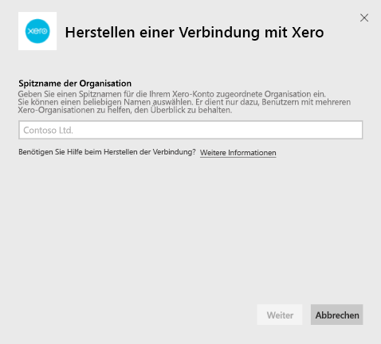

# Herstellen einer Verbindung mit Xero mithilfe von Power BI
Xero ist eine einfach zu verwendende Online-Buchhaltungssoftware, die speziell auf kleine Unternehmen zugeschnitten ist. Erstellen Sie mit diesem Power BI-Inhaltspaket ansprechende Visualisierungen basierend auf Ihren Xero-Finanzdaten. Ihr Standarddashboard umfasst viele Metriken für kleine Unternehmen, wie z.B. cash position, revenue vs. expenses, profit loss trend, debtor days und return on investment.

Stellen Sie eine Verbindung mit dem [Xero-Inhaltspaket](https://app.powerbi.com/getdata/services/xero) für Power BI her, oder erfahren Sie mehr über die [Xero- und Power BI](https://help.xero.com/Power-BI)-Integration.

## Herstellen der Verbindung
1. Wählen Sie unten im linken Navigationsbereich **Daten abrufen** aus.
   
   
2. Wählen Sie im Feld **Dienste** die Option **Abrufen**aus.
   
   
3. Wählen Sie **Xero** \> **Abrufen** aus.
   
   
4. Geben Sie einen Spitznamen für die Ihrem Xero-Konto zugeordnete Organisation ein. Der Name kann beliebig sein. Er dient nur dazu, Benutzern mit mehreren Xero-Organisationen zu helfen, den Überblick zu behalten. Weitere Informationen finden Sie weiter [unten](#FindingParams).
   
   
5. Wählen Sie als **Authentifizierungsmethode** **OAuth** aus. Melden Sie sich bei Ihrem Xero-Konto an, wenn Sie dazu aufgefordert werden, und wählen Sie die Organisation aus, mit der Sie eine Verbindung herstellen möchten. Sobald die Anmeldeinformationen eingegeben sind, wählen Sie **Anmelden** aus, um den Ladevorgang zu starten.
   
    
   
    
6. Nach der Genehmigung wird der Importvorgang automatisch gestartet. Nach Abschluss des Vorgangs werden im Navigationsbereich ein neues Dashboard, ein Bericht und ein Modell angezeigt. Wählen Sie das Dashboard aus, um die importierten Daten anzuzeigen.
   
     

**Was nun?**

* Versuchen Sie, am oberen Rand des Dashboards [im Q&A-Feld eine Frage zu stellen](consumer/end-user-q-and-a.md).
* [Ändern Sie die Kacheln](service-dashboard-edit-tile.md) im Dashboard.
* [Wählen Sie eine Kachel aus](consumer/end-user-tiles.md), um den zugrunde liegenden Bericht zu öffnen.
* Zwar ist Ihr Dataset auf tägliche Aktualisierung festgelegt, jedoch können Sie das Aktualisierungsintervall ändern oder über **Jetzt aktualisieren** nach Bedarf aktualisieren.

## Inhalt
Das Dashboard des Inhaltspakets enthält Kacheln und Metriken, die verschiedene Bereiche abdecken, mit entsprechenden Berichten, um mehr zu erfahren:  

| Area | Dashboard Tiles | Report |
| --- | --- | --- |
| Cash |Daily cash flow  Cash in  Cash out  Closing balance by account  Closing balance today |Bank Accounts |
| Customer |Invoiced sales  Invoiced sales by customer  Invoiced sales growth trend  Invoices due  Outstanding receivables  Overdue receivables |Customer  Inventory |
| Supplier |Billed purchases  Billed purchases by supplier  Billed purchases growth trend   Bills due  Outstanding payables  Overdue payables |Suppliers  Inventory |
| Inventory |Monthly sales amount by product |Inventory |
| Profit and loss |Monthly profit and loss  Net profit this fiscal year  Net profit this month  Top expense accounts |Profit and Loss |
| Balance sheet |Total assets  Total liabilities  Equity |Balance Sheet |
| Gesundheit |Current ratio  Gross profit percentage   Return on total assets  Total liabilities to equity ratio |Gesundheit  Glossar und technische Hinweise |

Das Dataset enthält außerdem die folgenden Tabellen, mit denen Sie Ihre Berichte und Dashboards anpassen können:  

* Addresses  
* Alerts  
* Bank Statement Daily Balance  
* Bank Statements  
* Kontakte  
* Expense Claims  
* Invoice Line Items  
* Invoices  
* Items  
* Month End  
* Organisation  
* Trial Balance  
* Xero Accounts

## Systemanforderungen
Die folgenden Rollen sind für den Zugriff auf das Xero-Inhaltspaket erforderlich: „Standard + Berichte“ oder „Advisor“.

## Suchen von Parametern
Geben Sie einen Namen für Ihre Organisation an, um sie in Power BI zu verfolgen. Dadurch können Sie eine Verbindung mit mehreren verschiedenen Organisationen herstellen. Beachten Sie, dass Sie nicht mehrmals eine Verbindung mit derselben Organisation herstellen können, da dies Auswirkungen auf die geplante Aktualisierung hat.   

## Problembehandlung
* Xero-Benutzer benötigen die folgenden Rollen für den Zugriff auf das Xero-Inhaltspaket für Power BI: „Standard + Berichte“ oder „Advisor“: „Standard + Berichte“ oder „Advisor“. Das Inhaltspaket beruht auf den benutzerbasierten Berechtigungen für den Zugriff auf Berichtsdaten über Power BI.  
* Wenn der Ladevorgang längere Zeit in Anspruch nimmt und dann eine Fehlermeldung angezeigt wird, halten Sie fest, wie lange es gedauert hat, bis der Fehler angezeigt wurde. Beachten Sie, dass das durch Xero bereitgestellte Zugriffstoken nur für 30 Minuten gilt. Wenn ein Konto also mehr Daten enthält, als in dieser Zeit geladen werden können, tritt ein Fehler auf. Wir arbeiten derzeit daran, dies zu verbessern.
* Während des Ladens befinden sich die Kacheln auf dem Dashboard in einem generischen Ladezustand. Dies ändert sich erst nach erfolgreichem Abschluss des Ladevorgangs. Wenn Sie über den Abschluss des Ladevorgangs benachrichtigt werden, aber die Kacheln sich noch immer im Ladezustand befinden, aktualisieren Sie die Dashboardkacheln mit dem „...“ in der oberen rechten Ecke des Dashboards.
* Wenn Ihr Inhaltspaket nicht aktualisiert wird, überprüfen Sie, ob Sie mit derselben Organisation in Power BI mehr als einmal eine Verbindung hergestellt haben. Xero lässt nur eine einzige aktive Verbindung mit einer Organisation zu. Wenn Sie mit derselben Organisation mehr als einmal eine Verbindung herstellen, wird eine Fehlermeldung angezeigt, die angibt, dass Ihre Anmeldeinformationen ungültig sind.  
* Bei Problemen mit der Verbindung mit dem Xero-Inhaltspaket für Power BI, wie z.B. Fehlermeldungen oder sehr langsamen Ladezeiten, löschen Sie zunächst den Cache/die Cookies, starten Sie den Browser neu, und stellen Sie anschließend erneut eine Verbindung mit Power BI her.  

Bei anderen Problemen füllen Sie bitte ein Ticket unter http://support.powerbi.com aus, falls das Problem weiterhin besteht.

## Nächste Schritte
[Erste Schritte mit Power BI](service-get-started.md)

[Abrufen von Daten in Power BI](service-get-data.md)

