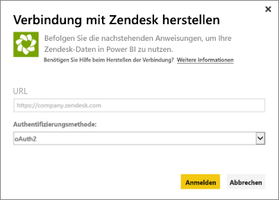

# Herstellen einer Verbindung mit Zendesk mithilfe von Power BI

Dieser Artikel führt Sie durch Abrufen von Daten aus Ihrem Zendesk-Konto mit einer Power BI-app-Vorlage. Der Zendesk-app bietet ein Power BI-Dashboard und einen Satz von Power BI-Berichten, die Einblicke in Ihr ticketaufkommen und die agentleistung bieten. Die Daten werden automatisch einmal täglich aktualisiert. 

Nachdem Sie die Vorlagen-app installiert haben, können Sie anpassen, das Dashboard und Bericht an, dass Sie besonders interessierenden Informationen hervorzuheben. Anschließend können Sie sie als app an Kollegen in Ihrer Organisation verteilen.

Stellen Sie eine Verbindung mit dem [Zendesk-Inhaltspaket](https://app.powerbi.com/getdata/services/zendesk) her, oder erfahren Sie mehr über die [Zendesk-Integration](https://powerbi.microsoft.com/integrations/zendesk) in Power BI.

Nachdem Sie die Vorlagen-app installiert haben, können Sie auf dem Dashboard und Bericht ändern. Anschließend können Sie sie als app an Kollegen in Ihrer Organisation verteilen.

>[!NOTE]
>Sie benötigen ein Zendesk-Administrator-Konto eine Verbindung herstellen. Weitere Informationen zu den [Anforderungen](#system-requirements) finden Sie unten.

## Herstellen der Verbindung

[!INCLUDE [powerbi-service-apps-get-more-apps](./includes/powerbi-service-apps-get-more-apps.md)]

3. Wählen Sie **Zendesk** \> **jetzt**.
4. In **dieses Power BI-App installieren?** wählen **installieren**.
4. In der **Apps** wählen Sie im Bereich der **Zendesk** Kachel.

    

6. In **beginnen Sie mit der neuen app**Option **Verbindungsdaten**.

    

4. Stellen Sie die Ihrem Konto zugeordnete URL bereit. Die URL weist das Format **https://company.zendesk.com** . Nachstehend finden Sie weitere Informationen zum [Suchen dieser Parameter](#finding-parameters).
   
   

5. Wenn Sie dazu aufgefordert werden, geben Sie Ihre Zendesk-Anmeldeinformationen ein.  Wählen Sie **oAuth 2** als Authentifizierungsmechanismus aus, und klicken Sie dann auf **Anmelden**. Befolgen Sie die Anweisungen bei der Zendesk-Authentifizierung. (Wenn Sie bereits bei Zendesk in Ihrem Browser angemeldet sind, können Sie nicht zur Eingabe von Anmeldeinformationen aufgefordert werden.)
   
   > [!NOTE]
   > Dieses Inhaltspaket erfordert, dass Sie eine Verbindung mit einem Zendesk-Administrator-Konto herstellen. 
   > 
   
   
6. Klicken Sie auf **Zulassen** , um Power BI den Zugriff auf Ihre Zendesk-Daten zu gewähren.
   
   
7. Klicken Sie auf **Verbinden** , um den Importvorgang zu starten. 
8. Nachdem Power BI die Daten importiert hat, Sie finden Sie unter der Liste mit Inhalt für Ihre Zendesk-app: ein neues Dashboard, Bericht und Dataset.
9. Wählen Sie das Dashboard zum Starten des Prozesses durchsuchen.

    
   
## Ändern Sie und verteilen Sie Ihre app

Sie haben die Zendesk-app-Vorlage installiert. Das bedeutet, dass Sie auch den Zendesk-app-Arbeitsbereich erstellt haben. Im Arbeitsbereich können Sie den Bericht und das Dashboard zu ändern und verteilen Sie es als ein *app* an Kollegen in Ihrer Organisation. 

1. Wählen Sie zum Anzeigen der gesamte Inhalt des dem neuen Zendesk-Arbeitsbereich, in der linken Navigationsleiste **Arbeitsbereiche** > **Zendesk**. 

    

    Diese Ansicht ist die Liste mit den Inhalten für den Arbeitsbereich. In der oberen rechten Ecke finden Sie **app aktualisieren**. Wenn Sie Ihre app an Ihre Kollegen verteilen möchten, ist, in dem Sie beginnen. 

    

2. Wählen Sie **Berichte** und **Datasets** die anderen Elementen im Arbeitsbereich angezeigt.

    Erfahren Sie mehr über [Verteilen von apps](service-create-distribute-apps.md) an Ihre Kollegen.

## Systemanforderungen
Ein Zendesk-Administratorkonto ist erforderlich, um auf das Zendesk-Inhaltspaket zuzugreifen. Wenn Sie einen Agent oder Endbenutzer sind und Ihre Zendesk-Daten anzeigen möchten, fügen Sie einen Vorschlag hinzu, und überprüfen Sie den Zendesk-Connector in der [Power BI Desktop](desktop-connect-to-data.md).

## Suchen von Parametern
Ihre Zendesk-URL stimmt mit der URL überein, die Sie zum Anmelden bei Ihrem Zendesk-Konto verwenden. Wenn Sie Ihre Zendesk-URL nicht kennen, können Sie die [Hilfe bei der Anmeldung](https://www.zendesk.com/login/) von Zendesk nutzen.

## Problembehandlung
Wenn Sie beim Herstellen einer Verbindung Probleme auftreten, überprüfen Sie Ihre Zendesk-URL, und bestätigen Sie, dass Sie ein Zendesk-Administratorkonto verwenden.

## Nächste Schritte

* [Erstellen Sie die neue Arbeitsbereiche in Power BI](service-create-the-new-workspaces.md)
* [Installieren und Verwenden von Apps in Power BI](consumer/end-user-apps.md)
* [Verbinden Sie mit Power BI-apps für externe Dienste](service-connect-to-services.md)
* Haben Sie Fragen? [Stellen Sie Ihre Frage in der Power BI-Community.](http://community.powerbi.com/)

