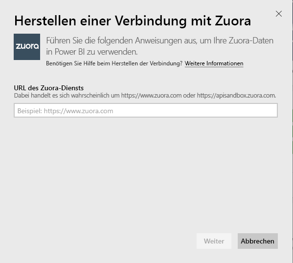
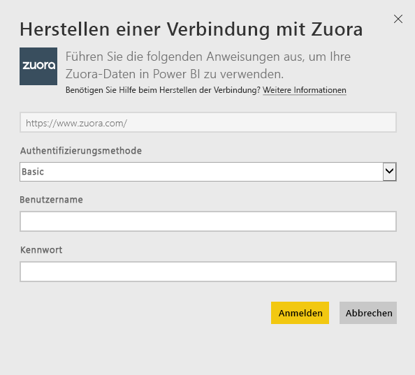
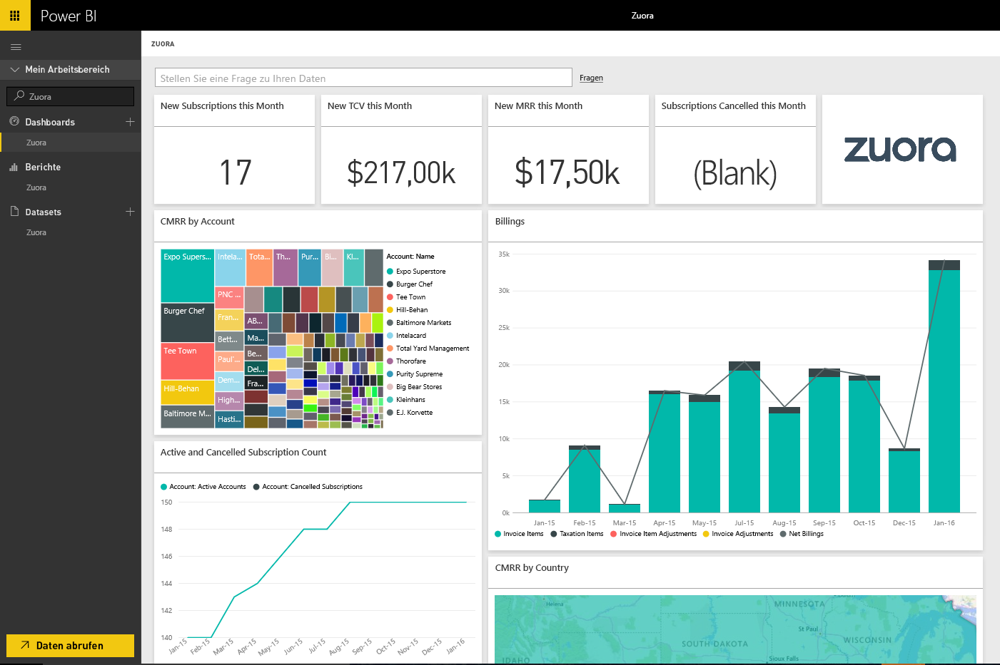

# Herstellen einer Verbindung mit Zuora mithilfe von Power BI
Mit Zuora für Power BI können Sie wichtige Umsatzerlös-, Abrechnungs- und Abonnementdaten visuell darstellen. Verwenden Sie die standardmäßigen Dashboards und Berichte, um Nutzungstrends zu analysieren, Abrechnungen und Zahlungen nachzuverfolgen und wiederkehrende Umsatzerlöse zu überwachen, oder passen Sie sie an Ihre eigenen Anforderungen an Dashboards und Berichte an.

Stellen Sie eine Verbindung mit [Zuora](https://app.powerbi.com/getdata/services/Zuora) für Power BI her.

## Herstellen der Verbindung
1. Wählen Sie unten im linken Navigationsbereich **Daten abrufen** aus.

   
2. Wählen Sie im Feld **Dienste** die Option **Abrufen**aus.

   
3. Wählen Sie **Zuora** \> **Abrufen** aus.

   
4. Geben Sie Ihre Zuora-URL an. Diese lautet in der Regel „<https://www.zuora.com>“. Unten finden Sie Einzelheiten zum [Suchen dieser Parameter](#FindingParams).

   
5. Wählen Sie als **Authentifizierungsmethode****Standard** aus, und geben Sie Ihren Benutzernamen und Ihr Kennwort ein (Groß- und Kleinschreibung müssen beachtet werden), und wählen Sie dann **Anmelden**aus.

    
6. Nach der Genehmigung wird der Importvorgang automatisch gestartet. Nach Abschluss des Vorgangs werden im Navigationsbereich ein neues Dashboard, ein Bericht und ein Modell angezeigt. Wählen Sie das Dashboard aus, um die importierten Daten anzuzeigen.

     

**Was nun?**

* Versuchen Sie, am oberen Rand des Dashboards [im Q&A-Feld eine Frage zu stellen](power-bi-q-and-a.md).
* [Ändern Sie die Kacheln](service-dashboard-edit-tile.md) im Dashboard.
* [Wählen Sie eine Kachel aus](service-dashboard-tiles.md), um den zugrunde liegenden Bericht zu öffnen.
* Ihr Dataset ist auf eine tägliche Aktualisierung festgelegt. Sie können jedoch das Aktualisierungsintervall ändern oder es über **Jetzt aktualisieren** nach Bedarf aktualisieren.

## Inhalt
Das Inhaltspaket verwendet die Zuora AQUA-API zum Abrufen von Daten aus den folgenden Tabellen:

| Tabellen |  |  |
| --- | --- | --- |
| Account |InvoiceItemAdjustment |Refund |
| AccountingCode |Payment |RevenueSchedule |
| AccountingPeriod |PaymentMethod |RevenueScheduleItem |
| BillTo |Product |Subscription |
| DateDim |ProductRatePlan |TaxationItem |
| Invoice |ProductRatePlanCharge |Verwendung |
| InvoiceAdjustment |RatePlan | |
| InvoiceItem |RatePlanCharge | |

Es enthält auch diese berechneten Measures:

| Measure | Beschreibung | Pseudo-Berechnung |
| --- | --- | --- |
| Account: Payments |Gesamtsumme der Zahlungsbeträge in einem bestimmten Zeitraum, basierend auf dem tatsächlichen Zahlungszeitpunkt. |SUM (Payment.Amount)  WHERE Payment.EffectiveDate =< TimePeriod.EndDate AND Payment.EffectiveDate >= TimePeriod.StartDate |
| Account: Refunds |Gesamtsumme der Erstattungsbeträge in einem bestimmten Zeitraum, basierend auf dem Erstattungsdatum. Die Gesamtsumme wird als eine negative Zahl zurückgegeben. |-1*SUM(Refund.Amount) WHERE Refund.RefundDate =< TimePeriod.EndDate AND    Refund.RefundDate >= TimePeriod.StartDate |
| Account: Net Payments |Kontozahlungen plus Kontoerstattungen in einem bestimmten Zeitraum. |Account.Payments + Account.Refunds |
| Account: Active Accounts |Die Summe der Konten, die in einem bestimmten Zeitraum aktiv waren. Abonnements müssen vor (oder an) dem Startdatum des Zeitraums gestartet sein. |COUNT (Account.AccountNumber) WHERE     Subscription.Status != "Expired" AND    Subscription.Status != "Draft" AND    Subscription.SubscriptionStartDate <= TimePeriod.StartDate AND    (Subscription.SubscriptionEndDate > TimePeriod.StartDate OR Subscription.SubscriptionEndDate = null) –evergreen subscription |
| Account: Average Recurring Revenue |Brutto-MRR pro aktivem Konto in einem bestimmten Zeitraum. |Gross MRR / Account.ActiveAccounts |
| Account: Cancelled Subscriptions |Die Summe der Konten, die in einem bestimmten Zeitraum ein Abonnement gekündigt haben. |COUNT (Account.AccountNumber) WHERE Subscription.Status = "Cancelled" AND    Subscription.SubscriptionStartDate <= TimePeriod.StartDate AND    Subscription.CancelledDate >= TimePeriod.StartDate |
| Account: Payment Errors |Gesamtwert der Zahlungsfehler. |SUM (Payment.Amount) WHERE Payment.Status = "Error" |
| Revenue Schedule Item: Recognized Revenue |Gesamtsumme der Umsatzrealisierungen in einem Abrechnungszeitraum. |SUM (RevenueScheduleItem.Amount) WHERE AccountingPeriod.StartDate = TimePeriod.StartDate |
| Subscription: New Subscriptions |Die Summe der neuen Abonnements in einem bestimmten Zeitraum. |COUNT (Subscription.ID) WHERE Subscription.Version = "1" AND    Subscription.CreatedDate <= TimePeriod.EndDate AND    Subscription.CreatedDate >= TimePeriod.StartDate |
| Invoice: Invoice Items |Gesamtsumme der Rechnungspostenbeträge in einem bestimmten Zeitraum. |SUM (InvoiceItem.ChargeAmount) WHERE     Invoice.Status = "Posted" AND Invoice.InvoiceDate <= TimePeriod.EndDate AND Invoice.InvoiceDate >= TimePeriod.StartDate |
| Invoice: Taxation Items |Gesamtsumme der auf einen Rechnungsposten angefallenen Steuern in einem bestimmten Zeitraum. |SUM (TaxationItem.TaxAmount) WHERE Invoice.Status = "Posted" AND Invoice.InvoiceDate <= TimePeriod.EndDate AND Invoice.InvoiceDate >= TimePeriod.StartDate |
| Invoice: Invoice Item Adjustments |Gesamtsumme der Änderungen, die in einem bestimmten Zeitraum an einem Rechnungsposten vorgenommen wurden. |SUM (InvoiceItemAdjustment.Amount)  WHERE     Invoice.Status = "Posted" AND InvoiceItemAdjustment.AdjustmentDate <= TimePeriod.EndDate AND    InvoiceItemAdjustment.AdjustmentDate >= TimePeriod.StartDate |
| Invoice: Invoice Adjustments |Gesamtsumme der Änderungen, die in einem bestimmten Zeitraum an einer Rechnung vorgenommen wurden. |SUM (InvoiceAdjustment.Amount)  WHERE     Invoice.Status = "Posted" AND InvoiceAdjustment.AdjustmentDate <= TimePeriod.EndDate AND    InvoiceAdjustment.AdjustmentDate >= TimePeriod.StartDate |
| Invoice: Net Billings |Summe der Rechnungsposten, Steuer auf Rechnungsposten, Änderungen an Rechnungsposten und Änderungen an Rechnungen in einem bestimmten Zeitraum. |Invoice.InvoiceItems + Invoice.TaxationItems + Invoice.InvoiceItemAdjustments + Invoice.InvoiceAdjustments |
| Invoice: Invoice Aging Balance |Summe der gebuchten Rechnungssaldos. |SUM (Invoice.Balance)  WHERE     Invoice.Status = "Posted" |
| Invoice: Gross Billings |Summe der Rechnungspostenbeträge für gebuchte Rechnungen in einem bestimmten Zeitraum. |SUM (InvoiceItem.ChargeAmount)  WHERE     Invoice.Status = "Posted" AND Invoice.InvoiceDate <= TimePeriod.EndDate AND Invoice.InvoiceDate >= TimePeriod.StartDate |
| Invoice: Total Adjustments |Summe der verarbeiteten Änderungen an Rechnungen und Rechnungsposten, die den gebuchten Rechnungen zugeordnet sind. |SUM (InvoiceAdjustment.Amount)  WHERE     Invoice.Status = "Posted" AND InvoiceAdjustment.Status = "Processed" + SUM (InvoiceItemAdjustment.Amount)  WHERE     Invoice.Status = "Posted" AND invoiceItemAdjustment.Status = "Processed" |
| Rate Plan Charge: Gross MRR |Summe der monatlich wiederkehrenden Umsätze von Abonnements in einem bestimmten Zeitraum. |SUM (RatePlanCharge.MRR)  WHERE     Subscription.Status != "Expired" AND    Subscription.Status != "Draft" AND    RatePlanCharge.EffectiveStartDate <= TimePeriod.StartDate AND RatePlanCharge.EffectiveEndDate > TimePeriod.StartDate     OR    RatePlanCharge.EffectiveEndDate = null --evergreen subscription |

## Systemanforderungen
Zugriff auf die Zuora-API ist erforderlich.

## Suchen von Parametern
Geben Sie die URL an, mit der Sie sich in der Regel anmelden, um auf Ihre Zuora-Daten zugreifen. Die gültigen Optionen sind:  

* https://www.zuora.com  
* https://www.apisandbox.zuora.com  
* Die Ihrer Dienstinstanz entsprechende URL  

## Problembehandlung
Das Zuora-Inhaltspaket berücksichtigt viele unterschiedliche Aspekte Ihres Zuora-Kontos. Wenn Sie bestimmte Features nicht verwenden, sind die dazugehörigen Kacheln/Berichte ggf. leer. Wenn Sie Probleme beim Laden haben, wenden Sie sich an den Power BI-Support.

## Nächste Schritte
[Erste Schritte mit Power BI](service-get-started.md)

[Abrufen von Daten in Power BI](service-get-data.md)
