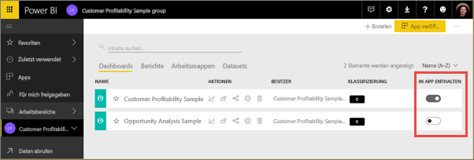
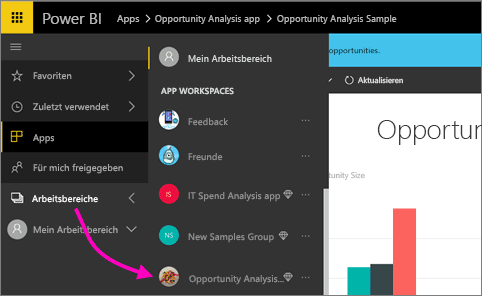
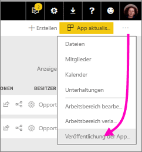

# Veröffentlichen einer app in Powerbi

In Power BI können Sie offiziellen verpackt Inhalt erstellen und dann an eine Breite Zielgruppe als Verteilen einer *app*. Sie können Apps in *App-Arbeitsbereichen* erstellen, in denen Sie mit Ihren Kollegen zusammen an Power BI-Inhalten arbeiten können. Anschließend können Sie die fertigen Apps für große Personengruppen in Ihrer Organisation veröffentlichen. 

Ihre Geschäftskunden benötigen für den Betrieb ihres Unternehmens häufig mehrere Power BI-Dashboards und -Berichte. Mit Power BI-Apps können Sie Sammlungen von Dashboards und Berichten erstellen und diese Apps in Ihrer gesamten Organisation oder für bestimmte Personen oder Gruppen veröffentlichen. Apps vereinfachen das Verwalten von Berechtigungen für derartige Sammlungen für Berichtersteller und Administratoren.

Geschäftskunden erhalten Ihre apps auf verschiedene Weise:

- Suchen und Installieren der app in Microsoft AppSource
- Sie können sie einen direkten Link senden.
- Sie können sie automatisch in den Power BI-Konten Ihrer Kollegen installieren, wenn Ihr Power BI-Administrator Ihnen die Berechtigung dazu erteilt.

Sie können die app einen eigenen integrierten Navigation zu erstellen, sodass Ihre Benutzer ihren Weg auf Ihre Inhalte leicht finden können. Der Inhalt der app ändern nicht. Sie können mit ihnen in Power BI-Dienst oder eine mobile App - interagieren – filtern, hervorheben und Sortieren der Daten selbst. Sie erhalten Updates automatisch, und Sie können steuern, wie oft die Daten aktualisiert werden. Erfahren Sie mehr über die [Nutzung von Apps durch Geschäftskunden](consumer/end-user-apps.md).

## Lizenzen für Apps
Zum Erstellen oder eine app aktualisieren, benötigen Sie eine Power BI Pro-Lizenz. Für app *Consumer*, es gibt zwei Optionen zur Verfügung.

* Option 1: Alle Geschäftsbenutzer benötigen **Power BI Pro**-Lizenzen, um Ihre App anzeigen zu können. 
* Option 2: Wenn Ihre app-Arbeitsbereich in einer Power BI Premium-Kapazität befindet, können free-Benutzer in Ihrer Organisation auf app-Inhalte anzeigen. Details finden Sie unter [Was ist Power BI Premium?](service-premium.md).

## Veröffentlichen der App
Wenn die Dashboards und Berichte in Ihrem Arbeitsbereich bereit sind, wählen Sie aus, welche Dashboards und Berichte Sie veröffentlichen möchten. Anschließend veröffentlichen Sie diese als App. 

1. In der Listenansicht des Arbeitsbereichs, zu entscheiden, welche Dashboards und Berichte, die gewünschten **in app eingeschlossen**.

     

     Wenn Sie sich nicht um einen Bericht einschließen, die ein dazugehöriges Dashboard auswählen, sehen Sie eine Warnung neben dem Bericht. Sie können die app veröffentlichen, aber im entsprechenden Dashboard keine Kacheln aus diesem Bericht.

     

2. Wählen Sie die **app veröffentlichen** -Schaltfläche in der oberen rechten Ecke, um den Prozess zum Erstellen und Veröffentlichen einer app aus dem Arbeitsbereich zu starten.
   
     

3. Auf **Setup**, geben Sie Name und Beschreibung können Personen, die die app zu finden. Sie können ein Farbdesign aus, um ihn zu personalisieren festlegen. Sie können auch einen Link zu einer Support-Website hinzufügen.
   
     

4. Auf **Navigation**, Sie wählen Sie den Inhalt als Teil der app veröffentlicht wird. Dann fügen Sie die app-Navigation verwendet werden, um den Inhalt in den Abschnitten zu organisieren. Finden Sie unter [entwerfen Sie die Navigation für Ihre app](#design-the-navigation-experience-for-your-app) in diesem Artikel Weitere Informationen.
   
     

5. Auf **Zugriff**, fest, wer Zugriff auf die app hat. 
    - In [klassischen Arbeitsbereiche](service-create-workspaces.md): alle Benutzer in Ihrer Organisation, bestimmte Personen oder Sicherheitsgruppen von Azure Active Directory (AAD).
    - In der [neue Erfahrung Arbeitsbereiche](service-create-the-new-workspaces.md): bestimmte Personen, AAD-Sicherheitsgruppen und Verteilerlisten und Office 365-Gruppen.

6. Wenn Sie über Berechtigungen verfügen, können Sie die app automatisch installieren, für die Empfänger. Power BI-Administratoren können diese Einstellung im Power BI-Verwaltungsportal aktivieren. Erfahren Sie mehr über [automatisch installieren einer app](#automatically-install-apps-for-end-users) in diesem Artikel.

     

7. Bei der Auswahl **app veröffentlichen**, daraufhin wird eine Meldung zur Bestätigung zum Veröffentlichen bereit ist. In der **diese app freigeben** im Dialogfeld können Sie die URL, die einen direkten Link zu dieser app kopieren.
   
     

Sie können senden, direkten Link an die Personen die App wurde freigegeben haben, oder sie können Ihre app auf der Registerkarte "Apps" zu finden **herunterladen und erkunden Sie weitere apps aus AppSource**. Erfahren Sie mehr über die [Nutzung von Apps durch Geschäftskunden](consumer/end-user-apps.md).

## Ändern der veröffentlichten App
Nachdem Sie Ihre App veröffentlicht haben, möchten Sie sie eventuell ändern oder aktualisieren. Es ist einfach zu aktualisieren, wenn Sie ein Administrator oder Mitglied in der neuen app-Arbeitsbereichs sind. 

1. Öffnen Sie den App-Arbeitsbereich, der der App entspricht. 
   
     

2. Stellen Sie alle gewünschten Änderungen an den Dashboards oder Berichte.
 
     Der App-Arbeitsbereich ist der Stagingbereich. Deshalb werden Ihre Änderungen nicht in Echtzeit in der App angezeigt, bis Sie die App erneut veröffentlichen. So können Sie Änderungen vornehmen, ohne dass sich diese auf die veröffentlichten Apps auswirken.  
 
    > [!IMPORTANT]
    > Wenn Sie einen Bericht zu entfernen und die app aktualisieren, auch wenn Sie den Bericht an die app hinzufügen, verlieren die app-Benutzer alle Anpassungen wie das Lesezeichen, Kommentare usw. an.  
 
3. Wechseln Sie zurück zur Liste app-Arbeitsbereich der Inhalt, und wählen **app aktualisieren** in der oberen rechten Ecke.
   
1. Update **Setup**, **Navigation**, und **Berechtigungen**, wenn Sie möchten, und wählen Sie dann **app aktualisieren**.
   
Den Personen, für die Sie die App veröffentlicht haben, wird automatisch die aktualisierte Version der App angezeigt. 

## Entwerfen Sie die Navigation für Ihre app
Die **neue Navigation Generator** Option können Sie eine benutzerdefinierte Navigation für Ihre app zu erstellen. Die benutzerdefinierte Navigation erleichtert es für Ihre Benutzer zu suchen und Verwenden von Inhalt in der app. Vorhandene apps verfügen über diese Option deaktiviert und neue apps sind standardmäßig die Option auf.

Wenn die Option deaktiviert ist, klicken Sie auf die **Landing Page der App** entweder **bestimmte Inhalte**zum Beispiel ein Dashboard oder Bericht, oder wählen Sie **keine** eine einfache Liste der anzuzeigenden der Inhalt für den Benutzer.

Wenn Sie aktivieren **neue Navigation Generator**, Sie können eine benutzerdefinierte Navigation entwerfen. Standardmäßig werden alle Berichte, Dashboards und Excel-Arbeitsmappen, die Sie in Ihrer app berücksichtigt werden soll, als flache Liste aufgeführt. 

Sie können die app-Navigation, indem weiter anpassen:
* Neuordnung der Elemente mithilfe der nach-oben / nach-unten-Taste. 
* Umbenennen von Elementen in der **melden Details**, **Dashboard-Detailfenster**, und **arbeitsmappendetails**.
* Durch das bestimmte Elemente aus dem Navigationsbereich ausblenden.
* Mithilfe der **neu** Option zum Hinzufügen von **Abschnitte** Gruppe verwandte Inhalte.
* Mithilfe der **neu** Option zum Hinzufügen einer **Link** auf eine externe Ressource auf der linken Navigationsleiste. 

Beim Hinzufügen einer **Link**im **Link Details** können Sie, bei dem auf der Link öffnet. Standardmäßig Links öffnen, in der **aktuelle Registerkarte**, Sie können jedoch **neue Registerkarte**, oder **Inhaltsbereich**. 

### Überlegungen zur Verwendung der neuen Navigation-Generator-option
Hier werden allgemeine Dinge zu bedenken, wenn den neue Generator für die Navigation zu verwenden:
* Seiten des Berichts werden im Navigationsbereich der app als einen erweiterbaren Abschnitt angezeigt.
* Wenn Sie der neuen Navigation-Generator deaktivieren, und klicken Sie dann veröffentlichen oder aktualisieren Sie Ihre app, die vorgenommenen Anpassungen gehen verloren. Beispielsweise sind die Abschnitte, Sortierung, Links und benutzerdefinierte Namen für die Navigationselemente alle verloren.

Beim Hinzufügen von Links zu Ihrer app-Navigation und die Inhaltsbereich-Option auswählen:
* Stellen Sie sicher, dass der Link eingebettet werden kann. Einige Dienste blockiert das Einbetten ihrer Inhalte in Drittanbieter-Websites wie Power BI.
* Einbetten von Power BI-Dienst-Inhalten wie Berichte oder Dashboards in anderen Arbeitsbereichen wird nicht unterstützt. 
* Einbetten von Power BI-Berichtsserver Inhalte über das systemeigene Einbetten von URL-Inhalten aus einer Bereitstellung vor Ort. Verwenden Sie die Schritte in [erstellen die Power BI Berichtsserver-URL](https://docs.microsoft.com/power-bi/report-server/quickstart-embed#creating-the-power-bi-report-server-report-url) um die URL abzurufen. Denken Sie daran regulären Authentifizierungsregeln anwenden, Anzeigen des Inhalts eine VPN-Verbindung mit dem lokalen Server erforderlich ist. 
* Eine sicherheitswarnung wird am oberen Rand die eingebetteten Inhalte angezeigt, um anzugeben, dass die Inhalte in Power BI nicht.

## Automatisches Installieren von Apps für Endbenutzer
Wenn ein Administrator Sie Berechtigungen erhalten, können Sie apps automatisch installieren *mithilfe von Push übertragen* diese für Endbenutzer bereitzustellen. Diese Funktionalität Push erleichtert es, um die richtigen apps an die richtigen Personen oder Gruppen verteilen. Ihre app wird automatisch in Ihrer Endbenutzer-Apps-Inhaltsliste angezeigt. Sie müssen keine finden sie in Microsoft AppSource, oder führen einen Link für die Installation. Sehen Sie, wie Administratoren aktivieren [apps an Endbenutzer übertragen](service-admin-portal.md#push-apps-to-end-users) im Power BI Admin Portal Artikel.

### Wie Sie eine app automatisch per Push an Endbenutzer übertragen
Sobald der Administrator Ihnen die Berechtigungen zugewiesen hat, verfügen Sie über die neue Option **install the app automatically** (App automatisch installieren). Wenn Sie das Kontrollkästchen und **app veröffentlichen** (oder **app aktualisieren**), die app wird mithilfe von Push übertragen für alle Benutzer oder Gruppen definiert, der **Berechtigungen** Abschnitt der app auf die **Zugriff** Registerkarte.

### Wie Benutzer apps erhalten, die Sie auf diese per Push übertragen
Nachdem Sie eine app übertragen, wird sie in der Liste ihrer Apps automatisch. Auf diese Weise können Sie die apps, bestimmte Benutzer oder Rollen der Auftrag in Ihrer Organisation müssen jederzeit überprüfen.

### Überlegungen zum automatischen Installieren von Apps
Beachten Sie bei der Übertragung von Apps mithilfe von Push an Benutzer folgende Punkte:

* Die automatische Installation für Benutzer einer App kann zeitaufwendig sein. Die meisten apps, die Installation sofort für Benutzer, aber die Übertragung von apps kann Zeit in Anspruch nehmen.  Dies ist von der Anzahl der Elemente in der App und der Anzahl der Personen abhängig, denen der Zugriff gewährt wird. Es wird empfohlen, die Übertragung von Apps mithilfe von Push außerhalb der Stoßzeiten und mit ausreichend Vorlaufzeit durchzuführen, bevor die Benutzer diese benötigen. Überprüfen Sie die Funktionsfähigkeit des Vorgangs mit einigen wenigen Benutzern, bevor Sie die Verfügbarkeit der App im großen Rahmen ankündigen.

* Aktualisieren Sie den Browser. Bevor die mithilfe von Push übertragene App in der Liste der Apps angezeigt wird, muss der Benutzer seinen Browser gegebenenfalls aktualisieren, schließen und neu öffnen.

* Wenn Benutzer die app in der Liste der Apps nicht sofort sehen, sollten sie aktualisieren oder zu schließen und öffnen Sie ihren Browser erneut.

* Versuchen Sie die Benutzer nicht zu überfordern. Achten Sie darauf, dass nicht zu viele Apps mithilfe von Push übertragen werden, damit die Benutzer die vorinstallierten Apps als nützlich wahrnehmen. Um ein sinnvolles Timing zu gewährleisten, sollten Sie steuern können, wer Apps mithilfe von Push an Endbenutzer übertragen kann. Richten Sie eine Anlaufstelle zum Abrufen von apps in Ihrer Organisation mithilfe von Push an Endbenutzer übertragen.

* Gastbenutzer die Einladung nicht akzeptiert haben abrufen keine apps, die die automatische Installation.  

## Aufheben der Veröffentlichung einer App
Jedes Mitglied eines App-Arbeitsbereichs kann die Veröffentlichung der App aufheben.

>[!IMPORTANT]
>Wenn Sie die Veröffentlichung einer App aufheben, gehen die Anpassungen der App-Benutzer verloren. Sie verlieren privaten Lesezeichen, Kommentare oder Abonnements, die Inhalt in der app zugeordnet ist. Heben Sie die Veröffentlichung einer App nur dann auf, wenn Sie sie entfernen müssen.
> 
> 

* Klicken Sie im App-Arbeitsbereich rechts oben auf die Auslassungspunkte ( **...** ), und wählen Sie **Veröffentlichung der App aufheben** aus.
  
     

Dadurch wird die App für alle Benutzer, für die sie veröffentlicht wurde, deinstalliert, sodass diese keinen Zugriff mehr darauf haben. Der App-Arbeitsbereich oder sein Inhalt wird dadurch nicht gelöscht.

## Anzeigen der veröffentlichten app

Wenn die app-Benutzer Ihre app öffnen, sehen sie die Navigation, die Sie erstellt, anstatt im linken Navigationsbereich standard Power BI haben. Die app-Navigation Listet die Berichte und Dashboards in den Abschnitten, die Sie definiert haben. Es enthält eine Liste mit die einzelnen Seiten in jedem Bericht stattdessen, die gerade den Namen des Berichts.

## Nächste Schritte
* [Erstellen eines App-Arbeitsbereichs](service-create-workspaces.md)
* [Installieren und Verwenden von Apps in Power BI](consumer/end-user-apps.md)
* [Power BI-Apps für externe Dienste](service-connect-to-services.md)
* [Power BI-Verwaltungsportal](https://docs.microsoft.com/power-bi/service-admin-portal)
* Haben Sie Fragen? [Stellen Sie Ihre Frage in der Power BI-Community.](http://community.powerbi.com/)
