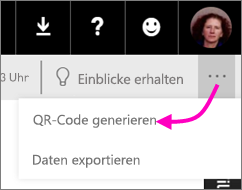
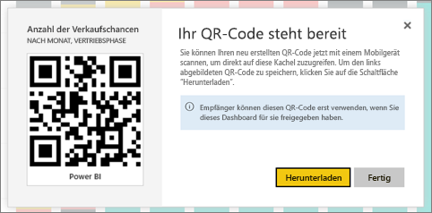

# Erstellen eines QR-Codes für eine Kachel in Power BI für die Verwendung in mobilen Apps
QR-Codes in Power BI können alle Elemente in der realen Welt direkt mit verwandten BI-Informationen verbinden – es ist keine Navigation oder Suche erforderlich.

Im Power BI-Dienst können Sie einen QR-Code für Kacheln in allen Dashboards erstellen, selbst in Dashboards, die Sie nicht bearbeiten können. Platzieren Sie den QR-Code dann an einer eindeutigen Stelle. Fügen Sie ihn beispielsweise in eine E-Mail ein, oder drucken Sie ihn aus, und stellen Sie ihn an einem bestimmten Ort bereit. 

Kollegen, mit denen Sie das Dashboard gemeinsam verwenden, können [den QR-Code für den Zugriff auf die Kachel direkt mit ihrem mobilen Gerät scannen](consumer/mobile/mobile-apps-qr-code.md). Sie können entweder den QR-Code-Scanner in der Power BI-App oder jeden anderen auf dem Gerät installierten QR-Scanner verwenden.

## Erstellen eines QR-Codes für eine Kachel
1. Öffnen Sie ein Dashboard im Power BI-Dienst.
2. Wählen Sie die Auslassungspunkte (...) in der oberen rechten Ecke der Kachel und dann **Fokusmodus**  aus.
3. Wählen Sie die Auslassungspunkte (...) in der oberen rechten Ecke und dann **QR-Code generieren**aus. 
   
    
4. Es wird ein Dialogfeld mit dem QR-Code angezeigt. 
   
    
5. Von hier aus können Sie den QR-Code scannen oder herunterladen und speichern, um folgende Aktionen durchzuführen: 
   
   * Hinzufügen zu einer E-Mail oder einem anderen Dokument 
   * Ausdrucken und Platzieren an einem bestimmten Speicherort 

## Drucken des QR-Codes
Power BI generiert den QR-Code für den Druck als JPG-Datei. 

1. Wählen Sie **Herunterladen** aus, und öffnen Sie dann die JPG-Datei auf einem Computer, der mit einem Drucker verbunden ist.  
   
   > [!TIP]
   > Die JPG-Datei hat denselben Namen wie die Kachel. Beispiel: „Anzahl Verkaufschancen – nach Monat, Vertriebsphase.jpg".
   > 
   > 
2. Drucken Sie die Datei mit einer Größe von 100 % oder in „Originalgröße“.  
3. Schneiden Sie den QR-Code aus, und kleben Sie ihn an einem für die Kachel relevanten Ort auf. 

## Nächste Schritte
* [Connect to Power BI data from the real world](consumer/mobile/mobile-apps-data-in-real-world-context.md) (Verbinden mit realen Power BI-Daten mit den Apps für mobile Geräte)
* [Scannen eines Power BI-QR-Codes mit einem mobilen Gerät](consumer/mobile/mobile-apps-qr-code.md)
* [Erstellen eines QR-Codes für einen Bericht](service-create-qr-code-for-report.md)
* Haben Sie Fragen? [Stellen Sie Ihre Frage in der Power BI-Community.](http://community.powerbi.com/)

