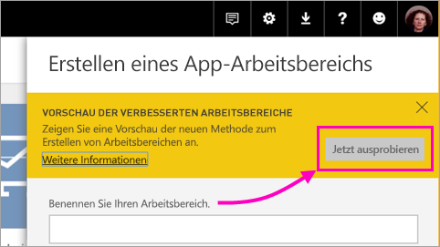
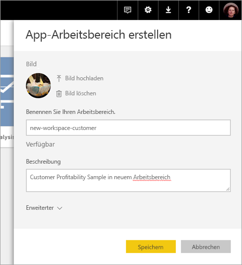
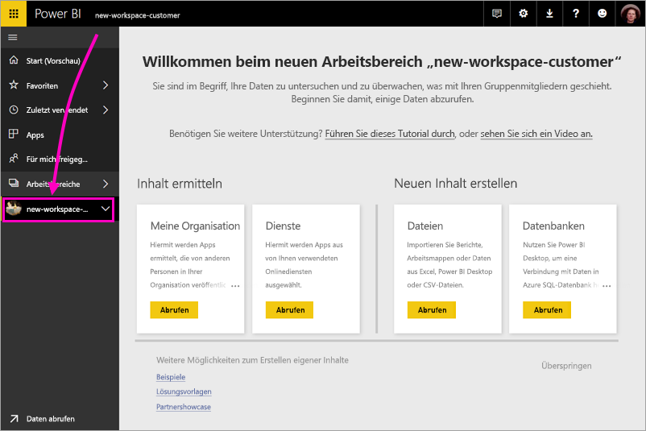
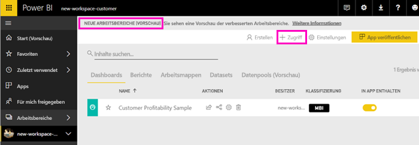
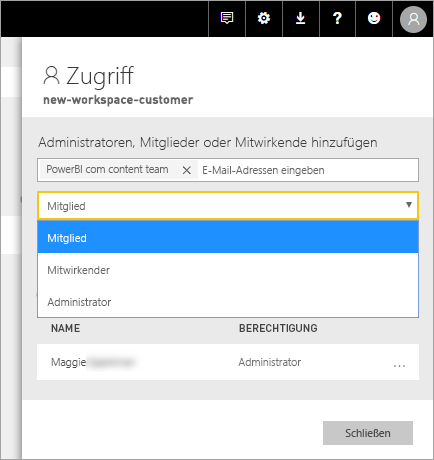

# Erstellen der neuen Arbeitsbereiche (Vorschau) in Power BI

In Power BI wird eine Vorschauversion für die neuen Arbeitsbereiche eingeführt. Arbeitsbereiche sind auch weiterhin ein Ort für die Zusammenarbeit mit Kollegen, um Sammlungen von Dashboards und Berichten zu erstellen, die Sie in *Apps* bündeln und an Ihre gesamte Organisation oder bestimmte Personen oder Gruppen verteilen können. 

Mit den neuen Arbeitsbereichen (Vorschau) können Sie nun Folgendes durchführen:

- Arbeitsbereichsrollen Benutzergruppen zuweisen: Sicherheitsgruppen, Verteilerlisten, Office 365-Gruppen und Einzelpersonen.
- Einen Arbeitsbereich in Power BI erstellen, ohne eine Office 365-Gruppe zu erstellen.
- Genauere Arbeitsbereichsrollen für flexiblere Verwaltung von Berechtigungen in einem Arbeitsbereich verwenden.
 
Wenn Sie einen der neuen Arbeitsbereiche erstellen, erstellen Sie keine zugrunde liegende, zugehörige Office 365-Gruppe. Die gesamte Arbeitsbereichsverwaltung findet in Power BI statt, nicht in Office 365. Sie können dem Arbeitsbereich immer noch eine Office 365-Gruppe hinzufügen, um den Benutzerzugriff auf Inhalte weiterhin über Office 365-Gruppen zu verwalten. Zusätzlich können Sie jedoch Sicherheitsgruppen und Verteilerlisten verwenden sowie Benutzer direkt in Power BI hinzufügen. Damit profitieren Sie von einer flexiblen Möglichkeit für die Verwaltung des Arbeitsbereichszugriffs. Da die Arbeitsbereichsverwaltung jetzt in Power BI erfolgt, entscheiden die Power BI-Administratoren, welche Benutzer in einer Organisation Arbeitsbereiche erstellen dürfen. Weitere Informationen finden Sie im [Abschnitt zu Arbeitsbereichen im Artikel zum Power BI-Verwaltungsportal](service-admin-portal.md#workspace-settings). 

Sie fügen den neuen Arbeitsbereichen Benutzergruppen oder Einzelpersonen als Mitglieder, Mitwirkende oder Administratoren hinzu. Allen Mitgliedern einer Benutzergruppe wird die von Ihnen festgelegte Rolle zugewiesen. Wenn eine Person in mehreren Benutzergruppen Mitglied ist, erhält sie die höchsten zugewiesenen Berechtigungen.  Eine Erläuterung der verschiedenen Rollen finden Sie im weiteren Verlauf dieses Artikels unter [Rollen in den neuen Arbeitsbereichen](#roles-in-the-new-workspaces).

Alle Benutzer, die Sie einem App-Arbeitsbereich hinzufügen, benötigen eine Power BI Pro-Lizenz. Im Arbeitsbereich ist die Zusammenarbeit aller Beteiligten beim Erstellen von Dashboards und Berichten möglich, die Sie für eine größere Zielgruppe oder sogar die gesamte Organisation veröffentlichen möchten. Wenn Sie Inhalte an andere Personen in Ihrer Organisation verteilen möchten, können Sie diesen Benutzern Power BI Pro-Lizenzen zuweisen oder den Arbeitsbereich in einer Power BI Premium-Kapazität hinzufügen.

Mit den neuen Arbeitsbereichen werden einige Features neu gestaltet. Im Abschnitt [App-Arbeitsbereichsfeatures mit geänderter Funktionsweise](#app-workspace-features-that-work-differently) weiter unten in diesem Artikel finden Sie eine Erläuterung der Änderungen, die nicht nur in der Vorschauversion, sondern permanent gelten werden. Da dies ein Vorschaufeature ist, gibt es einige Einschränkungen, die Sie beachten sollten. Eine Erläuterung dieser aktuellen Einschränkungen finden Sie im Abschnitt [Bekannte Probleme](#known-issues) weiter unten in diesem Artikel. 

## Rollout der neuen App-Arbeitsbereiche

Während der Vorschauphase können alte und neue Arbeitsbereiche parallel zueinander existieren, und Sie können beide erstellen. Wenn die Vorschau der neuen Arbeitsbereiche endet, und diese in die allgemeine Verfügbarkeit übergehen, werden alte Arbeitsbereiche für einen gewissen Zeitraum beibehalten. Sie können sie jedoch nicht mehr erstellen, und Sie müssen sich darauf vorbereiten, Ihre Arbeitsbereiche zur Infrastruktur der neuen Arbeitsbereiche zu migrieren. Aber keine Sorge, Ihnen werden mehrere Monate zur Verfügung stehen, um diese Migration abzuschließen.

## Erstellen eines neuen App-Arbeitsbereichs

1. Erstellen Sie zunächst den App-Arbeitsbereich. Wählen Sie **Arbeitsbereiche** > **App-Arbeitsbereich erstellen** aus.
   
     

2. Klicken Sie unter **Vorschau der verbesserten Arbeitsbereiche** auf **Jetzt testen**.
   
     

2. Benennen Sie den Arbeitsbereich. Wenn der Name nicht verfügbar ist, geben Sie eine eindeutige ID ein.
   
     Die App wird den gleichen Namen wie der Arbeitsbereich haben.
   
1. Fügen Sie optional ein Bild hinzu. Die Dateigröße darf 45 KB nicht überschreiten.
 
    

1. Wählen Sie **Speichern**.

    Auf der **Willkommensseite** Ihres neuen Arbeitsbereichs können Sie Daten hinzufügen. 

    

1. Klicken Sie beispielsweise auf **Beispiele** > **Customer Profitability Sample**.

    In der Inhaltsliste im Arbeitsbereich wird nun **Neue Arbeitsbereiche (Vorschau)** angezeigt. Da Sie über Administratorrechte verfügen, wird Ihnen auch die neue Aktion **Zugriff** angezeigt.

    

1. Klicken Sie auf **Zugriff**.

1. Fügen Sie diesen Arbeitsbereichen Sicherheitsgruppen, Verteilerlisten, Office 365-Gruppen oder Einzelpersonen als Mitglieder, Mitwirkende oder Administratoren hinzu. Eine Erläuterung der verschiedenen Rollen finden Sie im weiteren Verlauf dieses Artikels unter [Rollen in den neuen Arbeitsbereichen](#roles-in-the-new-workspaces).

    

9. Klicken Sie auf **Hinzufügen** > **Schließen**.

1. Der Arbeitsbereich wird in Power BI erstellt und geöffnet. Er wird in der Liste der Arbeitsbereiche angezeigt, deren Mitglied Sie sind. Da Sie Administrator sind, können Sie auf die Auslassungspunkte (...) klicken, um zurückzukehren, und Änderungen an Arbeitsbereichseinstellungen vornehmen, neue Mitglieder hinzufügen oder deren Berechtigungen ändern.

     

## Hinzufügen von Inhalt zum App-Arbeitsbereich

Nachdem Sie einen neuen App-Arbeitsbereich erstellt haben, ist es Zeit, diesem Inhalte hinzuzufügen. Das Hinzufügen von Inhalt ist in den alten und neuen Arbeitsbereichen ähnlich, mit einer Ausnahme. Sie können in beiden Versionen von App-Arbeitsbereichen Dateien hochladen oder Verbindungen mit ihnen herstellen, wie Sie es in „Mein Arbeitsbereich“ tun würden. In den neuen Arbeitsbereichen können Sie keine Verbindung mit organisationsbezogenen Inhaltspaketen oder Inhaltspaketen von Drittanbietern herstellen, z.B. Microsoft Dynamics CRM, Salesforce oder Google Analytics. In den aktuellen Arbeitsbereichen können Sie eine Verbindung mit Inhaltspaketen herstellen.

Wenn Sie Inhalte in der Inhaltsliste eines App-Arbeitsbereichs anzeigen, wird der Name des Arbeitsbereichs als Besitzer aufgeführt.

### Herstellen einer Verbindung mit Drittanbieterdiensten in neuen Arbeitsbereichen (Vorschau)

In den neuen Arbeitsbereichen rücken Apps in den Vordergrund. Apps für Drittanbieterdienste erleichtern es Benutzern, Daten von den Diensten abzurufen, die sie verwenden, z.B. Microsoft Dynamics CRM, Salesforce oder Google Analytics.
Organisationsbezogene Apps stellen Ihren Benutzern die internen Daten zur Verfügung, die sie benötigen. Es sind weitere Funktionen für organisationsbezogene Apps geplant, damit Benutzer den Inhalt anpassen können, den sie in den Apps finden. Damit entfällt die Notwendigkeit von Inhaltspaketen. 

Mit der Vorschauversion der neuen Arbeitsbereiche können Sie keine organisationsbezogenen Inhaltspakete erstellen oder nutzen. Stattdessen können Sie die Apps verwenden, die zum Herstellen einer Verbindung mit Drittanbieterdiensten bereitgestellt werden, oder fordern Sie Ihre internen Teams dazu auf, Apps für Inhaltspakete bereitzustellen, die Sie derzeit verwenden. 

## Rollen in den neuen Arbeitsbereichen

Mit Rollen können Sie verwalten, wer welche Aktionen in einem Arbeitsbereich durchführen kann. So können Teams zusammenarbeiten. Mithilfe der neuen Arbeitsbereiche können Sie Einzelpersonen und Benutzergruppen Rollen zuweisen: Sicherheitsgruppen, Office 365-Gruppen und Verteilerlisten. 

Wenn Sie einer Benutzergruppe Rollen zuweisen, verfügen die Personen in der Gruppe über Zugriffsberechtigungen für Inhalte. Wenn Sie Benutzergruppen schachteln, verfügen alle Benutzer über die Berechtigung. Ein Benutzer, der in mehreren Benutzergruppen mit verschiedenen Rollen Mitglied ist, erhält die höchsten ihm zugewiesenen Berechtigungen. 

Die neuen Arbeitsbereiche bieten drei Rollen: Administratoren, Mitglieder und Mitwirkende.

**Administratoren können folgende Aktionen durchführen:**

- Den Arbeitsbereich aktualisieren und löschen. 
- Personen hinzufügen/entfernen (einschließlich anderer Administratoren).
- Alle Aktionen ausführen, die Mitglieder ausführen können.

**Mitglieder können folgende Aktionen durchführen:** 

- Mitglieder oder andere Benutzer mit niedrigeren Berechtigungen hinzufügen.
- Apps veröffentlichen und aktualisieren.
- Elemente und Apps freigeben.
- Anderen erlauben, Elemente erneut freizugeben.
- Alle Aktionen ausführen, die Mitwirkende ausführen können.

**Mitwirkende können folgende Aktionen durchführen:** 

- Inhalte im Arbeitsbereich erstellen, bearbeiten und löschen. 
- Berichte im Arbeitsbereich veröffentlichen und Inhalt löschen.
- Sie können neuen Benutzern jedoch keinen Zugriff auf Inhalt gewähren und keine neuen Inhalte freigeben. Allerdings können sie Inhalte für jemanden freigeben, für den der Arbeitsbereich, das Element oder die App bereits freigegeben ist. 
- Keine Mitglieder der Gruppe bearbeiten.
 
Durch den Dienst werden Workflows für die Zugriffsanforderung erstellt, damit Benutzer, die keinen Zugriff haben, diesen anfordern können. Derzeit sind Workflows für die Zugriffsanforderung für Dashboards, Berichte und Apps verfügbar.

## Verteilen einer App

Wenn der Inhalt bereit ist, können Sie auswählen, welche Dashboards und Berichte Sie veröffentlichen möchten. Anschließend veröffentlichen Sie diese als *App*. Sie können über jeden Arbeitsbereich eine App erstellen. Ihre Kollegen können Ihre App auf verschiedene Weise abrufen. Sie können sie automatisch in den Power BI-Konten Ihrer Kollegen installieren, wenn Ihr Power BI-Administrator Ihnen die Berechtigung dazu erteilt. Andernfalls können diese Ihre App über Microsoft AppSource finden und installieren, oder Sie können Ihren Kollegen einen direkten Link senden. Sie erhalten Updates automatisch, und Sie können steuern, wie oft die Daten aktualisiert werden. Ausführliche Informationen finden Sie unter [Veröffentlichen von Apps mit Dashboards und Berichten in Power BI](service-create-distribute-apps.md).

## Konvertieren alter App-Arbeitsbereiche in neue App-Arbeitsbereiche

Während der Vorschauphase können Sie ihre alten App-Arbeitsbereiche nicht automatisch in neue konvertieren. Sie können jedoch einen neuen App-Arbeitsbereich erstellen und Ihren Inhalt dort veröffentlichen. 

Wenn die neuen Arbeitsbereiche in die allgemeine Verfügbarkeit übergehen, können Sie die alten Arbeitsbereiche automatisch migrieren. Nach Eintritt der allgemeinen Verfügbarkeit müssen Sie sie migrieren.

## Power BI-Apps – Häufig gestellte Fragen

### Inwiefern unterscheiden sich die neuen App-Arbeitsbereiche von den aktuellen App-Arbeitsbereichen?
* Beim Erstellen von App-Arbeitsbereichen werden keine entsprechenden Entitäten in Office 365 erstellt, wie es bei aktuellen App-Arbeitsbereichen noch der Fall ist. (Sie können Ihrem Arbeitsbereich weiterhin eine Office 365-Gruppe hinzufügen, indem Sie eine Rolle zuweisen.) 
* In den aktuellen App-Arbeitsbereichen können Sie den Listen der Mitglieder und Administratoren nur Einzelpersonen hinzufügen. In den neuen App-Arbeitsbereichen können Sie diesen Listen mehrere AD-Sicherheitsgruppen, Verteilerlisten oder Office 365-Gruppen hinzufügen, um die Benutzerverwaltung zu vereinfachen. 
- Sie können ein organisationsbezogenes Inhaltspaket über einen aktuellen Arbeitsbereich erstellen. Über den neuen App-Arbeitsbereich können Sie diese nicht erstellen.
- Über einen aktuellen App-Arbeitsbereich können Sie ein organisationsbezogenes Inhaltspaket nutzen. Über den neuen App-Arbeitsbereich können Sie diese nicht nutzen.
- Während der Vorschauphase sind einige Funktionen der neuen App-Arbeitsbereiche noch nicht aktiviert. Weitere Informationen finden Sie im [nächsten Abschnitt](service-create-the-new-workspaces.md#other-planned-new-app-workspace-preview-features).

## Geplante Vorschaufeatures für die neuen App-Arbeitsbereiche

Einige weitere Vorschaufeatures für die neuen App-Arbeitsbereiche befinden sich noch in der Entwicklung. Bei Veröffentlichung der Vorschauversion werden sie jedoch noch nicht verfügbar sein:

- Es gibt keine Schaltfläche **Arbeitsbereich verlassen**.
- Nutzungsmetriken werden noch nicht unterstützt.
- Funktionsweise von Premium: Sie können Arbeitsbereiche in einer Premium-Kapazität zuweisen und erstellen. Um einen Arbeitsbereich jedoch zwischen Kapazitäten zu verschieben, müssen Sie die Einstellungen des Arbeitsbereichs öffnen.
- Das Einbetten von SharePoint-Webparts wird noch nicht unterstützt.
- Es gibt keine **OneDrive**-Schaltfläche für Office 365-Gruppen unter „Daten abrufen“ und „Dateien abrufen“.

## App-Arbeitsbereichsfeatures mit geänderter Funktionsweise

Einige Features funktionieren in den neuen App-Arbeitsbereichen anders als in den aktuellen App-Arbeitsbereichen. Diese Unterschiede sind beabsichtigt und basieren auf Feedback, das von Kunden gesammelt wurde. Mit diesen Änderungen wird ein flexiblerer Ansatz für die Zusammenarbeit in Arbeitsbereichen geboten:

- Mitglieder, die eine erneute Freigabe durchführen oder nicht durchführen können: ersetzt durch die Rolle „Mitwirkender“.
- Schreibgeschützte Arbeitsbereiche: Anstatt Benutzern schreibgeschützten Zugriff auf einen Arbeitsbereich zu gewähren, weisen Sie Benutzern die in Kürze verfügbare Rolle „Anzeigender Benutzer“ zu, die einen ähnlichen schreibgeschützten Zugriff auf den Inhalt eines Arbeitsbereichs umfasst.

## Bekannte Probleme

Die folgenden Probleme sind bekannt, und Fehlerbehebungen sind in der Entwicklung:

- Free-Benutzer oder Benutzergruppen, die als Empfänger von E-Mail-Abonnements hinzugefügt wurden, erhalten keine E-Mails, obwohl sie sollten. Das Problem tritt auf, wenn der neue Arbeitsbereich sich in einer Premium-Kapazität befindet, aber der Bereich „Mein Arbeitsbereich“ des Benutzers, der das Abonnement abschließt, sich nicht in einer Premium-Kapazität befindet. Wenn „Mein Arbeitsbereich“ sich in einer Premium-Kapazität befindet, erhalten Free-Benutzer und Benutzergruppen die E-Mails.
- Nachdem ein Arbeitsbereich aus einer Premium-Kapazität in eine freigegebene Kapazität verschoben wurde, erhalten Free-Benutzer und Benutzergruppen in manchen Fällen weiterhin E-Mails, obwohl dies nicht der Fall sein sollte. Das Problem tritt auf, wenn der Bereich „Mein Arbeitsbereich“ des Benutzers, der das Abonnement abschließt, sich in einer Premium-Kapazität befindet.

## Nächste Schritte
* [Create the current workspaces (Erstellen der aktuellen Arbeitsbereiche)](service-create-workspaces.md)
* [Installieren und Verwenden von Apps in Power BI](service-create-distribute-apps.md)
* Haben Sie Fragen? [Stellen Sie Ihre Frage in der Power BI-Community.](http://community.powerbi.com/)
