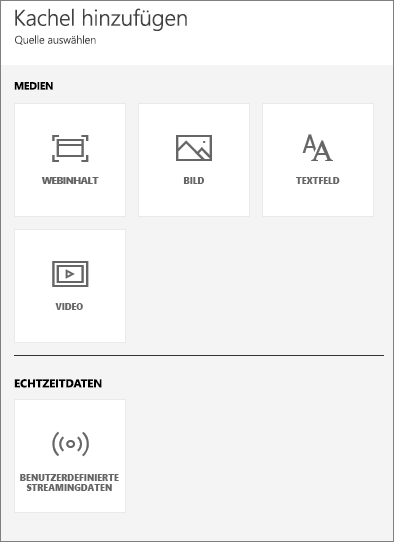
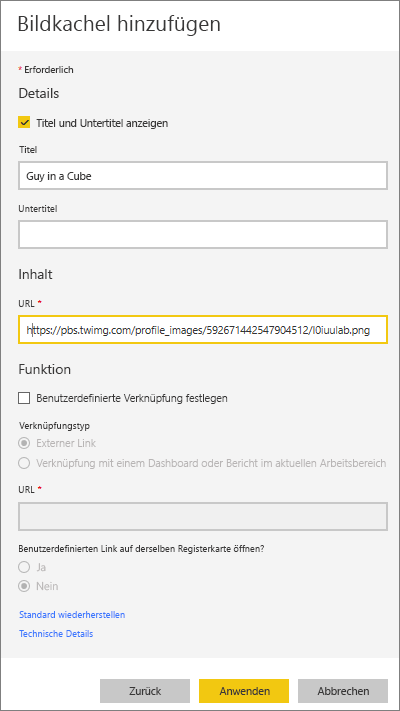
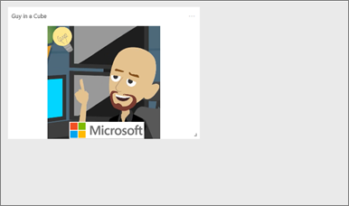
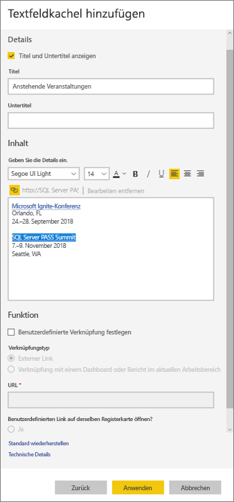
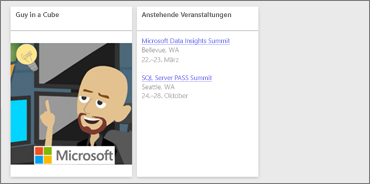
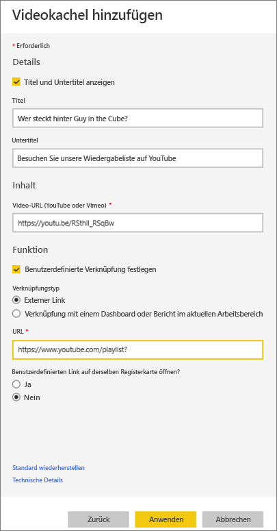
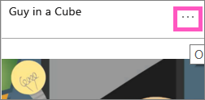

# <a name="add-image-text-video-and-more-to-your-dashboard"></a>Hinzufügen von Bildern, Text, Video und weiteren Elementen zu Ihrem Dashboard
<iframe width="560" height="315" src="https://www.youtube.com/embed/e2PD8m1Q0vU" frameborder="0" allowfullscreen></iframe>


## <a name="add-tile"></a>Kachel hinzufügen
Mithilfe des Steuerelements **Kachel hinzufügen** können Sie Ihrem Dashboard direkt ein Bild, ein Textfeld, ein Video, Streamingdaten oder Webcode hinzufügen.

1. Wählen Sie auf der oberen Menüleiste **Kachel hinzufügen** aus. Je nach verfügbarem Platz sehen Sie möglicherweise nur das Pluszeichen .
   
    
2. Wählen Sie den Typ der Kachel aus, die Sie hinzufügen möchten: **Bild**, **Textfeld**, **Video**, **Webinhalt** oder **Benutzerdefinierte Streamingdaten**.
   
    

## <a name="add-an-image"></a>Hinzufügen von Bildern
Angenommen, Ihr Firmenlogo oder ein anderes Bild soll auf dem Dashboard angezeigt werden. Sie müssen die Bilddatei online speichern und eine Verknüpfung zu der Datei erstellen. Stellen Sie sicher, dass für den Zugriff auf die Bilddatei keine speziellen Anmeldeinformationen erforderlich sind. So muss beispielsweise für OneDrive und SharePoint eine Authentifizierung ausgeführt werden. Daher können dort gespeicherte Bilder nicht auf diese Weise dem Dashboard hinzugefügt werden.  

1. Wählen Sie **Bild** > **Weiter**.
2. Fügen Sie im Fenster **Bildkachel hinzufügen** Bildinformationen hinzu.
   
    
   
   * Um einen Titel oberhalb des Bilds anzuzeigen, wählen Sie *Titel und Untertitel anzeigen* aus, und geben Sie einen Titel und/oder einen Untertitel aus.
   * Geben Sie die Bild-URL ein.
   * Um die Kachel als Link zu aktivieren, wählen Sie **Benutzerdefinierte Verknüpfung festlegen** aus, und geben Sie die URL ein.  Wenn Arbeitskollegen auf dieses Bild oder diese Kachel klicken, gelangen Sie zur angegebenen URL.
   * Wählen Sie **Übernehmen**aus.  Ändern Sie auf dem Dashboard die Größe und Position des Bilds nach Bedarf.
     
     

## <a name="add-a-text-box-or-dashboard-heading"></a>Hinzufügen eines Textfelds oder einer Dashboardüberschrift
1. Wählen Sie **Textfeld > Weiter**.
   
   > **HINWEIS**: Fügen Sie eine Dashboardüberschrift hinzu, indem Sie diese in das Textfeld eingeben und die Schrift vergrößern.
   > 
2. Formatieren Sie das Textfeld:
   
   * Um einen Titel oberhalb des Textfelds anzuzeigen, wählen Sie **Titel und Untertitel anzeigen** aus, und geben Sie einen Titel und/oder einen Untertitel aus.
   * Geben Sie den Inhalt für das Textfeld ein, und formatieren Sie ihn.  
   * Legen Sie optional einen benutzerdefinierten Link für den Titel fest. Bei einem benutzerdefinierten Link kann es sich um eine externe Website oder ein Dashboard oder einen Bericht im Arbeitsbereich handeln. Allerdings haben wir in diesem Beispiel Hyperlinks innerhalb des Textfelds selbst hinzugefügt, daher lassen wir **Benutzerdefinierte Verknüpfung festlegen** deaktiviert.

     
   
3. Klicken Sie auf **Übernehmen**.  Ändern Sie auf dem Dashboard die Größe und Position des Textfelds nach Bedarf.
   
   

## <a name="add-a-video"></a>Hinzufügen von Videos
Wenn Sie Ihrem Dashboard eine YouTube- oder Vimeo-Videokachel hinzufügen, wird das Video direkt auf Ihrem Dashboard abgespielt.

1. Wählen Sie **Video > Weiter**.
2. Fügen Sie im Bereich **Videokachel hinzufügen** Videoinformationen hinzu.
   
    
   
   * Um oben in der Videokachel einen Titel und Untertitel anzuzeigen, wählen Sie *Titel und Untertitel anzeigen* aus, und geben Sie einen Titel und/oder einen Untertitel aus. In diesem Beispiel fügen wir einen Untertitel hinzu und wandeln ihn dann in einen Link zur gesamten Wiedergabeliste auf YouTube um.
   * Geben Sie die URL für das Video ein.
   * Fügen Sie einen Link für den Titel und Untertitel hinzu.  Möglicherweise möchten Sie Ihren Arbeitskollegen die Möglichkeit geben, nach dem Abspielen des eingebetteten Videos die gesamte Wiedergabeliste auf YouTube anzusehen – fügen Sie hier einen Link zu Ihrer Wiedergabeliste hinzu.
   * Wählen Sie **Übernehmen**aus.  Ändern Sie auf dem Dashboard die Größe und Position der Videokachel nach Bedarf.
     
      
3. Wählen Sie die Videokachel aus, um das Video abzuspielen.
4. Wählen Sie den Untertitel aus, um zur Wiedergabeliste auf YouTube zu navigieren.

## <a name="add-streaming-data"></a>Hinzufügen von Streamingdaten
<iframe width="560" height="315" src="https://www.youtube.com/embed/kOuINwgkEkQ" frameborder="0" allowfullscreen></iframe>

## <a name="add-web-content"></a>Hinzufügen von Webinhalten
Fügen oder geben Sie HTML-Inhalte ein.  Power BI fügt diese als Kachel Ihrem Dashboard hinzu. Geben Sie den Einbindungscode manuell ein, oder kopieren Sie ihn von Websites wie u. a. Twitter, YouTube und embed.ly.

1. Wählen Sie **Webinhalt > Weiter**.
2. Machen Sie im Bereich **Webinhaltskachel hinzufügen** die erforderlichen Eingaben.
   
    
   
   * Um einen Titel oberhalb der Kachel anzuzeigen, wählen Sie *Titel und Untertitel anzeigen* aus und geben einen Titel und/oder Untertitel ein.
   * Geben Sie den Einbindungscode ein. In diesem Beispiel wird ein Twitter-Feed kopiert und eingefügt.
3. Wählen Sie **Übernehmen**aus.  Ändern Sie auf dem Dashboard die Größe und Position der Webinhaltskachel nach Bedarf.
     
      

## <a name="tips-for-embedding-web-content"></a>Tipps für das Einbinden von Webinhalten
* Verwenden Sie für Iframes eine sichere Quelle. Wenn Sie Ihren iframe-Einbindungscode eingeben und eine leere Kachel erhalten, prüfen Sie, ob Sie **http** für die iframe-Quelle verwenden.  Falls ja, ändern Sie die Angabe in **https**.
  
  ```
  <iframe src="https://xyz.com">
  ```
* Bearbeiten Sie die Informationen zu Breite und Höhe. Dieser Einbindungscode bindet ein Video ein und legt den Videoplayer auf 560 x 315 Pixel fest.  Diese Größe wird beim Ändern der Kachelgröße nicht geändert.
  
  ```
  <iframe width="560" height="315"
  src="https://www.youtube.com/embed/Cle_rKBpZ28" frameborder="0"
   allowfullscreen></iframe>
  ```
  
  Wenn die Größe des Players entsprechend zur Kachelgröße geändert werden soll, legen Sie Breite und Höhe auf 100 % fest.
  
  ```
  <iframe width="100%" height="100%"
  src="https://www.youtube.com/embed/Cle_rKBpZ28" frameborder="0"
   allowfullscreen></iframe>
  ```
* Dieser Code bettet einen Tweet ein und behält (separat auf dem Dashboard) Links zum **AFK**-Podcast, zur **@GuyInACubeTwitter-Seite**, zu **Follow**, **#analytics**, **Reply**, **Retweet** und **Like** bei.  Wenn Sie die Kachel selbst auswählen, gelangen Sie zum Podcast auf Twitter.
  
  ```
  <blockquote class="twitter-tweet" data-partner="tweetdeck">
  <p lang="en" dir="ltr">Listen to
  <a href="https://twitter.com/GuyInACube">@GuyInACube</a> talk to
  us about making videos about Microsoft Business Intelligence
  platform
  <a href="https://t.co/TmRgalz7tv">https://t.co/TmRgalz7tv </a>
  <a href="https://twitter.com/hashtag/analytics?src=hash">
  #analytics</a></p>&mdash; AFTK Podcast (@aftkpodcast) <a
  href="https://twitter.com/aftkpodcast/status/693465456531771392">
  January 30, 2016</a></blockquote> <script async src="//platform.twitter.com/widgets.js" charset="utf-8"></script>
  ```

## <a name="edit-a-tile"></a>Bearbeiten einer Kachel
So nehmen Sie Änderungen an einer Kachel vor...

1. Zeigen Sie auf die rechte obere Ecke der Kachel, und wählen Sie die Auslassungspunkte aus.
   
    
2. Wählen Sie das Bearbeiten-Symbol aus, um den Bereich **Kacheldetails** erneut zu öffnen und Änderungen vorzunehmen.
   
    

## <a name="considerations-and-troubleshooting"></a>Zu beachtende Aspekte und Problembehandlung
* Um das Verschieben der Kachel auf dem Dashboard zu vereinfachen, fügen Sie einen Titel und/oder Untertitel hinzu.
* Wenn Sie einige Inhalte von einer Website einbinden möchten, aber die Website keinen Einbindungscode zum Kopieren und Einfügen bietet, finden Sie auf „embed.ly“ Hilfe zum Generieren des Einbindungscodes.

## <a name="next-steps"></a>Nächste Schritte
[Dashboardkacheln](service-dashboard-tiles.md)

Weitere Fragen? [Wenden Sie sich an die Power BI-Community](http://community.powerbi.com/).

