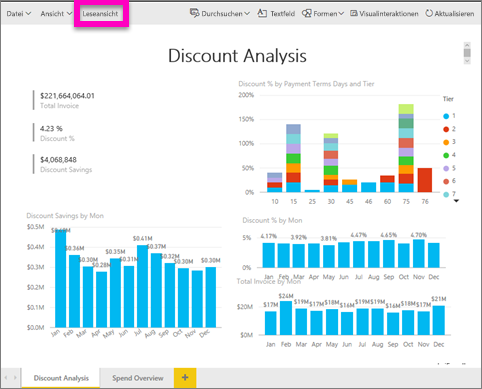
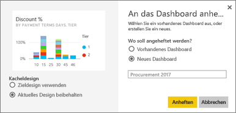

# Erstellen eines Power BI-Dashboards aus einem Bericht
Sie haben [Dashboards in Power BI](service-dashboards.md) gelesen, und jetzt möchten Sie Ihr eigenes erstellen. Ein Dashboard kann auf verschiedene Arten erstellt werden, beispielsweise aus einem Bericht, von Grund auf neu, aus einem Dataset oder durch Duplizieren eines vorhandenen Dashboards.  In diesem Thema und dem zugehörigen Video erfahren Sie, wie Sie ein neues Dashboard durch Anheften von Visualisierungen aus einem vorhandenen Bericht erstellen.

> **HINWEIS**: Dashboards sind ein Feature des Power BI-Diensts und nicht von Power BI Desktop. Obwohl Dashboards nicht mit Power BI Mobile erstellt werden können, lassen sie sich dort [anzeigen und freigeben](mobile-apps-view-dashboard.md).
> 
> 

## Video: Erstellen eines Dashboards durch Anheften von Visuals und Bildern aus einem Bericht
Amanda zeigt Ihnen, wie Sie ein neues Dashboard erstellen, indem Sie Visualisierungen aus einem Bericht anheften. Wenn Sie es selbst ausprobieren möchten, verwenden Sie das Beispiel für die Beschaffungsanalyse, und befolgen Sie die Schritte unter dem Video.

<iframe width="560" height="315" src="https://www.youtube.com/embed/lJKgWnvl6bQ" frameborder="0" allowfullscreen></iframe>

## Importieren eines Datasets mit einem Bericht
Wir werden eines der Beispiel-Power BI-Datasets importieren, um damit unser neues Dashboard zu erstellen. Das Beispiel ist eine Excel-Arbeitsmappe mit zwei PowerView-Tabellen. Wenn Sie die Arbeitsmappe in Power BI importieren, werden ein Dataset und ein Bericht Ihrem Arbeitsbereich hinzugefügt.  Der Bericht wird automatisch aus den PowerView-Tabellen erstellt.

1. [Folgen Sie diesem Link](http://go.microsoft.com/fwlink/?LinkId=529784), um die Excel-Datei des Beispiels für die Beschaffungsanalyse herunterzuladen und zu speichern. Wir empfehlen, die Datei in OneDrive for Business zu speichern.
2. Öffnen Sie den Power BI-Dienst in einem Browser (app.powerbi.com).
3. Wählen Sie einen vorhandenen Arbeitsbereich aus, oder erstellen Sie einen neuen App-Arbeitsbereich.
4. Wählen Sie im linken Navigationsbereich **Daten abrufen** aus.
   
    
5. Wählen Sie **Dateien**aus.
   
   
6. Navigieren Sie zum Speicherort der Excel-Datei des Beispiels für die Beschaffungsanalyse. Wählen Sie die Datei und dann **Verbinden** aus.
   
   
7. Wählen Sie für diese Übung **Importieren** aus.
   
    
8. Wenn die Erfolgsmeldung angezeigt wird, schließen Sie sie mit **x**.
   
   

### Öffnen des Berichts und Anheften von Kacheln an ein Dashboard
1. Wählen Sie in diesem Arbeitsbereich die Registerkarte **Berichte** aus. Der neu importierte Bericht wird mit einem gelben Sternchen gekennzeichnet. Wählen Sie den Namen des Berichts aus, um ihn zu öffnen.
   
    
2. Der Bericht wird in der [Leseansicht](service-interact-with-a-report-in-reading-view.md) geöffnet. Beachten Sie die zwei Registerkarten am unteren Rand: „Discount Analysis“ und „Spend Overview“. Jede Registerkarte stellt eine Seite des Berichts dar.
   
    
3. Zeigen Sie auf eine Visualisierung, um die verfügbaren Optionen anzuzeigen. Um eine Visualisierung einem Dashboard hinzuzufügen, wählen Sie das Stecknadelsymbol  aus.
   
    
4. Da wir ein neues Dashboard erstellen, wählen Sie die Option **Neues Dashboard** aus, und geben Sie einen Namen ein. 
   
   
5. Wenn Sie **Anheften** auswählen, erstellt Power BI das neue Dashboard im aktuellen Arbeitsbereich. Wenn die Meldung **An das Dashboard angeheftet** angezeigt wird, wählen Sie **Zum Dashboard wechseln** aus. Wenn Sie aufgefordert werden, den Bericht zu speichern, wählen Sie **Speichern** aus.
   
     
6. Power BI öffnet das neue Dashboard. Es enthält eine Kachel – die eben von uns angeheftete Visualisierung. 
   
   
7. Um zum Bericht zurückzukehren, wählen Sie die Kachel aus. Heften Sie einige weitere Kacheln an das neue Dashboard an. Wenn das Fenster **An das Dashboard anheften** angezeigt wird, wählen Sie dieses Mal **Vorhandenes Dashboard** aus.  
   
   

Glückwunsch, Sie haben Ihr erstes Dashboard erstellt! Da Sie jetzt über ein Dashboard verfügen, stehen Ihnen alle Möglichkeiten offen, die ein Dashboard bietet.  Wenn Sie unseren Empfehlungen folgen möchten, finden Sie unten verschiedene **Nächste Schritte**. Oder studieren Sie dieses Beispiel genauer.   

## Nächste Schritte
* [Ändern der Größe und Position von Kacheln](service-dashboard-edit-tile.md)
* [Alle wichtigen Informationen über Dashboardkacheln](service-dashboard-tiles.md)
* [Freigeben des Dashboards durch Erstellen einer App](service-create-distribute-apps.md)
* [Power BI – Grundkonzepte](service-basic-concepts.md)
* [Dashboards in Power BI](service-dashboards.md)
* [Tipps zum Gestalten überzeugender Power BI-Dashboards](service-dashboards-design-tips.md)

Weitere Fragen? [Wenden Sie sich an die Power BI-Community](http://community.powerbi.com/)

