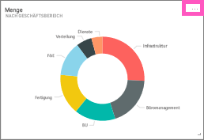

# Bearbeiten oder Entfernen einer Dashboardkachel
Sie können die Darstellung und das Standardverhalten einer Kachel in einem Dashboard ändern.

<iframe width="560" height="315" src="https://www.youtube.com/embed/lJKgWnvl6bQ" frameborder="0" allowfullscreen></iframe>

In diesem Artikel werden folgende Themen behandelt:

* [Anheften einer Kachel an ein anderes Dashboard](#different)
* [Umbenennen einer Kachel](#rename)
* [Verschieben einer Kachel](#move)
* [Ändern der Größe einer Kachel](#resize)
* [Hinzufügen eines Links zu einer Kachel](#hyperlink)
* [Löschen einer Kachel](#delete)
  
  > [!TIP]
  > Um die Visualisierung auf der Kachel selbst zu ändern, löschen Sie die Kachel, und fügen Sie eine neue [Dashboard-Kachel](service-dashboard-tiles.md) hinzu.
  > 
  > 

## Erste Schritte
1. Öffnen Sie ein [Dashboard](service-dashboards.md), das mindestens eine Kachel enthält. 
   
   
2. Zeigen Sie auf eine Dashboardkachel, und wählen Sie die Auslassungspunkte aus, um die Optionen anzuzeigen.
   
   

## Anheften der Kachel an ein Dashboard
1. Wählen Sie das Symbol **Kachel anheften**  aus.
2. Entscheiden Sie, ob Sie die Kachel an ein vorhandenes oder ein neues Dashboard anheften möchten. 
   
   
3. Wählen Sie **Anheften**aus.

- - -

## Umbenennen der Kachel und Bearbeiten von Kacheldetails
Wählen Sie das Symbol „Kacheldetails“  aus, um den Titel zu bearbeiten und den Zeitpunkt der letzten Aktualisierung anzuzeigen.

- - -

## Verschieben der Kachel
Wählen Sie die Kachel aus und halten Sie sie, um sie auf eine neue Position im Dashboardbereich zu ziehen.

- - -

## Ändern der Größe der Kachel
Sie können Kacheln in vielen unterschiedlichen Größen erstellen – von 1 x 1 Kacheleinheiten bis zu 5 x 5. Wählen Sie den Ziehpunkt (in der unteren rechten Ecke) aus, und ziehen Sie diesen, um die Größe der Kachel zu ändern.
    

- - -

## Ändern des Standardhyperlinks
Standardmäßig gelangen Sie durch Auswählen einer Kachel zu dem Bericht, in dem die Kachel erstellt wurde, oder zu Q&A (sofern die Kachel in Q&A erstellt wurde). Um eine Webseite, ein anderes Dashboard oder einen anderen Bericht (in demselben Arbeitsbereich), einen SSRS-Bericht oder andere Onlineinhalte zu verlinken, fügen Sie einen benutzerdefinierten Link hinzu:

1. Wählen Sie das Symbol **Details bearbeiten**  aus, um die Kachel zu bearbeiten.
2. Setzen Sie ein Häkchen neben **Benutzerdefinierte Verknüpfung festlegen**, und wählen Sie den Linktyp aus.    
   
   * Geben Sie für einen externen Link die entsprechende URL ein.     
   * Wählen Sie zum Verlinken mit einem Dashboard oder Bericht im aktuellen Arbeitsbereich das Dashboard oder den Bericht im Dropdownmenü aus.
   
   

- - -

## Löschen der Kachel
* Wählen Sie zum Löschen der Kachel das Symbol **Kachel löschen**  aus. Durch Löschen einer Kachel wird der zugrunde liegende Bericht oder die zugrunde liegende Visualisierung nicht gelöscht.

- - -
## Nächste Schritte
[Dashboardkacheln in Power BI](service-dashboard-tiles.md)

[Dashboards in Power BI](service-dashboards.md)

[Power BI – Grundkonzepte](service-basic-concepts.md)

Weitere Fragen? [Wenden Sie sich an die Power BI-Community](http://community.powerbi.com/)

