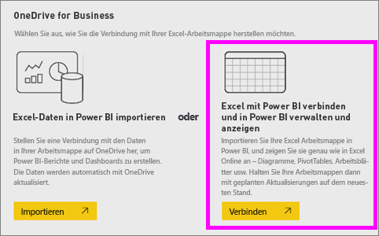
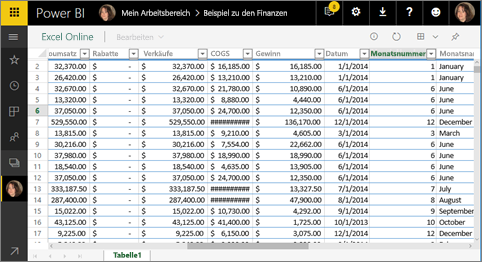
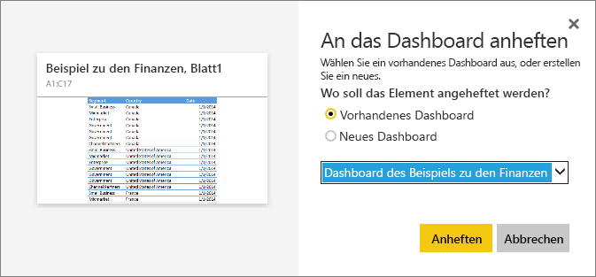
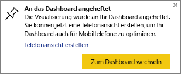

# Anheften einer Kachel an ein Power BI-Dashboard aus Excel
Bevor Sie eine Kachel aus der Excel-Arbeitsmappe anheften können, müssen Sie diese Arbeitsmappe mit dem Power BI-Dienst („app.powerbi.com“) verbinden. Durch Verbinden einer Arbeitsmappe wird im Wesentlichen eine verknüpfte schreibgeschützte Version der Arbeitsmappe im Power BI-Dienst bereitgestellt, und Sie können Bereiche an Dashboards anheften. Sie können auch ein gesamtes Arbeitsblatt an ein Dashboard anheften.  
Wenn eine Arbeitsmappe für Sie freigegeben wurde, können Sie die vom Besitzer angehefteten Kacheln anzeigen, jedoch selbst keine Dashboardkacheln erstellen. 

Ausführliche Informationen über die gemeinsame Verwendung von Excel und Power BI finden Sie unter [Abrufen von Daten aus Excel-Arbeitsmappendateien](http://go.microsoft.com/fwlink/?LinkID=521962).

Sehen Sie sich an, wie Will mehrere Verfahren zum Importieren von Daten aus Excel-Arbeitsmappen und Herstellen der Verbindung mit Excel-Arbeitsmappen vorführt.

<iframe width="560" height="315" src="https://www.youtube.com/embed/l8JoB7w0zJA" frameborder="0" allowfullscreen></iframe>

## Verbinden der Excel-Arbeitsmappe aus OneDrive for Business mit Power BI
Wenn Sie **Verknüpfen** wählen, wird die Arbeitsmappe in Power BI genauso angezeigt wie in Excel Online. Allerdings haben Sie im Gegensatz zu Excel Online einige hervorragende Funktionen zur Hand, mit denen Sie Elemente aus Arbeitsblättern direkt an Ihre Dashboards anheften können.

Sie können Ihre Arbeitsmappe in Power BI nicht bearbeiten. Sollten Sie aber Änderungen vornehmen müssen, können Sie auf der Registerkarte **Arbeitsmappen** Ihres Arbeitsbereichs das Stiftsymbol auswählen und die Arbeitsmappe dann in Excel Online bearbeiten oder lokal auf Ihrem Computer in Excel öffnen. Alle vorgenommenen Änderungen werden in der Arbeitsmappe in OneDrive gespeichert.

1. Laden Sie die Arbeitsmappe auf OneDrive for Business hoch.

2. Über Power BI [stellen Sie eine Verbindung mit der Arbeitsmappe her](service-excel-workbook-files.md), indem Sie **Daten abrufen > Dateien > OneDrive – Geschäftlich** auswählen und zum Speicherort der Excel-Datei navigieren. Wählen Sie die Datei aus, und wählen Sie **Verbinden > Verbinden**.

    

3. Die Arbeitsmappe wird in Power BI der Registerkarte **Arbeitsmappen** des Arbeitsbereichs hinzugefügt.  Das Symbol  gibt an, dass dies eine Excel-Arbeitsmappe ist, und das gelbe Sternchen gibt an, dass sie neu ist.
    
    
4. Öffnen Sie die Arbeitsmappe in Power BI, indem Sie den Namen der Arbeitsmappe auswählen.

    Änderungen an der Arbeitsmappe in Power BI werden nicht gespeichert und wirken sich nicht auf die ursprüngliche Arbeitsmappe auf OneDrive for Business aus. Wenn Sie Werte in Power BI sortieren, filtern oder ändern, können diese Änderungen nicht gespeichert oder angeheftet werden. Wenn Sie Änderungen vornehmen müssen, die gespeichert werden, klicken Sie oben rechts auf **Bearbeiten**, um sie zur Bearbeitung in Excel Online oder Excel zu öffnen. Es kann einige Minuten in Anspruch nehmen, bis die Kacheln auf den Dashboards mit den auf diese Weise vorgenommenen Änderungen aktualisiert wurden.
   
    

## Anheften eines Bereichs von Zellen an ein Dashboard
Eine Möglichkeit zum Hinzufügen einer neuen [Dashboardkachel](service-dashboard-tiles.md) ist, dies aus einer Excel-Arbeitsmappe in Power BI durchzuführen. Bereiche können aus Excel-Arbeitsmappen angeheftet werden, die in Ihrem OneDrive for Business oder einer anderen Dokumentbibliothek mit Gruppenfreigabe gespeichert wurden. Die Bereiche können Daten, Diagramme, Tabellen, PivotTables, PivotCharts und andere Excel-Elemente enthalten.

1. Markieren Sie die Zellen, die Sie an das Dashboard anheften möchten.
   
    
2. Wählen Sie das Symbol zum Anheften  aus. 
3. Heften Sie die Kachel an ein vorhandenes oder neues Dashboard an. 
   
   * Vorhandenes Dashboard: Wählen Sie den Namen des Dashboards aus der Dropdownliste aus.
   * Neues Dashboard: Geben Sie den Namen des neuen Dashboards ein.
   
    
4. Wählen Sie **Anheften**aus. Eine Erfolgsmeldung (in der Nähe der oberen rechten Ecke) weist Sie darauf hin, dass der Bereich Ihrem Dashboard als Kachel hinzugefügt wurde. 
   
    
5. Wählen Sie **Zum Dashboard wechseln** aus. Hier können Sie die angeheftete Visualisierung [umbenennen, die Größe ändern, verknüpfen und verschieben](service-dashboard-edit-tile.md). Wenn Sie die angeheftete Kachel auswählen, wird standardmäßig die Arbeitsmappe in Power BI geöffnet.

## Anheften einer kompletten Tabelle oder PivotTable an ein Dashboard
Führen Sie die oben beschriebenen Schritte aus, wählen Sie jedoch statt eines Bereichs von Zellen eine gesamte Tabelle oder PivotTable aus.

Um eine Tabelle anzuheften, wählen Sie den gesamten Bereich der Tabelle, einschließlich der Kopfzeilen, aus.  Stellen Sie zum Anheften einer PivotTable sicher, dass alle sichtbaren Elemente der PivotTable enthalten sind, einschließlich möglicherweise verwendeter Filter.

 

Eine aus einer Tabelle oder PivotTable erstellte Kachel zeigt die gesamte Tabelle an.  Wenn Sie Zeilen oder Spalten in der ursprünglichen Arbeitsmappe hinzufügen/entfernen/filtern, werden sie ebenfalls in der Kachel hinzugefügt/entfernt/gefiltert.

## Anzeigen der mit der Kachel verknüpften Arbeitsmappe
Wenn Sie eine Arbeitsmappenkachel auswählen, wird die verknüpfte Arbeitsmappe in Power BI geöffnet. Da sich die Datei im OneDrive for Business des Besitzers befindet, erfordert die Anzeige der Arbeitsmappe, dass Sie über Leseberechtigungen für die Arbeitsmappe verfügen. Wenn Sie nicht über die Berechtigungen verfügen, wird eine Fehlermeldung angezeigt.  

 

## Zu beachtende Aspekte und Problembehandlung
Nicht unterstützte Funktionen: Power BI verwendet Excel Services, um die Arbeitsmappenkacheln abzurufen. Da einige Funktionen von Excel in der Excel Services-REST-API nicht unterstützt werden, werden sie nicht auf Kacheln in Power BI angezeigt. Beispiele: Sparklines, bedingte Formatierung von Symbolsätzen und Zeitdatenschnitte. Eine vollständige Liste der nicht unterstützten Features finden Sie unter den [nicht unterstützten Features in der Excel Services-REST-API](http://msdn.microsoft.com/library/office/ff394477.aspx).

## Nächste Schritte
[Freigeben eines Dashboards mit Links zu einer Excel-Arbeitsmappe](service-share-dashboard-that-links-to-excel-onedrive.md)

[Abrufen von Daten aus Excel-Arbeitsmappendateien](service-excel-workbook-files.md)

Weitere Fragen? [Wenden Sie sich an die Power BI-Community](http://community.powerbi.com/)

