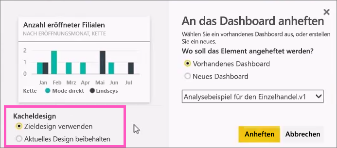

# Anheften einer Kachel an ein Power BI-Dashboard aus einem Bericht
## Anheften von Kacheln aus einem Bericht
Eine Möglichkeit zum Hinzufügen einer neuen [Dashboardkachel](service-dashboard-tiles.md) ist, dies innerhalb eines [Power BI-Berichts](service-reports.md) zu tun. Sie können sogar viele Kacheln aus einem Bericht hinzufügen.  Jede dieser Kacheln stellt, wenn angeklickt, einen Link zurück zu diesem Bericht dar.

Gesamte Berichtsseiten können an ein Dashboard angeheftet werden.  Dies wird auch bezeichnet als Anheften einer *Live* -Kachel bezeichnet.  *Live* , da Sie mit der Kachel auf dem Dashboard interagieren können und da im Gegensatz zu einzelnen Visualisierungskacheln am Bericht erfolgte Änderungen mit dem Dashboard synchronisiert werden. Weitere Informationen hierzu finden Sie nachstehend.

Kacheln aus für Sie freigegebenen Berichten oder aus Power BI Desktop können nicht angeheftet werden. 

> **TIPP**: In einigen Visualisierungen werden Hintergrundbilder verwendet. Wenn das Hintergrundbild zu groß ist, kann die Kachel möglicherweise nicht angeheftet werden.  Verringern Sie die Bildgröße, oder komprimieren Sie das Bild.  
> 
> 

## Anheften einer Kachel aus einem Bericht
Sehen Sie, wie ein Dashboard durch Anheften von Visualisierungen und Bildern aus einem Power BI-Bericht erstellt wird.

<iframe width="560" height="315" src="https://www.youtube.com/embed/lJKgWnvl6bQ" frameborder="0" allowfullscreen></iframe>

Erstellen Sie jetzt Ihr eigenes Dashboard mithilfe eines der Power BI-Beispielberichte.

1. Zeigen Sie auf die Visualisierung, die Sie anheften möchten, und wählen Sie das Anheftsymbol  aus. Power BI öffnet den Bildschirm **An Dashboard anheften** .
   
     
2. Entscheiden Sie, ob Sie die Kachel an ein vorhandenes oder ein neues Dashboard anheften möchten.
   
   * Vorhandenes Dashboard: Wählen Sie den Namen des Dashboards aus der Dropdownliste aus. Dashboards, die für Sie freigegeben wurden, werden nicht in der Dropdownliste angezeigt.
   * Neues Dashboard: Geben Sie den Namen des neuen Dashboards ein.
3. In einigen Fällen verfügt das Element, das Sie anheften möchten, möglicherweise bereits über ein *Design*.  Dies ist z. B. bei Visualisierungen aus einer Excel-Arbeitsmappe der Fall. Wenn dies der Fall ist, wählen Sie aus, welches Design auf die Kachel angewendet werden soll.
4. Wählen Sie **Anheften**aus.
   
   Eine Erfolgsmeldung (in der Nähe der oberen rechten Ecke) weist Sie darauf hin, dass die Visualisierung als Kachel zu Ihrem Dashboard hinzugefügt wurde.
   
   
5. Wählen Sie im Navigationsbereich das Dashboard mit der neuen Kachel. Wählen Sie die Kachel aus, um wieder zurück in den Bericht zu gelangen. Oder [bearbeiten Sie die Darstellung und das Verhalten der Kachel](service-dashboard-edit-tile.md).

## Anheften einer gesamten Berichtsseite
Eine weitere Option ist das Anheften einer gesamten Berichtsseite an ein Dashboard. Dies ist eine einfache Möglichkeit, mehr als eine Visualisierung gleichzeitig anzuheften.  Wenn Sie eine gesamte Seite anheften, werden Ihre Kacheln zudem *live* geschaltet. Sie können dann damit direkt auf dem Dashboard interagieren. Änderungen, die Sie im Berichts-Editor an Visualisierungen vornehmen, z. B. Hinzufügen eines Filters oder Ändern der im Diagramm verwendeten Felder, werden von der Dashboardkachel übernommen.  

Weitere Informationen finden Sie unter [Anheften einer gesamten Berichtsseite](service-dashboard-pin-live-tile-from-report.md).

## Nächste Schritte
[Dashboards in Power BI](service-dashboards.md)

[Dashboardkacheln in Power BI](service-dashboard-tiles.md)

[Berichte in Power BI](service-reports.md)

[Aktualisieren von Daten in Power BI](refresh-data.md)

[Power BI – Grundkonzepte](service-basic-concepts.md)

Weitere Fragen? [Wenden Sie sich an die Power BI-Community](http://community.powerbi.com/)

