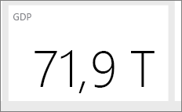

# Tipps zum Gestalten von Power BI-Dashboards
Nachdem Sie ein Dashboard erstellt und einige Kacheln hinzugefügt haben, können Sie Ihr Dashboard ansprechend und funktionell gestalten. In der Regel bedeutet das, dass die wichtigsten Informationen hervorgehoben werden, sodass das Dashboard ordentlich und übersichtlich ist.

Nachfolgend finden Sie einige Tipps.

> [!TIP]
> Viele der Entwurfsgrundlagen für Berichte gelten auch für Dashboards.  Lesen Sie unser Whitepaper [Bewährte Entwurfsmethoden für Berichte und Visualisierungen](visuals/power-bi-visualization-best-practices.md).
>
>

## Sehen Sie sich das [Webinar zur Dashboard-Überarbeitung](https://info.microsoft.com/CO-PowerBI-WBNR-FY16-05May-12-Dashboard-Makeover-Registration.html) an.
Sehen Sie, wie Marc Reguera, leitender Programm-Manager und Power BI-Dashboard-Experte bei Microsoft [Dashboard-Überarbeitungen durchführt](https://info.microsoft.com/CO-PowerBI-WBNR-FY16-05May-12-Dashboard-Makeover-Registration.html).

## Zielgruppe berücksichtigen
Wie lauten die wichtigsten Kennzahlen, um Entscheidungen zu treffen? Wie wird das Dashboard verwendet? Welche erlernten oder kulturellen Annahmen wirken sich möglicherweise auf die Gestaltung aus? Welche Informationen benötigt Ihre Zielgruppe, um erfolgreich zu sein?

Bedenken Sie, dass das Dashboard eine Übersicht ist, mit der Sie den aktuellen Status der Daten prüfen können. Das Dashboard basiert auf zugrunde liegenden Berichten und Datasets, die möglicherweise unzählige Details enthalten. Die Leser können die Berichte über Ihr Dashboard aufrufen. Nehmen Sie daher nur die Details in das Dashboard auf, die Ihre Leser prüfen sollen.

Wo wird das Dashboard angezeigt? Wird es auf einem großen Monitor angezeigt, können Sie mehr Inhalt einfügen. Wird es von Lesern auf Tablets angezeigt, ist es mit weniger Kacheln besser lesbar.

## Alle Informationen auf einen Blick
Dashboards sind dafür vorgesehen, auf einen Blick wichtige Informationen anzuzeigen. Idealerweise sollten daher alle Kacheln auf einem Bildschirm erscheinen. Können Sie Bildlaufleisten auf Ihrem Dashboard vermeiden?

Ist das Dashboard unübersichtlich?  Entfernen Sie alles bis auf die wesentlichen Informationen, die leicht gelesen und interpretiert werden können.

## Nutzen des Vollbildmodus
Zeigen Sie das Dashboard im [Vollbildmodus](consumer/end-user-focus.md) ohne störende Elemente an.

## Die wichtigsten Informationen in der größten Schrift anzeigen
Wenn die Texte und Visualisierungen auf Ihrem Dashboard alle gleich groß sind, haben die Leser Schwierigkeiten, sich auf das Wesentliche zu konzentrieren. So sind z. B. Kartenvisualisierungen eine gute Möglichkeit, wichtige Informationen anschaulich zu präsentieren:  

Stellen Sie jedoch unbedingt Kontext bereit.  

Erfahren Sie, wie Sie [eine Kachel mit nur einer Nummer erstellen](visuals/power-bi-visualization-card.md).

## Die wichtigsten Informationen in der oberen Ecke platzieren
Die meisten Personen lesen von oben nach unten. Daher sollten die wichtigsten Details oben angezeigt werden und weitere Einzelheiten in der Leserichtung Ihrer Zielgruppe eingefügt werden (von links nach rechts, von rechts nach links)

## Die richtigen Visualisierungen für die Daten verwenden und diese in ein übersichtliches Format bringen
Vermeiden Sie zahlreiche Visualisierungen auf Kosten der Vielfalt.  Visualisierungen sollten ein Bild vermitteln und leicht zu „lesen“ und interpretieren sein.  Für einige Daten und Visualisierungen reicht eine einfache grafische Visualisierung aus. Möglicherweise erfordern andere Daten eine komplexere Visualisierung – verwenden Sie Titel und Beschriftungen sowie andere Anpassungen, um das Lesen zu erleichtern.  

* [Wählen Sie die entsprechenden Datenvisualisierungen](https://www.youtube.com/watch?v=-tdkUYrzrio). Seien Sie vorsichtig mit Diagrammen, die die Realität verzerren, z. B. 3D-Diagramme. Bedenken Sie, dass das Interpretieren bestimmter Kreisformen für das menschliche Gehirn schwierig ist. Kreisdiagramme, Ringdiagramme, Messgerätdiagramme und andere Arten von Kreisdiagrammen mögen nett aussehen, sind aber nicht die optimale Lösung für die Datenvisualisierung.
* Achten Sie auf Einheitlichkeit bei den Diagrammskalen auf Achsen, der Reihenfolge der Diagrammdimensionen und den Farben der Dimensionswerte in Diagrammen.
* Stellen Sie sicher, dass quantitative Daten ansprechend verschlüsselt sind. Zeigen Sie in Telefonnummern maximal drei oder vier Ziffern am Stück an. Runden Sie Maßangaben auf eine oder zwei Stellen nach dem Dezimalkomma und unterteilen Sie Tausender oder Millionen, d. h. 3,4 Millionen anstatt 3.400.000.
* Achten Sie auf eine Trennung von Genauigkeit und Zeit. Sorgen Sie für verständliche Zeitangaben.  Zeigen Sie ein Diagramm vom letzten Monat nicht neben gefilterten Diagrammen von einem bestimmten Monat an.
* Wechseln Sie auf Skalen, z. B. auf einem Linien- oder Balkendiagramm, nicht zwischen großen und kleinen Maßeinheiten.  Beispiel: Eine Maßeinheit wird in Millionen, die andere in Tausenden angegeben.  Hier wäre es schwierig, die Differenz der Maßeinheit in Millionen und der Maßeinheit in Tausenden zu ermitteln.  Müssen Sie beide angegeben, wählen Sie eine Visualisierung, bei der eine zweite Achse möglich ist.
* Überladen Sie Ihre Diagramme nicht mit unnötigen Datenbeschriftungen. Werte in Balkendiagrammen sind in der Regel auch ohne Anzeige der tatsächlichen Zahl gut verständlich.
* Achten Sie darauf, wie die [Diagramme sortiert werden](consumer/end-user-change-sort.md).  Wenn Sie den höchsten oder niedrigsten Wert hervorheben möchten, sortieren Sie nach der Maßeinheit.  Sollen Benutzer eine bestimmte Kategorie in vielen anderen Kategorien schnell finden können, sortieren Sie nach der Achse.  
* Kreisdiagramme sind mit weniger als acht Kategorien am übersichtlichsten. Da Sie Werte nicht nebeneinander vergleichen können, sind Werte in einem Kreisdiagramm schwieriger zu vergleichen als in Balken- und Säulendiagrammen. Kreisdiagramme eignen sich besser zum Anzeigen von Teil-Ganzes-Beziehungen als zum Vergleichen der Teile. Und Messgerätdiagramme eignen sich ideal, um den aktuellen Status im Kontext eines Ziels anzuzeigen.

Weitere Informationen zur Visualisierung finden Sie unter [Visualisierungstypen in Power BI](visuals/power-bi-visualization-types-for-reports-and-q-and-a.md).  

## Weitere Informationen zu Best Practices bei der Gestaltung von Dashboards
Wenn Sie die Gestaltung erstklassiger Dashboards perfektionieren möchten, informieren Sie sich über die Gestaltgesetze der visuellen Wahrnehmung und die Kommunikation umsetzbarer Informationen im Kontext. Glücklicherweise finden Sie in vielen unserer Blogs bereits zahlreiche Informationen zu diesem Thema. Zu unseren Lieblingsbüchern (in englischer Sprache) zählen:

* *Information Dashboard Design* von Stephen Few  
* *Show Me the Numbers* von Stephen Few  
* *Now You See It* von Stephen Few  
* *Envisioning Information* von Edward Tufte  
* *Advanced Presentations* von Design by Andrew Abela   

## Nächste Schritte
[Erstellen eines Dashboards aus einem Bericht](service-dashboard-create.md)  
[Power BI – Grundkonzepte](consumer/end-user-basic-concepts.md)  
Weitere Fragen? [Wenden Sie sich an die Power BI-Community](http://community.powerbi.com/)
