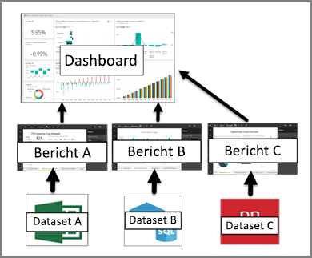

# Dashboards im Power BI-Dienst

Ein Power BI-***Dashboard*** ist eine einzelne Seite (häufig als Zeichenbereich bezeichnet), auf der mithilfe von Visualisierungen eine Geschichte erzählt wird. Wegen der Beschränkung auf eine Seite erkennen Sie ein gut gestaltetes Dashboard daran, dass die Geschichte auf ihre Kernaussagen verdichtet ist.

Dashboards sind ein Feature des Power BI-Diensts. In Power BI Desktop sind sie nicht verfügbar. Obwohl Dashboards nicht mit Mobilgeräten erstellt werden können, lassen sie sich dort [anzeigen und freigeben](mobile-apps-view-dashboard.md).

## Ersteller und Anwender von Dashboards
Erstellen Sie Dashboards für den eigenen Gebrauch, oder geben Sie sie später für Ihre Mitarbeiter frei? Weitere Informationen finden Sie unter **Dashboards für Ersteller**. Sie erhalten Dashboards von anderen? Dann möchten Sie vielleicht wissen, wie Dashboards funktionieren und wie Sie mit ihnen interagieren. Dieser Artikel ist für Sie!

### Wenn Sie Dashboards erhalten und verwenden

Die Visualisierungen auf einem Dashboard werden als *Kacheln* bezeichnet. Kacheln stammen aus Berichten von *Erstellern* von Dashboards und werden an ein Dashboard *angeheftet*. Wenn Sie mit Power BI noch nicht vertraut sind, lesen Sie den Artikel [Grundkonzepte des Power BI-Diensts](service-basic-concepts.md).

> [!IMPORTANT]
> [Power BI Pro](service-free-vs-pro.md) ist zum Anzeigen eines freigegebenen Dashboards erforderlich.

Die Visualisierungen eines Dashboards stammen aus Berichten. Jeder Bericht basiert auf einem Dataset. Sie können sich ein Dashboard als Fenster zu den zugrunde liegenden Berichten und Datasets vorstellen. Wenn Sie eine Visualisierung auswählen, gelangen Sie zu dem Bericht (und damit dem Dataset), mit dem sie erstellt wurde.

## Vorteile von Dashboards
Mit Dashboards können Sie die Entwicklung Ihres Geschäfts verfolgen, entscheidenden Fragen nachgehen und die wichtigsten Metriken immer im Auge behalten. Jede Visualisierung eines Dashboards kann auf einem oder vielen Datasets, auf einem einzelnen Bericht oder zahllosen Berichten basieren. Ein Dashboard fasst lokale und cloudbasierte Daten zusammen und bietet eine konsolidierte Ansicht – unabhängig vom Speicherort der Daten.

Ein Dashboard sieht nicht nur gut aus, es ist ausgesprochen interaktiv und immer aktuell, wenn sich die zugrunde liegenden Daten ändern.

## Vergleich: Dashboards und Berichte
Als Zeichenbereiche, die ebenfalls Visualisierungen enthalten, werden [Berichte](service-reports.md) gerne mit Dashboards verwechselt. Es gibt aber einige wichtige Unterschiede für Power BI-Verbraucher.

| **Eigenschaften** | **Dashboards** | **Berichte** |
| --- | --- | --- |
| Pages |Eine Seite |Eine oder mehrere Seiten |
| Datenquellen |Ein oder mehrere Berichte und ein oder mehrere Datasets pro Dashboard |Ein Dataset pro Bericht |
| In Power BI Desktop verfügbar |Nein |Ja, ***Ersteller*** können Berichte in Power BI Desktop erstellen und anzeigen. |
| Abonnieren |Dashboards können abonniert werden. |Berichtsseiten können abonniert werden. |
| Filter |Keine Filter, keine Slices |Viele Filter, Hervorhebungen und Slices |
| Empfohlen |Ein Dashboard kann als „ausgewähltes“ Dashboard festgelegt werden. |Ein ausgewählter Bericht kann nicht erstellt werden. |
| Favorit | Dashboards können als *Favoriten* festgelegt werden. | Berichte können als *Favoriten* festgelegt werden.
| Benachrichtigungen festlegen |Unter bestimmten Umständen für Dashboardkacheln verfügbar |Über Berichte nicht verfügbar |
| Abfragen in natürlicher Sprache |Über das Dashboard verfügbar |Über Berichte nicht verfügbar |
| Zugrunde liegende Dataset-Tabellen und Felder sichtbar |Nein. Exportieren von Daten, aber Tabellen und Felder im Dashboard nicht sichtbar |Ja. Tabellen, Felder und Werte des Datasets sichtbar |
| Anpassung |Nein |In der Leseansicht können Berichte u.a. veröffentlicht, eingebettet, gefiltert, exportiert, als PBIX heruntergeladen und in Excel analysiert werden. Außerdem können Sie verwandte Inhalte anzeigen und QR-Codes generieren.  |

## Nächste Schritte
* Machen Sie sich mit Dashboards vertraut, indem Sie sich eine Tour durch eines unserer [Beispiel-Dashboards](sample-tutorial-connect-to-the-samples.md) ansehen.
* Informieren Sie sich über [Dashboardkacheln](service-dashboard-tiles.md), und erfahren Sie, wie Sie damit interagieren.
* Sie möchten eine bestimmte Dashboardkachel im Auge behalten und eine E-Mail erhalten, wenn ein bestimmter Grenzwert erreicht wird? [Erstellen Sie Datenwarnungen auf Kacheln](service-set-data-alerts.md).
* Stellen Sie Fragen zu Dashboards. Mit [Power BI Q&A](power-bi-tutorial-q-and-a.md) können Sie Fragen zu Ihren Daten stellen und erhalten eine Antwort in Form einer Visualisierung.
