# Erstellen und Verwenden von Dataflows in Power BI (Vorschau)

Mit der erweiterten Datenaufbereitung in **Power BI** können Sie eine Sammlung von Daten erstellen, den sogenannten Dataflow. Damit können Sie eine Verbindung zu Geschäftsdaten aus verschiedenen Quellen herstellen sowie Daten bereinigen, transformieren und dann in den Power BI-Speicher laden.

Ein **Dataflow** ist eine Sammlung von *Entitäten* (Entitäten ähneln Tabellen), die in App-Arbeitsbereichen im Power BI-Dienst erstellt und verwaltet werden. Sie können Entitäten Ihrem Dataflow hinzufügen und diese bearbeiten sowie Zeitpläne zur Datenaktualisierung direkt in dem Arbeitsbereich verwalten, in dem Ihr Dataflow erstellt wurde.

Wenn Sie einen Dataflow erstellt haben, können Sie mit **Power BI Desktop** und dem **Power BI-Dienst** Datasets, Berichte, Dashboards und Apps erstellen, die auf den Daten basieren, die Sie in Power BI-Dataflows integriert haben, und so Informationen zu Ihren Geschäftsaktivitäten gewinnen.

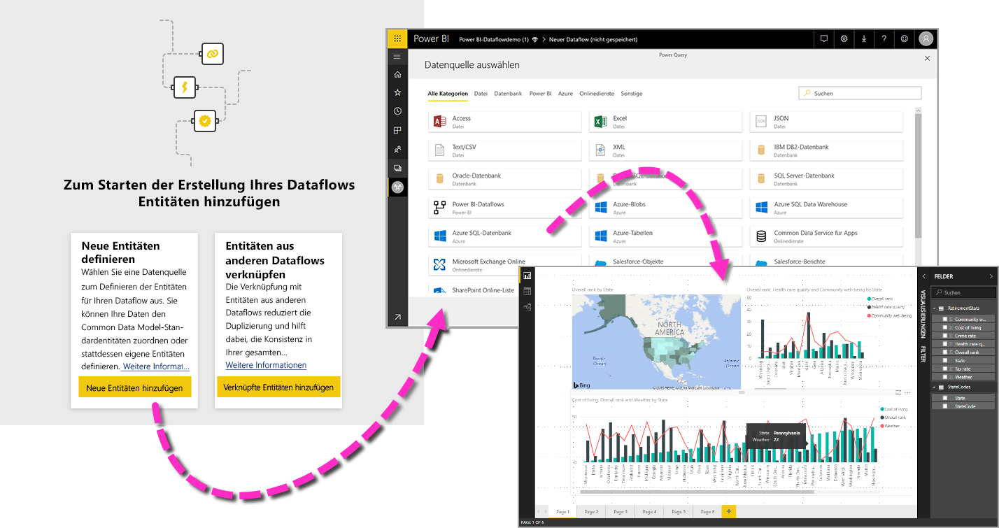

Das Verwenden eines Dataflows umfasst drei wesentliche Schritte:

1. Erstellen des Dataflows mit Microsoft-Tools, die speziell dafür konzipiert wurden
2. Planen der Aktualisierungshäufigkeit der Daten, die in Ihren Dataflow eingebunden werden
3. Erstellen des Datasets mit Ihrem Dataflow und Power BI Desktop 

Die folgenden Abschnitten widmen sich jedem dieser Schritte und stellen die dafür verfügbaren Tools vor. Fangen wir an.

> [!NOTE]
> Die Dataflowfunktionalität befindet sich in der Vorschau und unterliegt vor der allgemeinen Verfügbarkeit Änderungen und Updates.

## Erstellen eines Dataflows
Um einen Dataflow zu erstellen, starten Sie den Power BI-Dienst im Browser, und wählen Sie im Navigationsbereich links einen **App-Arbeitsbereich** aus (Dataflows sind im Power BI-Dienst unter *my-workspace* nicht verfügbar). Die folgende Abbildung veranschaulicht das. Sie können auch einen neuen Arbeitsbereich zum Erstellen Ihres neuen Dataflows erstellen. 

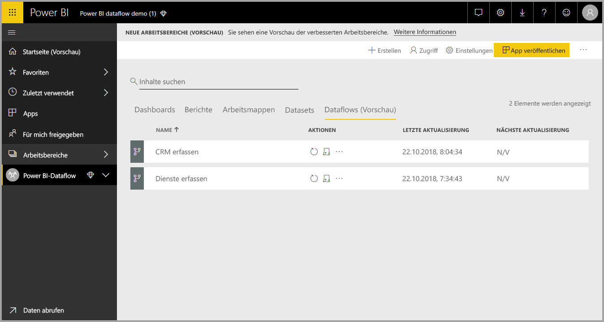

Im Bereich **App-Arbeitsbereich**, in dem Sie einen Dataflow erstellen können, wird oben rechts auf der Canvas die Schaltfläche **+ Erstellen** angezeigt. Wählen Sie die Schaltfläche **+ Erstellen** und dann **Dataflow** aus der Dropdownliste aus. 

Beachten Sie, dass ein Dataflow nur *einen Besitzer* haben kann. Das ist die Person, die den Dataflow erstellt. Nur der Besitzer kann den Dataflow bearbeiten. Alle Mitglieder des **App-Arbeitsbereichs**, die Lese- oder Schreibberechtigungen für den App-Arbeitsbereich haben, in dem der Dataflow erstellt wird, können sich über **Power BI Desktop** mit dem Dataflow verbinden. Dies wird später im Artikel beschrieben.

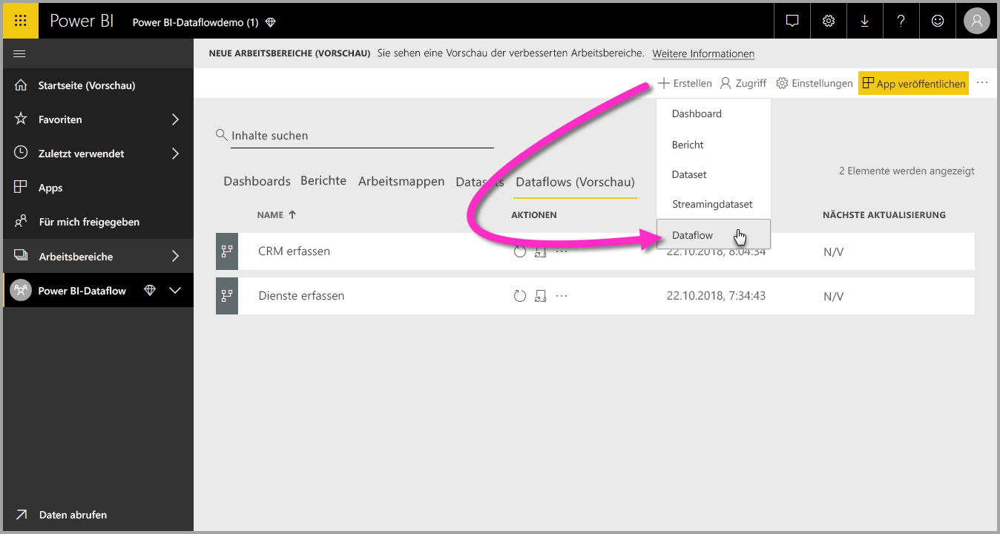

Dort können Sie **Entitäten** hinzufügen. Das wird im nächsten Abschnitt näher beschrieben.

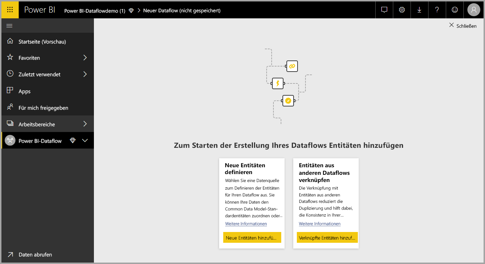

### Hinzufügen von Entitäten

Eine **Entität** ist eine Gruppe von Feldern, die ähnlich wie eine Tabelle in einer Datenbank zum Speichern von Daten verwendet wird. In der folgenden Abbildung sehen Sie die Auswahl der Datenquellen, aus denen Sie Daten in Power BI erfassen können.

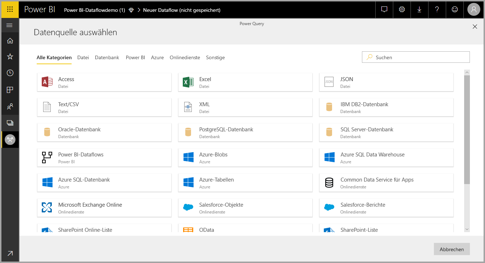

Wenn Sie eine Datenquelle auswählen, werden Sie aufgefordert, die Verbindungseinstellungen anzugeben, einschließlich des Kontos, das bei der Verbindung mit der Datenquelle verwendet werden soll (s. Abbildung).

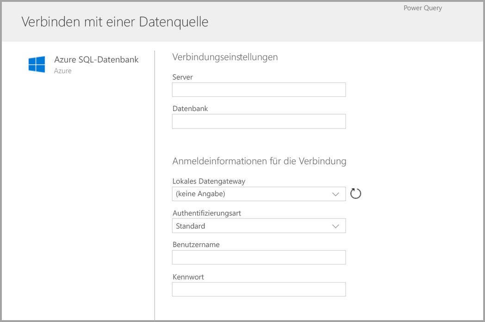

Nachdem die Verbindung hergestellt wurde, können Sie auswählen, welche Daten für Ihre Entität verwendet werden sollen. Wenn Sie Daten und eine Quelle auswählen, verbindet sich Power BI anschließend wieder mit der Datenquelle, um die Daten in Ihrem Dataflow mit der später im Setupprozess ausgewählten Häufigkeit zu aktualisieren.

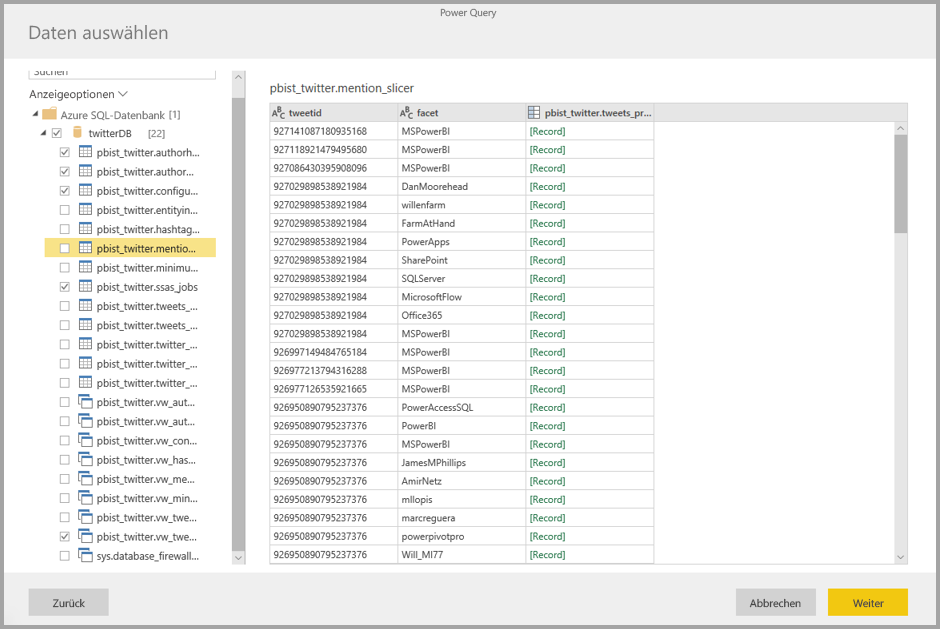

Wenn Sie die Daten zum Verwenden in der Entität ausgewählt haben, können Sie diese Daten mit dem Dataflow-Editor in das zur Verwendung in Ihrem Dataflow erforderliche Format bringen oder transformieren.

### Verwenden des Dataflow-Editors

Wenn Sie ausgewählt haben, welche Daten aus Ihrer Quelle für Ihre Entität verwendet werden, können Sie Ihre Datenauswahl in eine Form bringen, die für Ihre Entität am besten geeignet ist. Nutzen Sie dazu eine Power Query-Bearbeitungsumgebung, die dem **Power Query-Editor** in **Power BI Desktop** ähnelt. Weitere Informationen zu Power Query (in Power BI Desktop als Power Query-Editor integriert) finden Sie im Artikel [Abfrageübersicht in Power BI Desktop](desktop-query-overview.md). 

Wenn Sie den Code, den der Abfrage-Editor bei den einzelnen Schritten erzeugt, anzeigen oder eigenen Strukturierungscode erstellen möchten, können Sie das im Fenster **Erweiterter Editor**tun. 

### Dataflows und Common Data Model

Dataflowentitäten enthalten neue Tools, mit denen Sie Ihre Geschäftsdaten einfach dem Common Data Model (das standardisierte Schema von Microsoft) zuordnen sowie mit Daten von Microsoft und Drittanbietern anreichern können. Außerdem erhalten Sie vereinfachten Zugriff auf maschinelles Lernen. Diese neuen Funktionen bieten Ihnen intelligente Einblicke und handlungsrelevante Informationen zu Ihren Geschäftsdaten. Wenn Sie alle Transformationen im Schritt „Abfragen bearbeiten“ abgeschlossen haben, können Sie Spalten aus Ihren Datenquellentabellen gemäß dem Common Data Model Standardentitätsfeldern zuordnen. Standardentitäten haben ein bekanntes Schema, das durch das Common Data Model definiert wird.

Weitere Informationen zu diesem Ansatz und zum Common Data Model finden Sie im Artikel [Was ist das Common Data Model?](https://docs.microsoft.com/powerapps/common-data-model/overview).

Um das Common Data Model mit Ihrem Dataflow zu nutzen, klicken Sie im Dialogfeld **Abfragen bearbeiten** auf die Transformation **Zu Standard zuordnen**. Im daraufhin angezeigten Bildschirm **Entitäten zuordnen** können Sie die Standardentität auswählen, für die Sie die Zuordnung ausführen möchten.

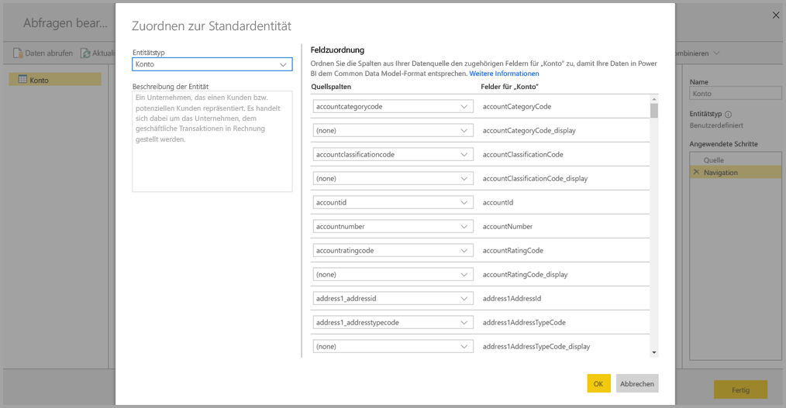

Wenn Sie eine Quellspalte einem Standardfeld zuordnen, geschieht Folgendes:

1. Die Quellspalte übernimmt den Standardfeldnamen (die Spalte wird umbenannt, wenn die Namen sich unterscheiden).
2. Die Quellspalte erhält den Datentyp des Standardfelds.

Um die Common Data Model-Standardentität beizubehalten, erhalten alle nicht zugeordneten Standardfelder den Wert *Null*.

Alle nicht zugeordneten Quellspalten bleiben unverändert, um sicherzustellen, dass das Ergebnis der Zuordnung eine Standardentität mit benutzerdefinierten Feldern ist.

Wenn Sie Ihre Auswahl getroffen haben und Ihre Entität und Dateneinstellungen gespeichert werden können, wählen Sie im Menü **Speichern** aus. Beachten Sie, dass Sie durch Auswählen der Schaltfläche **Entitäten hinzufügen** mehrere Entitäten erstellen können, und dass Sie Entitäten bearbeiten können, um Ihre Abfragen und Entitäten zu verfeinern.

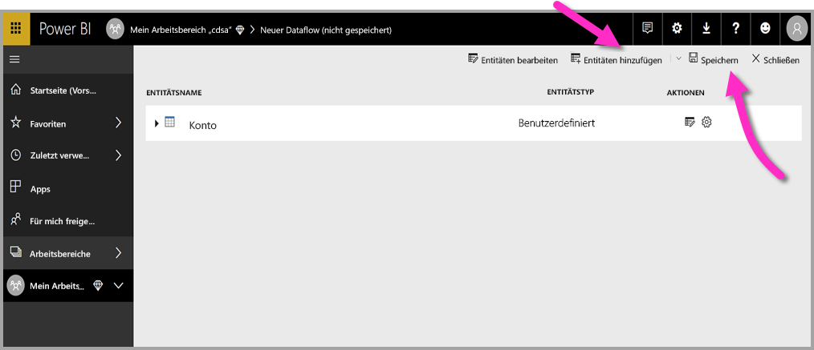

Wenn Sie **Speichern** auswählen, werden Sie aufgefordert, Ihren Dataflow zu benennen und eine Beschreibung anzugeben.

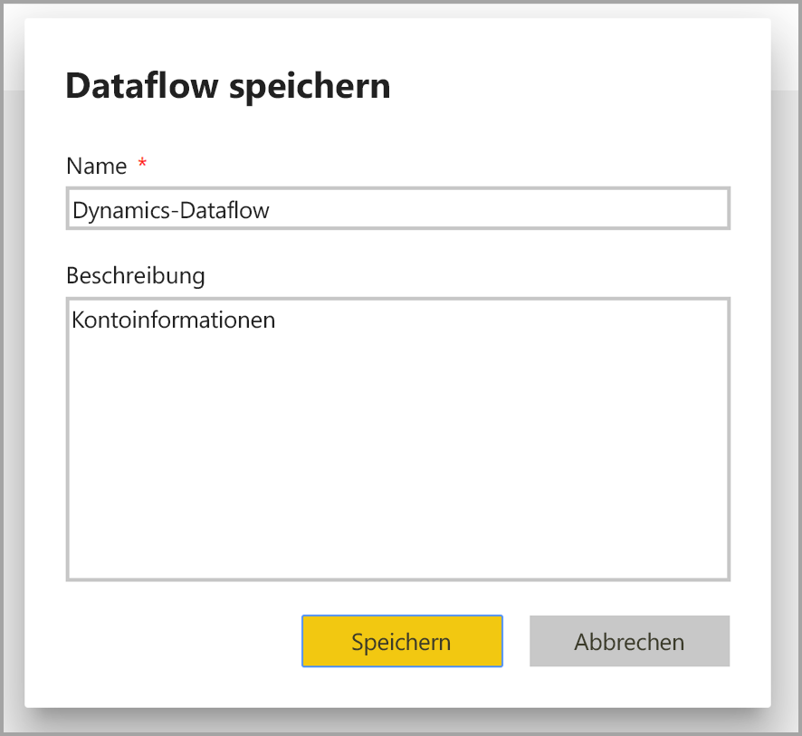

Wenn Sie so weit sind, wählen Sie die Schaltfläche **Speichern** aus. Daraufhin erscheint ein Fenster mit dem Hinweis, dass Ihr **Dataflow** erstellt wurde. 

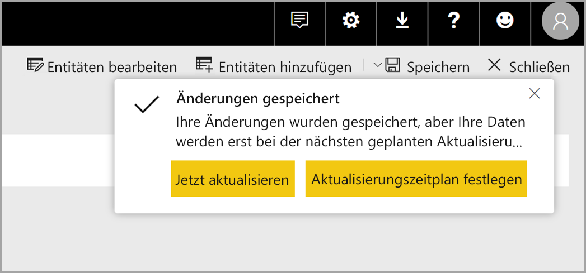

Großartig! Nun können Sie mit dem nächsten Schritt fortfahren, nämlich der Planung der Aktualisierungshäufigkeit für Ihre Datenquellen.

## Planen der Aktualisierungshäufigkeit

Wenn Ihr Dataflow gespeichert wurde, legen Sie die Aktualisierungshäufigkeit für alle Ihre verknüpften Datenquellen fest.

Power BI-Dataflows verwenden den Power BI-Datenaktualisierungsprozess, um Ihre Daten auf dem neuesten Stand zu halten. Im **Power BI-Dienst** finden Sie im Abschnitt **App-Arbeitsbereich** eine Sammlung von Bereichen, in denen Ihre Informationen aufgelistet werden können, einschließlich Dataflows (s. Abbildung).

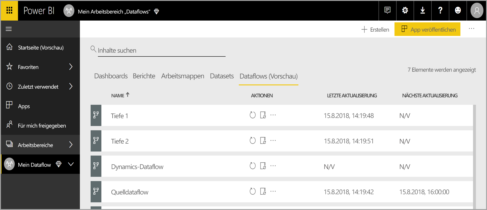

Der Eintrag *Dynamics Dataflow* in der obigen Abbildung entspricht dem Dataflow, der im vorherigen Abschnitt erstellt wurde. Um die Aktualisierung zu planen, wählen Sie im Abschnitt **Aktionen** das Symbol **Aktualisierung planen** aus (s. Abbildung). 

Wenn Sie das Symbol **Aktualisierung planen** auswählen, gelangen Sie zum Bereich **Aktualisierung planen**. Dort können Sie die Aktualisierungshäufigkeit und -zeit für den Dataflow festlegen.

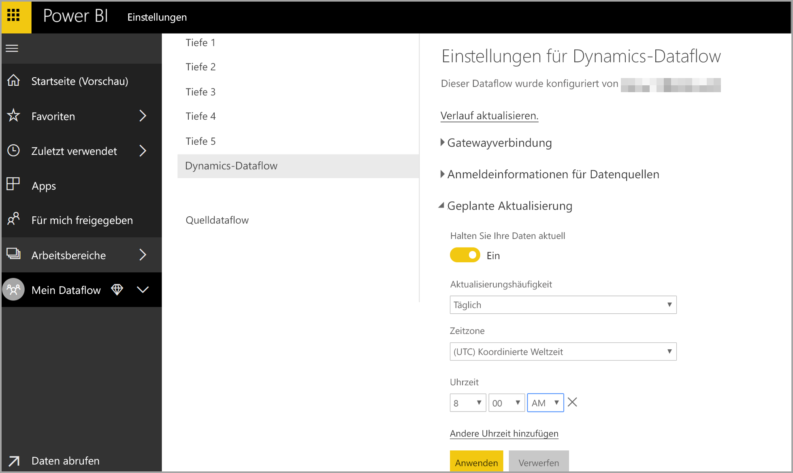

Weitere Informationen zum Planen der Aktualisierung finden Sie im Artikel [Konfigurieren geplanter Aktualisierungen](refresh-scheduled-refresh.md), der das Aktualisierungsverhalten von Power BI-Datasets beschreibt. Dataflows verhalten sich in Bezug auf Aktualisierungseinstellungen genauso wie Power BI-Datasets. 

## Herstellen einer Verbindung mit Dataflows in Power BI Desktop

Wenn Sie Ihren Dataflow erstellt und die Aktualisierungshäufigkeit für jede Datenquelle, die das Modell ausfüllt, geplant haben, können Sie mit dem dritten und letzten Schritt fortfahren: Dem Herstellen einer Verbindung mit Ihrem Dataflow über **Power BI Desktop**. 

Wählen Sie in Power BI Desktop **Daten abrufen > Power BI > Power BI-Dataflows (Beta)** aus, um eine Verbindung mit dem Dataflow herzustellen (s. Abbildung).

Navigieren Sie von dort aus zu dem **App-Arbeitsbereich**, in dem Sie Ihren Dataflow gespeichert haben. Wählen Sie den Dataflow und dann die Entitäten aus, die Sie aus der Liste erstellt haben.

Sie können auch die **Suchleiste** oben im Fensters verwenden, um schnell nach dem Namen Ihres Dataflows oder in Dataflowentitäten nach Ihren Entitäten zu suchen.

Wenn Sie die Entität und dann die Schaltfläche **Laden** auswählen, werden die Entitäten in **Power BI Desktop** im Bereich **Felder** angezeigt und verhalten sich wie **Tabellen** in anderen Datasets.

## Verwenden von in Azure Data Lake Storage Gen2 gespeicherten Dataflows

Einige Organisationen sollten ihren eigenen Speicher zum Erstellen und Verwalten von Dataflows verwenden. Sie können Dataflows in Azure Data Lake Storage Gen2 integrieren, wenn Sie die Anforderungen erfüllen und Berechtigungen ordnungsgemäß verwalten. Die Dokumentation für alle Anforderungen für diesen Ansatz finden Sie ab dem Übersichtdokument [Dataflows und Azure Data Lake-Integration (Vorschauversion)](service-dataflows-azure-data-lake-integration.md).

## Behandeln von Problemen bei Datenverbindungen

Es kann vorkommen, dass beim Verbinden von Dataflows mit Datenquellen Probleme auftreten. Dieser Abschnitt enthält Tipps zur Problembehandlung. 

* **Salesforce-Connector**: Das Verwenden eines Salesforce-Testkontos mit Dataflows führt zu einem Verbindungsfehler ohne Angabe von weiteren Informationen. Verwenden Sie für diese Problembehandlung ein Salesforce-Produktionskonto oder ein Entwicklerkonto zum Testen.

* **SharePoint-Connector**: Achten Sie darauf, dass Sie die Stammadresse der SharePoint-Website angeben – ohne Unterordner oder Dokumente. Verwenden Sie z.B. einen Link wie den folgenden: https://microsoft.sharepoint.com/teams/ObjectModel/. 

## Nächste Schritte

Dieser Artikel beschreibt, wie Sie Ihren eigenen **Dataflow** und in **Power BI Desktop** ein Dataset und einen Bericht erstellen, um diesen zu nutzen. Die folgenden Artikel enthalten nützliche Informationen und Szenarien zur Verwendung von Dataflows:

* [Self-Service-Datenaufbereitung mit Dataflows](service-dataflows-overview.md)
* [Verwenden berechneter Entitäten in Power BI Premium (Vorschau)](service-dataflows-computed-entities-premium.md)
* [Verwenden von Dataflows mit lokalen Datenquellen (Vorschau)](service-dataflows-on-premises-gateways.md)
* [Entwicklerressourcen für Power BI-Dataflows (Vorschau)](service-dataflows-developer-resources.md)
* [Dataflows und Integration in Azure Data Lake (Vorschauversion)](service-dataflows-azure-data-lake-integration.md)

Weitere Informationen zum Common Data Model finden Sie im folgenden Übersichtsartikel:
* [Common Data Model – Übersicht](https://docs.microsoft.com/powerapps/common-data-model/overview)
* [Auf GitHub](https://github.com/Microsoft/CDM) erfahren Sie mehr über das Common Data Model-Schema und Entitäten.

Ähnliche Artikel über Power BI Desktop:

* [Herstellen einer Verbindung mit Datasets im Power BI-Dienst über Power BI Desktop](desktop-report-lifecycle-datasets.md)
* [Abfrageübersicht in Power BI Desktop](desktop-query-overview.md)

Ähnliche Artikel über den Power BI-Dienst:
* [Konfigurieren geplanter Aktualisierungen](refresh-scheduled-refresh.md)
