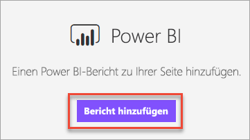
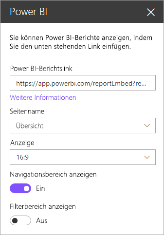

# Einbetten mit dem Berichts-Webpart in SharePoint Online

Jetzt in Power BI: Mit dem neuen Berichts-Webpart für SharePoint Online können Sie interaktive Power BI-Berichte einfach in SharePoint Online-Seiten einbetten.

Mit der neuen Option **In SharePoint Online einbetten** ist die umfassende Sicherheit eingebetteter Berichte gewährleistet. Erstellen Sie einfach sichere interne Portale.

## Anforderungen

Wenn Sie Berichte mit der Option **In SharePoint Online einbetten** verwenden möchten, sind einige Anforderungen zu erfüllen.

* Sie benötigen eine Power BI Pro-Lizenz oder eine [Power BI Premium-Kapazität (EM oder P SKU)](service-premium.md#premium-capacity-nodes) mit einer Power BI-Lizenz.
* Das Power BI-Webpart für SharePoint Online erfordert [Moderne Seiten](https://support.office.com/article/Allow-or-prevent-creation-of-modern-site-pages-by-end-users-c41d9cc8-c5c0-46b4-8b87-ea66abc6e63b).

## Einbetten des Berichts

Um den Bericht in SharePoint Online einzubetten, müssen Sie zuerst die URL des Berichts abrufen. Diese URL wird dann im neuen Power BI-Webpart in SharePoint Online verwendet.

### Abrufen der Berichts-URL

1. Rufen Sie den Bericht im Power BI-Dienst auf.

2. Wählen Sie den Menüeintrag **Datei** aus.

3. Wählen Sie **In SharePoint Online einbetten** aus.

    

4. Kopieren Sie die URL aus dem Dialogfeld.

    

### Hinzufügen des Power BI-Berichts zu einer SharePoint Online-Seite

1. Öffnen Sie die gewünschte Seite in SharePoint Online, und wählen Sie **Bearbeiten** aus.

    

    Sie können auch eine neue moderne Websiteseite erstellen, indem Sie in SharePoint Online **+ Neu** auswählen.

    

2. Wählen Sie **+** und dann das Webpart **Power BI**  aus.

    

3. Wählen Sie **Bericht hinzufügen** aus.

    

4. Fügen Sie die Berichts-URL im Eigenschaftsbereich ein. Dies ist die in den vorhergehenden Schritten kopierte Berichts-URL. Der Bericht wird automatisch geladen.

    

5. Wählen Sie **Veröffentlichen** aus, damit Ihre SharePoint Online-Benutzer die Änderung sehen können.

    

## Gewähren des Zugriffs auf Berichte

Nachdem Sie einen Bericht in SharePoint Online eingebettet haben, müssen Sie den Benutzern die Berechtigung geben, den Bericht anzuzeigen. Die Berechtigungen zum Anzeigen des Berichts werden im Power BI-Dienst festgelegt.

> [!IMPORTANT]
> Überprüfen Sie im Power BI-Dienst, wer den Bericht sehen kann, und stellen Sie sicher, dass nicht aufgeführte, berechtigte Benutzer Zugriff erhalten.

Es gibt zwei Möglichkeiten, den Zugriff auf den Bericht im Power BI-Dienst zu regeln. Wenn Sie die SharePoint Online-Teamwebsite auf Grundlage einer Office 365-Gruppe erstellen, führen Sie den Benutzer als Mitglied des **App-Arbeitsbereichs im Power BI-Dienst** und der **SharePoint-Seite** auf. Weitere Informationen finden Sie unter [Verwalten eines App-Arbeitsbereichs](service-manage-app-workspace-in-power-bi-and-office-365.md).

Alternativ können Sie einen Bericht auch direkt mit Benutzern teilen, indem Sie ihn in eine App einbetten. Die folgenden Schritte zeigen, wie Sie einen Bericht in eine App einbetten.  

1. Der Ersteller der App ist ein Pro-Benutzer.

2. Der Ersteller verfasst einen Bericht in einem App-Arbeitsbereich. *Zur Freigabe für **Power BI Free-Benutzer** muss der App-Arbeitsbereich als **Premium-Arbeitsbereich** eingerichtet sein.*

3. Der Ersteller veröffentlicht die App und installiert sie dann. *Der Ersteller muss sicherstellen, dass die App installiert ist, um auf die Berichts-URL zuzugreifen, die zum Einbetten in SharePoint Online verwendet wird.*

4. Nun müssen auch alle Endbenutzer die App installieren. Sie können jedoch die App so einrichten, dass sie für Endbenutzer vorinstalliert wird. Aktivieren Sie dazu im [Power BI-Verwaltungsportal](service-admin-portal.md) die Funktion **Hiermit wird die App automatisch installiert**.

   

5. Der Ersteller öffnet die App und ruft den Bericht auf.

6. Der Ersteller kopiert die einzubettende Berichts-URL aus dem von der App installierten Bericht. *Verwenden Sie nicht die ursprüngliche Berichts-URL aus dem App-Arbeitsbereich.*

7. Erstellen Sie in SharePoint Online eine neue Teamwebsite.

8. Fügen Sie die in Schritt 6 kopierte Berichts-URL dem Power BI-Webpart hinzu.

9. Fügen Sie alle Endbenutzer und/oder Gruppen hinzu, die die Daten auf der SharePoint Online-Seite und in der von Ihnen erstellten Power BI-App verwenden werden.

    > [!NOTE]
    > **Benutzer bzw. Gruppen benötigen Zugriff sowohl auf die SharePoint Online-Seite als auch auf den Bericht in der Power BI-App, um den Bericht auf der SharePoint-Seite anzuzeigen.**

10. Jetzt kann der Endbenutzer die Teamseite in SharePoint Online aufrufen und die Berichte auf der Seite anzeigen.

## Multi-Factor Authentication

Wenn Ihre Power BI-Umgebung die Anmeldung mit mehrstufiger Authentifizierung (MFA) erfordert, können Sie aufgefordert werden, Ihre Identität mithilfe eines Sicherheitsgeräts zu bestätigen. Dies ist der Fall, wenn Sie sich nicht bereits per MFA bei SharePoint Online angemeldet haben, Ihre Power BI-Umgebung aber ein per Sicherheitsgerät verifiziertes Konto erfordert.

> [!NOTE]
> Multi-Factor Authentication wird derzeit noch nicht von Azure Active Directory 2.0 unterstützt. Benutzer erhalten dann die Meldung *Fehler*. Der Benutzer kann sich mithilfe eines Sicherheitsgeräts erneut bei SharePoint Online anmelden, um Zugriff auf den Bericht zu erhalten.

## Webpart-Einstellungen

Das Power BI-Webpart für SharePoint Online verfügt über die folgenden Einstellungen.

| Eigenschaft | Beschreibung |
| --- | --- |
| Seitenname |Die Standardseite, die vom Webpart angezeigt wird. Wählen Sie einen Wert aus der Dropdownliste aus. Wenn keine Seiten angezeigt werden, verfügt der Bericht entweder nur über eine Seite, oder die eingefügte URL enthält den Seitennamen. Entfernen Sie den Berichtsabschnitt aus der URL, um eine bestimmte Seite auswählen zu können. |
| Anzeige |Option zum Festlegen, wie der Bericht in die SharePoint Online-Seite eingepasst wird. |
| Navigationsbereich anzeigen |Anzeigen oder Ausblenden des Navigationsbereichs der Seite. |
| Filterbereich anzeigen |Anzeigen oder Ausblenden des Filterbereichs. |

## Nicht geladene Berichte

Möglicherweise wird der Bericht im Power BI-Webpart nicht geladen, und die folgende Meldung wird angezeigt.

*Dieser Inhalt ist nicht verfügbar.*

Dies kann vor allem zwei Gründe haben.

1. Sie haben keinen Zugriff auf diesen Bericht.
2. Der Bericht wurde gelöscht.

Wenden Sie sich an den Besitzer der SharePoint Online-Seite, um diese Probleme zu beheben.

## Lizenzierung

Benutzer, die einen Bericht in SharePoint anzeigen, benötigen entweder eine **Power BI Pro-Lizenz**, oder der Inhalt muss sich in einem Arbeitsbereich integriert sein, der sich in einer **[Power BI Premium-Kapazität (EM oder P SKU)](service-admin-premium-purchase.md)** befindet.

## Bekannte Probleme und Einschränkungen

* Fehler: „Es ist ein Fehler aufgetreten, melden Sie sich ab und wieder an und öffnen Sie diese Seite dann erneut. Korrelations-ID: nicht definiert, HTTP-Antwortstatus: 400, Serverfehlercode 10001, Meldung: Fehlendes Aktualisierungstoken“
  
  Wenn Sie diesen Fehler erhalten, versuchen Sie einen der folgenden Schritte zur Fehlerbehebung.
  
  1. Melden Sie sich bei SharePoint ab und anschließend wieder an. Achten Sie darauf, alle Browserfenster zu schließen, bevor Sie sich erneut anmelden.

  2. Wenn MFA für Ihr Benutzerkonto erforderlich ist, stellen Sie sicher, dass Sie sich mit Ihrem MFA-Gerät in SharePoint anmelden (Smartphone-App, Smartcard usw.).
  
  3. Azure B2B-Gastbenutzerkonten werden nicht unterstützt. Den Benutzern wird das Power BI-Logo angezeigt, das anzeigt, dass der Teil geladen wird, jedoch wird der Bericht nicht angezeigt.

* Power BI unterstützt nicht die gleichen lokalisierte Sprachen wie SharePoint Online. Daher wird im eingebetteten Bericht möglicherweise nicht die ordnungsgemäße Lokalisierung angezeigt.

* Bei Verwendung von Internet Explorer 10 können Probleme auftreten. Informieren Sie sich über die [Browserunterstützung für Power BI](consumer/end-user-browsers.md) und für [Office 365](https://products.office.com/office-system-requirements#Browsers-section).

* Das Power BI-Webpart ist für [Sovereign Clouds](https://powerbi.microsoft.com/en-us/clouds/) nicht verfügbar.

* Der klassische Server von SharePoint Server wird mit diesem Webpart nicht unterstützt.

* [URL-Filter](service-url-filters.md) werden mit dem SPO-Webpart nicht unterstützt.

## Nächste Schritte

* [Erstellen moderner Websiteseiten durch Endbenutzer zulassen oder verhindern](https://support.office.com/article/Allow-or-prevent-creation-of-modern-site-pages-by-end-users-c41d9cc8-c5c0-46b4-8b87-ea66abc6e63b)  
* [Erstellen und Verteilen einer App in Power BI](service-create-distribute-apps.md)  
* [Freigeben eines Dashboards für Kollegen und andere](service-share-dashboards.md)  
* [Was ist Power BI Premium?](service-premium.md)
* [Einbetten eines Berichts in ein sicheres Portal oder eine sichere Website](service-embed-secure.md)

Weitere Fragen? [Stellen Sie Ihre Frage in der Power BI-Community.](http://community.powerbi.com/)