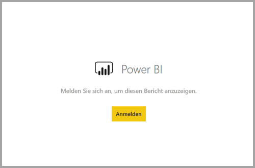
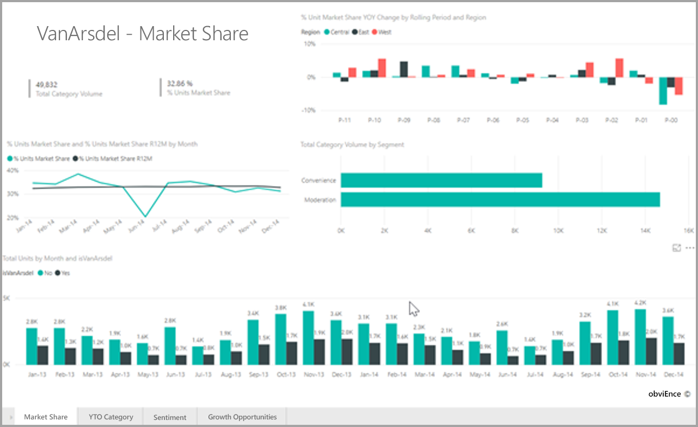

# <a name="embed-a-report-in-a-secure-portal-or-website"></a>Einbetten eines Berichts in ein sicheres Portal oder eine sichere Website

Mit dem neuen **einbetten** Option für Power BI meldet, die Sie ganz einfach und sicher Berichte Einbetten in internen Webportale. Diese Portale möglich **cloudbasierte** oder **auf lokal gehostete**, z. B. SharePoint 2019. Eingebettete Berichte berücksichtigt alle Element Berechtigungen und datensicherheit durch [zeilenbasierte Sicherheit (RLS)](service-admin-rls.md). Sie bieten, ohne Code in einem Portal, die akzeptiert eine URL oder einen iFrame einbetten. 

Die **einbetten** option unterstützt [URL-Filter](service-url-filters.md) und URL-Einstellungen. Sie können für die Integration, Portale, die mit einem geringen codeanpassungen Ansatz erfordert nur grundlegende HTML und JavaScript-Kenntnisse.

## <a name="how-to-embed-power-bi-reports-into-portals"></a>**Einbetten** von Power BI-Berichten in Portale

1. Sie finden die neue Option **Einbetten** im Power BI-Dienst im Menü **Datei** für Berichte.

    

2. Wählen Sie die **einbetten** Option aus, um ein Dialogfeld zu öffnen, die einen Link und eines IFRAMEs Sie den Bericht einbetten, sichere können bereitstellt.

    

3. Ob ein Benutzer eine Berichts-URL direkt öffnet, oder eine in einem Webportal eingebettete, erfordert Zugriff auf den Berichts-Authentifizierung. Der folgende Bildschirm wird angezeigt, wenn ein Benutzer nicht in Power BI in ihrer Browsersitzung angemeldet hat. Wenn sie die Option **Anmeldung**, ein neues Browserfenster oder einer Registerkarte konnte geöffnet werden. Lassen Sie ihn für die Popup-Blocker überprüfen Sie, ob sie nicht aufgefordert erhalten, sich anzumelden.

    

4. Nachdem der Benutzer angemeldet hat, wird der Bericht geöffnet, zeigt die Daten an und ermöglicht, Seitennavigation und filtern. Nur Benutzer, die View-Berechtigung verfügen, können den Bericht in Power BI sehen. Alle [zeilenbasierte Sicherheit (RLS)](service-admin-rls.md) Regeln werden ebenfalls angewendet. Schließlich muss der Benutzer ordnungsgemäß lizenziert sein, d.h., er benötigt eine Power BI Pro-Lizenz oder der Bericht muss sich in einem Arbeitsbereich in einer Power BI Premium-Kapazität befinden. Der Benutzer muss sich jedes Mal erneut anmelden müssen sie ein neues Browserfenster geöffnet. Aber wenn Sie angemeldet sind, andere Berichte werden automatisch geladen.

    

5. Wenn Sie einen iFrame verwenden zu können, müssen Sie möglicherweise Bearbeiten der **Höhe** und **Breite** eine Web-Seite des Portals anpassen.

    

## <a name="granting-report-access"></a>Gewähren den Zugriff auf Berichte

Die **einbetten** Option nicht automatisch ermöglichen es Benutzern, um den Bericht anzuzeigen. Anzeigen der Berechtigungen werden in Power BI-Dienst festgelegt.

Im Power BI-Dienst können Sie eingebettete Berichte für Benutzer, die Zugriff freigeben. Wenn Sie eine Office 365-Gruppe verwenden, können Sie den Benutzer als app-Arbeitsbereichsmitglied auflisten. Weitere Informationen finden Sie unter Vorgehensweise [Verwalten Ihres app-Arbeitsbereichs in Power BI und Office 365](service-manage-app-workspace-in-power-bi-and-office-365.md).

## <a name="licensing"></a>Lizenzierung

Zum Anzeigen des eingebetteten Berichts benötigen Benutzer entweder eine Power BI Pro-Lizenz, oder der Inhalt muss in einem Arbeitsbereich zu sein, die in einem [Power BI Premium-Kapazität (EM oder P-SKU)](service-admin-premium-purchase.md).

## <a name="customize-your-embed-experience-using-url-settings"></a>Anpassen der Darstellung des eingebetteten Berichts über URL-Einstellungen

Sie können die benutzererfahrung mit der Eingabe die einbettungs-URL-Einstellungen anpassen. Im bereitgestellten iFrame können Sie die URL des aktualisieren **Src** Einstellungen.

| Eigenschaft  | Beschreibung  |  |  |  |
|--------------|-----------------------------------------------------------------------------------------------------------------------------------------------------------------------------------------------------------------------|---|---|---|
| pageName  | Sie können die **PageName** Abfragezeichenfolgen-Parameter zum Festlegen der Berichtsseite zu öffnen. Dieser Wert finden am Ende der Berichts-URL Sie beim Anzeigen eines Berichts im Power BI-Dienst, wie unten dargestellt. |  |  |  |
| URL-Filter  | Sie können [URL-Filter](service-url-filters.md) in die einbettungs-URL, die Sie von der Power BI-Benutzeroberfläche zum Filtern der Inhalte einbetten erhalten. Auf diese Weise lassen sich Integrationen mit geringem Programmieraufwand erstellen, für die nur grundlegende Kenntnisse in HTML und JavaScript erforderlich sind.  |  |  |  |

## <a name="set-which-page-opens-for-an-embedded-report"></a>Gruppe, die die Seite für einen eingebetteten Bericht wird geöffnet. 

Sie finden die **PageName** Wert am Ende der Berichts-URL, beim Anzeigen eines Berichts im Power BI-Dienst.

1. Öffnen Sie den Bericht aus Power BI-Dienst in Ihrem Webbrowser, und kopieren Sie den URL-Leiste.

    

2. Hängen Sie die Einstellung **pageName** an die URL an.

    

## <a name="filter-report-content-using-url-filters"></a>Filtern der Berichtsinhalte mit URL-Filtern 

Sie können [URL-Filter](service-url-filters.md) um andere Berichtsansichten bereitzustellen. Beispielsweise wird der Bericht mit der unten aufgeführten URL so gefiltert, dass Daten für die Energiebranche angezeigt werden.

Die Kombination von **pageName** und [URL-Filter](service-url-filters.md) erlaubt besonders ausgefeilte Funktionen. Mit einfachem HTML und JavaScript lassen sich verschiedene Benutzeroberflächen gestalten.

Hier ist z. B. eine Schaltfläche, die Sie eine HTML-Seite hinzufügen können:

```html
<button class="textLarge" onclick='show("ReportSection", "Energy");' style="display: inline-block;">Show Energy</button>
```

Wenn aktiviert, ruft die Schaltfläche eine Funktion, um den iFrame mit einer aktualisierten-URL, zu aktualisieren, die Energie Branche Filter enthält.

```javascript
function show(pageName, filterValue)

{

var newUrl = baseUrl + "&pageName=" + pageName;

if(null != filterValue && "" != filterValue)

{

newUrl += "&$filter=Industries/Industry eq '" + filterValue + "'";

}

//Assumes there’s an iFrame on the page with id=”iFrame”

var report = document.getElementById("iFrame")

report.src = newUrl;

}
```


Sie können beliebig viele Schaltflächen hinzufügen, um mit geringem Programmieraufwand eine individuelle Benutzeroberfläche zu erstellen. 

## <a name="considerations-and-limitations"></a>Überlegungen und Einschränkungen

* Externe Gastbenutzer mit Azure B2B (Business-to-Business) werden nicht unterstützt.

* Das sichere Einbetten kann für Berichte verwendet werden, die im Power BI-Dienst veröffentlicht wurden.

* Der Benutzer muss sich anmelden, um den Bericht anzuzeigen, wenn sie ein neuen Browserfenster öffnen.

* Einige Browser müssen Sie die Seite nach der Anmeldung zu aktualisieren, insbesondere bei Verwendung von InPrivate- oder Inkognito-Modus.

* Eine einmalige Anmeldung zu erzielen, verwenden die Einbettung in SharePoint Online-Option oder Erstellen eines benutzerdefinierten-Integration mit der [Benutzer ist Besitzer der Daten](developer/embed-sample-for-your-organization.md) Methode einbetten. 

* Die Funktion zur automatischen Authentifizierung, die von der Option **Einbetten** unterstützt wird, kann nicht mit der Power BI-JavaScript-API verwendet werden. Verwenden Sie die Power BI JavaScript-API, die [Benutzer ist Besitzer der Daten](developer/embed-sample-for-your-organization.md) Methode einbetten. 

## <a name="next-steps"></a>Nächste Schritte

* [Möglichkeiten zum Freigeben Ihrer Arbeit in Power BI](service-how-to-collaborate-distribute-dashboards-reports.md)

* [Filtern eines Berichts mithilfe von Abfragezeichenfolgen-Parameter in der URL](service-url-filters.md)

* [Betten Sie mit Berichts-Webpart in SharePoint Online ein](service-embed-report-spo.md)

* [Webveröffentlichung von Powerbi](service-publish-to-web.md)