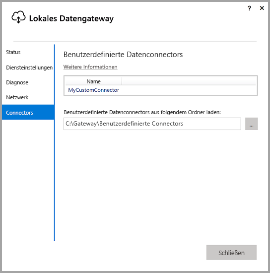
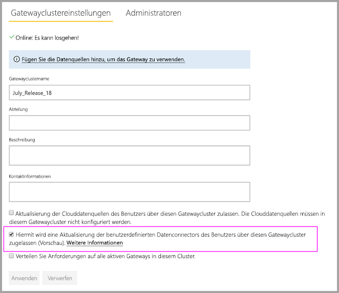
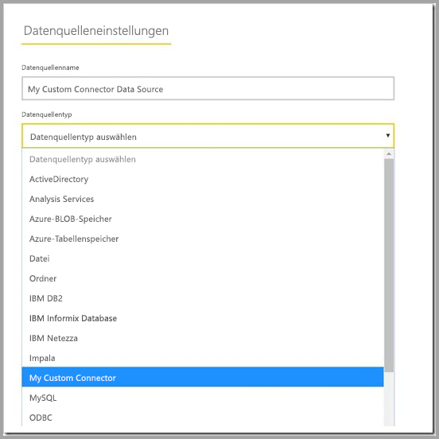

# Verwenden von benutzerdefinierten Datenconnectors mit dem lokalen Datengateway

Mithilfe der Datenconnectors für Power BI können Sie eine Verbindung zu Daten einer App, eines Diensts oder einer Datenquelle herstellen und auf diese zugreifen. Sie können benutzerdefinierte Datenconnectors entwickeln und diese in Power BI Desktop verwenden.

Weitere Informationen zum Entwickeln benutzerdefinierter Datenconnectors für Power BI finden Sie [in unserer Dokumentation](http://aka.ms/dataconnectors).

Wenn Sie Berichte in Power BI Desktop erstellen, die benutzerdefinierte Datenconnectors nutzen, können Sie das lokale Datengateway dazu verwenden, diese Berichte aus dem Power BI-Dienst zu aktualisieren.

## Anleitung zum Aktivieren und Verwenden dieser Funktion

Wenn Sie die Version vom Juli 2018 oder eine höhere Version des lokalen Datengateways installieren, wird im Konfigurator die Registerkarte „Connectors“ mit der Option, einen Ordner auszuwählen, aus dem benutzerdefinierte Connectors geladen werden sollen, angezeigt. Wählen Sie einen Ordner aus, auf den der Benutzer, der den Gatewaydienst (standardmäßig „NT SERVICE\PBIEgwService”) ausführt, zugreifen kann. Das Gateway lädt automatisch die benutzerdefinierten Connectordateien in diesem Ordner, die dann in der Liste der Datenconnectors angezeigt werden sollten.

Wenn Sie die persönliche Version des lokalen Datengateways verwenden, sollten Sie an dieser Stelle Ihren Power BI-Bericht im Power BI-Dienst hochladen können und das Gateway zum Aktualisieren verwenden.

Für die Enterpriseversion des Gateways müssen Sie immer noch eine Datenquelle für Ihren benutzerdefinierten Connector erstellen. Auf der Seite „Gatewayeinstellungen“ im Power BI-Dienst sollte eine neue Option angezeigt werden, wenn Sie dem Gatewaycluster erlauben, benutzerdefinierte Connectors mit diesem Cluster zu verwenden. Vergewissern Sie sich, dass für alle Gateways im Cluster das Update vom Juli 2018 oder höher installiert ist, damit diese Option verfügbar ist. Wählen Sie nun diese Option aus, um das Verwenden von benutzerdefinierten Connectors mit diesem Cluster zu aktivieren.

Wenn diese Option aktiviert ist, werden Ihre benutzerdefinierten Connectors als verfügbare Datenquellen angezeigt, die Sie in diesem Gatewaycluster erstellen können. Nach dem Erstellen einer Datenquelle mit Ihrem neuen benutzerdefinierten Connector können Sie die Power BI-Berichte aktualisieren, die diesen benutzerdefinierten Connector im Power BI-Dienst verwenden.

## Überlegungen und Einschränkungen

* Stellen Sie sicher, dass der erstellte Ordner für den Gatewaydienst im Hintergrund zugänglich ist. In der Regel ist der Zugriff auf Ordner unter Windows-Ordnern oder Systemordnern Ihres Benutzers nicht möglich. Der Gatewaykonfigurator zeigt eine Nachricht an, wenn der Ordner nicht zugänglich ist (gilt nicht für die persönliche Version des Gateways).
* Damit benutzerdefinierte Connectors mit dem lokalen Datengateway verwendet werden können, muss in deren Code ein „TestConnection“-Abschnitt implementiert werden. Dies ist nicht erforderlich, wenn benutzerdefinierte Connectors mit Power BI Desktop verwendet werden. Sie können einen benutzerdefinierten Connector nutzen, der zwar mit Power BI Desktop, aber nicht mit dem Gateway verwendet werden kann. Weitere Informationen zur Implementierung eines „TestConnection“-Abschnitts finden Sie in [dieser Dokumentation](https://github.com/Microsoft/DataConnectors/blob/master/docs/m-extensions.md#implementing-testconnection-for-gateway-support).

## Nächste Schritte

* [Verwalten Ihrer Datenquelle – Analysis Services](service-gateway-enterprise-manage-ssas.md)  
* [Verwalten Ihrer Datenquelle –SAP HANA](service-gateway-enterprise-manage-sap.md)  
* [Verwalten Ihrer Datenquelle – SQL Server](service-gateway-enterprise-manage-sql.md)  
* [Verwalten der Datenquelle – Oracle](service-gateway-onprem-manage-oracle.md)  
* [Verwalten der Datenquelle – Import/Geplante Aktualisierung](service-gateway-enterprise-manage-scheduled-refresh.md)  
* [Ausführliche Informationen zum lokalen Datengateway](service-gateway-onprem-indepth.md)  
* [Lokales Datengateway (persönlicher Modus)](service-gateway-personal-mode.md)
* [Konfigurieren von Proxyeinstellungen für das lokale Datengateway](service-gateway-proxy.md)  
* [Use Kerberos for SSO (single sign-on) from Power BI to On-premises data sources (Verwenden von Kerberos für SSO (Single Sign-On, Einmaliges Anmelden) bei Power BI für lokale Datenquellen)](service-gateway-sso-kerberos.md)  

Weitere Fragen? [Wenden Sie sich an die Power BI-Community](http://community.powerbi.com/)
