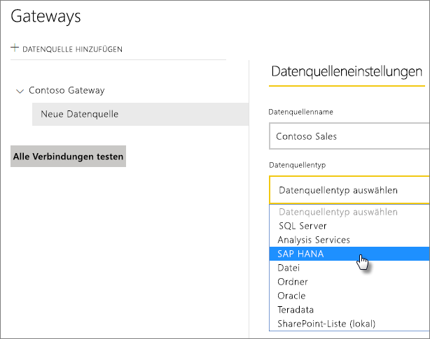
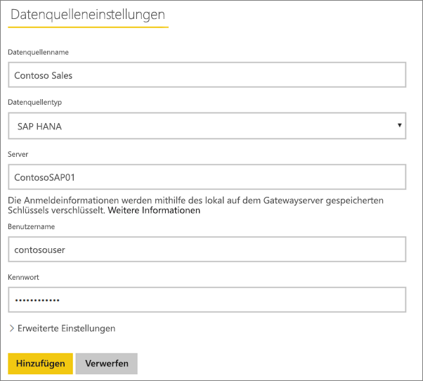
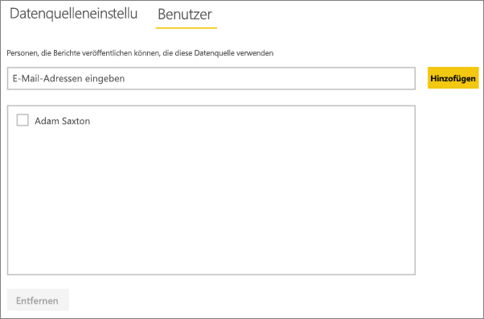
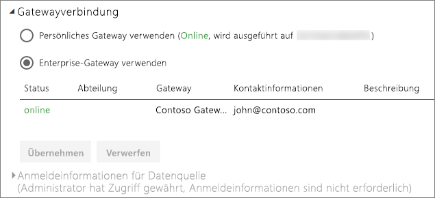

# Verwalten Ihrer SAP HANA-Datenquelle
Nach der Installation des lokalen Datengateways müssen Datenquellen hinzugefügt werden, die mit dem Gateway verwendet werden können. Dieser Artikel befasst sich mit dem Umgang mit Gateways und Datenquellen. Sie können die Datenquelle SAP HANA für die geplante Aktualisierung oder für DirectQuery verwenden.

## Herunterladen und Installieren eines Gateways
Sie können das Gateway vom Power BI-Dienst herunterladen. Wählen Sie **Herunterladen** > **Datengateway**, oder gehen Sie auf die [Gateway-Downloadseite](https://go.microsoft.com/fwlink/?LinkId=698861).

## Hinzufügen eines Gateways
Zum Hinzufügen eines Gateways können Sie einfach das Gateway [herunterladen](https://go.microsoft.com/fwlink/?LinkId=698861) und auf einem Server in Ihrer Umgebung installieren. Nach der Installation das Gateway in der Gatewayliste unter **Gateways verwalten**angezeigt.

> [!NOTE]
> **Gateways verwalten** wird nur angezeigt, wenn Sie Administrator auf mindestens einem Gateway sind. Dies kann erfolgen, indem Sie als Administrator hinzugefügt werden oder indem Sie selbst ein Gateway installieren und konfigurieren.
> 
> 

## Entfernen eines Gateways
Beim Entfernen eines Gateways werden auch alle Datenquellen unter diesem Gateway gelöscht.  Dadurch verlieren auch alle Dashboards und Berichte, die auf diesen Datenquellen beruhen, ihre Funktionsfähigkeit.

1. Wählen Sie rechts oben das Zahnradsymbol  > **Gateways verwalten**.
2. Gateway > **Entfernen**.
   
   

## Hinzufügen einer Datenquelle
Sie können eine Datenquelle hinzufügen, indem Sie ein Gateway auswählen und auf **Datenquelle hinzufügen** klicken oder „Gateway“ > **Datenquelle hinzufügen** auswählen.

Sie können anschließend den **Datenquellentyp** in der Liste auswählen.

Sie sollten dann die Angaben für die Datenquelle wie **Server**, **Benutzername** und **Kennwort**vervollständigen.

> [!NOTE]
> Alle Abfragen der Datenquelle werden mithilfe dieser Anmeldeinformationen durchgeführt. Weitere Informationen darüber, wie [Anmeldeinformationen](service-gateway-onprem.md#credentials) gespeichert werden, finden Sie im Hauptartikel zu On-premises data gateway.
> 
> 

Klicken Sie auf **Hinzufügen** , nachdem alle Angaben eingetragen wurden.  Sie können diese Datenquelle nun für eine geplante Aktualisierung oder DirectQuery mit einem lokalen SAP HANA-Server verwenden. Bei erfolgreicher Ausführung wird *Verbindung hergestellt* angezeigt.

### Erweiterte Einstellungen
Sie können die Datenschutzebene für die Datenquelle konfigurieren, die steuert, wie Daten kombiniert werden können. Diese wird nur für die geplante Aktualisierung verwendet und gilt nicht für DirectQuery. [Weitere Informationen](https://support.office.com/article/Privacy-levels-Power-Query-CC3EDE4D-359E-4B28-BC72-9BEE7900B540)

## Entfernen einer Datenquelle
Durch Entfernen einer Datenquelle geht die Funktionsfähigkeit aller Dashboards und Berichte verloren, die auf der betreffenden Datenquelle beruhen.  

Um eine Datenquelle zu entfernen, verwenden Sie „Datenquelle“ > **Entfernen**.

## Verwalten von Administratoren
Sie können auf der Registerkarte „Administratoren“ für das Gateway Benutzer (oder Sicherheitsgruppen) hinzufügen und entfernen, die das Gateway verwalten dürfen.

## Verwalten von Benutzern
Sie können auf der Registerkarte „Benutzer“ für die Datenquelle Benutzer oder Sicherheitsgruppen hinzufügen und entfernen, die diese Datenquelle verwenden dürfen.

> [!NOTE]
> Über die Benutzerliste wird nur gesteuert, wer Berichte veröffentlichen darf. Besitzer eines Berichts können Dashboards und Inhaltspakete erstellen und für andere Benutzer freigeben.
> 
> 

## Verwenden der Datenquelle
Nachdem Sie die Datenquelle erstellt haben, kann diese mit DirectQuery-Verbindungen oder durch eine geplante Aktualisierung verwendet werden.

> [!NOTE]
> Der Name des Servers und der Datenbank müssen in Power BI Desktop und in der Datenquelle auf dem lokalen Datengateway übereinstimmen.
> 
> 

Der Link zwischen Ihrem Dataset und der Datenquelle innerhalb des Gateways basiert auf dem Namen Ihres Servers und Ihrer Datenbank. Diese müssen übereinstimmen. Wenn Sie z.B. eine IP-Adresse für den Servernamen angeben, müssen Sie die IP-Adresse in Power BI Desktop für die Datenquelle innerhalb der Gatewaykonfiguration verwenden. Wenn Sie *SERVER\INSTANZ* verwenden, müssen Sie in Power BI Desktop dieselbe Instanz verwenden, die auch in der für das Gateway konfigurierten Datenquelle verwendet wird.

Dies gilt für DirectQuery ebenso wie für geplante Aktualisierungen.

### Verwenden der Datenquelle mit DirectQuery-Verbindungen
Stellen Sie sicher, dass der Name des Servers und der Datenbank in Power BI Desktop und der für das Gateway konfigurierten Datenquelle identisch sind. Stellen Sie außerdem sicher, dass der Benutzer auf der Registerkarte **Benutzer** der Datenquelle aufgeführt ist, um DirectQuery-Datasets veröffentlichen zu können. Die Auswahl für DirectQuery in Power BI Desktop erfolgt beim erstmaligen Importieren der Daten. [Weitere Informationen](desktop-use-directquery.md)

Nach der Veröffentlichung von Power BI Desktop oder mit **Daten abrufen** sollten Ihre Berichte funktionieren. Es kann nach dem Erstellen der Datenquelle im Gateway mehrere Minuten dauern, bis die Verbindung genutzt werden kann.

### Verwenden der Datenquelle mit geplanten Aktualisierungen
Wenn Sie auf der Registerkarte **Benutzer** der im Gateway konfigurierten Datenquelle aufgeführt sind und der Name des Servers und der Datenbank übereinstimmen, wird das Gateway als Option für geplante Aktualisierungen angezeigt.

## Nächste Schritte
[Lokales Datengateway](service-gateway-onprem.md)  
[Ausführliche Informationen zum lokalen Datengateway](service-gateway-onprem-indepth.md)  
[Problembehandlung beim lokalen Datengateway](service-gateway-onprem-tshoot.md)  
Weitere Fragen? [Wenden Sie sich an die Power BI-Community](http://community.powerbi.com/)

