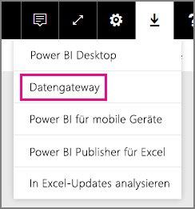
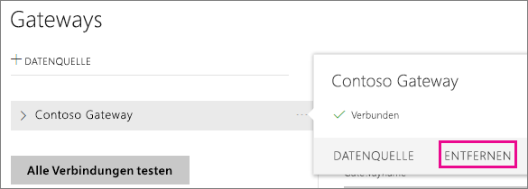
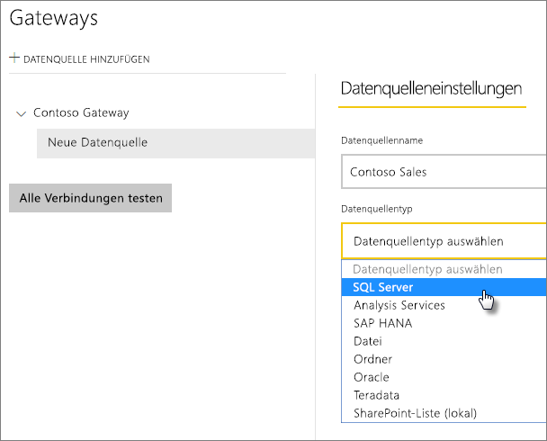
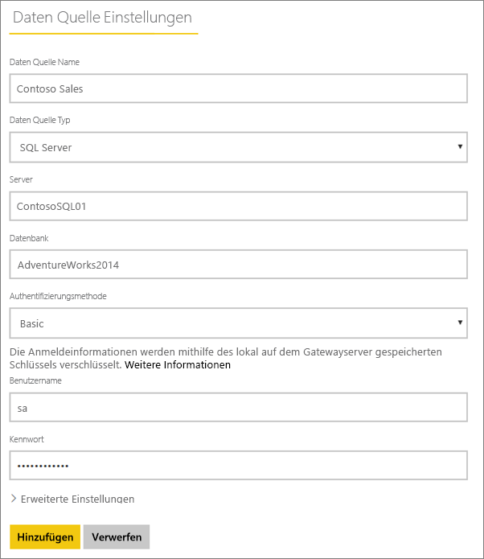
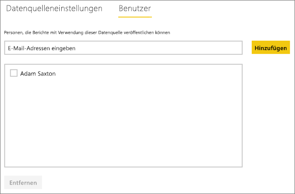

# Verwalten Ihrer Datenquelle – SQL Server
Nach der Installation des lokalen Datengateways können Datenquellen hinzugefügt werden, die mit dem Gateway verwendet werden können. Dieser Artikel befasst sich mit dem Umgang mit Gateways und Datenquellen. Sie können die Datenquelle SQL Server für die geplante Aktualisierung oder für DirectQuery verwenden.

## Herunterladen und Installieren eines Gateways
Sie können das Gateway vom Power BI-Dienst herunterladen. Wählen Sie **Herunterladen** > **Datengateway**, oder gehen Sie auf die [Gateway-Downloadseite](https://go.microsoft.com/fwlink/?LinkId=698861).

## Hinzufügen eines Gateways
Zum Hinzufügen eines Gateways können Sie einfach das Gateway [herunterladen](https://go.microsoft.com/fwlink/?LinkId=698861) und auf einem Server in Ihrer Umgebung installieren. Nach der Installation das Gateway in der Gatewayliste unter **Gateways verwalten**angezeigt.

> [!NOTE]
> **Gateways verwalten** wird nur angezeigt, wenn Sie Administrator auf mindestens einem Gateway sind. Dies ist der Fall, wenn Sie einem Gateway als Administrator hinzugefügt wurden oder wenn Sie selbst ein Gateway installieren und konfigurieren.
> 
> 

## Entfernen eines Gateways
Beim Entfernen eines Gateways werden auch alle Datenquellen unter diesem Gateway gelöscht.  Dadurch verlieren auch alle Dashboards und Berichte, die auf diesen Datenquellen beruhen, ihre Funktionsfähigkeit.

1. Wählen Sie rechts oben das Zahnradsymbol  > **Gateways verwalten**.
2. Gateway > **Entfernen**.
   
   

## Hinzufügen einer Datenquelle
Sie können eine Datenquelle hinzufügen, indem Sie ein Gateway auswählen und auf **Datenquelle hinzufügen** klicken oder „Gateway“ > **Datenquelle hinzufügen** auswählen.

Sie können anschließend den **Datenquellentyp** in der Liste auswählen.

> [!NOTE]
> Bei Verwendung von DirectQuery unterstützt das Gateway nur **SQL Server 2012 SP1** und nachfolgende Versionen.
> 
> 

Sie sollten dann die Angaben für die Datenquelle vervollständigen, insbesondere **Server** und **Datenbank**.  

Zudem muss eine **Authentifizierungsmethode**festgelegt werden.  Dabei kann es sich um **Windows** oder **Basic**handeln.  Wählen Sie **Basic** aus, wenn SQL-Authentifizierung statt der Windows-Authentifizierung verwendet werden soll. Geben Sie dann die Anmeldeinformationen ein, die für diese Datenquelle verwendet werden sollen.

> [!NOTE]
> Alle Abfragen der Datenquelle werden mit diesen Anmeldeinformationen ausgeführt, es sei denn, für die Datenquelle ist einmaliges Anmelden (Single Sign-On, SSO) mit Kerberos-Authentifizierung konfiguriert und aktiviert. Bei Verwendung von SSO werden für Importdatasets die gespeicherten Anmeldeinformationen verwendet. Für DirectQuery-Datasets wird jedoch der aktuelle Power BI-Benutzer zum Ausführen der Abfragen mit SSO verwendet. Weitere Informationen über das Speichern von [Anmeldeinformationen](service-gateway-onprem.md#credentials) finden Sie im Hauptartikel zum lokalen Datengateway oder im Artikel [Use Kerberos for SSO (single sign-on) from Power BI to on-premises data sources](service-gateway-kerberos-for-sso-pbi-to-on-premises-data.md) (Verwenden von Kerberos für einmaliges Anmelden (Single Sign-On, SSO) von Power BI bei lokalen Datenquellen, in englischer Sprache).
> 
> 

Klicken Sie auf **Hinzufügen** , nachdem alle Angaben eingetragen wurden.  Sie können diese Datenquelle nun für eine geplante Aktualisierung oder DirectQuery mit einem lokalen SQL-Server verwenden. Bei erfolgreicher Ausführung wird *Verbindung hergestellt* angezeigt.

### Erweiterte Einstellungen
Sie können die Datenschutzebene für die Datenquelle konfigurieren, die steuert, wie Daten kombiniert werden können. Diese wird nur für die geplante Aktualisierung verwendet und gilt nicht für DirectQuery. [Weitere Informationen](https://support.office.com/article/Privacy-levels-Power-Query-CC3EDE4D-359E-4B28-BC72-9BEE7900B540)

## Entfernen einer Datenquelle
Durch Entfernen einer Datenquelle geht die Funktionsfähigkeit aller Dashboards und Berichte verloren, die auf der betreffenden Datenquelle beruhen.  

Um eine Datenquelle zu entfernen, verwenden Sie „Datenquelle“ > **Entfernen**.

## Verwalten von Administratoren
Sie können auf der Registerkarte „Administratoren“ für das Gateway Benutzer (oder Sicherheitsgruppen) hinzufügen und entfernen, die das Gateway verwalten dürfen.

## Verwalten von Benutzern
Sie können auf der Registerkarte „Benutzer“ für die Datenquelle Benutzer oder Sicherheitsgruppen hinzufügen und entfernen, die diese Datenquelle verwenden dürfen.

> [!NOTE]
> Über die Benutzerliste wird nur gesteuert, wer Berichte veröffentlichen darf. Besitzer eines Berichts können Dashboards und Inhaltspakete erstellen und für andere Benutzer freigeben.
> 
> 

## Verwenden der Datenquelle
Nachdem Sie die Datenquelle erstellt haben, kann diese mit DirectQuery-Verbindungen oder durch eine geplante Aktualisierung verwendet werden.

> [!NOTE]
> Die Namen des Servers und der Datenbank müssen in Power BI Desktop und in der Datenquelle innerhalb des lokalen Datengateways übereinstimmen.
> 
> 

Der Link zwischen Ihrem Dataset und der Datenquelle innerhalb des Gateways basiert auf dem Namen Ihres Servers und Ihrer Datenbank. Diese müssen übereinstimmen. Wenn Sie z.B. eine IP-Adresse für den Servernamen angeben, müssen Sie die IP-Adresse in **Power BI Desktop** für die Datenquelle innerhalb der Gatewaykonfiguration verwenden. Wenn Sie *SERVER\INSTANZ* verwenden, müssen Sie in Power BI Desktop dieselbe Instanz verwenden, die auch in der für das Gateway konfigurierten Datenquelle verwendet wird.

Dies gilt für DirectQuery ebenso wie für geplante Aktualisierungen.

### Verwenden der Datenquelle mit DirectQuery-Verbindungen
Stellen Sie sicher, dass der Name des Servers und der Datenbank in **Power BI Desktop** und der für das Gateway konfigurierten Datenquelle identisch sind. Stellen Sie außerdem sicher, dass der Benutzer auf der Registerkarte **Benutzer** der Datenquelle aufgeführt ist, um DirectQuery-Datasets veröffentlichen zu können. Sie treffen die Auswahl für DirectQuery in Power BI Desktop beim Importieren der Daten. [Weitere Informationen](desktop-use-directquery.md)

Nach der Veröffentlichung von Power BI Desktop oder mit **Daten abrufen** sollten Ihre Berichte funktionieren. Es kann nach dem Erstellen der Datenquelle im Gateway mehrere Minuten dauern, bis die Verbindung genutzt werden kann.

### Verwenden der Datenquelle mit geplanten Aktualisierungen
Wenn Sie auf der Registerkarte **Benutzer** der im Gateway konfigurierten Datenquelle aufgeführt sind und der Name des Servers und der Datenbank übereinstimmen, wird das Gateway als Option für geplante Aktualisierungen angezeigt.

## Nächste Schritte
* [Lokales Datengateway](service-gateway-onprem.md)  
* [Ausführliche Informationen zum lokalen Datengateway](service-gateway-onprem-indepth.md)  
* [Lokales Datengateway – Problembehandlung](service-gateway-onprem-tshoot.md)
* [Use Kerberos for SSO (single sign-on) from Power BI to on-premises data sources](service-gateway-kerberos-for-sso-pbi-to-on-premises-data.md) (Verwenden von Kerberos für einmaliges Anmelden (Single Sign-On, SSO) von Power BI bei lokalen Datenquellen, in englischer Sprache) 
* Weitere Fragen? [Wenden Sie sich an die Power BI-Community](http://community.powerbi.com/)

