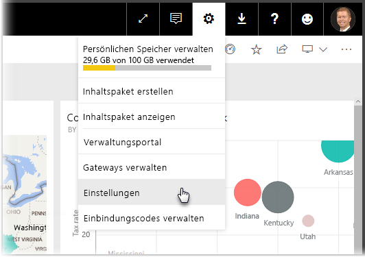
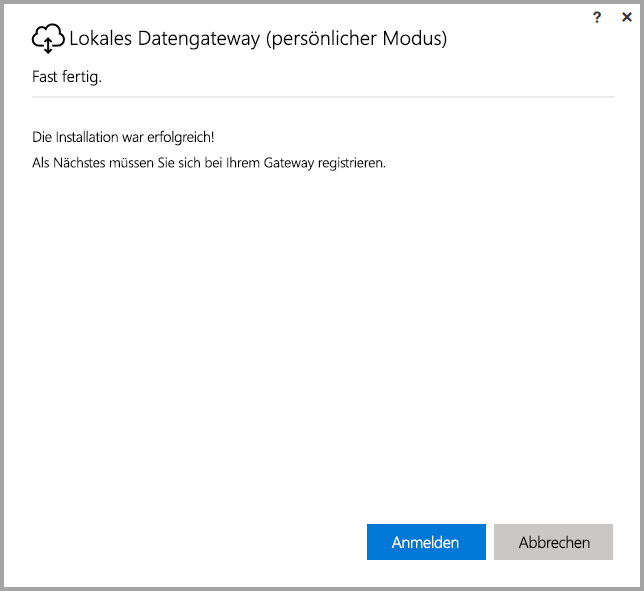

# <a name="on-premises-data-gateway-personal-mode"></a>Lokales Datengateway (persönlicher Modus)
Sie können lokale Datenquellen verwenden und Power BI-Berichte und Dashboards erstellen, indem Sie ein Gateway verwenden. Ein **Gateway** ist eine Software, die den Zugriff auf Daten erleichtert, die in einem privaten, lokalen Netzwerk gespeichert sind. Dann können Sie diese Daten in Onlinediensten wie z.B. **Power BI-Dienst** nutzen. Das **lokale Datengateway (persönlicher Modus)** ist ein kürzlich veröffentlichtes Update für das Power BI-Gateway, das es Benutzern ermöglicht, ein Gateway auf ihrem eigenen Computer zu installieren und auf lokale Daten zuzugreifen.


> [!NOTE]
> Das **lokale Datengateway (persönlicher Modus)** ersetzt die zuvor unterstützte Version von Personal Gateway, die als **Power BI Gateway – Personal** bezeichnet wird. Das vorherige Personal Gateway wird nur noch bis 31. Juli 2017 funktionieren. In den folgenden Abschnitten finden Sie Informationen darüber, wie Sie auf die neue Version aktualisieren.
> 
> 

## <a name="features-of-the-on-premises-data-gateway-personal-mode"></a>Funktionen des lokalen Datengateways (persönlicher Modus)
Mit der Veröffentlichung des **lokalen Datengateways (persönlicher Modus)** ist jetzt eine Sammlung von Verbesserungen und Funktionen verfügbar. In der vorherigen Version von Personal Gateway (das **Power BI Gateway – Personal** heißt) hat die Implementierung einige Einschränkungen auferlegt. Wie bei vielen Power BI-Produkten haben wir das Kundenfeedback, Kundenwünsche und den Gebrauch des Produkts durch Kunden berücksichtigt. Daher wurde das **lokale Datengateway (persönlicher Modus)** von Grund auf neu gestaltet und umfasst die folgenden Funktionen und Verbesserungen:

* **Verbesserte Zuverlässigkeit**: Die neue Version von Personal Gateway ist, gegenüber der vorherigen Version, zuverlässiger. Dies konnte aufgrund von Code- und strukturellen Softwareverbesserungen erreicht werden.
* **Verbesserte Erweiterbarkeit**: Als Teil der strukturellen Softwareverbesserungen können zusätzliche Funktionen einfach zum Personal Gateway hinzugefügt werden, sobald sie verfügbar sind.
* **Löschen von Personal Gateway aus dem Power BI-Dienst**: Mit der neuen Version können Sie jetzt Ihr Personal Gateway innerhalb des **Power BI-Diensts** löschen.
* **Konfigurations- und Dienstprotokolle**: In der neuen Version können Sie problemlos Konfigurations- und Dienstprotokolle in eine ZIP-Datei exportieren – mit einem einzigen Klick.

## <a name="installing-on-premises-data-gateway-personal-mode"></a>Installation des lokalen Datengateways (persönlicher Modus)
Um das **lokale Datengateway (persönlicher Modus)** zu installieren, ohne dass die vorherige Version des Gateways installiert ist, klicken Sie auf das Zahnradsymbol im **Power BI-Dienst**, und klicken Sie auf **Datengateway**.


Sie können das Gateway auch [hier](https://go.microsoft.com/fwlink/?LinkId=820925&clcid=0x409) herunterladen. Sie können die Installationsschritte befolgen, und nachdem der Installationsvorgang das Installieren einer Version des Gateways erlaubt hat (das Standardgateway, das für andere Benutzer freigegeben werden kann, oder den persönlichen Modus), stellen Sie sicher, dass Sie das **lokale Datengateway (persönlicher Modus)** auswählen, wenn Sie gefragt werden, welche Version des Gateways Sie installieren möchten.

### <a name="updating-from-the-previous-personal-gateway"></a>Aktualisieren vom früheren Personal Gateway
Falls Sie noch **Power BI Gateway – Personal** installiert haben, werden Sie aufgefordert, die neue und verbesserte Version von Personal Gateway zu installieren, wenn Sie **Datasets** unter **Einstellungen** im **Power BI-Dienst** ansehen.



Wenn Sie ein Dataset auswählen, und Sie dann **Gatewayverbindung** wählen, werden Sie benachrichtigt, dass die neue und verbesserte Version von Personal Gateway verfügbar ist. Wenn Sie dies tun, wählen Sie **Jetzt installieren**.


> [!NOTE]
> Wenn Sie die vorherige Version von **Power BI Gateway – Personal** als einen erhöhten Prozess ausführen, stellen Sie sicher, dass Sie die neue Gatewayinstallation auch mit erhöhten Rechten beginnen, damit Ihre Datasetanmeldeinformationen automatisch aktualisiert werden können. Andernfalls müssen Sie die Datasetanmeldeinformationen manuell aktualisieren.
> 
> 

Sie werden durch die Aktualisierung geführt, wonach Sie sehen, dass die Installation erfolgreich war. Schließen Sie das Programm noch nicht, Sie befinden sich im letzten Schritt.



Hier ist der letzte Schritt. Sobald das neue Personal Gateway installiert ist (und der letzte Installationsbildschirm immer noch sichtbar ist), melden Sie sich beim **Power BI-Dienst** an, und warten Sie, bis Sie feststellen, dass das Gateway online ist, wie in der folgenden Abbildung dargestellt.


Wenn Sie das Personal Gateway auf demselben Computer aktualisiert haben, auf dem das vorherige Gateway installiert ist, werden Ihre Anmeldeinformationen automatisch aktualisiert, und alle Aktualisierungsaktivitäten erfolgen über das neue Gateway. Wenn das vorherige Gateway auf einem anderen Computer installiert wurde, werden Sie dazu aufgefordert, Ihre Anmeldeinformationen für bestimmte Datasets zu aktualisieren. Beachten Sie in der vorherigen Abbildung die Liste der Datasets im Fenster. Auf der Liste werden Datasets angezeigt, die möglicherweise aktualisierte Anmeldeinformationen erfordern. Jedes aufgeführte Dataset ist eine direkte Verknüpfung, auf die Sie einfach klicken, um Ihre Anmeldeinformationen zu aktualisieren.

Das ist alles – zumindest fast. Da Sie das neue Gateway installiert haben, muss die vorherige Version nicht mehr auf Ihrem Computer installiert sein. Deshalb sollten Sie diese deinstallieren. Hierzu können Sie nach **Power BI Gateway – Personal** auf dem Computer suchen und sie deinstallieren.

### <a name="determining-which-version-of-the-personal-gateway-you-have-installed"></a>Bestimmen, welche Version von Personal Gateway auf Ihrem Computer installiert ist
Um die Version von Personal Gateway zu bestimmen, die Sie gerade installiert haben, können Sie Folgendes tun:

* Die vorherige Version von Personal Gateway heißt **Power BI Gateway – Personal** und das Power BI-Symbol wird im Installationsdialogfeld verwendet.
* Die neue Version von Personal Gateway wird als **lokales Datengateway (persönlicher Modus)** bezeichnet und verwendet das Gatewaysymbol (eine Wolke mit einem auf- und absteigenden Pfeil auf der Unterseite).

Wechseln Sie zu **Programme hinzufügen/entfernen** und finden Sie heraus, ob **Power BI Gateway – Personal** in der Liste angezeigt wird. In diesem Fall haben Sie die vorherige Version von Personal Gateway installiert.

## <a name="using-fast-combine-with-the-personal-gateway"></a>Verwendung von schnellem Kombinieren mit Personal Gateway
Wenn Sie **schnelles Kombinieren** mit dem vorherigen Gateway verwendet haben, müssen Sie die folgenden Schritte ausführen, um **schnelles Kombinieren** erneut zu aktivieren und mit dem **lokalen Datengateway (persönlicher Modus)** zu arbeiten:

1. Öffnen Sie die folgende Datei mit dem Datei-Explorer:
   
   ```
   %localappdata%\Microsoft\on-premises data gateway (personal mode)\Microsoft.PowerBI.DataMovement.Pipeline.GatewayCore.dll.config
   ```
2. Fügen Sie am Ende der Datei den folgenden Text ein:
   
       ```
       <setting name="EnableFastCombine" serializeAs="String">```
       <value>true</value>
       </setting>
       ```
3. Sobald der Vorgang abgeschlossen ist, wird die Einstellung in ungefähr einer Minute wirksam. Um zu überprüfen, ob es ordnungsgemäß funktioniert, versuchen Sie eine bedarfsgesteuerte Aktualisierung im **Power BI-Dienst**, um zu bestätigen, dass **schnelles Kombinieren** funktioniert.

## <a name="limitations-and-considerations"></a>Einschränkungen und Überlegungen
Bei der Verwendung des **lokalen Datengateways (persönlicher Modus)** sind die in der folgenden Liste beschriebenen Punkte zu berücksichtigen.

* Bei Verwendung von **Windows Hello** oder einer PIN zur Anmeldung bei Windows tritt möglicherweise der folgende Fehler auf: 
  * *Das Benutzerkonto, das Sie ausgewählt haben, entspricht nicht den Anforderungen der Anwendung. Verwenden Sie ein anderes Konto.*
  * Um diesen Fehler zu beheben, klicken Sie auf *Use a different account* (Anderes Konto verwenden) und melden sich erneut an. 

Die folgenden Datenquellen werden derzeit für das **lokale Datengateway (persönlicher Modus)** nicht unterstützt:

* ADO.NET 
* CurrentWorkbook
* FTP
* HDFS
* SAP BusinessObjects         
* Spark

Unterstützung für Spark ist für die zweite Hälfte des Kalenderjahres 2017 geplant.

## <a name="frequently-asked-questions-faq"></a>Häufig gestellte Fragen (FAQ)
* Kann ich das **lokale Datengateway (persönlicher Modus)** parallel mit dem **lokalen Datengateway** ausführen (vormals bekannt als die Enterpriseversion des Gateways)?
  
  * **Antwort**: Ja, mit der neuen Version können beide gleichzeitig ausgeführt werden.
* Kann ich das **lokale Datengateway (persönlicher Modus)** als Dienst ausführen?
  
  * **Antwort:** Nein. Das **lokale Datengateway (persönlicher Modus)** kann nur als Anwendung ausgeführt werden. Wenn Sie das Gateway als Dienst bzw. im Administratormodus ausführen müssen, müssen Sie das [**lokale Datengateway**](service-gateway-onprem.md) (vormals bekannt als das Enterprisegateway) in Betracht ziehen.
* Wie oft wird das **lokale Datengateway (persönlicher Modus)** aktualisiert?
  
  * **Antwort**: Wir möchten das Personal Gateway monatlich aktualisieren.
* Warum werde ich aufgefordert, Anmeldeinformationen zu aktualisieren?
  
  * **Antwort**: Vielen Situationen können eine Anfrage zum Eingeben von Anmeldeinformationen auslösen. Meistens passiert dies, wenn Sie das **lokale Datengateway (persönlicher Modus)** erneut auf einem anderen Computer als Ihr **Power BI – Personal**-Gateway installiert haben. Es kann auch ein Problem in der Datenquelle vorliegen und Power BI konnte keine Testverbindung herstellen, oder ein Timeout oder ein Systemfehler ist aufgetreten. Sie können Ihre Anmeldeinformationen im **Power BI-Dienst** aktualisieren, indem Sie auf das **Zahnradsymbol** klicken und **Einstellungen** und dann **Datasets** auswählen, und das betreffende Dataset suchen und auf *Anmeldeinformationen aktualisieren* klicken.
* Wie lang wird mein vorheriges Personal Gateway während des Upgrades offline geschaltet?
  
  * **Antwort**: Die Aktualisierung des Personal Gateways auf die neue Version sollte nur einige Minuten dauern. 
* Was geschieht, wenn ich nicht bis zum 31. Juli 2017 zum neuen Personal Gateway migriere?
  
  * **Antwort**: Wenn Sie Ihre Berichte mit dem aktuellen Gateway aktualisieren, werden Ihre Aktualisierungen nicht mehr vorgenommen. Die einzige Möglichkeit zum Einrichten eines neuen Aktualisierungszeitplan wird durch das Installieren und Konfigurieren des neuen Gateways gegeben sein.
* Ich verwende R-Skript. Wird dies unterstützt?
  
  * **Antwort**: Wir werden bald eine Unterstützung für R-Skripts hinzufügen.
* Warum sehe ich die Nachricht, dass ich mein Gateway aktualisieren soll, nicht im **Power BI-Dienst**?
  
  * **Antwort**: Wahrscheinlich, weil Sie ein oder mehrere Datasets haben, die eine Datenquelle enthalten, die derzeit nicht unterstützt wird.

## <a name="next-steps"></a>Nächste Schritte
[Konfigurieren von Proxyeinstellungen für Power BI-Gateways](service-gateway-proxy.md)  
Weitere Fragen? [Wenden Sie sich an die Power BI-Community](http://community.powerbi.com/)

