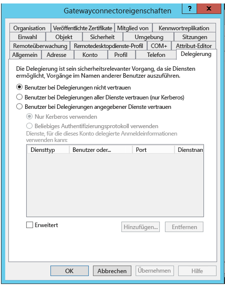
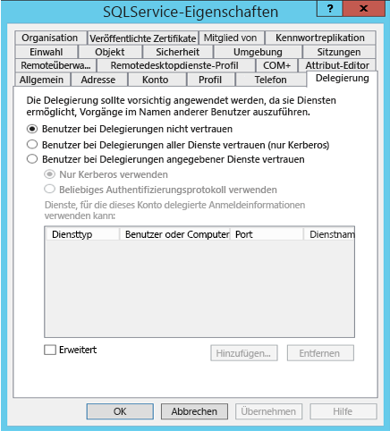
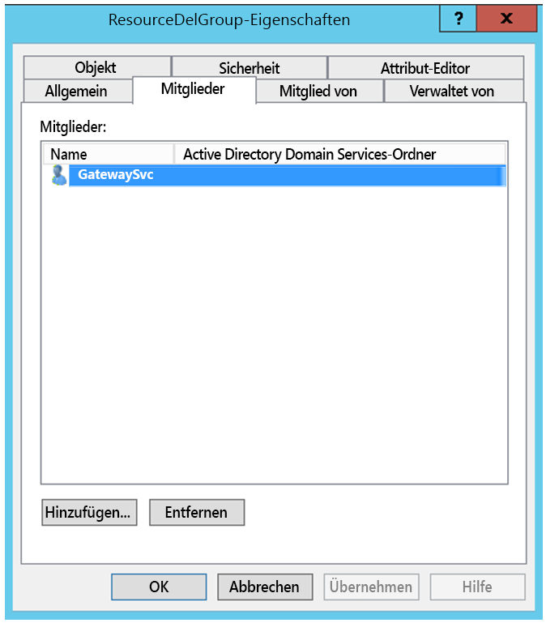
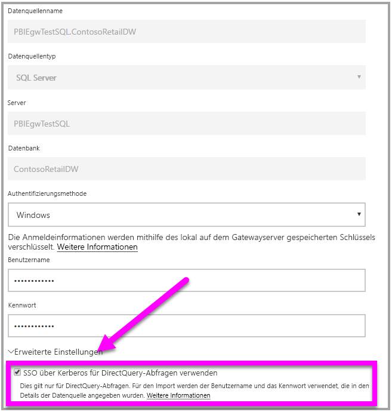

# <a name="use-resource-based-kerberos-for-single-sign-on-sso-from-power-bi-to-on-premises-data-sources"></a>Verwenden von Kerberos (ressourcenbasiert) für einmaliges Anmelden (SSO) über Power BI bei lokalen Datenquellen

Verwenden Sie die [ressourcenbasierte eingeschränkte Kerberos-Delegierung](/windows-server/security/kerberos/kerberos-constrained-delegation-overview), um SSO-Konnektivität für Windows Server 2012 und höhere Versionen zu ermöglichen und so zuzulassen, dass sich Front-End- und Back-End-Dienste in unterschiedlichen Domänen befinden. Damit dies funktioniert, muss die Domäne des Back-End-Diensts der Domäne des Front-End-Diensts vertrauen.

## <a name="preparing-for-resource-based-kerberos-constrained-delegation"></a>Vorbereiten für die ressourcenbasierte eingeschränkte Kerberos-Delegierung

Für die ordnungsgemäße Funktion der eingeschränkten Kerberos-Delegierung müssen verschiedene Elemente konfiguriert werden, u.a. _Dienstprinzipalnamen_ (SPN) und Delegierungseinstellungen für Dienstkonten.

### <a name="prerequisite-1-operating-system-requirements"></a>Voraussetzung 1: Betriebssystemanforderungen

Die ressourcenbasierte eingeschränkte Delegierung kann nur auf einem Domänencontroller unter Windows Server 2012 R2 oder Windows Server 2012 oder höher konfiguriert werden.

### <a name="prerequisite-2-install-and-configure-the-on-premises-data-gateway"></a>Voraussetzung 2: Installieren und Konfigurieren des lokalen Datengateways

Diese Version des lokalen Datengateways unterstützt das direkte Upgrade sowie die _Übernahme der Einstellungen_ von vorhandenen Gateways.

### <a name="prerequisite-3-run-the-gateway-windows-service-as-a-domain-account"></a>Voraussetzung 3: Ausführen des Gateway-Windows-Diensts als Domänenkonto

In einer Standardinstallation wird das Gateway als Dienstkonto des lokalen Computers (speziell _NT Service\PBIEgwService_) ausgeführt; siehe folgende Abbildung:


Zum Aktivieren der eingeschränkten Kerberos-Delegierung muss das Gateway als Domänenkonto ausgeführt werden, es sei denn, Ihr Azure AD ist bereits mit dem lokalen Active Directory synchronisiert (mit Azure AD DirSync/Connect). Wenn Sie das Konto in ein Domänenkonto ändern müssen, finden Sie im Verlauf dieses Artikels weitere Informationen unter [Switching the gateway to a domain account (Umstellen des Gateways auf ein Domänenkonto)](service-gateway-sso-kerberos.md#switching-the-gateway-to-a-domain-account).

Wenn Azure AD DirSync/Connect konfiguriert ist und Benutzerkonten synchronisiert werden, muss der Gatewaydienst zur Laufzeit keine lokalen AD-Suchvorgänge ausführen. Sie können die lokale Dienst-SID für den Gatewaydienst verwenden (statt ein Domänenkonto zu verlangen). Die in diesem Artikel beschriebenen Schritte für die Konfiguration der eingeschränkten Kerberos-Delegierung sind identisch mit den Schritten dieser Konfiguration (sie werden lediglich auf das Computerobjekt des Gateways in Active Directory angewendet und nicht auf das Domänenkonto).

### <a name="prerequisite-4-have-domain-admin-rights-to-configure-spns-setspn-and-kerberos-constrained-delegation-settings"></a>Voraussetzung 4: Vorhandene Domänenadministratorrechte zum Konfigurieren von SPNs (SetSPN) und Einstellungen für die eingeschränkte Kerberos-Delegierung

Der Domänenadministrator kann anderen Personen zwar vorübergehend oder dauerhaft Rechte zum Konfigurieren von SPNs und der Kerberos-Delegierung gewähren, ohne dass dafür Domänenadministratorrechte benötigt werden, diese Vorgehensweise ist jedoch nicht ratsam. Im folgenden Abschnitt werden die erforderlichen Schritte für **Voraussetzung 3** ausführlich erläutert.

## <a name="configuring-kerberos-constrained-delegation-for-the-gateway-and-data-source"></a>Konfigurieren der eingeschränkten Kerberos-Delegierung für das Gateway und die Datenquelle

Um das System ordnungsgemäß zu konfigurieren, müssen die folgenden zwei Elemente konfiguriert bzw. überprüft werden:

1. Konfigurieren Sie ggf. einen SPN für das Domänenkonto des Gatewaydiensts.

1. Konfigurieren Sie Delegierungseinstellungen für das Domänenkonto des Gatewaydiensts.

Beachten Sie, dass Sie zum Ausführen dieser beiden Konfigurationsschritte Domänenadministrator sein müssen.

In den folgenden Abschnitten werden diese Schritte beschrieben.

### <a name="configure-an-spn-for-the-gateway-service-account"></a>Konfigurieren eines SPN für das Gatewaydienstkonto

Bestimmen Sie zunächst, ob bereits ein SPN für das Domänenkonto erstellt wurde, das als Gatewaydienstkonto verwendet wird; führen Sie dabei jedoch diese Schritte aus:

1. Starten Sie **Active Directory-Benutzer und -Computer** als Domänenadministrator.

1. Klicken Sie mit der rechten Maustaste auf die Domäne, wählen Sie **Suchen** aus, und geben Sie den Kontonamen des Gatewaydienstkontos ein.

1. Klicken Sie im Suchergebnis mit der rechten Maustaste auf das Gatewaydienstkonto, und wählen Sie **Eigenschaften** aus.

1. Wenn im Dialogfeld **Eigenschaften** die Registerkarte **Delegierung** angezeigt wird, wurde bereits ein SPN erstellt, und Sie können mit dem nächsten Unterabschnitt zum Konfigurieren der Delegierungseinstellungen fortfahren.

    Ist im Dialogfeld **Eigenschaften** keine Registerkarte **Delegierung** vorhanden, können Sie manuell einen SPN für das Konto erstellen, wodurch die Registerkarte **Delegierung** hinzugefügt wird (mit dieser können Sie Delegierungseinstellungen am einfachsten konfigurieren). Sie können einen SPN mit dem [setspn-Tool](https://technet.microsoft.com/library/cc731241.aspx) von Windows erstellen (Sie benötigen Domänenadministratorrechte, um den SPN zu erstellen).

    Angenommen, das Gatewaydienstkonto heißt „PBIEgwTest\GatewaySvc“, während der Name des Computers, auf dem der Gatewaydienst ausgeführt wird, **Machine1** lautet. Zum Festlegen des SPN für das Gatewaydienstkonto für den Computer in diesem Beispiel führen Sie den folgenden Befehl aus:

      

    Ist dieser Schritt abgeschlossen, können wir mit dem Konfigurieren von Delegierungseinstellungen fortfahren.

### <a name="configure-delegation-settings"></a>Konfigurieren von Delegierungseinstellungen

In den folgenden Schritten wird davon ausgegangen, dass Sie eine lokale Umgebung mit zwei Computern in verschiedenen Domänen besitzen: einem Gatewaycomputer und einem Datenbankserver, der SQL Server ausführt. In diesem Beispiel wird außerdem von folgenden Einstellungen und Namen ausgegangen:

- Name des Gatewaycomputers: **PBIEgwTestGW**
- Gatewaydienstkonto: **PBIEgwTestFrontEnd\GatewaySvc** (Kontoanzeigename: Gatewayconnector)
- Computername der SQL Server-Datenquelle: **PBIEgwTestSQL**
- Dienstkonto der SQL Server-Datenquelle: **PBIEgwTestBackEnd\SQLService**

Für diese Beispielnamen und -einstellungen sind folgende Konfigurationsschritte auszuführen:

1. Stellen Sie mithilfe von **Active Directory-Benutzer und -Computer**, einem Snap-In der Microsoft Management Console (MMC), auf dem Domänencontroller für die Domäne **PBIEgwTestFront-End** sicher, dass für das Gatewaydienstkonto keine Einstellungen für die Delegierung angewendet werden.

    

1. Stellen Sie mithilfe von **Active Directory-Benutzer und -Computer** auf dem Domänencontroller für die Domäne **PBIEgwTestBack-End** sicher, dass für das Back-End-Dienstkonto keine Einstellungen für die Delegierung angewendet werden. Vergewissern Sie sich darüber hinaus, dass das Attribut „msDS-AllowedToActOnBehalfOfOtherIdentity“ für dieses Konto ebenfalls nicht festgelegt ist. Sie finden dieses Attribut im „Attribut-Editor“, wie in der folgenden Abbildung gezeigt:

    

1. Erstellen Sie eine Gruppe in **Active Directory-Benutzer und -Computer** auf dem Domänencontroller für die Domäne **PBIEgwTestBack-End**. Fügen Sie dieser Gruppe das Gatewaydienstkonto hinzu, wie in der folgenden Abbildung dargestellt. Die Abbildung zeigt eine neue Gruppe namens _ResourceDelGroup_ und das dieser Gruppe hinzugefügte Gatewaydienstkonto **GatewaySvc**.

    

1. Öffnen Sie die Eingabeaufforderung, und führen Sie auf dem Domänencontroller für die Domäne **PBIEgwTestBack-End** die folgenden Befehle aus, um das Attribut „msDS-AllowedToActOnBehalfOfOtherIdentity“ des Back-End-Dienstkontos zu aktualisieren:

    ```powershell
    $c=get-adgroupResourceDelGroup
    set-aduser **SQLService** -principalsAllowedToDelegateToAccount$c
    ```

1. Sie können überprüfen, ob das Update auf der Registerkarte „Attribut-Editor“ in den Eigenschaften für das Back-End-Dienstkonto in **Active Directory-Benutzer und -Computer** angezeigt wird.

Schließlich muss dem Gatewaydienstkonto auf dem Computer, auf dem der Gatewaydienst (**PBIEgwTestGW** in unserem Beispiel) ausgeführt wird, die lokale Richtlinie „Annehmen der Clientidentität nach Authentifizierung“ gewährt werden. Sie können dies mit dem lokalen Gruppenrichtlinien-Editor (**gpedit**) ausführen/überprüfen.

1. Führen Sie auf dem Gatewaycomputer Folgendes aus: _gpedit.msc_

1. Navigieren Sie zu **Richtlinie für „Lokaler Computer“ > Computerkonfiguration > Windows-Einstellungen > Sicherheitseinstellungen > Lokale Richtlinien > Zuweisen von Benutzerrechten**, wie in der folgenden Abbildung veranschaulicht.

    

1. Wählen Sie in der Liste der Richtlinien unter **Zuweisen von Benutzerrechten** den Eintrag **Annehmen der Clientidentität nach Authentifizierung** aus.

    

1. Klicken Sie mit der rechten Maustaste, öffnen Sie das Dialogfeld **Eigenschaften** für **Annehmen der Clientidentität nach Authentifizierung**, und überprüfen Sie die Liste der Konten. Sie muss das Gatewaydienstkonto (**PBIEgwTestFront-end**  **\GatewaySvc**) enthalten.

1. Wählen Sie in der Liste der Richtlinien unter **Zuweisen von Benutzerrechten** den Eintrag **Als Teil des Betriebssystems fungieren (SeTcbPrivilege)** aus. Vergewissern Sie sich, dass das Gatewaydienstkonto auch in der Liste der Konten aufgeführt wird.

1. Starten Sie den Dienstprozess **Lokales Datengateway** neu.

## <a name="running-a-power-bi-report"></a>Ausführen eines Power BI-Berichts

Nachdem alle zuvor in diesem Artikel beschriebenen Konfigurationsschritte ausgeführt wurden, können Sie auf der Seite **Gateways verwalten** in Power BI die Datenquelle konfigurieren. Anschließend können Sie unter **Erweiterte Einstellungen** SSO aktivieren, um Berichte und Datasets zu veröffentlichen, die an diese Datenquelle gebunden sind.



Diese Konfiguration funktioniert in den meisten Fällen. Bei Kerberos können jedoch je nach Umgebung unterschiedliche Konfigurationen vorhanden sein. Wenn der Bericht immer noch nicht geladen wird, wenden Sie sich an Ihren Domänenadministrator, um das Problem zu untersuchen.

## <a name="next-steps"></a>Nächste Schritte

Weitere Informationen zum **lokalen Datengateway** und **DirectQuery** finden Sie in den folgenden Ressourcen:

- [Lokales Datengateway](service-gateway-onprem.md)
- [DirectQuery in Power BI](desktop-directquery-about.md)
- [Von DirectQuery unterstützte Datenquellen](desktop-directquery-data-sources.md)
- [DirectQuery und SAP BW](desktop-directquery-sap-bw.md)
- [DirectQuery und SAP HANA](desktop-directquery-sap-hana.md)