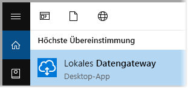
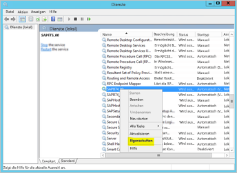
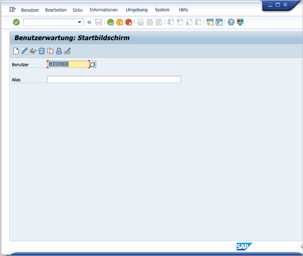
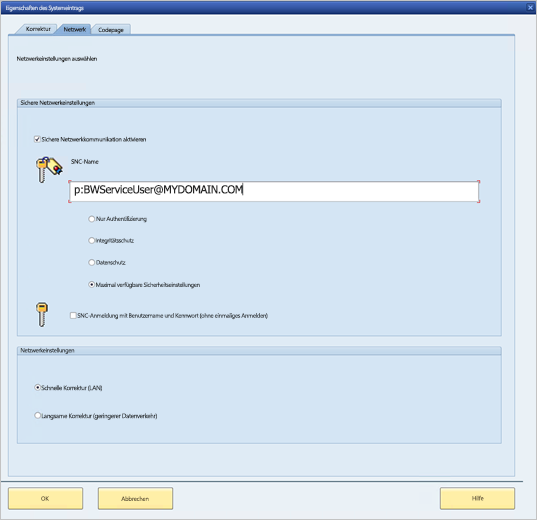

# <a name="use-kerberos-for-single-sign-on-sso-from-power-bi-to-on-premises-data-sources"></a>Verwenden von Kerberos für SSO (Single Sign-On, Einmaliges Anmelden) von Power BI bei lokalen Datenquellen

Verwenden Sie die [eingeschränkte Kerberos-Delegierung](/windows-server/security/kerberos/kerberos-constrained-delegation-overview), um eine nahtlose Konnektivität für das einmalige Anmelden (Single Sign-On, SSO) zu ermöglichen. Durch das Aktivieren von SSO für Power BI-Berichte und -Dashboards können Daten aus lokalen Datenquellen einfacher aktualisiert werden.

## <a name="supported-data-sources"></a>Unterstützte Datenquellen

Folgende Datenquellen werden derzeit unterstützt:

* SQL Server
* SAP HANA
* SAP BW
* Teradata
* Spark
* Impala

Außerdem wird SAP HANA mit [Security Assertion Markup Language (SAML)](service-gateway-sso-saml.md) unterstützt.

### <a name="sap-hana"></a>SAP HANA

Gehen Sie folgendermaßen vor, um SSO für SAP HANA zu aktivieren:

* Vergewissern Sie sich, dass auf dem SAP HANA-Server die erforderliche Mindestversion ausgeführt wird (abhängig von der Plattformebene Ihres SAP HANA-Servers):
  * [HANA 2 SPS 01 Rev 012.03](https://launchpad.support.sap.com/#/notes/2557386)
  * [HANA 2 SPS 02 Rev 22](https://launchpad.support.sap.com/#/notes/2547324)
  * [HANA 1 SP 12 Rev 122.13](https://launchpad.support.sap.com/#/notes/2528439)
* Installieren Sie auf dem Gatewaycomputer den aktuellen HANA-ODBC-Treiber von SAP.  Die Mindestversion ist die HANA-ODBC-Version 2.00.020.00 vom August 2017.

Weitere Informationen zum Einrichten von SSO für SAP HANA mit Kerberos finden Sie im SAP HANA Security Guide im Thema [Single Sign-On Using Kerberos](https://help.sap.com/viewer/b3ee5778bc2e4a089d3299b82ec762a7/2.0.03/1885fad82df943c2a1974f5da0eed66d.html) (Einmaliges Anmelden mit Kerberos). Sehen Sie sich außerdem die Links auf dieser Seite an – insbesondere den SAP-Hinweis 1837331 (HOWTO HANA DBSSO Kerberos/Active Directory).

## <a name="prepare-for-kerberos-constrained-delegation"></a>Vorbereiten für die eingeschränkte Kerberos-Delegierung

Damit die eingeschränkte Kerberos-Delegierung ordnungsgemäß funktioniert, müssen verschiedene Elemente konfiguriert werden. Hierzu zählen unter anderem *Dienstprinzipalnamen* (Service Principal Names, SPNs) und Delegierungseinstellungen für Dienstkonten.

### <a name="prerequisite-1-install-and-configure-the-microsoft-on-premises-data-gateway"></a>Voraussetzung 1: Installieren und Konfigurieren des lokalen Datengateways von Microsoft

Diese Version des lokalen Datengateways unterstützt das direkte Upgrade sowie die Übernahme der Einstellungen von vorhandenen Gateways.

### <a name="prerequisite-2-run-the-gateway-windows-service-as-a-domain-account"></a>Voraussetzung 2: Ausführen des Gateway-Windows-Diensts als Domänenkonto

In einer Standardinstallation wird das Gateway als Dienstkonto des lokalen Computers (*NT Service\PBIEgwService*) ausgeführt.


Zum Aktivieren der eingeschränkten Kerberos-Delegierung muss das Gateway als Domänenkonto ausgeführt werden, es sei denn, Ihre Instanz von Azure Active Directory (Azure AD) ist bereits mit Ihrer lokalen Active Directory-Instanz synchronisiert (mittels Azure AD DirSync/Connect). Informationen zur Umstellung auf ein Domänenkonto finden Sie weiter unten in diesem Artikel unter [Umstellen des Gateways auf ein Domänenkonto](#switch-the-gateway-to-a-domain-account).

> [!NOTE]
> Wenn Azure AD Connect konfiguriert ist und Benutzerkonten synchronisiert werden, muss der Gatewaydienst zur Laufzeit keine lokalen Azure AD-Suchvorgänge ausführen. Sie können anstelle eines Domänenkontos die lokale Dienst-SID für den Gatewaydienst verwenden. Die in diesem Artikel beschriebenen Schritte für die Konfiguration der eingeschränkten Kerberos-Delegierung sind bei dieser Konfiguration identisch. Sie werden lediglich auf das Computerobjekt des Gateways in Azure AD angewendet und nicht auf das Domänenkonto.

### <a name="prerequisite-3-have-domain-admin-rights-to-configure-spns-setspn-and-kerberos-constrained-delegation-settings"></a>Voraussetzung 3: Vorhandene Domänenadministratorrechte zum Konfigurieren von SPNs (SetSPN) und Einstellungen für die eingeschränkte Kerberos-Delegierung

Der Domänenadministrator kann anderen Personen ohne Domänenadministratorrechte zwar vorübergehend oder dauerhaft Rechte zum Konfigurieren von SPNs sowie zum Konfigurieren der Kerberos-Delegierung gewähren, dies wird jedoch nicht empfohlen. Die empfohlenen Konfigurationsschritte werden im folgenden Abschnitt ausführlicher erläutert.

## <a name="configure-kerberos-constrained-delegation-for-the-gateway-and-data-source"></a>Konfigurieren der eingeschränkten Kerberos-Delegierung für das Gateway und die Datenquelle

Konfigurieren Sie als Domänenadministrator einen SPN für das Domänenkonto des Gatewaydiensts sowie Delegierungseinstellungen für dieses Domänenkonto.

### <a name="configure-an-spn-for-the-gateway-service-account"></a>Konfigurieren eines SPN für das Gatewaydienstkonto

Ermitteln Sie zunächst, ob bereits ein SPN für das Domänenkonto erstellt wurde, das als Gatewaydienstkonto verwendet wird:

1. Öffnen Sie **Active Directory-Benutzer und -Computer** als Domänenadministrator.

2. Klicken Sie mit der rechten Maustaste auf die Domäne, wählen Sie **Suchen** aus, und geben Sie den Kontonamen des Gatewaydienstkontos ein.

3. Klicken Sie im Suchergebnis mit der rechten Maustaste auf das Gatewaydienstkonto, und wählen Sie **Eigenschaften** aus.

4. Wird im Dialogfeld **Eigenschaften** die Registerkarte **Delegierung** angezeigt, wurde bereits ein SPN erstellt. In diesem Fall können Sie direkt mit dem Konfigurieren der Delegierungseinstellungen fortfahren.

    Wird im Dialogfeld **Eigenschaften** keine Registerkarte namens **Delegierung** angezeigt, können Sie manuell einen SPN für das Konto erstellen. Dadurch wird die Registerkarte **Delegierung** hinzugefügt. Verwenden Sie das in Windows enthaltene [setspn-Tool](https://technet.microsoft.com/library/cc731241.aspx). (Für die SPN-Erstellung sind Domänenadministratorrechte erforderlich.)

    Angenommen, das Gatewaydienstkonto heißt „PBIEgwTest\GatewaySvc“, während der Name des Computers, auf dem der Gatewaydienst ausgeführt wird, **Machine1** lautet. Führen Sie den folgenden Befehl aus, um für den Computer in diesem Beispiel den SPN für das Gatewaydienstkonto festzulegen:

    

    Ist dieser Schritt abgeschlossen, können wir mit dem Konfigurieren von Delegierungseinstellungen fortfahren.

### <a name="configure-delegation-settings-on-the-gateway-service-account"></a>Konfigurieren von Delegierungseinstellungen für das Gatewaydienstkonto

Die zweite Konfigurationsvoraussetzung sind die Delegierungseinstellungen für das Gatewaydienstkonto. Es gibt verschiedene Tools, mit denen Sie diese Schritte ausführen können. Hier verwenden wir „Active Directory-Benutzer und -Computer“ – ein Snap-In der MMC (Microsoft Management Console) zur Verwaltung und Veröffentlichung von Informationen im Verzeichnis. Es ist auf Domänencontrollern standardmäßig verfügbar. Über die Windows-Funktionskonfiguration kann es jedoch auch auf anderen Computern aktiviert werden.

Wir müssen die eingeschränkte Kerberos-Delegierung mit Protokollübertragung konfigurieren. Bei der eingeschränkten Delegierung müssen Sie explizit angeben, an welche Dienste die Delegierung erfolgen soll. Delegierungsaufrufe des Gatewaydienstkontos werden beispielsweise nur von SQL Server oder Ihrem SAP HANA-Server akzeptiert.

In diesem Abschnitt wird davon ausgegangen, dass Sie bereits SPNs für die zugrunde liegenden Datenquellen (wie SQL Server, SAP HANA, Teradata und Spark) konfiguriert haben. Informationen zum Konfigurieren der SPNs für diese Datenquellenserver finden Sie in der technischen Dokumentation für den jeweiligen Datenbankserver. Eine weitere Informationsquelle ist der Blogbeitrag [What SPN does your app require?](https://blogs.msdn.microsoft.com/psssql/2010/06/23/my-kerberos-checklist/) (Welchen SPN benötigt Ihre App?).

In den folgenden Schritten wird davon ausgegangen, dass Sie eine lokale Umgebung mit zwei Computern besitzen: einem Gatewaycomputer und einem Datenbankserver, der SQL Server ausführt. Für dieses Beispiel wird ebenfalls von folgenden Einstellungen und Namen ausgegangen:

* Name des Gatewaycomputers: **PBIEgwTestGW**
* Gatewaydienstkonto: **PBIEgwTest\GatewaySvc** (Kontoanzeigename: Gatewayconnector)
* Computername der SQL Server-Datenquelle: **PBIEgwTestSQL**
* Dienstkonto der SQL Server-Datenquelle: **PBIEgwTest\SQLService**

Konfigurieren Sie die Delegierungseinstellungen wie folgt:

1. Öffnen Sie **Active Directory-Benutzer und -Computer** mit Domänenadministratorrechten.

2. Klicken Sie mit der rechten Maustaste auf das Gatewaydienstkonto (**PBIEgwTest\GatewaySvc**), und wählen Sie **Eigenschaften** aus.

3. Wählen Sie die Registerkarte **Delegierung** aus.

4. Wählen Sie **Computer nur bei Delegierungen angegebener Dienste vertrauen** > **Beliebiges Authentifizierungsprotokoll verwenden** aus.

6. Wählen Sie unter **Dienste, für die dieses Konto delegierte Anmeldeinformationen verwenden kann** die Option **Hinzufügen** aus.

7. Wählen Sie im Dialogfeld „Neu“ **Benutzer oder Computer** aus.

8. Geben Sie das Dienstkonto für die SQL Server-Datenquelle (**PBIEgwTest\SQLService**) ein, und wählen Sie **OK** aus.

9. Wählen Sie den SPN aus, den Sie für den Datenbankserver erstellt haben. In unserem Beispiel beginnt der SPN mit **MSSQLSvc**. Wenn Sie sowohl den FQDN als auch den NetBIOS-SPN für den Datenbankdienst hinzugefügt haben, wählen Sie beide aus. Unter Umständen wird nur eine einzelne Option angezeigt.

10. Wählen Sie **OK**aus. Der SPN sollte jetzt in der Liste angezeigt werden.

    Wahlweise können Sie **Erweitert** auswählen, um den FQDN und den NetBIOS-SPN anzuzeigen. Wenn Sie **Erweitert** ausgewählt haben, sieht das Dialogfeld in etwa wie auf der folgenden Abbildung aus. Wählen Sie **OK**aus.

    

Abschließend muss dem Gatewaydienstkonto auf dem Computer, auf dem der Gatewaydienst (in unserem Beispiel: **PBIEgwTestGW**) ausgeführt wird, die lokale Richtlinie **Annehmen der Clientidentität nach Authentifizierung** gewährt werden. Dies kann über den lokalen Gruppenrichtlinien-Editor (**gpedit**) ausgeführt und überprüft werden.

1. Führen Sie auf dem Gatewaycomputer Folgendes aus: *gpedit.msc*

1. Navigieren Sie zu **Richtlinie für „Lokaler Computer“** > **Computerkonfiguration** > **Windows-Einstellungen** > **Sicherheitseinstellungen** > **Lokale Richtlinien** > **Zuweisen von Benutzerrechten**.

    

1. Wählen Sie unter **Zuweisen von Benutzerrechten** in der Richtlinienliste den Eintrag **Annehmen der Clientidentität nach Authentifizierung** aus.

    

    Klicken Sie mit der rechten Maustaste, und öffnen Sie **Eigenschaften**. Überprüfen Sie die Kontenliste. Sie muss das Gatewaydienstkonto (**PBIEgwTest\GatewaySvc**) enthalten.

1. Wählen Sie unter **Zuweisen von Benutzerrechten** in der Richtlinienliste den Eintrag **Als Teil des Betriebssystems fungieren (SeTcbPrivilege)** aus. Vergewissern Sie sich, dass das Gatewaydienstkonto auch in der Liste der Konten aufgeführt wird.

1. Starten Sie den Dienstprozess **Lokales Datengateway** neu.

Wenn Sie SAP HANA verwenden, wird empfohlen, diese zusätzlichen Schritte durchzuführen, um die Leistung geringfügig zu verbessern.

1. Suchen Sie im Gatewayinstallationsverzeichnis die folgende Konfigurationsdatei, und öffnen Sie sie: *Microsoft.PowerBI.DataMovement.Pipeline.GatewayCore.dll.config*.

1. Suchen Sie die Eigenschaft *FullDomainResolutionEnabled*, und ändern Sie ihren Wert in *True*.

    ```xml
    <setting name=" FullDomainResolutionEnabled " serializeAs="String">
          <value>True</value>
    </setting>
    ```

## <a name="run-a-power-bi-report"></a>Ausführen eines Power BI-Berichts

Nach Abschluss aller Konfigurationsschritte können Sie in Power BI auf der Seite **Gateways verwalten** die Datenquelle konfigurieren. Aktivieren Sie anschließend unter **Erweiterte Einstellungen** das einmalige Anmelden, und veröffentlichen Sie Berichte und Datasets, die an diese Quelle gebunden sind.


Diese Konfiguration funktioniert in den meisten Fällen. Bei Kerberos können jedoch je nach Umgebung unterschiedliche Konfigurationen vorhanden sein. Sollte der Bericht immer noch nicht geladen werden, wenden Sie sich zur weiteren Untersuchung an Ihren Domänenadministrator.

## <a name="switch-the-gateway-to-a-domain-account"></a>Umstellen des Gateways auf ein Domänenkonto

Bei Bedarf können Sie das Gateway über die Benutzeroberfläche **Lokales Datengateway** von einem lokalen Dienstkonto auf die Ausführung als Domänenkonto umstellen. Dazu gehen Sie wie folgt vor:

1. Öffnen Sie das Konfigurationstool **Lokales Datengateway**.

   

2. Klicken Sie auf der Hauptseite auf die Schaltfläche **Anmelden**, und melden Sie sich mit Ihrem Power BI-Konto an.

3. Wählen Sie nach abgeschlossener Anmeldung die Registerkarte **Diensteinstellungen** aus.

4. Wählen Sie **Konto ändern** aus, um die geführte exemplarische Vorgehensweise zu starten.

   

## <a name="configure-sap-bw-for-sso"></a>Konfigurieren von SAP BW für SSO

Da Sie nun wissen, wie Kerberos mit einem Gateway funktioniert, können Sie SSO für SAP Business Warehouse (SAP BW) konfigurieren. Bei den folgenden Schritten wird vorausgesetzt, dass Sie auf die [eingeschränkte Kerberos-Delegierung](#prepare-for-kerberos-constrained-delegation) vorbereitet sind, die zuvor im Artikel beschrieben wurde.

Dieser Leitfaden wurde so umfassend wie möglich gestaltet. Sollten Sie einige dieser Schritte bereits ausgeführt haben, können Sie sie überspringen. Beispielsweise haben Sie vielleicht bereits einen Dienstbenutzer für Ihren SAP BW-Server erstellt und ihm einen SPN zugeordnet, oder Sie haben bereits die Bibliothek `gsskrb5` installiert.

### <a name="set-up-gsskrb5-on-client-machines-and-the-sap-bw-server"></a>Einrichten von „gsskrb5“ auf Clientcomputern und dem SAP BW-Server

> [!NOTE]
> `gsskrb5` wird von SAP nicht mehr aktiv unterstützt. Weitere Informationen finden Sie im [SAP-Hinweis 352295](https://launchpad.support.sap.com/#/notes/352295). Beachten Sie auch, dass `gsskrb5` keine SSO-Verbindungen vom Datengateway zu SAP BW-Nachrichtenservern zulässt. Nur Verbindungen mit SAP BW-Anwendungsservern sind möglich.

`gsskrb5` muss sowohl vom Client als auch vom Server genutzt werden, damit eine SSO-Verbindung über das Gateway hergestellt werden kann. Die Common Crypto-Bibliothek (sapcrypto) wird derzeit nicht unterstützt.

1. Laden Sie `gsskrb5` - `gx64krb5` aus dem [SAP-Hinweis 2115486](https://launchpad.support.sap.com/) herunter (S-User von SAP erforderlich). Versichern Sie sich, dass Sie mindestens Version 1.0.11.x von „gsskrb5.dll“ und „gx64krb5.dll“ besitzen.

1. Speichern Sie die Bibliothek an einem Ort auf Ihrem Gatewaycomputer, auf den Ihre Gatewayinstanz (und auch die SAP-GUI, falls Sie die SSO-Verbindung per SAP Logon testen möchten) zugreifen kann.

1. Legen Sie eine weitere Kopie an einem Ort auf Ihrem SAP BW-Servercomputer ab, auf den der SAP BW-Server zugreifen kann.

1. Legen Sie auf den Client- und Servercomputern die Umgebungsvariablen `SNC\_LIB` und `SNC\_LIB\_64` so fest, dass sie auf den Speicherort von „gx64krb5.dll“ bzw. „gx64krb5.dll“ verweisen.

### <a name="create-a-sap-bw-service-user-and-enable-snc-communication"></a>Erstellen eines SAP BW-Dienstbenutzers und Aktivieren der SNC-Kommunikation

Neben der bereits durchgeführten Gatewaykonfiguration gibt es einige spezifische Zusatzschritte für SAP BW. Im Abschnitt [Konfigurieren von Delegierungseinstellungen für das Gatewaydienstkonto](#configure-delegation-settings-on-the-gateway-service-account) der Dokumentation wird davon ausgegangen, dass Sie bereits SPNs für die zugrunde liegenden Datenquellen konfiguriert haben. So führen Sie diese Konfiguration für SAP BW durch:

1. Erstellen Sie auf einem Active Directory-Domänencontrollerserver einen Dienstbenutzer (zuerst nur einen einfachen Active Directory-Benutzer) für den SAP BW-Anwendungsserver in Ihrer Active Directory-Umgebung. Weisen Sie diesem anschließend einen SPN zu.

    SAP empfiehlt, den SPN mit `SAP/` zu beginnen, aber auch die Verwendung anderer Präfixe wie etwa `HTTP/` sollte möglich sein. Der Teil nach dem Präfix `SAP/` ist frei wählbar. So können Sie etwa den Benutzernamen des Dienstbenutzers des SAP BW-Servers verwenden. Ein Beispiel: Wenn Sie `BWServiceUser@\<DOMAIN\>` als Dienstbenutzer erstellen, können Sie `SAP/BWServiceUser` als SPN verwenden. Sie können die SPN-Zuordnung beispielsweise mit dem Befehl „setspn“ festlegen. Wenn Sie beispielsweise den SPN für den gerade erstellten Dienstbenutzer festlegen möchten, können Sie den folgenden Befehl über ein Befehlsfenster auf einem Domänencontrollercomputer ausführen: `setspn -s SAP/ BWServiceUser DOMAIN\ BWServiceUser`. Weitere Informationen finden Sie in der SAP BW-Dokumentation.

1. Gewähren Sie dem Dienstbenutzer Zugriff auf Ihren SAP BW-Anwendungsserver:

    1. Fügen Sie auf dem SAP BW-Servercomputer den Dienstbenutzer der lokalen Administratorgruppe für Ihren SAP BW-Server hinzu. Öffnen Sie hierzu das Programm „Computerverwaltung“, und doppelklicken Sie auf die lokale Administratorgruppe für Ihren Server.

        

    1. Doppelklicken Sie auf die lokale Administratorgruppe, und wählen Sie **Hinzufügen** aus, um Ihren Dienstbenutzer der Gruppe hinzuzufügen. Wählen Sie **Namen überprüfen** aus, um sicherzustellen, dass Sie den Namen korrekt eingegeben haben. Wählen Sie **OK**aus.

1. Legen Sie den Dienstbenutzer des SAP BW-Servers als den Benutzer fest, der den SAP BW-Serverdienst auf dem SAP BW-Servercomputer startet.

    1. Öffnen Sie **Ausführen**, und geben Sie „Services.msc“ ein. Suchen Sie nach dem Dienst für die Instanz Ihres SAP BW-Anwendungsservers. Klicken Sie mit der rechten Maustaste darauf, und wählen Sie **Eigenschaften** aus.

        

    1. Wechseln Sie zur Registerkarte **Anmelden**, und ändern Sie den Benutzer in Ihren SAP BW-Dienstbenutzer. Geben Sie das Kennwort des Benutzers ein, und wählen Sie **OK** aus.

1. Melden Sie sich über SAP Logon bei Ihrem Server an, und legen Sie mithilfe der Transaktion RZ10 folgende Profilparameter fest:

    1. Legen Sie den Profilparameter „snc/identity/as“ auf „p:\<von Ihnen erstellter SAP BW-Dienstbenutzer\>“ fest (Beispiel: p:BWServiceUser@MYDOMAIN.COM). Beachten Sie das „p:“, das dem UPN des Dienstbenutzers vorangestellt ist. Das Präfix lautet nicht „p:CN=“ wie bei Verwendung der Common Crypto-Bibliothek als SNC-Bibliothek.

    1. Legen Sie den Profilparameter „snc/gssapi\_lib“ auf \<Pfad zu gsskrb5.dll/gx64krb5.dll auf dem Servercomputer\> (die verwendete Bibliothek hängt von der Bitanzahl des Betriebssystems ab) fest. Vergessen Sie nicht, die Bibliothek an einem Ort zu speichern, auf den der SAP BW-Anwendungsserver zugreifen kann.

    1. Legen Sie außerdem folgende zusätzliche Profilparameter fest, bei denen Sie den Wert nach Bedarf ändern können. Beachten Sie, dass Clients durch die letzten fünf Optionen über SAP Logon eine Verbindung mit dem SAP BW-Server herstellen können, ohne dass SNC konfiguriert wurde.

        | **Einstellung** | **Wert** |
        | --- | --- |
        | snc/data\_protection/max | 3 |
        | snc/data\_protection/min | 1 |
        | snc/data\_protection/use | 9 |
        | snc/accept\_insecure\_cpic | 1 |
        | snc/accept\_insecure\_gui | 1 |
        | snc/accept\_insecure\_r3int\_rfc | 1 |
        | snc/accept\_insecure\_rfc | 1 |
        | snc/permit\_insecure\_start | 1 |

    1. Legen Sie die Eigenschaft „snc/enable“ auf 1 fest.

1. Wenn Sie diese Profilparameter festgelegt haben, öffnen Sie auf dem Servercomputer die SAP-Verwaltungskonsole, und starten Sie die SAP BW-Instanz neu. Sollte der Server nicht starten, vergewissern Sie sich, dass Sie die Profilparameter korrekt festgelegt haben. Weitere Informationen zu den Einstellungen für die Profilparameter finden Sie in der [SAP-Dokumentation](https://help.sap.com/saphelp_nw70ehp1/helpdata/en/e6/56f466e99a11d1a5b00000e835363f/frameset.htm). Bei Bedarf steht im weiteren Verlauf der Dokumentation auch ein Problembehandlungsabschnitt zur Verfügung.

### <a name="map-a-sap-bw-user-to-an-active-directory-user"></a>Zuordnen eines SAP BW-Benutzers zu einem Active Directory-Benutzer

Ordnen Sie einen Active Directory-Benutzer dem Benutzer eines SAP BW-Anwendungsservers zu, und testen Sie die SSO-Verbindung in SAP Logon.

1. Melden Sie sich über SAP Logon bei Ihrem SAP BW-Server an. Führen Sie die Transaktion SU01 aus.

1. Geben Sie für **User** (Benutzer) den SAP BW-Benutzer ein, für den Sie SSO-Verbindungen aktivieren möchten. (Auf dem vorherigen Screenshot wird die Berechtigung für „BIUSER“ festgelegt.) Klicken Sie auf der Symbolleiste des SAP Logon-Fensters auf das **Bearbeitungssymbol** (Stift).

    

1. Wählen Sie die Registerkarte **SNC** aus. Geben Sie im Eingabefeld „SNC name“ (SNC-Name) die Zeichenfolge „p:\<Ihr Active Directory-Benutzer\>@\<Ihre Domäne\>“ ein. Achten Sie auf die erforderliche Zeichenfolge „p:“, die dem UPN des Active Directory-Benutzers vorangestellt sein muss. Der angegebene Active Directory-Benutzer muss zu der Person oder Organisation gehören, für die Sie den SSO-Zugriff auf den SAP BW-Anwendungsserver gewähren möchten. Wenn Sie beispielsweise dem Benutzer [testuser@TESTDOMAIN.COM](mailto:testuser@TESTDOMAIN.COM) SSO-Zugriff gewähren möchten, geben Sie p:testuser@TESTDOMAIN.COM ein.

    

1. Wählen Sie in der Nähe der linken oberen Bildschirmecke auf das **Speichersymbol** (Diskette).

### <a name="test-sign-in-by-using-sso"></a>Testen der Anmeldung mit SSO

Vergewissern Sie sich, dass Sie sich bei dem Server anmelden können. Verwenden Sie SAP Logon über SSO als der Active Directory-Benutzer, für den Sie soeben den SSO-Zugriff aktiviert haben.

1. Melden Sie sich als der Active Directory-Benutzer, für den Sie soeben den SSO-Zugriff aktiviert haben, bei einem Computer an, auf dem SAP Logon installiert ist. Starten Sie SAP Logon, und erstellen Sie eine neue Verbindung.

1. Wählen Sie im Fenster **Create New System Entry** (Neuen Systemeintrag erstellen) die Optionen **User Specified System** (Benutzerdefiniertes System) > **Next** (Weiter) aus.

    

1. Geben Sie auf dem nächsten Bildschirm die entsprechenden Details (einschließlich Anwendungsserver, Instanznummer und System-ID) ein. Wählen Sie **Finish** (Fertig stellen) aus.

1. Klicken Sie mit der rechten Maustaste auf die neue Verbindung, und wählen Sie **Properties** (Eigenschaften) aus. Wählen Sie die Registerkarte **Network** (Netzwerk) aus. Geben Sie im Textfeld **SNC Name** (SNC-Name) die Zeichenfolge „p:\<UPN des SAP BW-Dienstbenutzers\>“ ein (Beispiel: p:BWServiceUser@MYDOMAIN.COM). Wählen Sie dann **OK** aus.

    

1. Doppelklicken Sie auf die Verbindung, die Sie gerade erstellt haben, um eine SSO-Verbindung mit dem SAP BW-Server herzustellen. Wenn die Verbindung erfolgreich ist, fahren Sie mit dem nächsten Schritt fort. Gehen Sie die vorherigen Schritt in dieser Dokumentation andernfalls erneut durch, um sicherzustellen, dass diese ordnungsgemäß durchgeführt wurden. Alternativ können Sie den untenstehenden Abschnitt zur Problembehandlung lesen. Hinweis: Wenn Sie in diesem Kontext keine SSO-Verbindung mit dem SAP BW-Server herstellen können, können Sie auch im Gatewaykontext keine SSO-Verbindung mit dem SAP BW-Server herstellen.

### <a name="troubleshoot-installation-and-connections"></a>Behandeln von Installations- und Verbindungsproblemen

Sollten Probleme mit der Installation von gsskrb5 oder mit SSO-Verbindungen über SAP Logon auftreten, gehen Sie wie folgt vor:

- Die Serverprotokolle („...work\dev\_w0“ auf dem Servercomputer) können beim Behandeln von Problemen hilfreich sein, die beim Setup von gsskrb5 auftreten. Dies gilt insbesondere dann, wenn der SAP BW-Server nicht startet, nachdem die Profilparameter geändert wurden.

- Falls Sie den SAP BW-Dienst aufgrund eines Anmeldefehlers nicht starten können, haben Sie möglicherweise das falsche Kennwort angegeben, als Sie den Benutzer zum Starten von SAP BW festgelegt haben. Überprüfen Sie das Kennwort, indem Sie sich bei einem Computer in Ihrer Active Directory-Umgebung als der SAP BW-Dienstbenutzer anmelden.

- Sollte eine Fehlermeldung im Zusammenhang mit SQL-Anmeldeinformationen angezeigt werden, überprüfen Sie, ob Sie dem Dienstbenutzer Zugriff auf die SAP BW-Datenbank gewährt haben.

- Unter Umständen wird folgende Meldung angezeigt: „(GSS-API) specified target is unknown or unreachable“ ((GSS-API) Das angegebene Ziel ist unbekannt oder nicht erreichbar.). Das bedeutet in der Regel, dass Sie den falschen SNC-Namen angegeben haben. Vergewissern Sie sich, dass Sie in der Clientanwendung nur „p:“ verwendet haben (nicht etwa „p:CN=“ oder eine andere Zeichenfolge außer dem UPN des Dienstbenutzers).

- Unter Umständen wird folgende Meldung angezeigt: „(GSS-API) An invalid name was supplied“ ((GSS-API) Ein ungültiger Name wurde angegeben.). Vergewissern Sie sich, dass „p:“ im Wert des SNC-Identitätsprofilparameters des Servers enthalten ist.

- Unter Umständen wird folgende Meldung angezeigt: „(SNC error) the specified module could not be found“ ((SNC-Fehler) Das angegebene Modul wurde nicht gefunden.). Dieser Fehler ist üblicherweise darauf zurückzuführen, dass sich `gsskrb5.dll/gx64krb5.dll` an einem Speicherort befindet, auf den nur mit erweiterten Berechtigungen (Administratorrechten) zugegriffen werden kann.

### <a name="add-registry-entries-to-the-gateway-machine"></a>Hinzufügen von Registrierungseinträgen zum Gatewaycomputer

Fügen Sie erforderliche Registrierungseinträge zur Registrierung des Computers hinzu, auf dem das Gateway installiert ist. Auszuführende Befehle:

1. REG ADD HKLM\SOFTWARE\Wow6432Node\SAP\gsskrb5 /v ForceIniCredOK /t REG\_DWORD /d 1 /f

1. REG ADD HKLM\SOFTWARE\SAP\gsskrb5 /v ForceIniCredOK /t REG\_DWORD /d 1 /f

### <a name="set-configuration-parameters-on-the-gateway-machine"></a>Festlegen von Konfigurationsparametern auf dem Gatewaycomputer

Es gibt zwei Optionen zum Festlegen von Konfigurationsparametern, je nachdem, ob Azure AD Connect so konfiguriert ist, dass Benutzer sich als Azure AD-Benutzer beim Power BI-Dienst anmelden können.

Wenn Azure AD Connect konfiguriert ist, gehen Sie wie folgt vor:

1. Öffnen Sie die Hauptdatei für die Gatewaykonfiguration (`Microsoft.PowerBI.DataMovement.Pipeline.GatewayCore.dll`). Standardmäßig befindet sich diese Datei unter C:\Programme\Lokales Datengateway.

1. Vergewissern Sie sich, dass die Eigenschaft **FullDomainResolutionEnabled** auf **True** und **SapHanaSsoRemoveDomainEnabled** auf **False** festgelegt ist.

1. Speichern Sie die Konfigurationsdatei.

1. Klicken Sie auf der Registerkarte **Dienste** des Task-Managers mit der rechten Maustaste auf den Gatewaydienst, und wählen Sie **Neu starten** aus.

    

Ist Azure AD Connect nicht konfiguriert, führen Sie für jeden Power BI-Dienstbenutzer, den Sie einem Azure AD-Benutzer zuordnen möchten, die folgenden Schritte aus. Durch diese Schritte wird ein Power BI-Dienstbenutzer manuell mit einem Active Directory-Benutzer mit der Berechtigung zur Anmeldung bei SAP BW verknüpft.

1. Öffnen Sie die Hauptdatei für die Gatewaykonfiguration (`Microsoft.PowerBI.DataMovement.Pipeline.GatewayCore.dll`). Standardmäßig befindet sich diese Datei unter C:\Programme\Lokales Datengateway.

1. Legen Sie **ADUserNameLookupProperty** auf `msDS-cloudExtensionAttribute1` und **ADUserNameReplacementProperty** auf `SAMAccountName` fest. Speichern Sie die Konfigurationsdatei.

1. Klicken Sie auf der Registerkarte **Dienste** des Task-Managers mit der rechten Maustaste auf den Gatewaydienst, und wählen Sie **Neu starten** aus.

    

1. Legen Sie die Eigenschaft `msDS-cloudExtensionAttribute1` des Active Directory-Benutzers fest. Das ist der Benutzer, den Sie einem SAP BW-Benutzer zugeordnet haben. Legen Sie die Eigenschaft auf den Power BI-Dienstbenutzer fest, für den Sie Kerberos-SSO aktivieren möchten. Die Eigenschaft `msDS-cloudExtensionAttribute1` kann unter anderem über das MMC-Snap-In „Active Directory-Benutzer und -Computer“ festgelegt werden. (Sie können aber auch andere Methoden verwenden.)

    1. Melden Sie sich bei einem Domänencontrollercomputer als Administrator an.

    1. Öffnen Sie den Ordner **Users** (Benutzer) im Fenster des Snap-Ins, und doppelklicken Sie auf den Active Directory-Benutzer, den Sie einem SAP BW-Benutzer zugeordnet haben.

    1. Wählen Sie die Registerkarte **Attribute Editor** (Attribut-Editor) aus.

        Sollte diese Registerkarte nicht angezeigt werden, suchen Sie nach Anweisungen, wie Sie diese aktivieren, oder verwenden Sie eine andere Methode, um die Eigenschaft festzulegen. Wählen Sie eines der Attribute aus, und drücken Sie die M-TASTE, um zu den Active Directory-Eigenschaften zu gelangen, die mit dem Buchstaben „m“ beginnen. Suchen Sie nach der Eigenschaft `msDS-cloudExtensionAttribute1`, und doppelklicken Sie darauf. Legen Sie den Wert auf den Benutzernamen fest, den Sie für die Anmeldung beim Power BI-Dienst verwenden. Verwenden Sie dazu das Format „YourUser@YourDomain“.

    1. Wählen Sie **OK**aus.

        

    1. Klicken Sie auf **Übernehmen**. Vergewissern Sie sich in der Spalte **Value** (Wert), dass der korrekte Wert festgelegt wurde.

### <a name="add-a-new-sap-bw-application-server-data-source-to-the-power-bi-service"></a>Hinzufügen einer neuen Datenquelle vom Typ „SAP BW-Anwendungsserver“ zum Power BI-Dienst

Fügen Sie die SAP BW-Datenquelle Ihrem Gateway hinzu. Führen Sie dazu die Schritte zum [Ausführen eines Berichts](#run-a-power-bi-report) aus, die weiter oben in diesem Artikel beschrieben sind.

1. Geben Sie im Konfigurationsfenster der Datenquelle genau wie bei der Anmeldung beim SAP BW-Server über Power BI Desktop den **Hostnamen**, die **Systemnummer** und die **Client-ID** des Anwendungsservers ein. Wählen Sie als **Authentifizierungsmethode** die Option **Windows** aus.

1. Geben Sie im Feld **Name des SNC-Partners** Folgendes ein: p:\<SPN, den Sie Ihrem SAP BW-Dienstbenutzer zugeordnet haben\>. Wenn der SPN z.B. „SAP/BWServiceUser@MYDOMAIN.COM“ lautet, geben Sie „p:SAP/BWServiceUser@MYDOMAIN.COM“ im Feld **Name des SNC-Partners** ein.

1. Wählen Sie für die SNC-Bibliothek **SNC\_LIB** oder **SNC\_LIB\_64** aus.

1. **Benutzername** und **Kennwort** müssen auf den Benutzernamen bzw. auf das Kennwort eines Active Directory-Benutzers festgelegt werden, der berechtigt ist, sich über SSO beim SAP BW-Server anzumelden. Die Angaben müssen also zu einem Active Directory-Benutzer gehören, der über die Transaktion SU01 einem SAP BW-Benutzer zugeordnet wurde. Diese Anmeldeinformationen werden nur verwendet, wenn das Kontrollkästchen **SSO über Kerberos für DirectQuery-Abfragen verwenden** nicht aktiviert ist.

1. Aktivieren Sie das Kontrollkästchen **SSO über Kerberos für DirectQuery-Abfragen verwenden**, und wählen Sie **Anwenden** aus. Wenn die Testverbindung nicht erfolgreich ist, überprüfen Sie, dass das Setup und die Konfigurationsschritte ordnungsgemäß durchgeführt wurden.

    Das Gateway verwendet immer die eingegebenen Anmeldeinformationen, um eine Testverbindung mit dem Server herzustellen und geplante Aktualisierungen importbasierter Berichte durchzuführen. Das Gateway versucht nur, eine SSO-Verbindung herzustellen, wenn **SSO über Kerberos für DirectQuery-Abfragen verwenden** ausgewählt ist und der Benutzer auf einen Bericht oder ein Dataset auf DirectQuery-Basis zugreift.

### <a name="test-your-setup"></a>Testen des Setups

Veröffentlichen Sie einen DirectQuery-Bericht über Power BI Desktop im Power BI-Dienst, um Ihr Setup zu testen. Vergewissern Sie sich, dass Sie beim Power BI-Dienst als Azure AD-Benutzer oder als Benutzer angemeldet sind, den Sie der Eigenschaft `msDS-cloudExtensionAttribute1` eines Azure AD-Benutzers zugeordnet haben. Wenn das Setup erfolgreich abgeschlossen wurde, sollten Sie auf der Grundlage des veröffentlichten Datasets im Power BI-Dienst einen Bericht erstellen können. Darüber hinaus sollten Sie Daten mittels Pull über visuelle Elemente in den Bericht übertragen können.

### <a name="troubleshoot-gateway-connectivity-issues"></a>Behandeln von Problemen mit der Gatewaykonnektivität

1. Überprüfen Sie die Gatewayprotokolle. Öffnen Sie die Anwendung für die Gatewaykonfiguration, und wählen Sie **Diagnose** > **Protokolle exportieren** aus. Die neuesten Fehler befinden sich jeweils am Ende der Protokolldatei.

    

1. Aktivieren Sie die SAP BW-Ablaufverfolgung, und überprüfen Sie die generierten Protokolldateien. Es sind verschiedene SAP BW-Ablaufverfolgungen verfügbar. Weitere Informationen finden Sie in der SAP-Dokumentation.

## <a name="errors-from-an-insufficient-kerberos-configuration"></a>Fehler aufgrund einer unzureichenden Kerberos-Konfiguration

Wenn der zugrunde liegende Datenbankserver und das Gateway nicht ordnungsgemäß für die eingeschränkte Kerberos-Delegierung konfiguriert sind, tritt unter Umständen der folgende Datenladefehler auf:


Die technischen Details für die Fehlermeldung (DM_GWPipeline_Gateway_ServerUnreachable) können wie folgt aussehen:


Infolgedessen kann das Gateway die Identität des ursprünglichen Benutzers nicht annehmen, und es kann keine Verbindung mit der Datenbank hergestellt werden.

## <a name="next-steps"></a>Nächste Schritte

Weitere Informationen zum **lokalen Datengateway** und **DirectQuery** finden Sie in den folgenden Ressourcen:

* [Lokales Datengateway](service-gateway-onprem.md)
* [DirectQuery in Power BI](desktop-directquery-about.md)
* [Von DirectQuery unterstützte Datenquellen](desktop-directquery-data-sources.md)
* [DirectQuery und SAP BW](desktop-directquery-sap-bw.md)
* [DirectQuery und SAP HANA](desktop-directquery-sap-hana.md)
