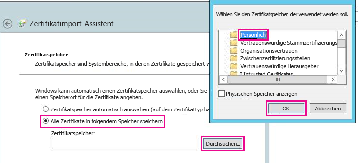
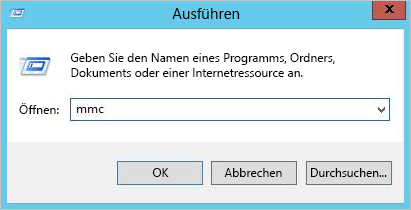

# <a name="use-security-assertion-markup-language-saml-for-single-sign-on-sso-from-power-bi-to-on-premises-data-sources"></a>Verwenden von SAML (Security Assertion Markup Language) für SSO (Single Sign-On, Einmaliges Anmelden) von Power BI bei lokalen Datenquellen

Verwenden Sie [SAML (Security Assertion Markup Language)](https://www.onelogin.com/pages/saml) zum Aktivieren der nahtlosen SSO-Konnektivität. Durch das Aktivieren von SSO für Power BI-Berichte und -Dashboards können Daten aus lokalen Datenquellen einfacher aktualisiert werden.

## <a name="supported-data-sources"></a>Unterstützte Datenquellen

Derzeit wird SAP HANA mit SAML unterstützt. Weitere Informationen zum Einrichten und Konfigurieren von SSO für SAP HANA mit SAML finden Sie in der SAP HANA-Dokumentation unter [SAML SSO for BI Platform to HANA (SAML SSO für die BI-Plattform mit HANA)](https://wiki.scn.sap.com/wiki/display/SAPHANA/SAML+SSO+for+BI+Platform+to+HANA).

Mit [Kerberos](service-gateway-sso-kerberos.md) werden weitere Datenquellen unterstützt.

## <a name="configuring-the-gateway-and-data-source"></a>Konfigurieren des Gateways und der Datenquelle

Zunächst generieren Sie ein Zertifikat für den SAML-Identitätsanbieter, dann weisen Sie der Identität einen Power BI-Benutzer zu, um SAML zu verwenden.

1. Generieren Sie ein Zertifikat. Stellen Sie sicher, dass Sie den FQDN des SAP HANA-Servers beim Ausfüllen des *allgemeinen Namens* verwenden. Das Zertifikat läuft in 365 Tagen ab.

    ```
    openssl req -newkey rsa:2048 -nodes -keyout samltest.key -x509 -days 365 -out samltest.crt
    ```

1. Klicken Sie in SAP HANA Studio mit der rechten Maustaste auf Ihren SAP HANA-Server, navigieren Sie dann zu **Security (Sicherheit)** > **Open Security Console (Sicherheitskonsole öffnen)** > **SAML Identity Provider (SAML-Identitätsanbieter)** > **OpenSSL Cryptographic Library (Kryptografische OpenSSL-Bibliothek)**.

    Es ist auch möglich, die kryptografische Bibliothek von SAP (auch bekannt als „CommonCryptoLib“ oder „sapcrypto“) anstelle von OpenSSL zu verwenden, um diese Einrichtungsschritte auszuführen. Für weitere Informationen lesen Sie die offizielle SAP-Dokumentation.

1. Klicken Sie auf **Import (Importieren)**, wählen Sie „samltest.crt“ aus, und importieren Sie die Datei.

    

1. Klicken Sie in SAP HANA Studio auf den Ordner **Security (Sicherheit)**.

    

1. Erweitern Sie **Users (Benutzer)**, und wählen Sie dann den Benutzer aus, den Sie Ihrem Power BI-Benutzer zuordnen möchten.

1. Wählen Sie **SAML** aus, und klicken Sie dann auf **Configure (Konfigurieren)**.

    

1. Wählen Sie den Identitätsanbieter aus, den Sie in Schritt 2 erstellt haben. Geben Sie die UPN des Power BI-Benutzers für die **External Identity (externe Identität)** ein, und klicken Sie dann auf **Add (Hinzufügen)**.

    

Nachdem Sie das Zertifikat und die Identität konfiguriert haben, können Sie als Nächstes das Zertifikat in das PFX-Format konvertieren und den Gatewaycomputer für die Verwendung des Zertifikats konfigurieren.

1. Konvertieren Sie das Zertifikat in das PFX-Format, indem Sie den folgenden Befehl ausführen.

    ```
    openssl pkcs12 -inkey samltest.key -in samltest.crt -export -out samltest.pfx
    ```

1. Kopieren Sie die PFX-Datei auf den Gatewaycomputer:

    1. Doppelklicken Sie auf die Datei „samltest.pfx“, und klicken Sie dann auf **Local Machine (Lokaler Computer)** > **Next (Weiter)**.

    1. Geben Sie das Kennwort ein, und klicken Sie auf **Next (Weiter)**.

    1. Wählen Sie die Option **Place all certificates in the following store (Alle Zertifikate unter folgendem Speicherort speichern)** aus, und klicken Sie dann auf **Browse (Durchsuchen)** > **Personal (Eigene Zertifikate)** > **OK**.

    1. Klicken Sie auf **Next (Weiter)**, und dann auf **Finish (Fertig stellen)**.

    

1. Gewähren Sie dem Gatewaydienstkonto den Zugriff auf den privaten Schlüssel des Zertifikats:

    1. Führen Sie die Microsoft Management Console (MMC) auf dem Gatewaycomputer aus.

        

    1. Klicken Sie unter **File (Datei)** auf **Add/Remove Snap-in (Snap-In hinzufügen/entfernen)**.

        

    1. Klicken Sie auf **Certificates (Zertifikate)** > **Add (Hinzufügen)**, und klicken Sie dann auf **Computer account (Computerkonto)** > **Next (Weiter)**.

    1. Klicken Sie auf **Local Computer (Lokaler Computer)** > **Finish (Fertig stellen)** > **OK**.

    1. Erweitern Sie **Certificates (Zertifikate)** > **Personal (Eigene Zertifikate)** > **Certificates (Zertifikate)**, und suchen Sie nach dem Zertifikat.

    1. Klicken Sie mit der rechten Maustaste auf das Zertifikat, und navigieren Sie zu **All Tasks (Alle Aufgaben)** > **Manage Private Keys (Private Schlüssel verwalten)**.

        

    1. Fügen Sie das Gatewaydienstkonto der Liste hinzu. Das Standardkonto ist **NT SERVICE\PBIEgwService**. Sie können herausfinden, welches Konto den Gatewaydienst ausführt, indem Sie **services.msc** ausführen, und nach **On-premises data gateway service (Lokaler Datengatewaydienst)** suchen.

        

Führen Sie schlussendlich die folgenden Schritte aus, um den Zertifikatfingerabdruck zur Gatewaykonfiguration hinzuzufügen.

1. Führen Sie den folgenden PowerShell-Befehl aus, um die Zertifikate auf Ihrem Computer aufzulisten.

    ```powershell
    Get-ChildItem -path cert:\LocalMachine\My
    ```
1. Kopieren Sie den Fingerabdruck des von Ihnen erstellten Zertifikats.

1. Navigieren Sie zum Gatewayverzeichnis, das standardmäßig C:\Programme\On-premises data gateway ist.

1. Öffnen Sie „PowerBI.DataMovement.Pipeline.GatewayCore.dll.config“, und suchen Sie nach dem Abschnitt \*SapHanaSAMLCertThumbprint\*. Fügen Sie den kopierten Fingerabdruck ein.

1. Starten Sie den Gatewaydienst neu.

## <a name="running-a-power-bi-report"></a>Ausführen eines Power BI-Berichts

Sie können jetzt die Seite **Manage Gateway (Gateway verwalten)** in Power BI verwenden, um die Datenquelle zu konfigurieren, und unter **Erweiterte Einstellungen** können Sie das einmalige Anmelden aktivieren. Anschließend können Sie Berichte und Datasets veröffentlichen, die an diese Datenquelle gebunden sind.


## <a name="troubleshooting"></a>Problembehandlung

Nachdem SSO konfiguriert wurde, wird Ihnen im Power BI-Portal möglicherweise der folgende Fehler angezeigt: „The credentials provided cannot be used for the SapHana source.“ (Die bereitgestellten Anmeldeinformationen können nicht für die SapHana-Quelle verwendet werden.) Dieser Fehler bedeutet, dass die SAML-Anmeldeinformationen von SAP HANA nicht akzeptiert wurden.

In den Authentifizierungsablaufverfolgungen finden sich detaillierte Informationen zur Fehlerbehebung bei Problemen mit Anmeldeinformationen bei SAP HANA. Befolgen Sie diese Schritte, um die Ablaufverfolgung für Ihren SAP HANA-Server zu konfigurieren.

1. Aktivieren Sie auf dem SAP HANA-Server die Authentifizierungsablaufverfolgung, indem Sie folgende Abfrage ausführen.

    ```
    ALTER SYSTEM ALTER CONFIGURATION ('indexserver.ini', 'SYSTEM') set ('trace', 'authentication') = 'debug' with reconfigure 
    ```

1. Reproduzieren Sie das Problem, das aufgetreten ist.

1. Öffnen Sie in HANA Studio die Administratorkonsole, und wechseln Sie zur Registerkarte **Diagnosis Files** (Diagnosedateien).

1. Öffnen Sie die aktuellste indexserver-Ablaufverfolgung, und suchen Sie nach „SAMLAuthenticator.cpp“.

    Sie sollten ähnlich wie in folgendem Beispiel eine detaillierte Fehlermeldung finden, die die Grundursache angibt.

    ```
    [3957]{-1}[-1/-1] 2018-09-11 21:40:23.815797 d Authentication   SAMLAuthenticator.cpp(00091) : Element '{urn:oasis:names:tc:SAML:2.0:assertion}Assertion', attribute 'ID': '123123123123123' is not a valid value of the atomic type 'xs:ID'.
    [3957]{-1}[-1/-1] 2018-09-11 21:40:23.815914 i Authentication   SAMLAuthenticator.cpp(00403) : No valid SAML Assertion or SAML Protocol detected
    ```

1. Sobald Sie die Problembehandlung abgeschlossen haben, deaktivieren Sie die Ablaufverfolgung, indem Sie die folgende Abfrage ausführen.

    ```
    ALTER SYSTEM ALTER CONFIGURATION ('indexserver.ini', 'SYSTEM') UNSET ('trace', 'authentication');
    ```

## <a name="next-steps"></a>Nächste Schritte

Weitere Informationen zum **lokalen Datengateway** und **DirectQuery** finden Sie in den folgenden Ressourcen:

* [Lokales Datengateway](service-gateway-onprem.md)
* [DirectQuery in Power BI](desktop-directquery-about.md)
* [Von DirectQuery unterstützte Datenquellen](desktop-directquery-data-sources.md)
* [DirectQuery und SAP BW](desktop-directquery-sap-bw.md)
* [DirectQuery und SAP HANA](desktop-directquery-sap-hana.md)
