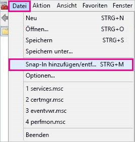

# <a name="use-security-assertion-markup-language-saml-for-single-sign-on-sso-from-power-bi-to-on-premises-data-sources"></a>Verwenden von SAML (Security Assertion Markup Language) für SSO (Single Sign-On, Einmaliges Anmelden) von Power BI bei lokalen Datenquellen

Verwenden Sie [SAML (Security Assertion Markup Language)](https://www.onelogin.com/pages/saml) zum Aktivieren der nahtlosen SSO-Konnektivität. Durch das Aktivieren von SSO für Power BI-Berichte und -Dashboards können Daten aus lokalen Datenquellen einfacher aktualisiert werden.

## <a name="supported-data-sources"></a>Unterstützte Datenquellen

Derzeit wird SAP HANA mit SAML unterstützt. Weitere Informationen zum Einrichten und Konfigurieren von SSO für SAP HANA mit SAML finden Sie in der SAP HANA-Dokumentation unter [SAML SSO for BI Platform to HANA (SAML SSO für die BI-Plattform mit HANA)](https://wiki.scn.sap.com/wiki/display/SAPHANA/SAML+SSO+for+BI+Platform+to+HANA).

Mit [Kerberos](service-gateway-sso-kerberos.md) werden weitere Datenquellen unterstützt.

## <a name="configuring-the-gateway-and-data-source"></a>Konfigurieren des Gateways und der Datenquelle

Zunächst generieren Sie ein Zertifikat für den SAML-Identitätsanbieter, dann weisen Sie der Identität einen Power BI-Benutzer zu, um SAML zu verwenden.

1. Generieren Sie ein Zertifikat. Stellen Sie sicher, dass Sie den FQDN des SAP HANA-Servers beim Ausfüllen des *allgemeinen Namens* verwenden. Das Zertifikat läuft in 365 Tagen ab.

    ```
    openssl req -newkey rsa:2048 -nodes -keyout samltest.key -x509 -days 365 -out samltest.crt
    ```

1. Klicken Sie in SAP HANA Studio mit der rechten Maustaste auf Ihren SAP HANA-Server, navigieren Sie dann zu **Security (Sicherheit)** > **Open Security Console (Sicherheitskonsole öffnen)** > **SAML Identity Provider (SAML-Identitätsanbieter)** > **OpenSSL Cryptographic Library (Kryptografische OpenSSL-Bibliothek)**.

1. Klicken Sie auf **Import (Importieren)**, wählen Sie „samltest.crt“ aus, und importieren Sie die Datei.

    

1. Klicken Sie in SAP HANA Studio auf den Ordner **Security (Sicherheit)**.

    

1. Erweitern Sie **Users (Benutzer)**, und wählen Sie dann den Benutzer aus, den Sie Ihrem Power BI-Benutzer zuordnen möchten.

1. Wählen Sie **SAML** aus, und klicken Sie dann auf **Configure (Konfigurieren)**.

    

1. Wählen Sie den Identitätsanbieter aus, den Sie in Schritt 2 erstellt haben. Geben Sie die UPN des Power BI-Benutzers für die **External Identity (externe Identität)** ein, und klicken Sie dann auf **Add (Hinzufügen)**.

    

Nachdem Sie das Zertifikat und die Identität konfiguriert haben, können Sie als Nächstes das Zertifikat in das PFX-Format konvertieren und den Gatewaycomputer für die Verwendung des Zertifikats konfigurieren.

1. Konvertieren Sie das Zertifikat in das PFX-Format, indem Sie den folgenden Befehl ausführen.

    ```
    openssl pkcs12 -inkey samltest.key -in samltest.crt -export -out samltest.pfx
    ```

1. Kopieren Sie die PFX-Datei auf den Gatewaycomputer:

    1. Doppelklicken Sie auf die Datei „samltest.pfx“, und klicken Sie dann auf **Local Machine (Lokaler Computer)** > **Next (Weiter)**.

    1. Geben Sie das Kennwort ein, und klicken Sie auf **Next (Weiter)**.

    1. Wählen Sie die Option **Place all certificates in the following store (Alle Zertifikate unter folgendem Speicherort speichern)** aus, und klicken Sie dann auf **Browse (Durchsuchen)** > **Personal (Eigene Zertifikate)** > **OK**.

    1. Klicken Sie auf **Next (Weiter)**, und dann auf **Finish (Fertig stellen)**.

    

1. Gewähren Sie dem Gatewaydienstkonto den Zugriff auf den privaten Schlüssel des Zertifikats:

    1. Führen Sie die Microsoft Management Console (MMC) auf dem Gatewaycomputer aus.

        

    1. Klicken Sie unter **File (Datei)** auf **Add/Remove Snap-in (Snap-In hinzufügen/entfernen)**.

        

    1. Klicken Sie auf **Certificates (Zertifikate)** > **Add (Hinzufügen)**, und klicken Sie dann auf **Computer account (Computerkonto)** > **Next (Weiter)**.

    1. Klicken Sie auf **Local Computer (Lokaler Computer)** > **Finish (Fertig stellen)** > **OK**.

    1. Erweitern Sie **Certificates (Zertifikate)** > **Personal (Eigene Zertifikate)** > **Certificates (Zertifikate)**, und suchen Sie nach dem Zertifikat.

    1. Klicken Sie mit der rechten Maustaste auf das Zertifikat, und navigieren Sie zu **All Tasks (Alle Aufgaben)** > **Manage Private Keys (Private Schlüssel verwalten)**.

        

    1. Fügen Sie das Gatewaydienstkonto der Liste hinzu. Das Standardkonto ist **NT SERVICE\PBIEgwService**. Sie können herausfinden, welches Konto den Gatewaydienst ausführt, indem Sie **services.msc** ausführen, und nach **On-premises data gateway service (Lokaler Datengatewaydienst)** suchen.

        

Führen Sie schlussendlich die folgenden Schritte aus, um den Zertifikatfingerabdruck zur Gatewaykonfiguration hinzuzufügen.

1. Führen Sie den folgenden PowerShell-Befehl aus, um die Zertifikate auf Ihrem Computer aufzulisten.

    ```powershell
    Get-ChildItem -path cert:\LocalMachine\My
    ```
1. Kopieren Sie den Fingerabdruck des von Ihnen erstellten Zertifikats.

1. Navigieren Sie zum Gatewayverzeichnis, das standardmäßig C:\Programme\On-premises data gateway ist.

1. Öffnen Sie „PowerBI.DataMovement.Pipeline.GatewayCore.dll.config“, und suchen Sie nach dem Abschnitt \*SapHanaSAMLCertThumbprint\*. Fügen Sie den kopierten Fingerabdruck ein.

1. Starten Sie den Gatewaydienst neu.

## <a name="running-a-power-bi-report"></a>Ausführen eines Power BI-Berichts

Sie können jetzt die Seite **Manage Gateway (Gateway verwalten)** in Power BI verwenden, um die Datenquelle zu konfigurieren, und unter **Erweiterte Einstellungen** können Sie das einmalige Anmelden aktivieren. Anschließend können Sie Berichte und Datasets veröffentlichen, die an diese Datenquelle gebunden sind.


## <a name="next-steps"></a>Nächste Schritte

Weitere Informationen zum **lokalen Datengateway** und **DirectQuery** finden Sie in den folgenden Ressourcen:

* [Lokales Datengateway](service-gateway-onprem.md)
* [DirectQuery in Power BI](desktop-directquery-about.md)
* [Von DirectQuery unterstützte Datenquellen](desktop-directquery-data-sources.md)
* [DirectQuery und SAP BW](desktop-directquery-sap-bw.md)
* [DirectQuery und SAP HANA](desktop-directquery-sap-hana.md)
