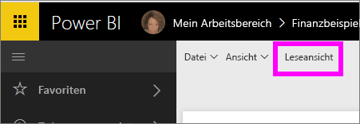
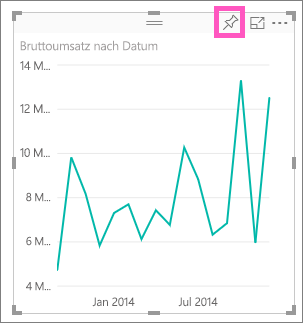
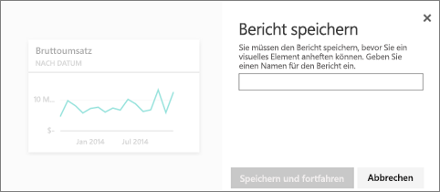
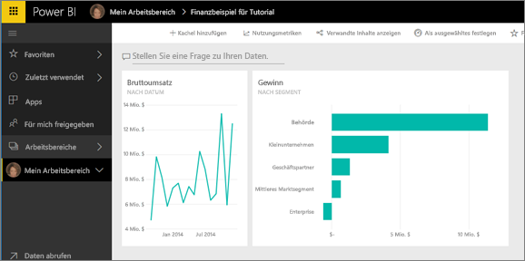

# Tutorial: Erste Schritte mit dem Power BI-Dienst (app.powerbi.com)
Dieses Lernprogramm erleichtert Ihnen den Einstieg in den ***Power BI-Dienst***. Damit Sie die Funktion des Power BI-Diensts im Hinblick auf die anderen Power BI-Angebote einordnen können, sollten Sie zunächst [Was ist Power BI?](power-bi-overview.md) lesen.

In diesem Tutorial führen Sie die folgenden Schritte aus:

> [!div class="checklist"]
> * Finden Sie andere Inhalte zu den ersten Schritten mit dem Power BI-Dienst
> * Melden Sie sich bei Ihrem Power BI-Onlinekonto an, oder registrieren Sie sich ggf. für ein Power BI-Onlinekonto
> * Öffnen des Power BI-Diensts
> * Rufen Sie einige Daten ab, und öffnen Sie diese im Bericht
> * Verwenden Sie diese Daten, um Visualisierungen zu erstellen und in Form eines Berichts zu speichern
> * Erstellen Sie ein Dashboard, indem Sie Kacheln aus dem Bericht anheften
> * Fügen Sie mithilfe des Q&A-Tools für natürliche Sprache eine weitere Visualisierung an Ihr Dashboard an
> * Bereinigen Sie Ressourcen, indem Sie das Dataset, den Bericht und das Dashboard löschen

## Registrieren beim Power BI-Dienst
Wenn Sie noch nicht bei Power BI registriert sind, [registrieren Sie sich für eine Power BI Pro-Testversion](https://app.powerbi.com/signupredirect?pbi_source=web), bevor Sie beginnen.

Öffnen Sie einen Browser, und geben Sie zunächst „app.powerbi.com“ ein, um den Power BI-Dienst aufzurufen, sofern Sie bereits ein Konto besitzen. 

Hilfe zu Power BI Desktop finden Sie unter [Erste Schritte mit Desktop](desktop-getting-started.md). Hilfe zu Power BI-Version für Mobilgeräte finden Sie unter [Microsoft Power BI – Mobilgeräte](consumer/mobile/mobile-apps-for-mobile-devices.md).

> [!TIP]
> Sie möchten Ihre Trainingsgeschwindigkeit lieber selbst bestimmen? [Registrieren Sie sich auf EdX für unseren Kurs zur Datenanalyse und -visualisierung.](http://aka.ms/edxpbi)

Besuchen Sie unsere [Wiedergabeliste auf YouTube](https://www.youtube.com/playlist?list=PL1N57mwBHtN0JFoKSR0n-tBkUJHeMP2cP). Ein anschauliches Video zum Einstieg ist „Introduction in Power BI service“ (in englischer Sprache):
> 
> <iframe width="560" height="315" src="https://www.youtube.com/embed/B2vd4MQrz4M" frameborder="0" allowfullscreen></iframe>
> 

## Was ist der Power BI-Dienst?
Der Microsoft Power BI-Dienst wird gelegentlich auch als Power BI Online oder app.powerbi.com bezeichnet. Power BI hilft Ihnen, hinsichtlich der für Sie wichtigen Informationen auf dem neuesten Stand zu bleiben.  Beim Power BI-Dienst sorgen Sie mit ***Dashboards*** dafür, dass Sie nie den Überblick über Ihr Unternehmen verlieren.  In Ihren Dashboards werden ***Kacheln*** angezeigt, auf die Sie klicken können, um weitere Informationen in Form von ***Berichten*** zu erhalten.  Stellen Sie Verbindungen mit mehreren ***Datasets*** her, um sämtliche relevanten Daten an einem Ort zusammenzuführen. Benötigen Sie Hilfe, um die Grundkomponenten zu verstehen, aus denen Power BI besteht?  Weitere Informationen finden Sie unter [Power BI – Grundkonzepte](consumer/end-user-basic-concepts.md).

Wenn Sie über wichtige Daten in Excel- oder CSV-Dateien verfügen, können Sie ein Power BI-Dashboard erstellen, um jederzeit informiert zu sein und Erkenntnisse mit anderen zu teilen.  Verfügen Sie über ein Abonnement für eine SaaS-Anwendung wie Salesforce?  Verschaffen Sie sich einen Vorsprung, indem Sie eine Verbindung mit Salesforce herstellen, um aus diesen Daten automatisch ein Dashboard zu erstellen, oder [sehen Sie sich die anderen SaaS-Anwendungen an](service-get-data.md), mit denen Sie eine Verbindung herstellen können. Wenn Sie einer Organisation angehören, überprüfen Sie, ob für Sie [Apps](consumer/end-user-create-apps.md) veröffentlicht wurden.

Informieren Sie sich über alle anderen Möglichkeiten zum [Abrufen von Daten für Power BI](service-get-data.md).

## Schritt 1: Abrufen von Daten
Hier folgt ein Beispiel zum Abrufen von Daten aus einer CSV-Datei. Möchten Sie dieses Tutorial durchführen? [Laden Sie diese CSV-Beispieldatei herunter](http://go.microsoft.com/fwlink/?LinkID=521962).

1. [Melden Sie sich bei Power BI an](http://www.powerbi.com/). Verfügen Sie über ein Konto? Keine Sorge: Sie können sich für eine kostenlose Testversion registrieren.
2. Power BI wird in Ihrem Browser geöffnet. Wählen Sie unten auf der linken Navigationsleiste **Daten abrufen** aus.
   
   
3. Wählen Sie **Dateien**aus. 
   
   
4. Navigieren Sie zu der Datei auf Ihrem Computer, und wählen Sie dann **Öffnen** aus. Wenn Sie sie in OneDrive for Business gespeichert haben, wählen Sie diese Option aus. Wenn sie lokal gespeichert ist, wählen Sie **Lokale Datei** aus. 
   
   
5. Für dieses Lernprogramm wählen wir **Importieren** aus, um die Excel-Datei als Dataset hinzuzufügen, mit dem dann Berichte und Dashboards erstellt werden können. Wenn Sie **Hochladen** auswählen, wird die gesamte Excel-Arbeitsmappe in Power BI hochgeladen, sodass Sie sie öffnen und online in Excel bearbeiten können.
   
   
6. Wenn Ihr Dataset bereit ist, wählen Sie **Dataset anzeigen** aus, um es im Berichts-Editor zu öffnen. 

    

    Da wir noch keine Visualisierungen erstellt haben, ist der Zeichenbereich des Berichts leer.

    

6. Auf der oberen Menüleiste sehen Sie die Option **Leseansicht**. Da die Option „Leseansicht“ angezeigt wird, müssen Sie sich derzeit in der **Bearbeitungsansicht** befinden. 

    

    In der Bearbeitungsansicht können Sie eigene Berichte erstellen und ändern, da Sie der *Besitzer* des Berichts sind, das heißt, Sie sind *Ersteller*. Wenn Sie den Bericht für Mitarbeiter freigeben, können diese den Bericht nur in der Leseansicht verwenden, das heißt, sie sind *Anwender*. Weitere Informationen über [Leseansicht und Bearbeitungsansicht](consumer/end-user-reading-view.md).
    
    Ein [Überblick](service-the-report-editor-take-a-tour.md) stellt eine hervorragende Möglichkeit dar, sich mit dem Berichts-Editor vertraut zu machen.
   > 
 

## Schritt 2: Untersuchen des Datasets
Nachdem die Verbindung mit den Daten hergestellt wurde, können Sie die Daten untersuchen.  Wenn Sie etwas gefunden haben, das für Sie von Interesse ist, können Sie ein Dashboard erstellen, um die Daten zu überwachen und Änderungen zu verfolgen. Sehen wir uns das einmal an.
    
1. Im Berichts-Editor verwenden Sie den Bereich **Felder** rechts auf der Seite, um eine Visualisierung zu erstellen.  Aktivieren Sie die Kontrollkästchen neben **Bruttoumsätze** und **Datum**.
   
   

2. Power BI analysiert die Daten und erstellt eine Visualisierung.  Wenn Sie zuerst **Datum** ausgewählt haben, wird eine Tabelle angezeigt.  Wenn Sie zuerst **Bruttoumsätze** ausgewählt haben, wird ein Diagramm angezeigt. Wechseln Sie für Ihre Daten zu einer anderen Anzeigeart. Im Folgenden werden diese Daten als Liniendiagramm dargestellt. Wählen Sie im Bereich **Visualisierungen** das Symbol für das Liniendiagramm (auch als „Vorlage“ bezeichnet).
   
   

3. Das möchten Sie verwenden und an ein Dashboard *anheften*. Zeigen Sie auf die Visualisierung, und wählen Sie das **Stecknadelsymbol** aus.  Wenn Sie diese Visualisierung anheften, wird sie auf dem Dashboard gespeichert und fortlaufend aktualisiert, sodass Sie den aktuellen Wert auf einen Blick nachverfolgen können.
   
   

4. Da es sich um einen neuen Bericht handelt, werden Sie aufgefordert, ihn zu speichern, bevor Sie eine Visualisierung an ein Dashboard anheften können. Weisen Sie dem Bericht einen Namen zu (z.B. *Umsätze im zeitlichen Verlauf*), und wählen Sie **Speichern und Weiter** aus. 
   
   
   
5. Heften Sie jetzt das Liniendiagramm an ein neues Dashboard an, und benennen Sie es „Finanzbeispiel für Tutorial“. 
   
   
   
1. Wählen Sie **Anheften**aus.
   
    Eine Erfolgsmeldung (in der Nähe der oberen rechten Ecke) weist Sie darauf hin, dass die Visualisierung als Kachel zu Ihrem Dashboard hinzugefügt wurde.
   
    

6. Wählen Sie **Zum Dashboard wechseln** aus. Das Liniendiagramm ist als Kachel an das neue Dashboard angeheftet. Perfektionieren Sie das Dashboard, indem Sie weitere Visualisierungskacheln hinzufügen und [Kacheln umbenennen, verknüpfen, neu positionieren und in der Größe ändern](service-dashboard-edit-tile.md).
   
   
   
   Wählen Sie die neue Kachel auf dem Dashboard aus, um jederzeit zum Bericht zurückzukehren. Sie kehren in Power BI zum Berichts-Editor in der Leseansicht zurück. Um wieder zur Bearbeitungsansicht zu wechseln, wählen Sie auf der oberen Menüleiste **Bericht bearbeiten** aus. Machen Sie sich in der Bearbeitungsansicht weiter mit den Kacheln und dem Anheften vertraut. 

## Schritt 3: Setzen Sie die Untersuchung mithilfe von Q&A fort (Abfragen in natürlicher Sprache)
1. Versuchen Sie, im Feld für Fragen und Antworten eine Frage zu stellen, um eine schnelle Untersuchung Ihrer Daten durchzuführen. Das Q&A-Fragefeld befindet sich oben auf dem Dashboard (**Stellen Sie eine Frage zu Ihren Daten**) und im Bericht auf der oberen Menüleiste (**Frage stellen**). Geben Sie z. B. Folgendes ein: „Welches Segment weist den höchsten Umsatz auf?“.
   
   

2. Q&A sucht nach einer Antwort und präsentiert diese in Form einer Visualisierung. Wählen Sie das Anheftsymbol aus  um diese Visualisierung ebenfalls auf dem Dashboard anzuzeigen.
3. Heften Sie die Visualisierung an das Dashboard „Finanzbeispiel für Tutorial“ an.
   
    

4. Kehren Sie zum Dashboard zurück, auf dem die neue Kachel angezeigt wird.

   

## Bereinigen von Ressourcen
Nachdem Sie das Tutorial abgeschlossen haben, können Sie das Dataset, den Bericht und das Dashboard löschen. 

1. Klicken Sie auf der linken Navigationsleiste auf **My Workspace** (Mein Arbeitsbereich).
2. Klicken Sie auf die Registerkarte **Dataset**, und suchen Sie nach dem Dataset, das Sie für dieses Tutorial importiert haben.  
3. Klicken Sie erst auf die Auslassungspunkte (...) und anschließend auf **Löschen**.

    

    Wenn das Dataset gelöscht wird, werden auch der Bericht und das Dashboard gelöscht. 

## Nächste Schritte
Möchten Sie fortfahren?  Hier folgen einige hervorragenden Möglichkeiten, um sich mit Power BI vertraut zu machen.

> [!div class="nextstepaction"]
> [Herstellen einer Verbindung mit von Ihnen verwendeten Onlinediensten](consumer/end-user-connect-to-services.md)

