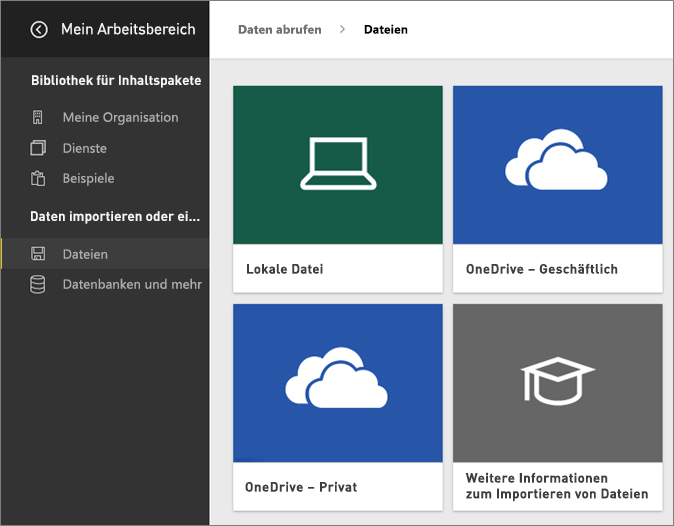
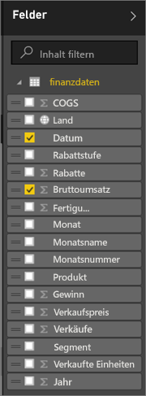
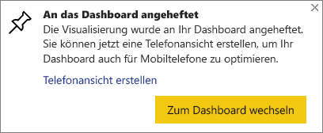
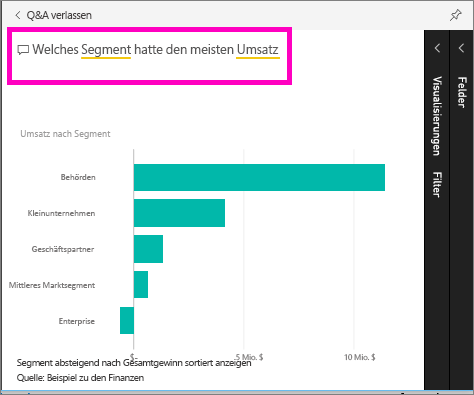

# Erste Schritte mit dem Power BI-Dienst
Dieses Lernprogramm erleichtert Ihnen den Einstieg in den ***Power BI-Dienst***. Damit Sie die Funktion des Power BI-Diensts im Hinblick auf die anderen Power BI-Angebote einordnen können, sollten Sie zunächst [Was ist Power BI?](guided-learning/gettingstarted.yml#step-1) lesen.

Der Power BI-Dienst wird in einer kostenlosen Version und einer Pro-Version angeboten. Unabhängig davon, welche Version Sie verwenden, öffnen Sie einen Browser und geben zunächst die Adresse „www.powerbi.com“ ein. Wenn Sie sich bereits registriert haben, klicken Sie rechts oben auf den Link **Anmelden**. Wenn Sie sich noch nicht für den Power BI-Dienst registriert haben, klicken Sie stattdessen auf den Link **Kostenlos registrieren**.

Hilfe zu Power BI Desktop finden Sie unter [Erste Schritte mit Desktop](desktop-getting-started.md). Hilfe zu Power BI-Version für Mobilgeräte finden Sie unter [Microsoft Power BI – Mobilgeräte](mobile-apps-for-mobile-devices.md).

> [!TIP]
> Sie möchten Ihre Trainingsgeschwindigkeit lieber selbst bestimmen? [Registrieren Sie sich auf EdX für unseren Kurs zur Datenanalyse und -visualisierung.](http://aka.ms/edxpbi)

Besuchen Sie unsere [Wiedergabeliste auf YouTube](https://www.youtube.com/playlist?list=PL1N57mwBHtN0JFoKSR0n-tBkUJHeMP2cP). Ein anschauliches Video zum Einstieg ist „Introduction in Power BI service“ (in englischer Sprache):
> 
> <iframe width="560" height="315" src="https://www.youtube.com/embed/B2vd4MQrz4M" frameborder="0" allowfullscreen></iframe>
> 
> 
> 

Microsoft Power BI hilft Ihnen, hinsichtlich der für Sie wichtigen Informationen auf dem neuesten Stand zu bleiben.  Beim Power BI-Dienst sorgen Sie mit ***Dashboards*** dafür, dass Sie nie den Überblick über Ihr Unternehmen verlieren.  In Ihren Dashboards werden ***Kacheln*** angezeigt, auf die Sie klicken können, um weitere Informationen in Form von ***Berichten*** zu erhalten.  Stellen Sie Verbindungen mit mehreren ***Datasets*** her, um sämtliche relevanten Daten an einem Ort zusammenzuführen. Benötigen Sie Hilfe, um die Grundkomponenten zu verstehen, aus denen Power BI besteht?  Weitere Informationen finden Sie unter [Power BI – Grundkonzepte](service-basic-concepts.md).

Wenn Sie über wichtige Daten in Excel- oder CSV-Dateien verfügen, können Sie ein Power BI-Dashboard erstellen, um jederzeit informiert zu sein und Erkenntnisse mit anderen zu teilen.  Verfügen Sie über ein Abonnement für eine SaaS-Anwendung wie Salesforce?  Erhalten Sie einen Vorsprung, indem Sie eine [Verbindung mit Salesforce herstellen](service-connect-to-salesforce.md), um aus diesen Daten automatisch ein Dashboard zu erstellen, oder [testen Sie alle anderen SaaS-Anwendungen](service-get-data.md), mit denen Sie eine Verbindung herstellen können. Wenn Sie einer Organisation angehören, überprüfen Sie, ob für Sie [Apps](service-create-distribute-apps.md) veröffentlicht wurden.

Informieren Sie sich über alle anderen Möglichkeiten zum [Abrufen von Daten für Power BI](service-get-data.md).

## Schritt 1: Abrufen von Daten
Hier folgt ein Beispiel zum Abrufen von Daten aus einer CSV-Datei. Möchten Sie dieses Tutorial durchführen? [Laden Sie diese CSV-Beispieldatei herunter](http://go.microsoft.com/fwlink/?LinkID=521962).

1. [Melden Sie sich bei Power BI an](http://www.powerbi.com/). Verfügen Sie über ein Konto? Keine Sorge: Die Registrierung ist kostenlos.
2. Power BI wird in Ihrem Browser geöffnet. Wählen Sie unten im linken Navigationsbereich **Daten abrufen** aus.
   
   
3. Wählen Sie **Dateien**aus. 
   
   
4. Wählen Sie **Lokale Datei**aus, navigieren Sie zu der Datei auf Ihrem Computer, und wählen Sie dann **Öffnen**aus.
   
   
5. Für dieses Lernprogramm wählen wir **Importieren** aus, um die Excel-Datei als Dataset hinzuzufügen, mit dem dann Berichte und Dashboards erstellt werden können.  
   
   > [!NOTE]
   > Wenn Sie **Hochladen** auswählen, wird die gesamte Excel-Arbeitsmappe in Power BI hochgeladen, sodass Sie sie öffnen und online in Excel bearbeiten können.
   > 
   > 
   
   
6. Wenn Ihr Dataset bereit ist, wählen Sie **Dataset anzeigen** aus, um es im Berichts-Editor zu öffnen. .
   
   > [!TIP]
   > Ein [Überblick](service-the-report-editor-take-a-tour.md) stellt eine hervorragende Möglichkeit dar, sich mit dem Berichts-Editor vertraut zu machen.
   > 
   > 

## Schritt 2: Untersuchen des Datasets
Nachdem die Verbindung zu den Daten hergestellt wurde, untersuchen Sie diese Daten, um Einblicke zu erhalten.  Wenn Sie etwas gefunden haben, dass Sie überwachen möchten, können Sie ein Dashboard erstellen, um bei Änderungen auf dem Laufenden zu bleiben.

1. Wählen Sie das Datasetimage auf dem Dashboard aus, um die Daten zu untersuchen, mit denen Sie soeben eine Verbindung hergestellt haben, oder wählen Sie unter der Überschrift **Datasets** den Namen des Datasets aus, um es zu öffnen. Dadurch wird das Dataset als leerer Bericht geöffnet.
   
   
   
   > [!NOTE]
> Eine weitere Möglichkeit zum Durchsuchen der Daten ist **Schnelle Einblicke**.  Weitere Informationen finden Sie unter [Einführung in schnelle Einblicke](service-insights.md).
   > 
   > 
2. Wählen Sie auf der rechten Seite in der Liste **Felder** einige Felder aus, um eine Visualisierung zu erstellen.  Aktivieren Sie die Kontrollkästchen neben **Bruttoumsätze** und **Datum**.
   
   
3. Power BI analysiert die Daten und erstellt ein visuelles Element.  Wenn Sie zuerst **Datum** ausgewählt haben, wird eine Tabelle angezeigt.  Wenn Sie zuerst **Bruttoumsätze** ausgewählt haben, wird ein Diagramm angezeigt. Wechseln Sie für Ihre Daten zu einer anderen Anzeigeart. Versuchen Sie, zu einem Liniendiagramm zu wechseln, indem Sie die Option für Liniendiagramme auswählen.
   
   
4. Wenn auf dem Dashboard die gewünschte Visualisierung angezeigt wird, wählen Sie diese Visualisierung aus, und klicken auf das Symbol zum **Anheften**.  Wenn Sie diese Visualisierung anheften, wird sie auf dem Dashboard gespeichert, damit Sie den aktuellen Wert auf einen Blick nachverfolgen können.
   
   
5. Da es sich um einen neuen Bericht handelt, müssen Sie ihn speichern, bevor Sie eine darin enthaltene Visualisierung auf dem Dashboard anheften können. Weisen Sie dem Bericht einen Namen zu (z. B. *Umsätze im zeitlichen Verlauf*), und wählen Sie **Speichern und Weiter** aus. 
   
   
   
   Der neue Bericht wird im Navigationsbereich unter der Überschrift **Berichte** angezeigt.
6. Heften Sie die Kachel an ein vorhandenes oder neues Dashboard an. 
   
   
   
   * **Vorhandenes Dashboard**: Wählen Sie den Namen des Dashboards aus der Dropdownliste aus.
   * **Neues Dashboard**: Geben Sie den Namen des neuen Dashboards ein.
7. Wählen Sie **Anheften**aus.
   
   Eine Erfolgsmeldung (in der Nähe der oberen rechten Ecke) weist Sie darauf hin, dass die Visualisierung als Kachel zu Ihrem Dashboard hinzugefügt wurde.
   
   
8. Wählen Sie **Zum Dashboard wechseln** aus, um das neue Dashboard mit der angehefteten Kachel zu sehen. Das Liniendiagramm ist als Kachel an das Dashboard angeheftet. Gestalten Sie das Dashboard noch übersichtlicher, indem Sie [Kacheln umbenennen, verknüpfen, neu positionieren und in der Größe ändern](service-dashboard-edit-tile.md).
   
   
   
   Wählen Sie die neue Kachel auf dem Dashboard aus, um jederzeit zum Bericht zurückzukehren.

## Schritt 3: Fahren Sie mit der Untersuchung mithilfe von Q&A fort (Abfragen in natürlicher Sprache)
1. Versuchen Sie, im Feld für Fragen und Antworten eine Frage zu stellen, um eine schnelle Untersuchung Ihrer Daten durchzuführen. Das Q&A-Textfeld befindet sich über Ihrem Dashboard. Geben Sie z. B. Folgendes ein: „**Welches Segment weist den höchsten Umsatz auf?**“.
   
   
2. Wählen Sie das Symbol zum Anheften  aus, um diese Visualisierung ebenfalls auf dem Dashboard anzuzeigen.
3. Heften Sie die Visualisierung auf dem Dashboard für das Finanzbeispiel an.
   
    
4. Wählen Sie den Zurück-Pfeil für **Q&A verlassen** aus, zum Dashboard zurückzukehren, auf dem die neue Kachel angezeigt wird.

## Nächste Schritte
Möchten Sie fortfahren?  Hier folgen einige hervorragenden Möglichkeiten, um mehr über Power BI zu erfahren.

* [Herstellen einer Verbindung mit einem anderen Dataset](service-get-data.md).
* [Teilen Sie Ihr Dashboard](service-share-dashboards.md) mit Ihren Kollegen.
* Lesen Sie die [Tipps zum Entwerfen von Dashboards](service-dashboards-design-tips.md).
* Zeigen Sie Ihre Dashboards mit einer [Power BI-App auf einem mobilen Gerät an](mobile-apps-for-mobile-devices.md).

Sind Sie noch nicht bereit, voll einzusteigen? Beginnen Sie mit diesen Themen, die Ihnen dabei helfen sollen, sich mit Power BI vertraut zu machen.

* [Erfahren Sie, wie Berichte, Datasets, Dashboards und Kacheln miteinander verbunden sind](service-basic-concepts.md)
* [Power BI-Videos](videos.md)
* [Verfügbare Beispiele](sample-datasets.md)

### Bleiben Sie hinsichtlich Power BI auf dem Laufenden
* Folgen Sie [@MSPowerBI auf Twitter](https://twitter.com/mspowerbi)
* Abonnieren Sie unseren [YouTube-Kanal](https://www.youtube.com/channel/UCy--PYvwBwAeuYaR8JLmrfg).
* Schauen Sie sich bei Bedarf unsere [Webinare zu den ersten Schritten mit Power BI](webinars.md) an.
* Sie wissen nicht, wo Sie Hilfe erhalten können? Besuchen Sie unsere Seite [10 Tipps, um Hilfe zu erhalten](service-tips-for-finding-help.md)

Weitere Fragen? [Stellen Sie Ihre Frage in der Power BI-Community.](http://community.powerbi.com/)

