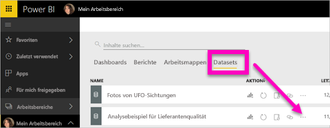
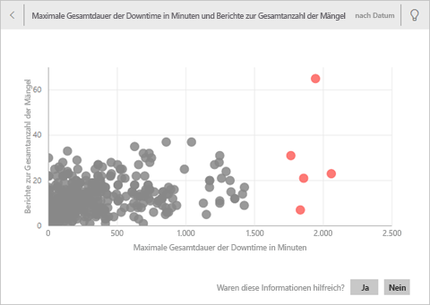
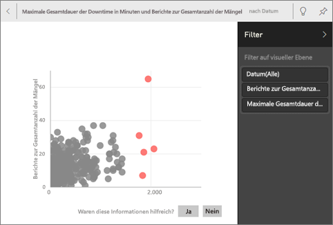
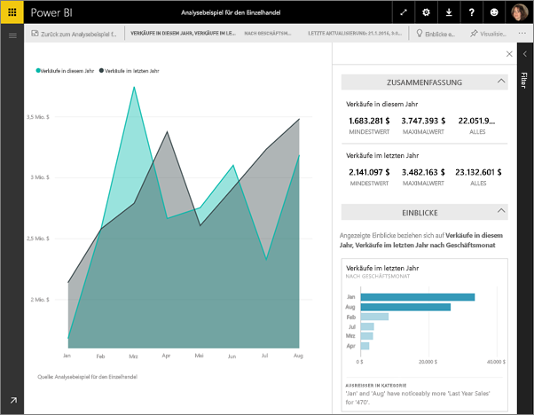

# Schnelle Einblicke mit Power BI
Sie besitzen ein neues Dataset und wissen nicht, womit Sie beginnen sollen?  Sie müssen schnell ein Dashboard erstellen?  Sie möchten auf schnelle Weise nach Einblicken suchen, die Sie möglicherweise übersehen haben?

Führen Sie schnelle Einblicke aus, um interessante interaktive Visualisierungen auf Grundlage Ihrer Daten zu generieren. Schnelle Einblicke können für ein gesamtes Dataset (schnelle Einblicke) oder eine bestimmte Dashboard-Kachel (bereichsbezogene Einblicke) ausgeführt werden. Sie können schnelle Einblicke sogar für einen Einblick ausführen!

> **HINWEIS:** „Schnelle Einblicke“ funktioniert nicht mit DirectQuery. Das Feature kann nur für in Power BI hochgeladene Daten verwendet werden.
> 
> 

Das Feature „Schnelle Einblicke“ basiert auf einer wachsenden Reihe [erweiterter analytischer Algorithmen](service-insight-types.md), die in Verbindung mit Microsoft Research entwickelt wurden. Wir möchten damit auch in Zukunft noch mehr Benutzern auf neue und intuitive Weise Einblicke in ihre Daten bieten.

## Ausführen von schnellen Einblicken für ein Dataset
Lassen Sie sich von Amanda zeigen, wie Sie schnelle Einblicke auf ein Dataset anwenden, einen Einblick im Fokusmodus öffnen, einen der schnellen Einblicke als Kachel an das Dashboard anheften und dann schnelle Einblicke für ein Visual erhalten.

<iframe width="560" height="315" src="https://www.youtube.com/embed/et_MLSL2sA8" frameborder="0" allowfullscreen></iframe>

Jetzt sind sie dran. Erkunden Sie „Schnelle Einblicke“ anhand des [Analysebeispiels für die Lieferantenqualität](sample-supplier-quality.md).

1. Wählen Sie auf der Registerkarte **Datasets** die Auslassungspunkte (...) und dann **Einblicke erhalten** aus.
   
    
   
    
2. Power BI verwendet [verschiedene Algorithmen](service-insight-types.md) zum Suchen nach Trends in Ihrem Dataset.
   
    
3. Innerhalb von Sekunden sind Ihre Einblicke bereit.  Wählen Sie **Einblicke anzeigen** aus, um Visualisierungen anzuzeigen.
   
    
   
   > **HINWEIS**: Einige Datasets können keine schnellen Einblicke generieren, da die Daten statistisch nicht signifikant sind.  Weitere Informationen finden Sie unter [Optimieren von Daten für schnelle Einblicke](service-insights-optimize.md).
   > 
   > 
4. Die Visualisierungen werden in einem speziellen Bereich für **schnelle Einblicke** mit bis zu 32 getrennten Einblickkarten angezeigt. Jede Karte enthält ein Diagramm oder eine Grafik und eine kurze Beschreibung.
   
    

## Interaktion mit Karten für schnelle Einblicke
  

1. Zeigen Sie auf eine Karte, und wählen Sie das Anheftsymbol aus, um die Visualisierung einem Dashboard hinzuzufügen.
2. Zeigen Sie auf eine Karte, und wählen Sie das Symbol für den Fokusmodus aus, um die Karte im Vollbildmodus anzuzeigen.
   
    
3. In diesem Modus haben Sie folgende Möglichkeiten:
   
   * [Filtern](service-interact-with-a-report-in-reading-view.md) der Visualisierungen.  Um die Filter anzuzeigen, wählen Sie in der oberen rechten Ecke das Pfeilsymbol aus, um den Filterbereich zu erweitern.
     
        
   * Heften Sie die Einblickkarte an ein Dashboard an, indem Sie das Stecknadelsymbol  oder **Visual anheften** auswählen.
   * Ausführen von schnellen Einblicken für die Karte selbst. Dies wird als **bereichsbezogene schnelle Einblicke** bezeichnet. Wählen Sie in der oberen rechten Ecke das Glühbirnensymbol  oder **Einblicke erhalten** aus.
     
       
     
     Der schnelle Einblick wird auf der linken Seite angezeigt, und neue Karten (ausschließlich abhängig von den Daten in diesem schnellen Einblick) werden rechts angezeigt.
     
       
4. Wenn Sie zum Bereich „Schnelle Einblicke“ zurückkehren möchten, wählen Sie links oben **Fokusmodus beenden** aus.

## Ausführen schneller Einblicke auf einer Dashboardkachel
Anstatt ein gesamtes Dataset nach Einblicken zu durchsuchen, können Sie die Suche auf die zum Erstellen einer einzelnen Dashboardkachel verwendeten Daten einschränken. Dies wird als **bereichsbezogene schnelle Einblicke** bezeichnet.

1. Öffnen Sie ein Dashboard.
2. Wählen Sie eine Kachel aus, und [öffnen Sie die Kachel im Fokusmodus](service-focus-mode.md).
3. Wählen Sie in der oberen rechten Ecke die Option zum **Abrufen von Einblicken** aus.
   
    
4. Power BI zeigt die Einblickkarten rechts neben der Kachel an.
   
    
5. Ist einer der Einblicke für Sie interessant? Wählen Sie die entsprechende Einblickkarte aus, um weitere Informationen zu erhalten. Der ausgewählte schnelle Einblick wird auf der linken Seite angezeigt, und neue Einblickkarten (ausschließlich abhängig von den Daten in diesem schnellen Einblick) werden rechts angezeigt.
6. Schlüsseln Sie Ihre Daten weiter auf. Wenn Sie für Sie interessante schnelle Einblicke finden, können Sie deren Visual an Ihr Dashboard anheften, indem Sie rechts oben auf **Visualisierung anheften** klicken. Sie können auch Feedback an den Besitzer des Datasets senden, um ihm mitzuteilen, ob ein bestimmter schneller Einblick hilfreich war.
   
    

## Nächste Schritte
Wenn Sie ein Dataset besitzen, können Sie es [für Schnelleinblicke optimieren](service-insights-optimize.md).

Erfahren Sie mehr über die [Typen verfügbarer schneller Einblicke](service-insight-types.md).

Weitere Fragen? [Wenden Sie sich an die Power BI-Community](http://community.powerbi.com/)

