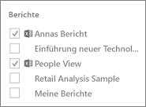

# Erstellen und Veröffentlichen eines organisationsbezogenen Power BI-Inhaltspakets (Tutorial)

In diesem Tutorial erstellen Sie ein organisationsbezogenes Inhaltspaket, gewähren einer bestimmten Gruppe Zugriff darauf und veröffentlichen es in der Inhaltspaketbibliothek Ihrer Organisation in Power BI.

Das Erstellen von Inhaltspaketen unterscheidet sich vom Freigeben von Dashboards oder dem gemeinsamen Bearbeiten in einer Gruppe. Lesen Sie den Artikel [Wie kann ich Dashboards und Berichte freigeben?](service-how-to-collaborate-distribute-dashboards-reports.md), um die beste Option für Ihre Situation zu ermitteln.

Zum Erstellen eines organisationsbezogenen Inhaltspakets benötigen Sie und Ihre Kollegen ein [Power BI Pro-Konto](https://powerbi.microsoft.com/pricing). 

> [!NOTE]
> Mit der Vorschauversion der neuen Arbeitsbereiche können Sie keine organisationsbezogenen Inhaltspakete erstellen oder installieren. Führen Sie jetzt ein Upgrade durch, und wandeln Sie Ihre Inhaltspakete in Apps um, falls Sie dies noch nicht getan haben. Erfahren Sie [mehr über die neuen Arbeitsbereiche](service-create-the-new-workspaces.md).
> 

Nehmen Sie an, Sie wären der Release-Manager bei Contoso und bereiteten sich auf einen neue Produkteinführung vor.  Sie haben ein Dashboard mit Berichten erstellt, die Sie für andere Mitarbeiter, die ebenfalls an der Verwaltung der Produkteinführung beteiligt sind, freigeben möchten. Jetzt möchten Sie das Dashboard und die Berichte packen und Ihren Kollegen zur Verfügung stellen. 

Führen Sie hierzu die folgenden Schritte aus: Navigieren Sie im [Power BI-Dienst](https://powerbi.com) zu **Daten abrufen > Beispiele > Analysebeispiel für Opportunity** > **Verbinden**, um ihr eigenes Exemplar abzurufen. 

1. Wählen Sie im linken Navigationsbereich das **Analysebeispiel für Opportunity** -Dashboard aus.
2. Wählen Sie auf der oberen Navigationsleiste das Zahnradsymbol  > **Inhaltspaket erstellen** aus.    
   
3. Geben Sie im Fenster **Inhaltspaket erstellen** die folgenden Informationen ein.  
   
   Beachten Sie, dass die Inhaltspaketbibliothek Ihrer Organisation Hunderte von Inhaltspakete enthalten kann, die für die Organisation oder Gruppen veröffentlicht wurden. Wählen Sie einen aussagekräftigen Namen für das Inhaltspaket, fügen Sie eine passende Beschreibung hinzu, und wählen Sie die richtige Zielgruppe aus.  Verwenden Sie Wörter, über die das Inhaltspaket mithilfe der Suchfunktion einfach gefunden werden kann.
   
   1. Wählen Sie **Bestimmte Gruppen** aus, und geben Sie die vollständige E-Mail-Adresse für Einzelpersonen, [Office 365-Gruppen](https://support.office.com/article/Create-a-group-in-Office-365-7124dc4c-1de9-40d4-b096-e8add19209e9), Verteilergruppen oder Sicherheitsgruppen ein. Beispiel:
      
        salesmgrs@contoso.com; sales@contoso.com
      
      Verwenden Sie in diesem Tutorial Ihre eigene E-Mail-Adresse oder Ihre Gruppen-E-Mail-Adresse.
   
   2. Nennen Sie das Inhaltspaket **Verkaufschancen**.
   
      > [!TIP]
      > Es kann von Vorteil sein, den Namen des Dashboards in den Namen des Inhaltspakets einzubeziehen. Dies erleichtert es Ihren Kollegen, das Dashboard zu finden, wenn sie eine Verbindung mit Ihrem Inhaltspaket herstellen.
      > 
      > 
   
   3. Empfohlen: Fügen Sie eine **Beschreibung** hinzu. So können Kollegen das benötigte Inhaltspaket leichter finden. Fügen Sie neben der Beschreibung auch noch Schlagwörter hinzu, mit denen Ihre Kollegen nach diesem Inhaltspaket suchen können. Geben Sie auch Ihre Kontaktdaten ein, falls Ihre Kollegen eine Frage haben oder Hilfe brauchen.
   
   4. **Laden Sie ein Bild oder Logo hoch**, damit die Gruppenmitglieder das Inhaltspaket besser finden können – auf den ersten Blick lässt sich ein Bild schneller finden als Text. Im folgenden Screenshot wurde ein Bild der Kachel mit dem Säulendiagramm (100 %) für die Gesamtzahl der Verkaufschancen verwendet.
   
   5. Wählen Sie das Dashboard **Analysebeispiel für Verkaufschancen** aus, um es dem Inhaltspaket hinzuzufügen.  Power BI fügt den zugehörigen Bericht und das Dataset automatisch hinzu. Sie können ggf. weitere hinzufügen.
   
      > [!NOTE]
      >  Es werden nur die Dashboards, Berichte, Datasets und Arbeitsmappen aufgeführt, die Sie bearbeiten können. Für Sie freigegebene Dashboards und Berichte sind in der Liste somit nicht enthalten.
      > 
      > 
   
       
   
   6. Wenn Sie Excel-Arbeitsmappen haben, werden diese unter „Berichte“, mit einem Excel-Symbol angezeigt. Sie können diese ebenfalls dem Inhaltspaket hinzufügen.
   
      
   
      > [!NOTE]
      > Wenn Mitglieder der Gruppe die Excel-Arbeitsmappe nicht anzeigen können, müssen Sie möglicherweise [die Arbeitsmappe in OneDrive for Business für sie freigeben](https://support.office.com/article/Share-documents-or-folders-in-Office-365-1fe37332-0f9a-4719-970e-d2578da4941c).
      > 
      > 
4. Wählen Sie **Veröffentlichen** , um das Inhaltspaket zur organisatorischen Inhaltspaketbibliothek der Gruppe hinzuzufügen.  
   
   Wenn das Veröffentlichen erfolgreich war, wird Ihnen eine Erfolgsmeldung angezeigt. 
5. Wenn Mitglieder Ihrer Gruppe zu **Daten abrufen > Meine Organisation** wechseln, tippen sie in das Suchfeld und geben „Verkaufschancen“ ein.
   
    
6. Daraufhin wird ihnen Ihr Inhaltspaket angezeigt.  
    
   
   > [!TIP]
   > Die im Browser angezeigte URL ist eine eindeutige Adresse für dieses Inhaltspaket.  Möchten Sie Ihre Kollegen über dieses neue Inhaltspaket informieren?  Fügen Sie die URL in eine E-Mail ein.
   > 
   > 
7. Ihre Kollegen wählen dann **Verbinden** aus und können [Ihr Inhaltspaket anzeigen und damit arbeiten](service-organizational-content-pack-copy-refresh-access.md). 

### Nächste Schritte
* [Einführung in organisationsbezogene Inhaltspakete](service-organizational-content-pack-introduction.md)  
* [Verwalten, Aktualisieren und Löschen von organisationsbezogenen Inhaltspaketen](service-organizational-content-pack-manage-update-delete.md)  
* [Erstellen einer Gruppe in Power BI](service-create-distribute-apps.md)  
* [Was ist OneDrive for Business?](https://support.office.com/article/What-is-OneDrive-for-Business-187f90af-056f-47c0-9656-cc0ddca7fdc2)
* Weitere Fragen? [Wenden Sie sich an die Power BI-Community](http://community.powerbi.com/)

