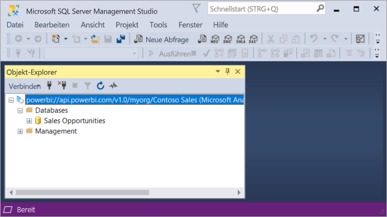

# Verbindung mit Datasets mit Clientanwendungen und Tools (Vorschau)

Power BI Premium-Arbeitsbereichen und Datasets-Unterstützung *schreibgeschützte* Verbindungen von Microsoft und Drittanbieter-Clientanwendungen und Tools. 

> [!NOTE]
> Dieser Artikel richtet sich nur für schreibgeschützte Verbindungen mit Power BI Premium-Arbeitsbereichen und Datasets eingeführt. Es *nicht* vorgesehen, um ausführliche Informationen zu Programmierbarkeit, bestimmte Tools und Anwendungen, Architektur und Verwaltung von Arbeitsbereich und das Dataset bereitzustellen. Themen, die hier beschriebenen erfordert ein solides Grundwissen über Analysis Services-Tabellenmodell-Datenbankarchitektur und Verwaltung.

## Protokoll

Power BI Premium verwendet die [XML for Analysis](https://docs.microsoft.com/bi-reference/xmla/xml-for-analysis-xmla-reference) (XMLA)-Protokolls für die Kommunikation zwischen Clientanwendungen und die Engine, die Ihre Arbeitsbereiche und die Datasets verwaltet. Diese kommunkationen sind durch was häufig als XMLA-Endpunkte bezeichnet werden. XMLA ist das gleiche Kommunikationsprotokoll verwendet, die von der Microsoft Analysis Services-Engine, die hinter den Kulissen Power BI semantische Modellierung, Governance, Lebenszyklus und datenverwaltung ausgeführt wird. 

Die große Mehrheit von Clientanwendungen und Tools explizit kommunizieren nicht mit der Engine mithilfe von XMLA-Endpunkte. Stattdessen verwenden sie die Clientbibliotheken, z. B. MSOLAP, ADOMD und AMO als Vermittler zwischen der Clientanwendung und die Engine, die ausschließlich mithilfe von XMLA kommuniziert.

## Unterstützte tools

Diese Tools unterstützen nur-Lese Zugriff auf Power BI Premium-Arbeitsbereichen und Datasets:

**SQL Server Management Studio (SSMS)** -unterstützt DAX, MDX, XMLA und TraceEvent-Abfragen. Erfordert Version 18.0. Herunterladen [hier](https://docs.microsoft.com/sql/ssms/download-sql-server-management-studio-ssms). 

**SQL Server Profiler** -mit SSMS 18.0 (Vorschau) enthalten, die dieses Tool bietet Ablaufverfolgung und Debuggen von Ereignissen auf Serverebene. Sie können zu erfassen und speichern Daten zu jedem Ereignis in einer Datei oder Tabelle zur späteren Analyse. Während offiziell für SQL Server als veraltet eingestuft, Profiler weiterhin in SSMS enthalten sein, und Sie werden weiterhin für Analysis Services und nun Power BI Premium unterstützt. Weitere Informationen finden Sie unter [SQL Server Profiler](https://docs.microsoft.com/sql/tools/sql-server-profiler/sql-server-profiler).

**DAX-Studio** – Open Source-communitytool, das zum Ausführen und Analysieren von DAX-Abfragen für Analysis Services. Erfordert Version 2.8.2 oder höher. Weitere Informationen finden Sie unter [daxstudio.org](https://daxstudio.org/).

**Excel-PivotTables** -Klick-und-Los-Version von Office 16.0.11326.10000 oder höher ist erforderlich.

**Von Drittanbietern** – beinhaltet datenvisualisierungsanwendungen Client und Tools, die eine Verbindung herstellen können, das Abfragen und Datasets in Power BI Premium nutzen. Die meisten Tools benötigen die neuesten Versionen der Clientbibliotheken MSOLAP, aber möglicherweise einige ADOMD verwenden.

## Clientbibliotheken

Client-Bibliotheken sind für Clientanwendungen und Tools, um mit Power BI Premium-Arbeitsbereichen verbinden können. Die gleichen Clientbibliotheken, die zur Verbindung mit Analysis Services werden auch in Power BI Premium unterstützt. Microsoft-Clientanwendungen wie Excel, SQL Server Management Studio (SSMS) und SQL Server Data Tools (SSDT) installieren alle drei Clientbibliotheken und diese zusammen mit regulären Anwendungsupdates aktualisieren. In einigen Fällen, insbesondere bei Drittanbieter-Anwendungen und Tools müssen Sie neuere Versionen der Clientbibliotheken installieren. Clientbibliotheken werden monatlich aktualisiert. Weitere Informationen finden Sie unter [-Clientbibliotheken für die Verbindung mit Analysis Services](https://docs.microsoft.com/azure/analysis-services/analysis-services-data-providers).

## Herstellen einer Verbindung mit einem Premium-Arbeitsbereich

Sie können auf Arbeitsbereiche, die auf die dedizierte Premium-Kapazität zugewiesen verbinden. Arbeitsbereiche, die einer bestimmten Kapazität zugewiesen haben eine Verbindungszeichenfolge im URL-Format. 

Zum Abrufen der Verbindungszeichenfolge Arbeitsbereich in Power BI in **Arbeitsbereichseinstellungen**auf die **Premium** Registerkarte **Arbeitsbereichverbindung**, klicken Sie auf **Kopieren**.

Arbeitsbereich-Verbindungen verwenden die folgende URL-Format, um einen Arbeitsbereich zu adressieren, als wäre es einem Analysis Services-Servernamen:   
`powerbi://api.powerbi.com/v1.0/[tenant name]/[workspace name]` 

Zum Beispiel `powerbi://api.powerbi.com/v1.0/contoso.com/Sales Workspace`
> [!NOTE]
> `[workspace name]` ist der Fall, die vertrauliche und darf Leerzeichen enthalten. 

### In SSMS eine Verbindung herstellen

In **Herstellen einer Verbindung mit Server** > **Servertyp**Option **Analysis Services**. In **Servernamen**, geben Sie die URL. In **Authentifizierung**Option **Active Directory: universell mit MFA-Unterstützung**, und klicken Sie dann im **Benutzernamen**, geben Sie Ihrer Organisation Benutzer-ID. 

Wenn verbunden, sehen Sie der Arbeitsbereich als Analysis Services-Server und Datenbanken werden Datasets im Arbeitsbereich angezeigt.  

### Anfangskatalog

Einige Tools, z. B. SQL Server Profiler, müssen Sie möglicherweise angeben einer *Anfangskatalog*. Geben Sie ein Dataset (Datenbank) in Ihrem Arbeitsbereich an. In **Herstellen einer Verbindung mit Server**, klicken Sie auf **Optionen**. In der **Herstellen einer Verbindung mit Server** Dialogfeld auf die **Verbindungseigenschaften** Registerkarte **Herstellen einer Verbindung mit Datenbank**, geben Sie den Namen des Datasets.

### Doppelter Name des Arbeitsbereichs

Bei der Verbindung mit einem Arbeitsbereich mit dem gleichen Namen wie einen anderen Arbeitsbereich wird möglicherweise der folgende Fehler angezeigt: **Kann keine Verbindung mit powerbi://api.powerbi.com/v1.0/ [Tenant-Name] / [Arbeitsbereichsname].**

Geben Sie zum Umgehen dieser Fehler, zusätzlich zu den Namen des Arbeitsbereichs, den ObjectIDGuid, der aus die Workspace-Objekt-ID in der URL kopiert werden kann. Fügen Sie die Objekt-ID, an der Verbindungs-URL. Z. B. "powerbi://api.powerbi.com/v1.0/myorg/Contoso Verkauf - 9d83d204-82a9-4b36-98f2-a40099093830"

### Duplizieren von Dataset-name

Bei der Verbindung mit einem Dataset mit dem gleichen Namen wie ein weiteres Dataset im selben Arbeitsbereich fügen Sie die Dataset-Guid an den Namen des Datasets ein. Erhalten Sie beide Datasetnamen *und* Guid, die beim Verbinden mit dem Arbeitsbereich in SSMS. 

### Verzögerung in Datasets angezeigt

Bei der Verbindung mit einem Arbeitsbereich dauert Änderungen von neuen, gelöschten und umbenannte Datasets bis zu 5 Minuten angezeigt werden. 

### Nicht unterstützte datasets

Die folgenden Datasets sind nicht mithilfe von XMLA-Endpunkte zugegriffen werden kann. Diese Datasets *nicht* im Arbeitsbereich "" in SSMS oder in anderen Tools angezeigt werden: 

- Datasets mit einer liveverbindung mit einem Analysis Services-Modelle. 
- Datasets mit Daten per Push mithilfe der REST-API.
- Excel-Arbeitsmappe-Datasets. 

Die folgenden Datasets werden in Power BI-Dienst nicht unterstützt:   

- Datasets mit einer liveverbindung mit Power BI-Dataset.

## Überwachungsprotokolle 

Wenn Clientanwendungen und Tools mit einem Arbeitsbereich verbinden, wird in der Power BI-Überwachungsprotokolle unter Zugriffs über Endpunkte mit XMLA protokolliert die **GetWorkspaces** Vorgang. Weitere Informationen finden Sie unter [Überwachen von Power BI](service-admin-auditing.md).

## Siehe auch

[Analysis Services-Verweise](https://docs.microsoft.com/bi-reference/#pivot=home&panel=home-all)   
[SQL Server Management Studio](https://docs.microsoft.com/sql/ssms/sql-server-management-studio-ssms)   
[SQL Server Analysis Services Tabular Protocol](https://docs.microsoft.com/openspecs/sql_server_protocols/ms-ssas-t/b98ed40e-c27a-4988-ab2d-c9c904fe13cf)   
[Dynamische Verwaltungssichten (DMVs)](https://docs.microsoft.com/sql/analysis-services/instances/use-dynamic-management-views-dmvs-to-monitor-analysis-services)   

Weitere Fragen? [Stellen Sie Ihre Frage in der Power BI-Community.](https://community.powerbi.com/)
