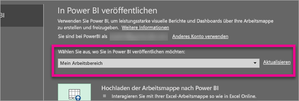
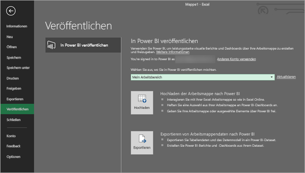
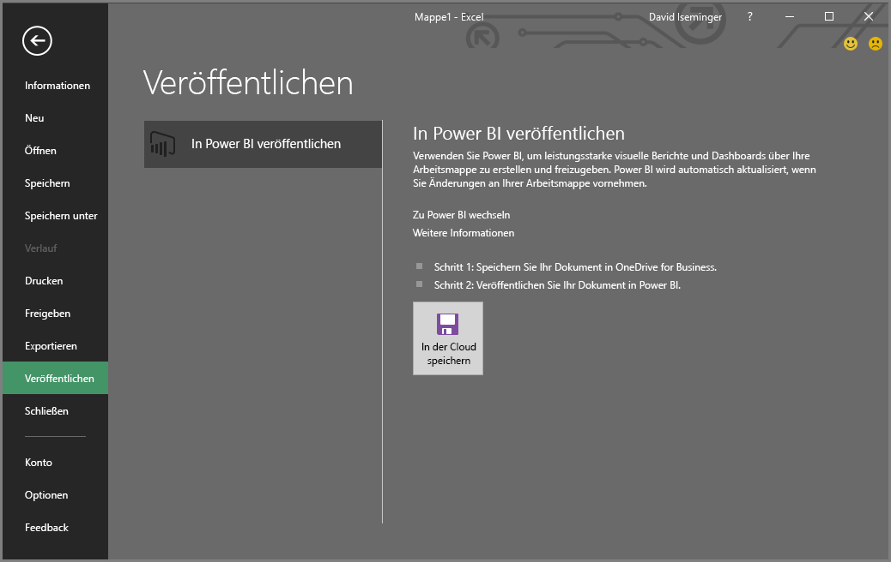
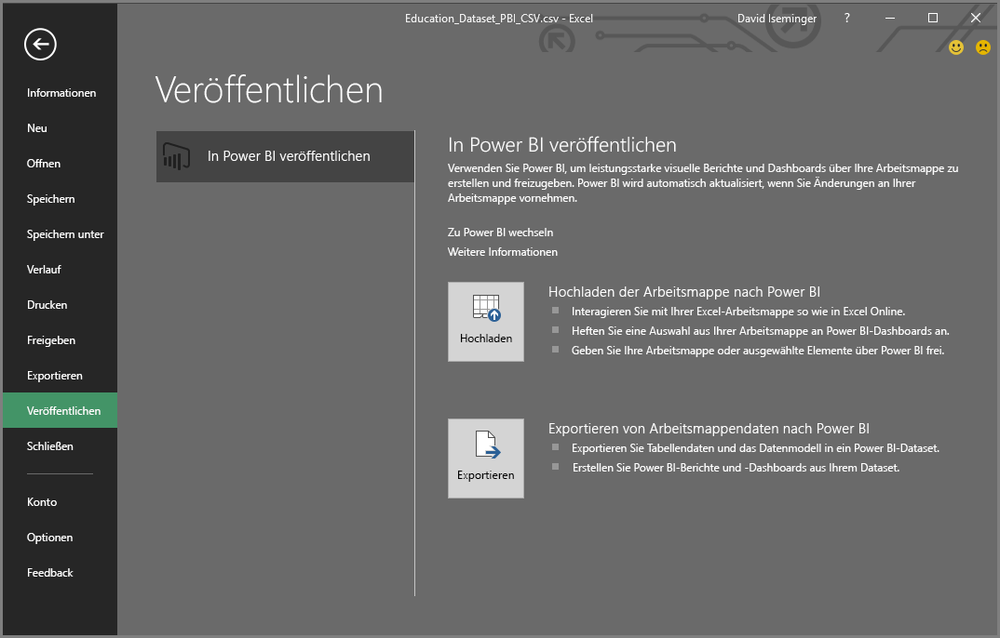

# Veröffentlichen in Power BI aus Excel 2016
Mit Excel 2016 können Sie Ihre Excel-Arbeitsmappen direkt auf Ihrer [Power BI](https://powerbi.microsoft.com)-Website veröffentlichen. Dort können Sie hochgradig interaktive Berichte und Dashboards auf Grundlage der Daten in Ihrer Arbeitsmappe erstellen. Sie können Ihre Einblicke dann für andere Personen in Ihrer Organisation freigeben.

Bevor wir fortfahren, gibt es einige Dinge zu beachten:

* Um etwas in Power BI veröffentlichen zu können, müssen Sie Ihre Arbeitsmappe in OneDrive for Business speichern.
* Sie müssen zum Anmelden bei Office, OneDrive for Business und Power BI dasselbe Konto verwenden.
* Es können weder leere Arbeitsmappen noch Arbeitsmappen ohne von Power BI unterstützten Inhalt veröffentlicht werden.
* Sie können weder verschlüsselte oder kennwortgeschützte Arbeitsmappen noch Arbeitsmappen veröffentlichen, die Information Protection Management aufweisen.
* Um etwas in Power BI zu veröffentlichen, muss die moderne Authentifizierung aktiviert sein (Standardeinstellung). Wenn sie deaktiviert ist, steht die Option „Veröffentlichen“ nicht im Menü „Datei“ zur Verfügung.

## Veröffentlichen Ihrer Excel-Arbeitsmappe
Wählen Sie in Excel **Datei** > **Veröffentlichen**.

### Veröffentlichen lokaler Dateien
Mit dem Update vom Februar 2017 unterstützt Excel 2016 das Veröffentlichen von lokalen Excel-Dateien. Die Dateien müssen hierfür nicht in OneDrive for Business oder SharePoint Online gespeichert werden.

> [!IMPORTANT]
> Die Oberfläche zum Veröffentlichen lokaler Dateien wird in Excel 2016 nur mit einem Office 365-Abonnement angezeigt. Bei der eigenständigen Installation von Excel 2016 steht nach wie vor die Funktion „Veröffentlichen“ zur Verfügung. Hier ist es erforderlich, die Excel-Arbeitsmappe in OneDrive for Business oder SharePoint Online zu speichern.
> 
> 

Wenn Sie **Veröffentlichen** wählen, können Sie den für die Veröffentlichung gewünschten Arbeitsbereich auswählen. Dabei kann es sich um einen persönlichen oder einen Gruppenarbeitsbereich, auf den Sie zugreifen können, handeln.

Sie haben zwei Optionen, die Arbeitsmappe in Power BI einzubinden.

Sobald sie veröffentlicht ist, wird eine Kopie (als von der lokalen Datei eigenständige Datei) in Power BI gespeichert. Wenn Sie die Datei in Power BI aktualisieren möchten, müssen Sie die aktuelle Version erneut veröffentlichen. Sie können die Daten aktualisieren und für die Arbeitsmappe oder das Dataset in Power BI eine geplante Aktualisierung festlegen.

### Veröffentlichen aus einer eigenständigen Excel-Installation
Wenn die Arbeitsmappe noch nicht in OneDrive gespeichert ist, müssen Sie dies zuerst nachholen. Wählen Sie „In der Cloud speichern“ und dann einen Speicherort in OneDrive for Business.

Nachdem die Arbeitsmappe in OneDrive gespeichert wurde, stehen Ihnen durch Wahl von **Veröffentlichen** zwei Optionen für den Import Ihrer Arbeitsmappe in Power BI zur Verfügung.

#### Hochladen der Arbeitsmappe nach Power BI
Wenn Sie diese Option wählen, wird die Arbeitsmappe in Power BI genauso angezeigt wie in Excel Online. Allerdings haben Sie im Gegensatz zu Excel Online einige hervorragende Funktionen zur Hand, mit denen Sie Elemente aus Arbeitsblättern an Dashboards anheften können.

Wenn Sie Ihre Arbeitsmappe in Power BI öffnen, können Sie sie nicht bearbeiten. Sollten Sie aber Änderungen vornehmen müssen, können Sie **Bearbeiten** wählen und die Arbeitsmappe in Excel Online oder lokal auf Ihrem Computer in Excel öffnen. Alle vorgenommenen Änderungen werden in der Arbeitsmappe in OneDrive gespeichert.

Wenn Sie etwas hochladen, wird kein Dataset in Power BI erstellt. Ihre Arbeitsmappe wird im Navigationsbereich Ihres Arbeitsbereichs unter „Berichte“ angezeigt. Nach Power BI hochgeladene Arbeitsmappen weisen ein besonderes Excel-Symbol auf, das anzeigt, dass sie aus Excel hochgeladen wurden.

Wählen Sie diese Option, wenn Ihre Daten ausschließlich in Arbeitsblättern angelegt sind oder Sie Ihre PivotTables und Diagramme in Power BI anzeigen möchten.
Die Verwendung der Upload-Funktion in Excel für die Veröffentlichung in Power BI ähnelt der Vorgehensweise „Daten abrufen > Datei > OneDrive for Business > Verknüpfen, Verwalten und Anzeigen von Excel in Power BI“ von Power BI in Ihrem Browser.

#### Exportieren von Arbeitsmappendaten nach Power BI
Wenn Sie diese Option wählen, werden alle unterstützten Daten in Tabellen und/oder Datenmodellen in ein neues Dataset in Power BI exportiert. Wenn Sie über Blätter mit Power View-Visualisierungen verfügen, werden diese in Power BI als Berichte neu erstellt.

Sie können Ihre Arbeitsmappe weiterhin bearbeiten. Wenn Sie die Änderungen speichern, werden sie für gewöhnlich innerhalb einer Stunde mit dem Dataset in Power BI synchronisiert. Wenn Sie Ergebnisse unmittelbar benötigen, können Sie erneut „Veröffentlichen“ wählen, und Ihre Änderungen werden sofort exportiert. Alle Visualisierungen in Ihren Berichten und Dashboards werden ebenfalls aktualisiert.

Wählen Sie diese Option, wenn Sie „Abrufen und Transformieren von Daten“ oder Power Pivot zum Laden von Daten in ein Datenmodell verwendet haben oder wenn Ihre Arbeitsmappe über Power View-Visualisierungen verfügt, die in Power BI angezeigt werden sollen.

Die Verwendung der Export-Funktion in Excel für die Veröffentlichung in Power BI ähnelt der Vorgehensweise „Daten abrufen > Datei > OneDrive for Business > Exportieren von Excel-Daten in Power BI“ von Power BI in Ihrem Browser.

## Veröffentlichen
Wenn Sie eine dieser Optionen auswählen, wird sich Excel mit Ihrem aktuellen Konto bei Power BI anmelden und Ihre Arbeitsmappe dann auf Ihrer Power BI-Website veröffentlichen. Behalten Sie die Excel-Statusleiste im Auge. Sie zeigt den Status der Vorgänge an.

Nach Abschluss des Vorgangs können Sie direkt aus Excel zu Power BI wechseln.

## Nächste Schritte
[Excel-Daten in Power BI](service-excel-workbook-files.md)  
Weitere Fragen? [Wenden Sie sich an die Power BI-Community](http://community.powerbi.com/)

