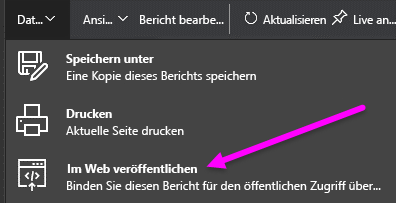
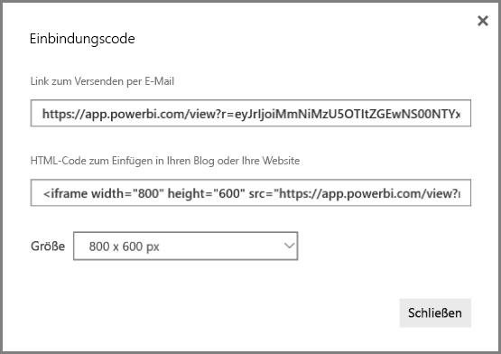
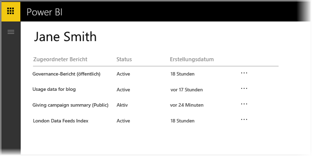
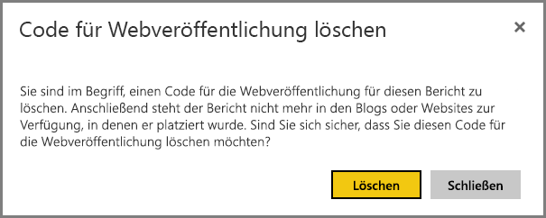

# Veröffentlichen im Web aus Power BI

Mit Power BI **im Web veröffentlichen** Option, Sie können auf einfache Weise einbetten interaktive Power BI-Visualisierungen online, z. B. in Blogbeiträge, Websites, in e-Mails oder über soziale Medien auf einem beliebigen Gerät. Ebenso einfach können Sie Ihre veröffentlichten Visuals bearbeiten, updaten, aktualisieren oder ihre Freigabe aufheben.

> [!WARNING]
> Bei Verwendung von **im Web veröffentlichen**, jede Person im Internet kann Ihre veröffentlichten Bericht oder visuellen anzeigen. Dies ist keine Authentifizierung erforderlich und umfasst das Anzeigen von Daten auf Detailebene Ihren aggregierten Berichten. Stellen Sie vor der Veröffentlichung eines Berichts an, Sie sicher, dass es für Sie, die Daten und Visualisierungen öffentlich freizugeben. Veröffentlichen Sie keine vertraulichen oder proprietären Informationen. Überprüfen Sie vor der Veröffentlichung im Zweifelsfall die Richtlinien Ihrer Organisation.

>[!Note]
>Um Ihre Inhalte sicher in ein internes Portal oder eine interne Website einzubetten, verwenden Sie die Optionen [Einbetten](service-embed-secure.md) oder [In SharePoint Online einbetten](service-embed-report-spo.md). Dadurch wird sichergestellt, dass alle Berechtigungen und die Datensicherheit erzwungen werden, wenn die Benutzer Ihre internen Daten abrufen.

## Verwenden von „Im Web veröffentlichen“

**Webveröffentlichung** steht für Berichte in Ihren persönlichen oder Arbeitsbereichen, die Sie bearbeiten können.  Es ist nicht für Berichte, die für Sie oder diejenigen, die vertrauenden Seite, auf die Sicherheit auf Zeilenebene zum Schützen von Daten freigegeben. Finden Sie unter den [ **Einschränkungen** ](#limitations) Beispielabschnitt unten eine vollständige Liste der Fälle, in denen **im Web veröffentlichen** wird nicht unterstützt. Überprüfen Sie die **Warnung** weiter oben in diesem Artikel vor der Verwendung von **im Web veröffentlichen**.

Die folgenden *kurzvideo* zeigt, wie dieses Feature funktioniert. Klicken Sie dann Probieren Sie es selbst in den folgenden Schritten.

<iframe width="560" height="315" src="https://www.youtube.com/embed/UF9QtqE7s4Y" frameborder="0" allowfullscreen></iframe>

In den folgenden Schritten wird die Verwendung von **Im Web veröffentlichen**beschrieben.

1. Öffnen Sie einen Bericht in Ihrem Arbeitsbereich, den Sie bearbeiten und auswählen können **Datei > im Web veröffentlichen**.

   

2. Überprüfen Sie im Dialogfeld Inhalt, und wählen Sie **Einbindungscode erstellen**.

   

3. Überprüfen Sie die Warnung, aus, wie hier gezeigt, und vergewissern Sie sich, dass die Daten können in einer öffentlichen Website einbetten. Wenn es sich handelt, wählen Sie **veröffentlichen**.

   

4. Ein Dialogfeld wird mit einem Link angezeigt. Sie können diesen Link per e-Mail senden, in der Code wie etwa einen iFrame einbetten oder fügen Sie ihn direkt in einer Webseite oder einen Blog.

   

5. Wenn Sie zuvor erstellt, einen Einbindungscode für einen Bericht haben, und wählen Sie Sie **im Web veröffentlichen**, wird nicht angezeigt, die Dialogfelder in den Schritten 2 bis 4. Stattdessen die **Einbindungscode** Dialogfeld wird angezeigt:

   

   Für jeden Bericht kann nur ein Einbindungscode erstellt werden.

## Tipps und tricks für Ansichtsmodi

Wenn Sie Inhalt in einen Blogbeitrag einbetten, müssen Sie in der Regel diese in eine bestimmte Bildschirmgröße passt.  Sie können die Höhe und Breite im iFrame-Tag nach Bedarf anpassen. Allerdings müssen Sie sicherstellen, dass der Bericht innerhalb des Bereichs angegebenen iFrame passt, daher Sie auch einen geeigneten Ansichtsmodus festlegen, wenn Sie den Bericht zu bearbeiten müssen.

Die folgende Tabelle gibt Hilfestellung zum Ansichtsmodus und wie er sich auf die Darstellung bei der Einbettung auswirkt.

| Ansichtsmodus | Darstellung bei der Einbettung |
| --- | --- |
|  |**An Seite anpassen** berücksichtigt Höhe und Breite des Berichts. Wenn Sie die Seite "Dynamisches" Seitenverhältnis wie 16:9 oder 4:3 festlegen wird Ihr Inhalt skaliert so, in den iFrame passt. Verwenden Sie bei der Einbettung in einen iFrame **"an Seite anpassen"** kann dazu führen, **Letterbox-Effekt**, in ein grauer Hintergrund in iFrame-Bereichen hinter dem Inhalt angezeigt wird so skaliert, die in den iFrame passt. Um Letterbox-Effekt zu minimieren, legen Sie Ihren iFrame Höhe und Breite entsprechend fest. |
|  |**Tatsächliche Größe** wird sichergestellt, der Bericht die Größe beibehalten wird, wie Sie auf der Berichtsseite festgelegt. Dies kann zu Scrollleisten im iFrame führen. Festlegen der iFrame-Höhe und Breite um Scrollleisten zu vermeiden. |
|  |**An Breite anpassen** stellt sicher, der Inhalt in horizontalen Bereich des iFrame passt. Ein Rahmen wird weiterhin angezeigt, aber der Inhalt wird skaliert, um der horizontalen verfügbare Platz vollständig zu verwenden. |

## Tipps und Tricks für die iFrame-Höhe und -Breite

Ein **im Web veröffentlichen** Einbetten von Code sieht wie folgt:

 
Sie können die Breite und Höhe manuell fest, um sicherzustellen, dass sie genau wie Sie es auf der Seite passt, in dem Sie den Code einbetten, soll, bearbeiten.

Um eine bessere Anpassung zu erreichen, können Sie versuchen, 56 Pixel des iFrame-Höhe, auf die aktuelle Größe des unteren hinzufügen. Wenn Ihre Berichtsseite die dynamische Größe verwendet, finden Sie in der nachstehenden Tabelle einige Größen, die Sie verwenden können, um eine Anpassung ohne Letterbox-Effekt zu erreichen.

| Seitenverhältnis | Größe | Dimension (Breite x Höhe) |
| --- | --- | --- |
| 16:9 |Klein |640 x 416 px |
| 16:9 |Mittel |800 x 506 px |
| 16:9 |Groß |960 x 596 px |
| 4:3 |Klein |640 x 536 px |
| 4:3 |Mittel |800 x 656 px |
| 4:3 |Groß |960 x 776 px |

## Einbindungscodes verwalten

Nach dem Erstellen einer **im Web veröffentlichen** Code einbetten, können Sie festlegen, Verwalten Ihrer Codes aus der **Einstellungen** Menü in Power BI. Verwalten von einbindungscodes bietet die Möglichkeit, das visuelle Zielelement oder den Bericht für einen Code (wodurch der Einbindungscode unbrauchbar), entfernen oder den Einbindungscode abrufen.

1. Um Ihre Einbindungscodes für **Im Web veröffentlichen** zu verwalten, öffnen Sie über das Zahnrad das Menü **Einstellungen** , und wählen Sie **Einbindungscodes verwalten**aus.

   

2. Ihre einbindungscodes angezeigt werden.

   

3. Sie können entweder abrufen oder löschen ein einbindungscodes. Löschen, werden von Links zu diesem Bericht oder das visuelle deaktiviert.

   

4. Bei Auswahl von **löschen**, Sie werden aufgefordert zu bestätigen.

   

## Updates an Berichten und Datenaktualisierung

Nach der Erstellung Ihrer **im Web veröffentlichen** Einbindungscode und die Freigabe, der Bericht mit den Änderungen aktualisiert wird, die Sie vornehmen, der einbindungscodelink sofort aktiv ist, und jemand auf den Link öffnet anzeigen kann. Nach dieser anfänglichen Aktion jedoch dauert Updates an Berichten oder Visuals ungefähr eine Stunde, bevor Sie die aufgabenausführung für Benutzer sichtbar. Wenn Ihre Updates sofort verfügbar sein müssen, können Sie den Einbindungscode löschen und einen neuen erstellen. Weitere Informationen finden Sie unter den [ **Funktionsweise** ](#howitworks) weiter unten in diesem Artikel. 

## Datenaktualisierung

Datenaktualisierungen werden in Ihrem eingebetteten Bericht oder in Ihrer Virtualisierung automatisch wiedergegeben. Es kann ungefähr eine Stunde dauern, bis aktualisierte Daten über Einbindungscodes widergespiegelt werden. Um die automatische Aktualisierung deaktivieren, können Sie auswählen **nicht aktualisieren** gemäß dem Zeitplan für das Dataset im Bericht verwendet werden.  

## Benutzerdefinierte visuelle Elemente

Benutzerdefinierte visuelle Elemente werden von **Im Web veröffentlichen**unterstützt. Bei Verwendung von **im Web veröffentlichen**, Benutzer, die mit denen Sie Ihr veröffentlichte visuelles freigeben müssen sich nicht um benutzerdefinierte visuelle Elemente zum Anzeigen des Berichts zu aktivieren.

## Einschränkungen

**Im Web veröffentlichen** wird unterstützt, für die überwiegende Mehrheit der Datenquellen und in Power BI-Dienst, jedoch die folgende Liste enthält Berichten **aktuell nicht unterstützt oder verfügbaren** mit **im Web veröffentlichen** :

- Berichte, die die Sicherheit auf Zeilenebene verwenden
- Berichte, die eine Datenquelle mit Liveverbindung verwenden, einschließlich dem lokal gehosteten tabellarischen Analysis Services-Dienst, dem mehrdimensionalen Analysis Services-Dienst und Azure Analysis Services.
- Berichte, die für Sie direkt oder über ein Organisationsinhaltspaket freigegeben werden
- Berichte in einer Gruppe, in der Sie kein Bearbeitungsmitglied sind
- "R" visuelle Elemente werden derzeit nicht unterstützt **im Web veröffentlichen** Berichte.
- Exportieren von Daten aus Visualisierungen in einem Bericht ein, wurde die im Web veröffentlicht.
- ArcGIS Maps for Power BI-Visualisierungen.
- Berichte, die auf DAX-Measures enthält.
- Einmaliges Anmelden Abfrage Datenmodelle.
- [Schützen von vertraulichen oder proprietären Informationen](#publish-to-web-from-power-bi).
- Die Funktion zur automatischen Authentifizierung, die von der Option **Einbetten** unterstützt wird, kann nicht mit der Power BI-JavaScript-API verwendet werden. Verwenden Sie zum Einbetten mit der Power BI-JavaScript-API die Methode [Benutzer ist Besitzer der Daten](developer/embed-sample-for-your-organization.md). Weitere Informationen zu [Benutzer ist Besitzer der Daten](developer/embed-sample-for-your-organization.md)

## Mandanteneinstellung

Power BI-Administratoren können aktivieren oder Deaktivieren der **im Web veröffentlichen** Feature. Sie können auch den Zugriff auf bestimmte Gruppen einschränken, die was die Möglichkeit, einen Einbindungscode erstellen auswirken kann.

|Feature |Für die gesamte Organisation aktiviert |Für die gesamte Organisation deaktiviert |Bestimmte Sicherheitsgruppen   |
|---------|---------|---------|---------|
|**Webveröffentlichung** unter des Berichts **Datei** Menü|Für alle aktiviert|Nicht für alle sichtbar|Nur für autorisierte Benutzer oder Gruppen sichtbar|
|**Einbindungscodes verwalten** unter **Einstellungen**|Für alle aktiviert|Für alle aktiviert|Für alle aktiviert.  Option * **Löschen** nur für autorisierte Benutzer oder Gruppen * **Codes abrufen** für alle aktiviert|
|**Einbindungscodes** im Verwaltungsportal|Es wird einer der folgenden Status angezeigt: * Aktiv * Nicht unterstützt * Blockiert|Als Status wird **Deaktiviert** angezeigt.|Es wird einer der folgenden Status angezeigt: * Aktiv * Nicht unterstützt * Blockiert  Wenn ein Benutzer gemäß den Mandanteneinstellungen nicht autorisiert ist, wird als Status **Verletzt** angezeigt.|
|Vorhandene veröffentlichte Berichte|Alle aktiviert|Alle deaktiviert|Berichte werden weiterhin für alle gerendert.|

## Funktionsweise der Einbindungscode-Statusspalte

Die **einbindungscodes verwalten** Seite enthält eine Statusspalte. In der Standardeinstellung einbindungscodes sind **Active**, aber auch einen der unten aufgeführten Status werden konnte.

| Status | Beschreibung |
| --- | --- |
| **Aktiv** |Der Bericht ist für Internetbenutzer zur Ansicht und Interaktion verfügbar. |
| **Blockiert** |Den Inhalt des Berichts verstößt gegen die [Power BI-Dienstvertrag](https://powerbi.microsoft.com/terms-of-service). Microsoft hat es blockiert. Kontaktieren Sie den Support, wenn Sie glauben, dass der Inhalt irrtümlich blockiert wurde. |
| **Nicht unterstützt** |Das Dataset des Berichts verwendet die Sicherheit auf Zeilenebene oder eine andere nicht unterstützte Konfiguration. Finden Sie unter den [ **Einschränkungen** ](#limitations) Abschnitt, um eine vollständige Liste. |
| **Verletzt** |Der Einbindungscode befindet sich außerhalb der definierten mandantenrichtlinie. Dies tritt normalerweise auf, wenn ein Einbindungscode erstellt wurde, und klicken Sie dann die **im Web veröffentlichen** mandanteneinstellung wurde geändert, um das zuständige des einbindungscodes ausgeschlossen. Wenn die mandanteneinstellung deaktiviert ist oder der Benutzer nicht mehr erstellen darf einbindungscodes, betten Sie vorhandene Codes Anzeigen einer **verletzt** Status. |

## Melden eines Problems im Zusammenhang mit „Im Web veröffentlichen“-Inhalten

Ein Problem im Zusammenhang mit der Bericht **im Web veröffentlichen** Inhalte, die in einer Website oder einem Blog eingebettet, verwenden Sie die **Flag** Symbol in der unteren Leiste, wie in der folgenden Abbildung dargestellt. Sie werden aufgefordert, eine e-Mail an Microsoft zu senden. Ihr Anliegen erläutern. Microsoft beurteilt die Inhalte basierend auf der Power BI-Dienstvertrag und entsprechende Maßnahmen ergreifen.

Um ein Problem melden möchten, wählen die **Flag** Symbol in der unteren Leiste des der **im Web veröffentlichen** Berichts angezeigt.

## Lizenzierung und Preise

Sie müssen ein Microsoft Power BI-Benutzer sein, um **Im Web veröffentlichen**zu verwenden. Des Berichts-Viewer müssen nicht auf Power BI-Benutzer sein.

## Funktionsweise (technische Details)

Beim Erstellen einer Embed Code mit **im Web veröffentlichen**, der Bericht an die Internetbenutzer sichtbar gemacht wird. Es ist öffentlich verfügbar, sodass Sie erwartungsgemäß Viewer ganz einfach den Bericht über soziale Medien in der Zukunft freigeben. Wenn Benutzer den Bericht anzeigen, entweder indem sie die direkte öffentliche URL öffnen oder den Bericht auf einer Webseite oder in einem Blog eingebettet anzeigen, speichert Power BI die Berichtsdefinition und die Ergebnisse der zum Anzeigen des Berichts erforderlichen Abfragen zwischen. Dadurch wird sichergestellt, dass tausende gleichzeitiger Benutzer den Bericht anzeigen können, ohne Beeinträchtigung der Leistung.

Der Cache ist updaten, also wenn Sie die Berichtsdefinition (z. B., wenn Sie den Ansichtsmodus ändern) oder die Berichtsdaten aktualisieren, es ungefähr eine Stunde dauern kann, bis Änderungen in der Version des Berichts sichtbar sind, die Ihre Benutzer anzeigen. Es wird daher empfohlen, dass Sie Ihre Arbeit rechtzeitig vorab bereitstellen und den Einbindungscode für **Im Web veröffentlichen** erst erstellen, wenn Sie mit den Einstellungen zufrieden sind.

## Nächste Schritte

- [SharePoint Online-Berichts-Webpart](service-embed-report-spo.md) 

- [Einbetten eines Berichts in ein sicheres Portal oder eine sichere Website](service-embed-secure.md)

Weitere Fragen? [Wenden Sie sich an die Power BI-Community](http://community.powerbi.com/)
