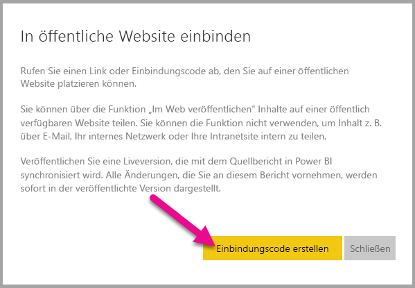
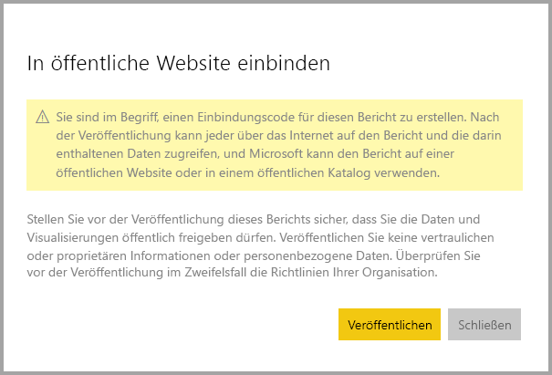
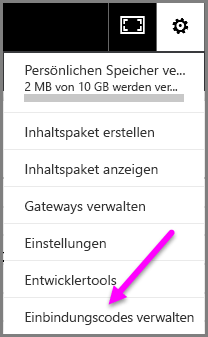
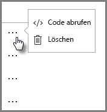

# Veröffentlichen im Web aus Power BI

Mit der Power BI-Funktion **Im Web veröffentlichen** können Sie auf einfache Weise interaktive Power BI-Visualisierungen auf beliebigen Geräten online einbetten, etwa in Blogbeiträgen, auf Websites, in E-Mails oder über soziale Medien.

Ebenso einfach können Sie Ihre veröffentlichten Visuals bearbeiten, updaten, aktualisieren oder ihre Freigabe aufheben.

> [!WARNING]
> Wenn Sie **Im Web veröffentlichen** verwenden, kann der Bericht oder das visuelle Element von jedermann im Internet angesehen werden. Für die Anzeige dieser Berichte wird keine Authentifizierung verwendet. Verwenden Sie „Im Web veröffentlichen“ nur für Berichte und Daten, die jedermann im Internet (nicht authentifizierte öffentliche Teilnehmer) ansehen können soll. Dies gilt auch für aggregierte Detaildaten in Ihren Berichten. Stellen Sie vor der Veröffentlichung dieses Berichts sicher, dass Sie die Daten und Visualisierungen öffentlich freigeben dürfen. Veröffentlichen Sie keine vertraulichen oder proprietären Informationen. Überprüfen Sie vor der Veröffentlichung im Zweifelsfall die Richtlinien Ihrer Organisation.

## Verwenden von „Im Web veröffentlichen“

**Im Web veröffentlichen** steht für Berichte in Ihrem persönlichen Arbeitsbereich oder Ihrem Gruppenarbeitsbereich zur Verfügung, die Sie bearbeiten können.  Sie können „Im Web veröffentlichen“ weder für Berichte verwenden, die für Sie freigegeben wurden, noch für Berichte, die zum Sichern der Daten auf die Sicherheit auf Zeilenebene vertrauen. Eine vollständige Liste der Fälle, in denen „Im Web veröffentlichen“ nicht unterstützt wird, finden Sie weiter unten im Abschnitt **Einschränkungen**. Lesen Sie die **Warnung** weiter oben in diesem Artikel, bevor Sie „Im Web veröffentlichen“ verwenden.

Das folgende *kurze Video*zeigt, wie dieses Feature funktioniert. Führen Sie anschließend die Schritte unten aus, um es selbst auszuprobieren.

<iframe width="560" height="315" src="https://www.youtube.com/embed/UF9QtqE7s4Y" frameborder="0" allowfullscreen></iframe>

In den folgenden Schritten wird die Verwendung von **Im Web veröffentlichen**beschrieben.

1. Wählen Sie in einem Bericht in Ihrem Arbeitsbereich, den Sie bearbeiten können, **Datei > Im Web veröffentlichen** aus.
   
   

2. Überprüfen Sie den Inhalt des Dialogfelds, und wählen Sie dann **Einbindungscode erstellen** aus, wie im folgenden Dialogfeld dargestellt.
   
   

3. Lesen Sie die Warnung, die im folgenden Dialogfeld angezeigt wird, und bestätigen Sie, dass die Einbettung der Daten in eine öffentlich zugängliche Website unbedenklich ist. Wenn das der Fall ist, wählen Sie **Veröffentlichen**aus.
   
   

4. Es wird ein Dialogfeld angezeigt, das einen Link bereitstellt, der per E-Mail gesendet, in Code (wie etwa einen iFrame) eingebettet oder direkt in eine Webseite oder einen Blog eingefügt werden kann.
   
   

5. Wenn Sie zuvor einen Einbindungscode für den Bericht erstellt haben, wird der Einbindungscode schnell angezeigt. Für jeden Bericht kann nur ein Einbindungscode erstellt werden.
   
   

## Tipps und Tricks für Ansichtsmodi

Wenn Sie Inhalte in einen Blogbeitrag einbetten, müssen Sie sie in der Regel in eine bestimmte Bildschirmgröße einpassen.  Sie können Höhe und Breite im iFrame-Tag nach Bedarf anpassen, müssen dabei möglicherweise aber auch sicherstellen, dass Ihr Bericht in den angegebenen Bereich des iFrames passt, sodass Sie beim Bearbeiten des Berichts auch einen geeigneten Ansichtsmodus festlegen müssen.

Die folgende Tabelle gibt Hilfestellung zum Ansichtsmodus und wie er sich auf die Darstellung bei der Einbettung auswirkt.

| Ansichtsmodus | Darstellung bei der Einbettung |
| --- | --- |
|  |**An Seite anpassen** berücksichtigt die Höhe und Breite des Berichts. Wenn Sie für Ihre Seite das Seitenverhältnis auf „Dynamisch“ – z.B. 16:9 oder 4:3 – festlegen, wird Ihr Inhalt so skaliert, dass er in den von Ihnen bereitgestellten iFrame passt. Wenn Inhalt im iFrame eingebettet ist, kann die Verwendung von **An Seite anpassen** zu einem **Letterbox-Effekt** führen, wobei ein grauer Hintergrund in iFrame-Bereichen angezeigt wird, nachdem der Inhalt so skaliert wurde, dass er in den iFrame passt. Legen Sie die Höhe und Breite Ihres iFrames entsprechend fest, um den Letterbox-Effekt zu minimieren. |
|  |**Originalgröße** stellt sicher, dass die Größe des Berichts so beibehalten wird, wie sie auf der Berichtsseite festgelegt ist. Dies kann zur Folge haben, dass im iFrame Scrollleisten dargestellt werden. Legen Sie die iFrame-Höhe und -Breite fest, um die Scrollleisten zu vermeiden. |
|  |**An Breite anpassen** stellt sicher, dass die Inhalte in den horizontalen Bereich Ihres iFrames passen. Es wird trotzdem ein Rahmen angezeigt, die Inhalte werden aber so skaliert, dass der in der Horizontalen verfügbare Platz vollständig ausgenutzt wird. |

## Tipps und Tricks für die iFrame-Höhe und -Breite

Der Einbindungscode, der für Sie nach der Auswahl von „Im Web veröffentlichen“ bereitgestellt wird, sieht etwa so aus:

Sie können Breite und Höhe manuell bearbeiten, um sicherzustellen, dass die Einpassung auf der Seite, auf der Sie den Code einbetten, genau Ihren Vorstellungen entspricht.

Sie können versuchen, 56 Pixel zur Höhenabmessung des iFrame hinzuzufügen, um eine bessere Anpassung zu erreichen. Dadurch wird die aktuelle Größe der unteren Leiste angepasst. Wenn Ihre Berichtsseite die dynamische Größe verwendet, finden Sie in der nachstehenden Tabelle einige Größen, die Sie verwenden können, um eine Anpassung ohne Letterbox-Effekt zu erreichen.

| Seitenverhältnis | Größe | Dimension (Breite x Höhe) |
| --- | --- | --- |
| 16:9 |Klein |640 x 416 px |
| 16:9 |Mittel |800 x 506 px |
| 16:9 |Groß |960 x 596 px |
| 4:3 |Klein |640 x 536 px |
| 4:3 |Mittel |800 x 656 px |
| 4:3 |Groß |960 x 776 px |

## Verwalten von Einbindungscodes

Nachdem Sie mithilfe von **Im Web veröffentlichen** einen Einbindungscode erstellt haben, können Sie die erstellten Codes im Menü **Einstellungen** des Power BI-Diensts verwalten. Das Verwalten von Einbindungscodes schließt auch die Möglichkeit ein, das visuelle Zielelement oder den Zielbericht für einen Code zu entfernen (wodurch der Einbindungscode unbrauchbar wird) oder den Einbindungscode erneut abzurufen.

1. Um Ihre Einbindungscodes für **Im Web veröffentlichen** zu verwalten, öffnen Sie über das Zahnrad das Menü **Einstellungen** , und wählen Sie **Einbindungscodes verwalten**aus.
   
   

2. Die Liste der von Ihnen erstellten Einbindungscodes wird angezeigt, wie in der folgenden Abbildung dargestellt.
   
   

3. Für jeden **Im Web veröffentlichen** -Einbindungscode in der Liste können Sie den Einbindungscode abrufen oder löschen, wodurch alle Verknüpfungen mit dem betreffenden Bericht oder visuellen Element nicht mehr funktionieren.
   
   

4. Wenn Sie **Löschen** auswählen, werden Sie gefragt, ob Sie sicher sind, dass Sie den Einbindungscode löschen möchten.
   
   

## Updates an Berichten und Datenaktualisierung

Nachdem Sie einen **Im Web veröffentlichen** Einbindungscode erstellt und geteilt haben, werden alle Änderungen, die Sie vornehmen, im Bericht geupdatet. Sie müssen aber beachten, dass es eine Weile dauern kann, bis die Updates für Ihre Benutzer sichtbar sind. Updates an einem Bericht oder visuellen Element werden nach ungefähr einer Stunde in „Im Web veröffentlichen“-Einbindungscodes berücksichtigt.

Bei der erstmaligen Verwendung von **Im Web veröffentlichen** zum Abrufen eines Einbindungscodes ist der Einbindungscodelink sofort aktiv und kann von jedermann angezeigt werden, der den Link öffnet.  Nach der ursprünglichen „Im Web veröffentlichen“-Aktion kann es jedoch ungefähr eine Stunde dauern, bis nachfolgende Updates an Berichten oder visuellen Elementen, auf die ein „Im Web veröffentlichen“-Link verweist, für Ihre Benutzer sichtbar sind.

Weitere Informationen finden Sie im Abschnitt **Funktionsweise** weiter unten in diesem Artikel. Wenn Ihre Updates sofort verfügbar sein müssen, können Sie den Einbindungscode löschen und einen neuen erstellen.

## Datenaktualisierung

Datenaktualisierungen werden in Ihrem eingebetteten Bericht oder in Ihrer Virtualisierung automatisch wiedergegeben. Es kann ungefähr eine Stunde dauern, bis aktualisierte Daten über Einbindungscodes widergespiegelt werden. Sie können die automatische Aktualisierung deaktivieren, indem Sie im Zeitplan für das vom Bericht verwendete Dataset **nicht aktualisieren** auswählen.  

## Benutzerdefinierte Visualisierungen

Benutzerdefinierte visuelle Elemente werden von **Im Web veröffentlichen**unterstützt. Wenn Sie „Im Web veröffentlichen“ verwenden, brauchen Benutzer, mit denen Sie Ihr veröffentlichtes visuelles Element teilen, benutzerdefinierte Visualisierungen nicht zu aktivieren, um den Bericht anzuzeigen.

## Einschränkungen

**Im Web veröffentlichen** wird für die überwiegende Mehrheit der Datenquellen und Berichte im Power BI-Dienst unterstützt, die folgenden werden in „Im Web veröffentlichen“ jedoch **aktuell nicht unterstützt oder stehen nicht zur Verfügung**:

- Berichte, die die Sicherheit auf Zeilenebene verwenden
- Berichte, die eine Datenquelle mit Liveverbindung verwenden, einschließlich dem lokal gehosteten tabellarischen Analysis Services-Dienst, dem mehrdimensionalen Analysis Services-Dienst und Azure Analysis Services.
- Berichte, die für Sie direkt oder über ein Organisationsinhaltspaket freigegeben werden
- Berichte in einer Gruppe, in der Sie kein Bearbeitungsmitglied sind
- „R“-Visualisierungen werden in „Im Web veröffentlichen“-Berichten derzeit nicht unterstützt.
- Exportieren von Daten aus visuellen Elementen in einen Bericht, der im Web veröffentlicht wurde
- ArcGIS Maps for Power BI-Visuals
- Berichte, die DAX-Measures auf Berichtebene enthalten
- SSO-Datenabfragemodelle
- [Sichern vertraulicher oder proprietärer Informationen](#publish-to-web-from-power-bi)

## Mandanteneinstellung

Power BI-Administratoren können die Funktion „Im Web veröffentlichen“ aktivieren oder deaktivieren. Außerdem können sie den Zugriff auf bestimmte Gruppen einschränken. Von dieser Einstellung ist abhängig, ob Sie einen Einbindungscode erstellen können.

|Ausgewählt |Für die gesamte Organisation aktiviert |Für die gesamte Organisation deaktiviert |Bestimmte Sicherheitsgruppen   |
|---------|---------|---------|---------|
|**Im Web veröffentlichen** im Menü **Datei** des Berichts.|Für alle aktiviert|Nicht für alle sichtbar|Nur für autorisierte Benutzer oder Gruppen sichtbar|
|**Einbindungscodes verwalten** unter **Einstellungen**|Für alle aktiviert|Für alle aktiviert|Für alle aktiviert  Option * **Löschen** nur für autorisierte Benutzer oder Gruppen * **Codes abrufen** für alle aktiviert|
|**Einbindungscodes** im Verwaltungsportal|Es wird einer der folgenden Status angezeigt: * Aktiv * Nicht unterstützt * Blockiert|Als Status wird **Deaktiviert** angezeigt.|Es wird einer der folgenden Status angezeigt: * Aktiv * Nicht unterstützt * Blockiert  Wenn ein Benutzer gemäß den Mandanteneinstellungen nicht autorisiert ist, wird als Status **Verletzt** angezeigt.|
|Vorhandene veröffentlichte Berichte|Alle aktiviert|Alle deaktiviert|Berichte werden weiterhin für alle gerendert.|

## Funktionsweise der Einbindungscode-Statusspalte

Wenn Sie die Seite **Einbindungscodes verwalten** für Ihre **Im Web veröffentlichen** -Einbindungscodes anzeigen, steht eine Statusspalte zur Verfügung. Einbindungscodes sind standardmäßig aktiv, jedoch könnten Sie auf jeden der nachstehend aufgelisteten Status stoßen.

| Status | Beschreibung |
| --- | --- |
| **Aktiv** |Der Bericht ist für Internetbenutzer zur Ansicht und Interaktion verfügbar. |
| **Blockiert** |Der Inhalt des Berichts verstößt gegen die [Power BI-Vertragsbedingungen](https://powerbi.microsoft.com/terms-of-service). Er wurde von Microsoft blockiert. Kontaktieren Sie den Support, wenn Sie glauben, dass der Inhalt irrtümlich blockiert wurde. |
| **Nicht unterstützt** |Das Dataset des Berichts verwendet die Sicherheit auf Zeilenebene oder eine andere nicht unterstützte Konfiguration. Eine vollständige Liste finden Sie im Abschnitt **Einschränkungen**. |
| **Verletzt** |Der Einbindungscode befindet sich außerhalb der definierten Mandantenrichtlinie. Dies tritt normalerweise auf, wenn ein Einbindungscode erstellt und dann die Mandanteneinstellung „Im Web veröffentlichen“ so geändert wurde, dass der Eigentümer des Einbindungscodes ausgeschlossen wird. Wenn die Mandanteneinstellung deaktiviert wird oder der Benutzer keine Einbindungscodes mehr erstellen darf, wird bei vorhandenen Einbindungscodes der Status **Verletzt** angezeigt. |

## Melden eines Problems im Zusammenhang mit „Im Web veröffentlichen“-Inhalten

Um ein Problem im Zusammenhang mit den auf einer Website oder in einem Blog eingebetteten **Im Web veröffentlichen** -Inhalten zu melden, verwenden Sie das **Flaggensymbol** in der unteren Leiste, das in der folgenden Abbildung dargestellt ist. Sie werden aufgefordert, eine E-Mail an Microsoft zu senden, in der Sie Ihr Anliegen erläutern. Microsoft beurteilt die Inhalte auf der Grundlage des Power BI-Dienstvertrags und leitet geeignete Maßnahmen ein.

Um ein Problem zu melden, wählen Sie das **Flaggensymbol** in der unteren Leiste des angezeigten „Im Web veröffentlichen“-Berichts aus.

## Lizenzierung und Preise

Sie müssen ein Microsoft Power BI-Benutzer sein, um **Im Web veröffentlichen**zu verwenden. Die Benutzer Ihres Berichts (diejenigen, die sich die Berichte anzeigen lassen und sie lesen) müssen keine Power BI-Benutzer sein.

## Funktionsweise (technische Details)

Wenn Sie mithilfe von **Im Web veröffentlichen**einen Einbindungscode erstellen, wird der Bericht für Benutzer im Internet sichtbar gemacht. Er ist öffentlich verfügbar, daher können Sie davon ausgehen, dass Leser den Bericht in Zukunft einfach über soziale Medien teilen. Wenn Benutzer den Bericht anzeigen, entweder indem sie die direkte öffentliche URL öffnen oder den Bericht auf einer Webseite oder in einem Blog eingebettet anzeigen, speichert Power BI die Berichtsdefinition und die Ergebnisse der zum Anzeigen des Berichts erforderlichen Abfragen zwischen. Dieser Ansatz stellt sicher, dass der Bericht ohne Beeinträchtigung der Leistung von Tausenden von Benutzern zugleich angezeigt werden kann.

Der Cache hat einen langen Lebenszyklus. Wenn Sie die Berichtsdefinition updaten (etwa, indem Sie den Ansichtsmodus ändern) oder die Berichtsdaten aktualisieren, kann es daher ungefähr eine Stunde dauern, ehe die Änderungen in der von Ihren Benutzern angezeigten Version des Berichts angezeigt werden. Es wird daher empfohlen, dass Sie Ihre Arbeit rechtzeitig vorab bereitstellen und den Einbindungscode für **Im Web veröffentlichen** erst erstellen, wenn Sie mit den Einstellungen zufrieden sind.

Weitere Fragen? [Wenden Sie sich an die Power BI-Community](http://community.powerbi.com/)
