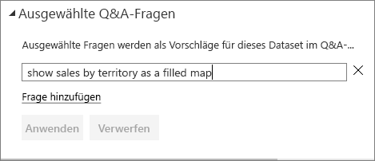

# Erstellen von ausgewählten Fragen für Power BI Q&A
Wenn Sie ein Dataset besitzen, können Sie dem Dataset eigene ausgewählte Fragen hinzufügen. Power BI Q & A zeigt diese Fragen Ihren Kollegen, die Berichte auf Grundlage dieses Datasets zu nutzen.  Durch die ausgewählten Fragen erhalten Ihre Kollegen Anhaltspunkte für die Arten von Fragen, die sie zum Dataset stellen können. Welche ausgewählten Fragen Sie hinzufügen, ist Ihnen überlassen – häufig gestellte Fragen, Fragen mit interessanten Ergebnissen oder Fragen, die möglicherweise schwierig zu formulieren sind.

> [!NOTE]
> Eine ausgewählte Fragen für Q & stehen für die Verwendung in der [Microsoft Power BI-app für iOS auf iPads, iPhones und iPod Touch-Geräten](consumer/mobile/mobile-apps-ios-qna.md) und Power BI Desktop Q & a Erstellen der Fragen ist nur in Power BI-Dienst ("App.powerbi.com") verfügbar.
> 

## Erstellen Sie eine ausgewählte Frage ein

In diesem Artikel wird das [Analysebeispiel für den Einzelhandel](sample-datasets.md) verwendet. Führen Sie die folgenden Schritte aus, um zu versuchen, ein Dataset zu untersuchen.

1. Wählen Sie im Dashboard das Q&A-Fragefeld aus.   Beachten Sie, dass Q&A an sich bereits hilfreich ist, da eine Liste der im Dataset auftretenden Begriffe angezeigt wird.
2. Um zu dieser Liste hinzuzufügen, wählen Sie das Zahnradsymbol in der oberen rechten Ecke von Power BI.  
   
3. Wählen Sie **Einstellungen** &gt; **Datasets** &gt; **Analysebeispiel für Einzelhandel** &gt; **Ausgewählte Q&A-Fragen** aus.  
4. Wählen Sie **Frage hinzufügen**aus.
   
   
5. Geben Sie Ihre Frage in das Textfeld ein, und wählen Sie **Übernehmen**aus.   Optional können Sie eine weitere Frage hinzufügen, indem Sie **Frage hinzufügen**auswählen.  
   
6. Navigieren Sie zurück zum Power BI-Dashboard, um das Analysebeispiel für Einzelhandel zu öffnen, und platzieren Sie den Cursor im Fragenfeld für Fragen und Antworten (F&A).   
   
7. Die neue ausgewählte Frage **Umsatz nach Gebiet als Karte** wird in der Liste an erster Stelle aufgeführt. Wählen Sie sie aus.  
8. Die Antwort wird als Flächenkartogramm visualisiert.  
   

## Nächste Schritte

- [Q & A für Consumer](consumer/end-user-q-and-a.md)  
- [Verwenden von Q & A in Dashboards und Berichten](power-bi-tutorial-q-and-a.md)  
- [Power BI – Grundkonzepte](consumer/end-user-basic-concepts.md)  

Weitere Fragen? [Wenden Sie sich an die Power BI-Community](http://community.powerbi.com/)

