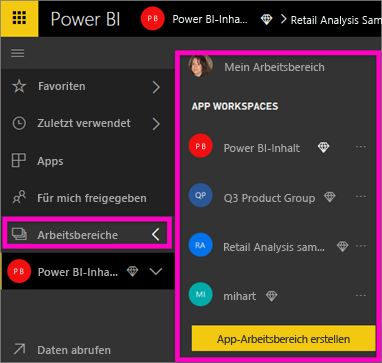
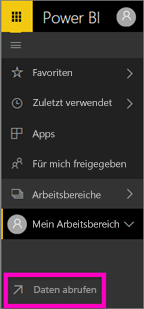
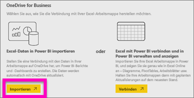
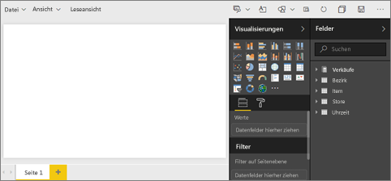
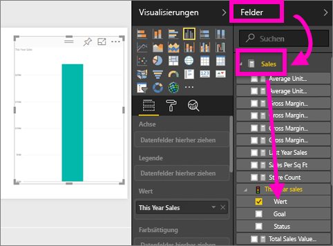
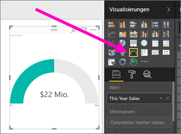
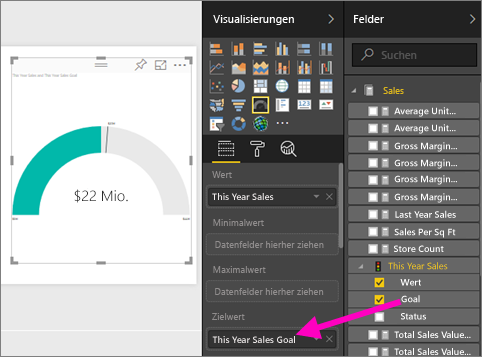
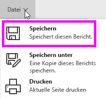
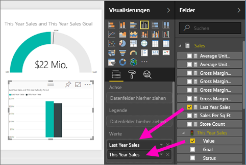
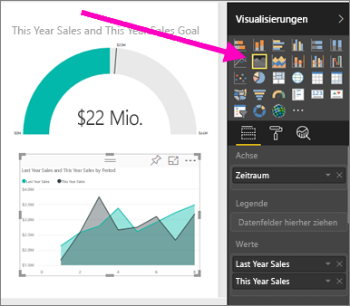

# Erstellen Sie einen neuen Bericht im Power BI-Dienst durch Importieren eines Datasets.
Sie haben [Berichte in Power BI](service-reports.md) gelesen, und jetzt möchten Sie Ihren eigenen erstellen. Es gibt viele verschiedene Möglichkeiten zum Erstellen eines Berichts. In diesem Artikel wird zunächst ein sehr einfacher Bericht aus einem Excel-Dataset mithilfe des Power BI-Diensts erstellt. Nachdem Sie die Grundlagen zur Erstellung eines Berichts kennen, gelangen Sie über die **nächsten Schritte** ganz unten zu komplexeren Themen über Berichte.  

> **TIPP:** Informationen zum Erstellen eines Berichts durch Kopieren eines vorhandenen Berichts finden Sie unter [Kopieren eines Berichts](power-bi-report-copy.md)
> 
### Voraussetzungen
- Power BI-Dienst (Informationen zum Erstellen von Berichten mit Power BI Desktop finden Sie unter [Berichtsansicht in Power BI Desktop](desktop-report-view.md))  
- Dataset des Analysebeispiels für den Einzelhandel

## Importieren des Datasets
Diese Methode zum Erstellen eines Berichts beginnt mit einem Dataset und einem leeren Berichtszeichenbereich. Um die Vorgehensweise selbst nachzuvollziehen, [laden Sie das Excel-Dataset „Analysebeispiel für Einzelhandel“ herunter](http://go.microsoft.com/fwlink/?LinkId=529778), und speichern Sie es in OneDrive for Business (bevorzugt) oder lokal.

1. Wir erstellen den Bericht in einem Arbeitsbereich des Power BI-Diensts. Wählen Sie daher einen vorhandenen Arbeitsbereich aus, oder erstellen Sie einen neuen.
   
   
2. Wählen Sie unten im linken Navigationsbereich **Daten abrufen** aus.
   
   
3. Wählen Sie **Dateien** aus, und navigieren Sie zum Speicherort des Beispiels für die Einzelhandelsanalyse.
   
    
4. Wählen Sie für diese Übung **Importieren** aus.
   
   
5. Nachdem das Dataset importiert wurde, wählen Sie **Dataset anzeigen** aus.
   
   
6. Durch das Anzeigen eines Datasets wird der Berichts-Editor geöffnet.  Sie sehen dort einen leeren Zeichenbereich und Bearbeitungstools für den Bericht.
   
   

> **TIPP:** Wenn Sie mit dem Berichtszeichenbereich nicht vertraut sind oder Ihre Kenntnisse auffrischen möchten, [verschaffen Sie sich einen Überblick über den Berichts-Editor](service-the-report-editor-take-a-tour.md), bevor Sie fortfahren.
> 
> 

## Hinzufügen eines radialen Messgeräts zum Bericht
Nachdem das Dataset importiert wurde, beginnen wir damit, einige Fragen zu beantworten.  Die leitende Marketingbeauftragte (Chief Marketing Officer, CMO) möchte wissen, wie nahe wir den Vertriebszielen dieses Jahres sind. Ein Messgerät ist eine [gute Visualisierungsoption](power-bi-report-visualizations.md), um diese Art von Informationen anzuzeigen.

1. Wählen Sie im Felderbereich die Option **Sales** > **This Year Sales** > **Wert**.
   
    
2. Konvertieren Sie das visuelle Element in einen Maßstab, indem Sie im Bereich **Visualisierungen** auf die Vorlage für „Maßstab“  klicken.
   
    
3. Ziehen Sie **Sales** > **This Year Sales** > **Ziel** in den Bereich **Zielwert**. Anscheinend haben wir unser Ziel nahezu erreicht.
   
    
4. Jetzt sollte [der Bericht gespeichert werden](service-report-save.md).
   
   

## Hinzufügen eines Flächendiagramms und Slicers zum Bericht
Die CMO stellt noch weitere Fragen, die beantwortet werden müssen. Sie möchte die Umsätze dieses Jahres im Vergleich zum Vorjahr einsehen. Die Ergebnisse möchte sie nach Region geordnet anzeigen.

1. Zunächst schaffen wir etwas Platz im Zeichenbereich. Wählen Sie das Messgerät aus, und verschieben Sie es in die obere rechte Ecke. Ziehen Sie dann eine der Ecken, und verkleinern Sie es.
2. Heben Sie die Auswahl des Messgeräts auf. Wählen Sie im Felderbereich die Option **Sales** > **This Year Sales** > **Wert**, und wählen Sie dann **Sales** > **Last Year Sales**.
   
    
3. Konvertieren Sie das visuelle Element in ein Flächendiagramm, indem Sie im Bereich **Visualisierungen** auf die Vorlage für Flächendiagramme  klicken.
4. Wählen Sie **Zeit** > **Zeitraum**, um es auch der **Achse** hinzuzufügen.
   
    
5. Wählen Sie zum Sortieren der Visualisierung die Auslassungspunkte und anschließend die Option **Nach Zeitraum sortieren** aus.
6. Nun fügen wir den Slicer hinzu. Klicken Sie zunächst auf einen leeren Bereich im Zeichenbereich und anschließend auf die Slicer-     Vorlage. Dadurch wird im Zeichenbereich ein leerer Slicer hinzugefügt.
   
        
7. Wählen Sie im Bereich „Felder“ die Option **Region** > **Region** aus. Verschieben Sie den Slicer, und ändern Sie seine Größe.
   
      
8. Verwenden Sie den Slicer, um nach Mustern und Einblicken nach Region zu suchen.
   
     

Erkunden Sie weiter Ihre Daten, und fügen Sie Visualisierungen hinzu. Wenn Sie interessante Einblicke finden, [heften Sie diese an ein Dashboard](service-dashboard-pin-tile-from-report.md) an.

## Nächste Schritte
* [Hinzufügen einer neuen Seite zum Bericht](power-bi-report-add-page.md)  
* Erfahren Sie, wie Sie [Visualisierungen an ein Dashboard anheften](service-dashboard-pin-tile-from-report.md).   
* Weitere Fragen? [Wenden Sie sich an die Power BI-Community](http://community.powerbi.com/)

