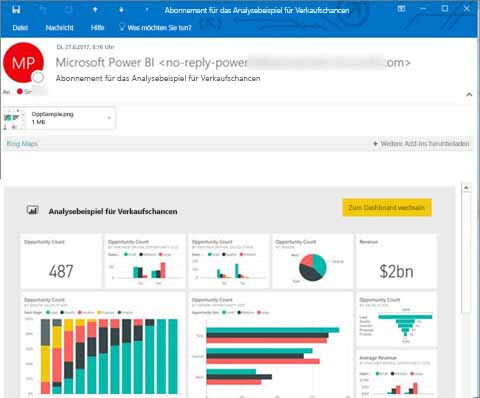
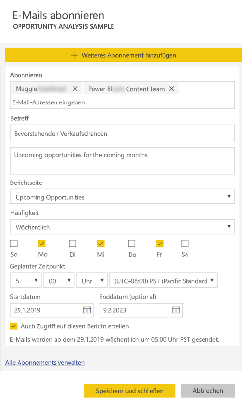
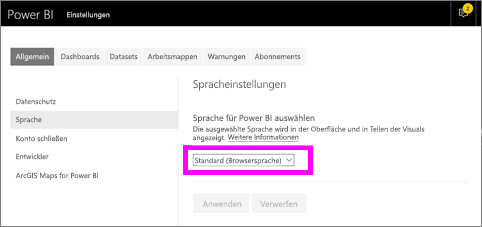
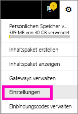

# Abonnieren eines Berichts oder Dashboards im Power BI-Dienst für sich selbst und andere

Sie können für sich selbst und Ihre Kollegen die Berichtseiten und Dashboards abonnieren, die für Sie am wichtigsten sind, und von Power BI per E-Mail eine Momentaufnahme erhalten. Sie geben an, wie oft Sie E-Mails von Power BI erhalten möchten: täglich, wöchentlich oder einmal am Tag nach der anfänglichen Datenaktualisierung.  Wenn Sie täglich oder wöchentlich auswählen, können Sie die Zeit(en) bestimmen, wann das Abonnement ausgeführt werden soll.  Insgesamt können Sie für jede Berichtseite und jedes Dashboard bis zu 24 verschiedene Abonnements pro Tag einrichten.

 

Sie können Abonnements nur im Power BI-Dienst erstellen. Sie erhalten eine E-Mail mit einer Momentaufnahme der Berichtseite oder des Dashboards und einem Link, über den Sie den Bericht oder das Dashboard öffnen können. Wenn Sie diesen Link auf mobilen Geräten auswählen, auf denen Power BI-Apps installiert sind, wird die Power BI-App gestartet und nicht der Bericht oder das Dashboard auf der Power BI-Website geöffnet.

## Anforderungen
- Das **Erstellen** eines Abonnements ist ein Feature von Power BI Pro.
- Sie müssen nicht über Berechtigungen zum Bearbeiten des Inhalts (Dashboard oder Bericht) verfügen, um ein Abonnement für sich selbst zu erstellen. Sie müssen jedoch über Berechtigungen zum Bearbeiten verfügen, um ein Abonnement für eine andere Person zu erstellen. 
- Seit Januar 2019 müssen Sie nicht länger eine Datasetaktualisierung eingerichtet haben, um ein Abonnement auszuführen.  Es wird unabhängig von planmäßigen Aktualisierungen ausgeführt, die Sie eingerichtet haben.  

## Abonnieren eines Berichts oder Dashboards
Egal, ob Sie ein Dashboard oder einen Bericht abonnieren – der Vorgang ist ähnlich. Sie können Dashboards und Berichte im Power BI-Dienst über dieselbe Schaltfläche abonnieren.
 
.

1. Öffnen Sie das Dashboard oder den Bericht.
2. Klicken Sie in der oberen Menüleiste auf **Abonnieren**, oder klicken Sie auf das Briefumschlagsymbol .
   
   

3. Mithilfe des gelben Schiebereglers können Sie das Abonnement aktivieren und deaktivieren.  Wenn Sie den Schieberegler auf **Aus** stellen, wird das Abonnement nicht gelöscht. Verwenden Sie zum Löschen des Abonnements das Papierkorbsymbol.

4. Ihre E-Mail-Adresse befindet sich bereits im Feld **Abonnieren**. Sie können dem Abonnement weitere E-Mail-Adressen hinzufügen, jedoch nur in derselben Domäne. Wenn der Bericht oder das Dashboard in einer [Premium-Kapazität](service-premium.md) gehostet wird, können Sie Abonnements für andere einzelne E-Mail-Adressen und Gruppenaliase abschließen. Wenn der Bericht oder das Dashboard nicht in einer Premium-Kapazität gehostet wird, können Sie Abonnements für andere Personen abschließen, aber diese müssen auch über eine Power BI Pro-Lizenz verfügen. Weitere Informationen finden Sie im Folgenden unter [Zu beachtende Aspekte und Problembehandlung](#considerations-and-troubleshooting). 

5. Füllen Sie **Subject** (Betreff) und **Nachricht** der E-Mail aus. 

5. Wählen Sie eine Option für **Frequency** (Häufigkeit) für Ihr Abonnement aus: **Daily** (Täglich), **Weekly** (Wöchentlich) oder **After Data Refresh (Daily)** (Nach der Datenaktualisierung (Täglich)).  Wenn Sie die E-Mail des Abonnements nur an bestimmten Tagen erhalten möchten, können Sie **Weekly** (Wöchentlich) und dann die konkreten Tage auswählen.  Wenn Sie die E-Mail des Abonnements zum Beispiel nur an Werktagen erhalten möchten, können Sie **Weekly** (Wöchentlich) auswählen und die Kontrollkästchen bei **Sat** (Sa) und **Sun** (So) deaktivieren.  

6. Wenn Sie **Daily** (Täglich) oder **Weekly** (Wöchentlich) auswählen, können Sie auch die Option **Scheduled Time** (Geplante Zeit) für das Abonnement angeben.  Sie müssen es zur vollen Stunde oder zur Minute 15, 30 oder 45 ausführen.  Wählen Sie Vormittag (AM) oder Nachmittag/Abend (PM) aus. Sie können auch die Zeitzone angeben.

7. Standardmäßig ist das Startdatum für Ihr Abonnement das Datum, an dem Sie es erstellen. Sie haben die Möglichkeit, ein Enddatum auszuwählen. Wenn Sie kein Enddatum festlegen, ist das Enddatum automatisch ein Jahr nach dem Startdatum. Sie können es zu einem beliebigen Zeitpunkt vor dem Ablauf des Abonnements in ein beliebiges Datum in der Zukunft (bis zum Jahr 9999) ändern. Wenn ein Abonnement ein Enddatum erreicht, wird es deaktiviert, bis Sie es erneut aktivieren. Vor dem geplanten Enddatum werden Sie per Benachrichtigung(en) gefragt, ob Sie das Abonnement verlängern möchten.    

    Im Screenshot unten sehen Sie, dass Sie beim Abonnieren eines Berichts eigentlich eine *Berichtseite* abonnieren.  Klicken Sie auf **Weiteres Abonnement hinzufügen**, und wählen Sie die gewünschten Seiten aus, um mehrere Seiten in einem Bericht zu abonnieren. 
      
     

7. Klicken Sie auf **Speichern und schließen**. Die Abonnenten erhalten eine E-Mail und eine Momentaufnahme des Dashboards oder der Berichtseite mit der Häufigkeit und zu der Uhrzeit, die Sie ausgewählt haben. Insgesamt können Sie bis zu 24 Abonnements pro Bericht oder Dashboard erstellen und für jedes Abonnement eigene Empfänger, Uhrzeiten und Häufigkeiten angeben.  Für alle Abonnements, für die **After Data Refresh** (Nach der Datenaktualisierung) für das Dashboard oder den Bericht festgelegt wurde, wird dennoch nur nach der ersten geplanten Aktualisierung eine E-Mail versendet.   
      
   > [!TIP]
   > Möchten Sie die E-Mail-Nachricht sofort ansehen? Lösen Sie das Senden einer E-Mail aus, indem Sie eines der mit dem Dashboard oder dem Bericht verknüpften Datasets aktualisieren. Wenn Sie nicht über Bearbeitungsberechtigungen für das Dataset verfügen, können Sie einen Benutzer mit den entsprechenden Berechtigungen bitten, es für Sie zu aktualisieren. Klicken Sie zum Anzeigen verwandter Datasets auf das Symbol **Verwandte Inhalte anzeigen** , um **Verwandte Inhalte** zu öffnen, und klicken Sie dann auf das Symbol zum Aktualisieren . 
   > 
   > 
   
   

## E-Mail-Sprachen

Für E-Mails und Momentaufnahmen wird die Sprache verwendet, die in den Power BI-Einstellungen festgelegt ist. Weitere Informationen finden Sie unter [Unterstützte Sprachen und Länder/Regionen für Power BI](supported-languages-countries-regions.md). Wenn keine Sprache definiert ist, verwendet Power BI die Sprache, die der Gebietsschemaeinstellung Ihres aktuellen Browsers entspricht. Sie können die Spracheinstellung anzeigen bzw. festlegen, indem Sie zuerst auf das Zahnradsymbol  >  **und dann auf Einstellungen > Allgemein > Sprache** klicken. 

## Verwalten Ihrer Abonnements
Nur der Ersteller eines Abonnements kann dieses auch verwalten.  Die Anzeige der Abonnementverwaltung kann auf zwei Arten aufgerufen werden.  Wählen Sie im Dialogfeld **E-Mails abonnieren** die Option **Alle Abonnements verwalten** aus (siehe Screenshots unter Schritt 4 weiter oben). Oder: Klicken Sie auf der oberen Menüleiste auf das Power BI-Zahnradsymbol  und anschließend auf **Einstellungen**.

Welche Abonnements hier angezeigt werden, hängt vom aktiven Arbeitsbereich ab.  Wenn Sie alle Ihre Abonnements für alle Arbeitsbereiche anzeigen möchten, muss **Mein Arbeitsbereich** aktiv sein. Grundlegende Informationen zu Arbeitsbereichen finden Sie unter [Arbeitsbereiche in Power BI](service-create-workspaces.md).

Ein Abonnement wird beendet, wenn die Pro-Lizenz abläuft, der Besitzer das Dashboard oder den Bericht löscht oder das zum Erstellen des Abonnements verwendete Benutzerkonto gelöscht wird.

## Zu beachtende Aspekte und Problembehandlung
* Wenn auf Kacheln Sicherheit auf Zeilenebene (Row Level Security, RLS) angewendet wurde, werden diese Kacheln bei Dashboard-E-Mail-Abonnements nicht angezeigt.  Wenn das Dataset die RLS verwendet, können Sie kein neues Abonnement für Berichts-E-Mail-Abonnements erstellen.
* Abonnements von Berichtseiten sind mit dem Namen der Berichtseite verknüpft. Wenn Sie eine Berichtseite abonnieren und dann umbenennen, müssen Sie das Abonnement erneut erstellen.
* Ihre Organisation kann möglicherweise bestimmte Einstellungen in Azure Active Directory konfigurieren, wodurch die Möglichkeit zur Verwendung von E-Mail-Abonnements in Power BI eingeschränkt werden kann.  Dies umfasst unter anderem das Vorhandensein von Einschränkungen durch mehrstufige Authentifizierung oder IP-Adressbereiche beim Zugriff auf Ressourcen.
* Aktuell werden keine E-Mail-Abonnements für Berichte/Dashboards mit Datasets mit Liveverbindung unterstützt, wenn Sie ein Abonnement für jemand anderen abschließen.
* E-Mail-Abonnements bieten keine Unterstützung für die meisten [benutzerdefinierten Visuals](power-bi-custom-visuals.md).  Die einzige Ausnahme sind benutzerdefinierte Visuals, die [zertifiziert](power-bi-custom-visuals-certified.md) wurden.  
* E-Mail-Abonnements bieten aktuell keine Unterstützung für R-gestützte benutzerdefinierte Visuals.  
* Wenn auf Kacheln des Dashboards Sicherheit auf Zeilenebene (Row Level Security, RLS) angewendet wurde, werden diese Kacheln nicht angezeigt.
* Sie können andere Benutzer nicht zu einem Bericht abonnieren, auf den die Sicherheit auf Zeilenebene angewendet wurde.
* E-Mail-Abonnements werden mit Standardzuständen für Filter und Slicer des Berichts gesendet. Alle Änderungen der Standardwerte, die Sie nach dem Abonnieren vornehmen, werden nicht in der E-Mail angezeigt.    
* Für Abonnements von Dashboards werden bestimmte Typen von Kacheln noch nicht unterstützt.  Dazu zählen Streamingkacheln, Videokacheln und benutzerdefinierte Kacheln mit Webinhalten.     
* Wenn Sie ein Dashboard für einen Kollegen außerhalb Ihres Mandanten freigeben, können Sie zusätzlich kein Abonnement für diesen Kollegen erstellen. Wenn Sie aaron@xyz.com sind, können Sie es für anyone@ABC.com freigeben, aber es kann dafür derzeit kein Abonnement für anyone@ABC.com abgeschlossen werden.      
* Aufgrund der Beschränkungen für die E-Mail-Größe können Dashboards oder Berichte mit extrem großen Bildern möglicherweise nicht abonniert werden.    
* Die Aktualisierung von Datasets, die mit Dashboards und Berichten verknüpft sind und seit mehr als zwei Monaten nicht besucht wurden, wird von Power BI automatisch ausgesetzt.  Wenn Sie jedoch einem Dashboard oder Bericht ein Abonnement hinzufügen, wird die Aktualisierung nicht ausgesetzt, auch wenn das Dashboard oder der Bericht längere Zeit nicht besucht wurde.    
* Wenn Sie die E-Mails des Abonnements nicht erhalten, vergewissern Sie sich, dass Ihr Benutzerprinzipalname (User Principal Name, UPN) E-Mails empfangen kann. [Das Power BI-Team arbeitet daran, diese Anforderung zu lockern](https://community.powerbi.com/t5/Issues/No-Mail-from-Cloud-Service/idc-p/205918#M10163) – schauen Sie also wieder vorbei. 
* Wenn Ihr Dashboard oder Bericht sich in einer Premium-Kapazität befindet, können Sie E-Mail-Aliase von Gruppen für Abonnements verwenden, statt für jeden Kollegen einzeln mit dessen E-Mail-Adresse ein Abonnement abschließen zu müssen. Die Aliase basieren auf dem aktuellen Verzeichnis der aktiven Benutzer. 

## Nächste Schritte
* Weitere Fragen? [Stellen Sie Ihre Frage in der Power BI-Community.](http://community.powerbi.com/)    
* [Blogbeitrag lesen](https://powerbi.microsoft.com/blog/introducing-dashboard-email-subscriptions-a-360-degree-view-of-your-business-in-your-inbox-every-day/)

