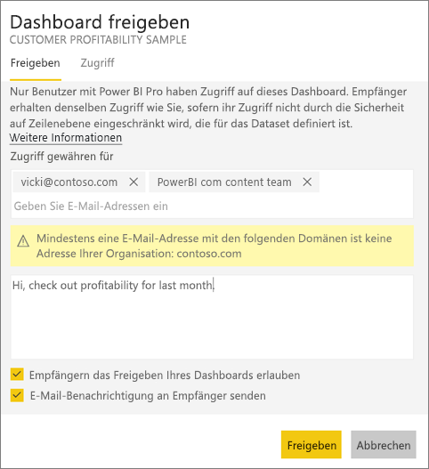
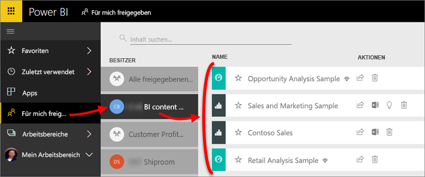
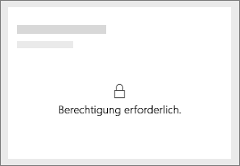

# Freigeben Ihrer Power BI-Dashboards und -Berichte für Kollegen und andere
*Freigeben* ist eine gute Möglichkeit, einigen Personen Zugriff auf Ihre Dashboards und Berichte zu gewähren. Zudem bietet Power BI [verschiedene Möglichkeiten zum gemeinsamen Bearbeiten und Verteilen von Dashboards und Berichten](service-how-to-collaborate-distribute-dashboards-reports.md).

Zum Freigeben benötigen Sie eine [Power BI Pro-Lizenz](service-free-vs-pro.md), egal, ob Sie Inhalte innerhalb oder außerhalb Ihrer Organisation freigeben. Auch Ihre Empfänger benötigen Power BI Pro-Lizenzen, oder es muss sich um Inhalte in einer [Premium-Kapazität](service-premium.md) handeln. 

Sie können Dashboards und Berichte von den meisten Stellen im Power BI-Dienst aus freigeben: Ihre „Favoriten“, „Zuletzt verwendet“, „Für mich freigegeben“ (wenn der Besitzer es erlaubt), „Mein Arbeitsbereich“ oder andere Arbeitsbereiche. Wenn Sie Dashboards oder Berichts freigeben, können diejenigen, für die Sie sie freigeben, diese anzeigen und damit interagieren, aber nicht bearbeiten. Sie sehen die gleichen Daten wie Sie im Dashboard oder Bericht, es sei denn, die [Sicherheit auf Zeilenebene (RLS)](service-admin-rls.md) ist aktiviert. Die Kollegen, für die Sie Inhalte freigeben, können diese auch für ihre Kollegen freigeben, wenn Sie dies zulassen. Die Personen außerhalb Ihrer Organisation können ebenfalls das Dashboard oder den Bericht anzeigen und damit interagieren, aber diese nicht freigeben. 

Sie können [ein Dashboard auch aus einer beliebigen mobilen Power BI-App freigeben](mobile-share-dashboard-from-the-mobile-apps.md). Sie können Dashboards über den Power BI-Dienst und die mobilen Power BI-Apps, aber nicht über Power BI Desktop freigeben.

## Video: Freigeben eines Dashboards
Sehen Sie sich an, wie Amanda ihr Dashboard für Kollegen im Unternehmen und externe Personen freigibt. Befolgen Sie dann die schrittweisen Anleitungen unter dem Video, um es selbst ausprobieren.

<iframe width="560" height="315" src="https://www.youtube.com/embed/0tUwn8DHo3s?list=PL1N57mwBHtN0JFoKSR0n-tBkUJHeMP2cP" frameborder="0" allowfullscreen></iframe>

## Freigeben eines Dashboards oder Berichts

1. Wählen Sie in einer Liste von Dashboards bzw. Berichten oder in einem geöffneten Dashboard oder Bericht **Freigeben** .

1. Geben Sie im oberen Feld die vollständigen E-Mail-Adressen für Einzelpersonen, Verteilergruppen oder Sicherheitsgruppen ein. Bei dynamischen Verteilerlisten sind Freigaben nicht möglich. 
   
   Freigaben sind auch für Personen mit Adressen außerhalb der Organisation möglich. In diesem Fall wird allerdings eine Warnung angezeigt.
   
    
 
3. Wenn Sie möchten, fügen Sie eine Nachricht hinzu. Dies ist optional.
4. Damit Ihre Kollegen Ihren Inhalt für weitere Personen freigeben können, aktivieren Sie das Kontrollkästchen **Empfängern das Freigeben Ihres Dashboards/Berichts erlauben**.
   
   Wenn Sie anderen Personen das Freigeben gestatten, wird dies als *erneutes Freigeben* bezeichnet. In diesem Fall können die anderen Personen die Inhalte über den Power BI-Dienst und die mobilen Apps erneut freigeben oder die E-Mail-Einladung an andere Personen in der Organisation weiterleiten. Nach einem Monat läuft die Einladung ab. Für Personen außerhalb Ihrer Organisation ist die erneute Freigabe nicht möglich. Als Besitzer des Inhalts können Sie die erneute Freigabe deaktivieren oder individuell widerrufen. Siehe unten [Aufheben der Freigabe oder Aufheben der Freigabe durch andere](service-share-dashboards.md#stop-sharing-or-stop-others-from-sharing).

5. Wählen Sie **Freigeben** aus.
   
     
   
   Power BI sendet an die Personen, jedoch nicht an Gruppen, eine Einladung per E-Mail, die einen Link zum freigegebenen Inhalt enthält. Die Benachrichtigung **Erfolgreich** wird angezeigt. 
   
   Wenn Empfänger in Ihrer Organisation auf den Link klicken, wird das Dashboard bzw. der Bericht in Power BI ihrer Listenseite **Für mich freigegeben** hinzugefügt. Die Empfänger können Ihren Namen auswählen, um alle von Ihnen für sie freigegebenen Inhalte anzuzeigen. 
   
   
   
   Wenn Empfänger außerhalb der Organisation auf den Link klicken, wird das Dashboard bzw. der Bericht angezeigt, jedoch nicht im üblichen Power BI-Portal. Im Abschnitt [Freigeben für Personen außerhalb Ihrer Organisation](service-share-dashboards.md#share-a-dashboard-with-people-outside-your-organization) weiter unten finden Sie eine nähere Beschreibung.

## Wer hat Zugriff auf von Ihnen freigegebene Dashboards und Berichte?
In einigen Fällen müssen Sie sehen können, für welche Personen Sie Inhalte freigegeben haben, und für welche Personen diese die Inhalte freigegeben haben.

1. Wählen Sie in der Liste der Dashboards und Berichte oder im Dashboard bzw. Bericht selbst **Freigeben**  aus. 
2. Wählen Sie im Dialogfeld **Dashboard/Bericht freigeben** die Option **Zugriff** aus.
   
    
   
    Personen außerhalb Ihrer Organisation werden als **Gast** aufgelistet.

## Aufheben der Freigabe oder Aufheben der Freigabe durch andere
Nur der Dashboard- bzw. Berichtbesitzer kann die erneute Freigabe aktivieren und deaktivieren.

### Wenn Sie die Freigabeeinladung noch nicht gesendet haben
* Deaktivieren Sie unten in der Einladung das Kontrollkästchen **Empfängern das Freigeben Ihres Dashboards/Berichts erlauben**, bevor Sie sie senden.

### Wenn Sie das Dashboard bzw. den Bericht bereits freigegeben haben
1. Wählen Sie in der Liste der Dashboards und Berichte oder im Dashboard bzw. Bericht selbst **Freigeben**  aus. 
2. Wählen Sie im Dialogfeld **Dashboard/Bericht freigeben** die Option **Zugriff** aus.
   
    
3. Klicken Sie auf die Auslassungspunkte (**...**) neben **Lesen und erneut freigeben**, und wählen Sie dann Folgendes:
   
   
   
   * **Lesen**, um Freigaben dieser Person für andere Personen zu verhindern.
   * **Zugriff entfernen**, um zu verhindern, dass diese Person den freigegebenen Inhalt anzeigen kann.

4. Legen Sie im Dialogfeld **Zugriff entfernen** fest, ob Sie auch den Zugriff auf verwandte Inhalte entfernen möchten, z.B. auf Berichte und Datasets. Wenn Sie Elemente mit einem Warnsymbol  entfernen, sollten Sie auch verwandte Inhalte entfernen, da sie nicht korrekt angezeigt werden.

## Freigeben eines Dashboards bzw. eines Berichts für Personen außerhalb Ihrer Organisation
Bei einer Freigabe für Personen außerhalb Ihrer Organisation erhalten diese eine E-Mail mit einem Link zum freigegebenen Dashboard bzw. Bericht. Sie müssen sich bei Power BI anmelden, um den Inhalt anzuzeigen. Wenn sie keine Power BI Pro-Lizenz haben, können sie sich nach Klicken auf den Link für eine Lizenz registrieren.

Nachdem sie sich angemeldet haben, sehen sie das freigegebene Dashboard bzw. den freigegebenen Bericht in einem eigenen Browserfenster ohne den linken Navigationsbereich, nicht in ihrem üblichen Power BI-Portal. Sie müssen den Link als Favoriten speichern, um künftig auf dieses Dashboard bzw. diesen Bericht zugreifen zu können.

Sie können Inhalte in diesem Dashboard oder Bericht nicht bearbeiten. Aber Sie haben die Möglichkeit, im Bericht mit den Diagrammen zu interagieren und Änderungsfilter oder Datenschnitte zu ändern, wobei sie ihre Änderungen jedoch nicht speichern können.

Nur direkte Empfänger können das freigegebene Dashboard bzw. den freigegebenen Bericht anzeigen. Wenn Sie die E-Mail beispielsweise an Vicki@contoso.com gesendet haben, wird das Dashboard nur für Vicki angezeigt. Niemand sonst kann das Dashboard sehen, selbst wenn der Link verfügbar ist, und Vicki muss dieselbe E-Mail-Adresse verwenden, um auf dieses Dashboard zuzugreifen. Wenn sie sich mit einer anderen E-Mail-Adresse anmeldet, hat sie auch keinen Zugriff auf das Dashboard.

Personen außerhalb Ihrer Organisation können überhaupt keine Daten anzeigen, wenn für lokale Analysis Services-Tabellenmodelle die Sicherheit auf Rollen- oder Zeilenebene implementiert ist.

Wenn Sie aus einer mobilen Power BI-App einen Link an Personen außerhalb Ihrer Organisation senden und diese auf den Link klicken, wird das Dashboard in einem Browser und nicht in der mobilen Power BI-App geöffnet.

## Einschränkungen und Überlegungen
Aspekte, die beim Freigeben von Dashboards und Berichten zu beachten sind:

* Im Allgemeinen sehen Sie und Ihre Kollegen die gleichen Daten im Dashboard bzw. Bericht. Wenn Sie folglich mehr Berechtigungen als Ihre Kollegen haben, Daten zu sehen, werden sie alle Daten in Ihrem Dashboard bzw. Bericht sehen können. Wenn jedoch die [Sicherheit auf Zeilenebene (RLS)](service-admin-rls.md) auf das einem Dashboard bzw. Bericht zugrunde liegende Dataset angewendet ist, wird anhand der Anmeldeinformationen jeder Person festgelegt, auf welche Daten sie zugreifen kann.
* Jede Person, für die Sie das Dashboard freigeben, kann es anzeigen und in der [Leseansicht](service-reading-view-and-editing-view.md) mit den verknüpften Berichten interagieren. Sie können keine Berichte erstellen oder Änderungen an vorhandenen Berichten speichern.
* Das Dataset kann von ihnen nicht angezeigt oder heruntergeladen werden.
* Alle Benutzer können die [Daten manuell aktualisieren](refresh-data.md).
* Wenn Sie Office 365 für E-Mails verwenden, ist die Freigabe für Mitglieder einer Verteilergruppe möglich, indem Sie die der Verteilergruppe zugeordnete E-Mail-Adresse eingeben.
* Kollegen in derselben E-Mail-Domäne wie Sie und Kollegen, die zu einer anderen Domäne gehören, aber innerhalb desselben Mandanten registriert sind, können das Dashboard für andere freigeben. Angenommen, die Domänen „contoso.com“ und „contoso2.com“ sind im selben Mandanten registriert. Wenn Sie die E-Mail-Adresse konrads@contoso.com haben, ist sowohl ravali@contoso.com als auch gustav@contoso2.com eine Freigabe erlaubt, sofern Sie ihnen die Berechtigung zum Freigeben erteilt haben.
* Wenn Ihre Kollegen bereits über den Zugriff auf ein bestimmtes Dashboard bzw. einen bestimmten Bericht verfügen, können Sie einen direkten Link senden, indem Sie einfach die URL kopieren, wenn Sie sich auf dem Dashboard bzw. im Bericht befinden. Beispiel: `https://powerbi.com/dashboards/g12466b5-a452-4e55-8634-xxxxxxxxxxxx`
* Ebenso können Sie, wenn Ihre Kollegen bereits Zugriff auf ein bestimmtes Dashboard haben, [einen direkten Link zum zugrunde liegenden Bericht senden](service-share-reports.md). 

## Behandeln von Problemen bei der Freigabe

### Die Empfänger meines Dashboards sehen ein Schlosssymbol auf einer Kachel oder die Meldung „Berechtigung erforderlich“.

Den Personen, für die Sie Inhalte freigeben, wird möglicherweise eine gesperrte Kachel in einem Dashboard oder die Meldung „Berechtigung erforderlich“ angezeigt, wenn sie einen Bericht anzeigen möchten.

In diesem Fall müssen Sie ihnen eine Berechtigung für das zugrunde liegende Dataset gewähren. Dazu gehen Sie wie folgt vor.

1. Wechseln Sie in der Liste Ihrer Inhalte zur Registerkarte **Datasets**.

1. Wählen Sie die Auslassungspunkte (**...** ) neben dem Dataset > **Berechtigungen verwalten** aus.

    

3. Wählen Sie **Benutzer hinzufügen** aus.

    

1. Geben Sie die vollständigen E-Mail-Adressen für Einzelpersonen, Verteilergruppen oder Sicherheitsgruppen ein. Bei dynamischen Verteilerlisten sind Freigaben nicht möglich.

    

5. Wählen Sie **Hinzufügen**.

### Ein Dashboard oder Bericht kann nicht freigegeben werden

Zum Freigeben eines Dashboards oder Berichts benötigen Sie die Berechtigung zum Freigeben des zugrunde liegenden Inhalts, d.h. alle zugehörigen Berichte und Datasets. Wenn eine Meldung angezeigt wird, dass die Freigabe nicht möglich ist, bitten Sie den Autor des Berichts, Ihnen für diese Berichte und Datasets die Berechtigung zum erneuten Freigeben zu gewähren.

## Nächste Schritte
* Feedback? Anregungen nehmen wir auf der [Power BI-Communitywebsite](https://community.powerbi.com/) entgegen.
* [Wie kann ich Dashboards und Berichte freigeben?](service-how-to-collaborate-distribute-dashboards-reports.md)
* [Freigeben eines gefilterten Power BI-Berichts](service-share-reports.md)
* Haben Sie Fragen? [Wenden Sie sich an die Power BI-Community](http://community.powerbi.com/).

