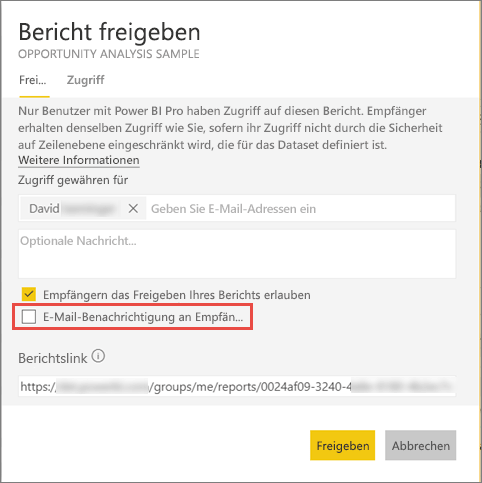

# Freigeben eines gefilterten Power BI-Berichts für Ihre Kollegen
*Freigeben* ist eine gute Möglichkeit, einigen Personen Zugriff auf Ihre Dashboards und Berichte zu gewähren. Zudem bietet Power BI [verschiedene Möglichkeiten zum gemeinsamen Bearbeiten und Verteilen Ihrer Berichte](service-how-to-collaborate-distribute-dashboards-reports.md).

Zum Freigeben benötigen Sie und die Empfänger eine [Power BI Pro-Lizenz](service-free-vs-pro.md), oder es muss sich um Inhalte in einer [Premium-Kapazität](service-premium.md) handeln. Vorschläge? Das Power BI-Team ist immer an Ihrem Feedback interessiert. Besuchen Sie daher die [Power BI-Community-Website](https://community.powerbi.com/).

Sie können einen Bericht für Kollegen in derselben E-Mail-Domäne wie Sie von den meisten Stellen im Power BI-Dienst aus freigeben: Ihre „Favoriten“, „Zuletzt verwendet“, „Für mich freigegeben“ (wenn der Besitzer es erlaubt), „Mein Arbeitsbereich“ oder andere Arbeitsbereiche. Wenn Sie einen Bericht freigeben, können diejenigen, für die Sie ihn freigeben, ihn anzeigen und damit interagieren, aber ihn nicht bearbeiten. Sie sehen die gleichen Daten wie Sie im Bericht, es sei denn, die [Sicherheit auf Zeilenebene (Row-Level Security, RLS)](service-admin-rls.md) ist aktiviert. 

## Filtern und Freigeben eines Berichts
Wie gehen Sie vor, wenn Sie eine gefilterte Version eines Berichts freigeben möchten? Dabei handelt es sich möglicherweise um einen Bericht, der nur Daten für einen bestimmten Ort, einen bestimmten Vertriebsmitarbeiter oder ein bestimmtes Jahr enthält. Sie erstellen zu diesem Zweck eine benutzerdefinierte URL.

1. Öffnen Sie den Bericht in der [Bearbeitungsansicht](service-reading-view-and-editing-view.md), wenden Sie den Filter an, und speichern Sie den Bericht.
   
   In diesem Beispiel wird das [Analysebeispiel für den Einzelhandel](sample-tutorial-connect-to-the-samples.md) so gefiltert, dass nur Werte angezeigt werden, in denen **Territory** gleich **NC** ist.
   
   
2. Fügen Sie am Ende der Berichtsseiten-URL Folgendes hinzu:
   
   ?filter=*Tabellenname*/*Feldname* eq *Wert*
   
    Das Feld muss vom Typ **string** sein, und weder der *Tabellenname* noch der *Feldname* darf Leerzeichen enthalten.
   
   In diesem Beispiel lautet der Name der Tabelle **Store**, das Feld hat den Namen **Territory**, und der Wert, nach dem gefiltert werden soll, lautet **NC**:
   
    ?filter=Store/Territory eq 'NC'
   
   
   
   Durch den Browser werden Sonderzeichen hinzugefügt, die Schrägstriche, Leerzeichen und Apostrophe darstellen, sodass die URL schließlich wie folgt lautet:
   
   app.powerbi.com/groups/me/reports/010ae9ad-a9ab-4904-a7a1-xxxxxxxxxxxx/ReportSection2?filter=Store%252FTerritory%20eq%20%27NC%27

3. [Geben Sie den Bericht frei](service-share-dashboards.md), aber deaktivieren Sie das Kontrollkästchen **E-Mail-Benachrichtigungen an Empfänger senden**. 

    

4. Senden Sie den Link mit dem zuvor erstellten Filter.

## Nächste Schritte
* Feedback? Anregungen nehmen wir auf der [Power BI-Communitywebsite](https://community.powerbi.com/) entgegen.
* [Wie kann ich Dashboards und Berichte freigeben?](service-how-to-collaborate-distribute-dashboards-reports.md)
* [Freigeben eines Dashboards](service-share-dashboards.md)
* Weitere Fragen? [Wenden Sie sich an die Power BI-Community](http://community.powerbi.com/).

