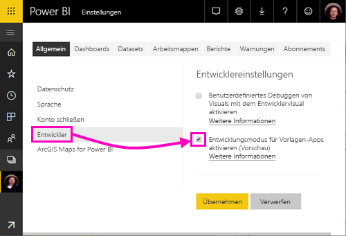
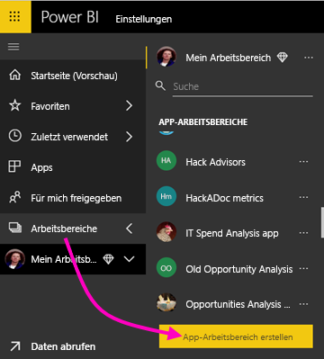
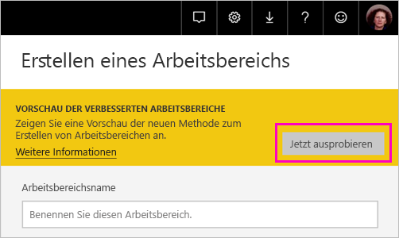
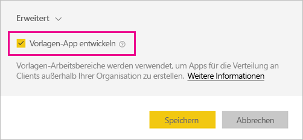
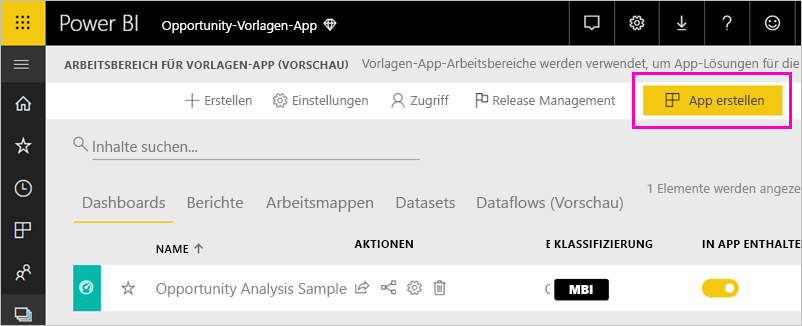
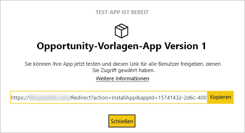
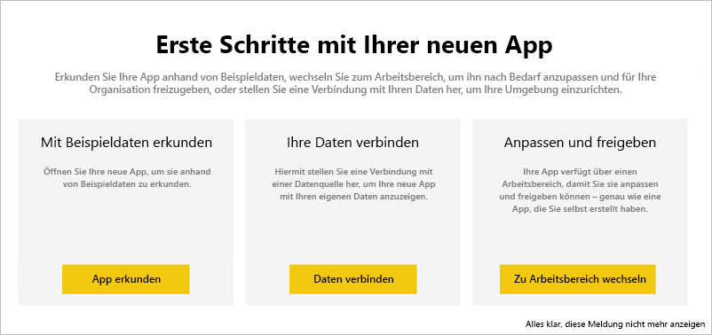
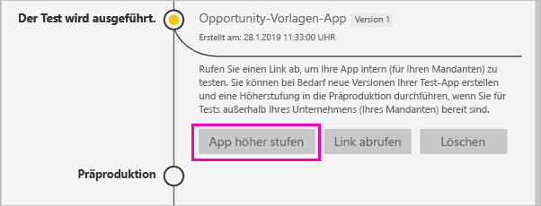
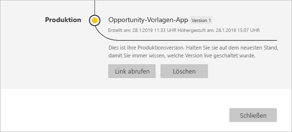
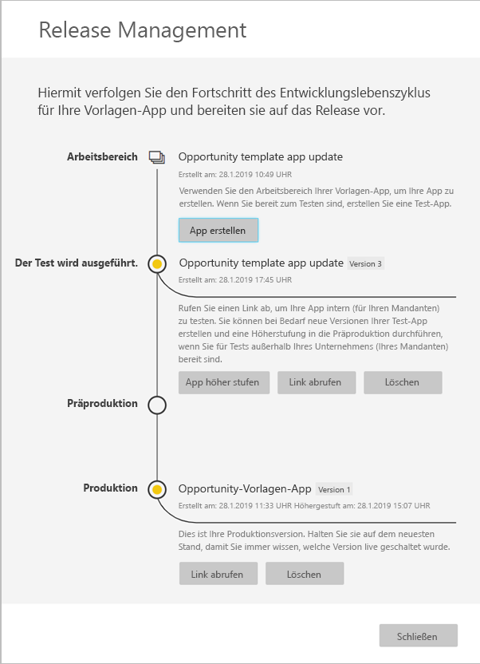

# Erstellen einer Vorlagen-App in Power BI (Vorschauversion)

Mit den neuen *Vorlagen-Apps* von Power BI können Power BI-Partner Power BI-Apps ohne oder mit nur wenig Code erstellen und für Power BI-Kunden bereitstellen.  In diesem Artikel finden Sie detaillierte Anweisungen für das Erstellen einer Power BI-Vorlagen-App.

Wenn Sie Power BI-Berichten und Dashboards erstellen können, können Sie werden eine *Vorlage Anwendungsgenerator* erstellt und verpackt analyseinhalte in eine *app*. Sie können Ihre app für andere Power BI-Mandanten über verfügbare Plattform, z.B. AppSource, oder durch die Verwendung in Ihren eigenen Webdienst bereitstellen. Als ein Generator müssen Sie die Möglichkeit zum Erstellen eines geschützten Analytics-Pakets für die Verteilung.

Administratoren für Power BI-Mandanten steuern und legen fest, wer in ihrer Organisation Vorlagen-Apps erstellen und installieren kann. Die Benutzer, die autorisiert sind, können Ihrer Vorlage-app installieren und dann ändern und an die Power BI-Benutzer in ihrer Organisation verteilen.

## Voraussetzungen

Zum Erstellen einer Vorlagen-App ist Folgendes erforderlich:  

- [Power BI Pro-Lizenz](service-self-service-signup-for-power-bi.md)
- [Installation von Power BI Desktop](desktop-get-the-desktop.md) (optional)
- Vertrautheit mit der [Grundkonzepte von Power BI](service-basic-concepts.md)
- Berechtigungen zum Erstellen einer Vorlagen-App Details finden Sie unter Power BI-[Verwaltungsportal > Vorlagen-App-Einstellungen](service-admin-portal.md#template-apps-settings-preview).

## Aktivieren des App-Entwicklermodus

Um eine Vorlagen-App zu erstellen, die Sie an andere Power BI-Mandanten verteilen können, müssen Sie sich im App-Entwicklermodus befinden. Andernfalls erstellen Sie nur eine App für Power BI-Anwender in Ihrer eigenen Organisation.

1. Öffnen Sie den Power BI-Dienst in einem Browser.
2. Navigieren Sie zu **Settings** > **General** > **Developer** > **Enable template app development mode** (Einstellungen > Allgemein > Entwickler > Entwicklermodus für Vorlagen-Apps aktivieren).

    

    Wenn diese Option nicht angezeigt wird, kontaktieren Sie Ihren Power BI-Administrator, damit er Ihnen im Verwaltungsportal [Berechtigungen für die Entwicklung von Vorlagen-Apps](service-admin-portal.md#template-apps-settings-preview) gewährt.

3. Klicken Sie auf **Übernehmen**.

## Erstellen des Arbeitsbereichs für eine Vorlagen-App

Um eine Vorlagen-App zu erstellen, die Sie an andere Power BI-Mandanten verteilen können, müssen Sie diese in einem der neuen App-Arbeitsbereiche erstellen.

1. Wählen Sie im Power BI-Dienst die Option **Arbeitsbereiche** > **App-Arbeitsbereich erstellen** aus.

    

2. Klicken Sie unter **App-Arbeitsbereich erstellen** in **Vorschau der verbesserten Arbeitsbereiche** auf **Jetzt ausprobieren**.

    

3. Geben Sie einen Namen und für Ihren App-Arbeitsbereich ein und fügen Sie optional eine Beschreibung und ein Bild des Logos hinzu.

4. Klicken Sie auf**Vorlagen-App entwickeln**.

    

5. Wählen Sie **Speichern**.
>[!NOTE]
>Sie benötigen die Berechtigungen von Ihren Power BI-Administrator, um die Vorlage apps bewerben.

## Erstellen des Inhalts in Ihrer Vorlagen-App

Wie in einem regulären Power BI-Arbeitsbereich, müssen Sie im nächsten Schritt die Inhalte im Arbeitsbereich erstellen.  In dieser Vorschauversion der Vorlagen-Apps unterstützen wir nur eine App pro Typ: ein Dataset, einen Bericht und ein Dashboard.

- [Erstellen Sie Ihren Power BI-Inhalt](power-bi-creator-landing.md) in Ihrem Arbeitsbereich.

Wenn Sie Parameter in Power Query verwenden, stellen Sie sicher, dass diese einen klar definierten Typ aufweisen (z.B. Text). Die Typen „Any“ und „Binary“ werden nicht unterstützt.

Unter [Tips for authoring template apps in Power BI (preview) (Tipps für die Erstellung von Vorlagen-Apps (Vorschauversion))](service-template-apps-tips.md) finden Sie Vorschläge, die Sie beim Erstellen von Berichten und Dashboards für Ihre Vorlagen-App beachten können.

## Erstellen der Test-Vorlagen-App

Nun, da sich Inhalt in Ihrem Arbeitsbereich befindet, können Sie diesen in einer Vorlagen-App packen. Zunächst müssen Sie eine Test-Vorlagen-App erstellen, auf die nur innerhalb Ihrer Organisation in Ihrem Mandanten zugegriffen werden kann.

1. Klicken Sie im Vorlagen-App-Arbeitsbereich auf **Create app** (App erstellen).

    

    Hier fügen Sie zusätzliche Erstellen von Optionen für Ihre Vorlage-app in fünf Kategorien:

    **Branding**

    
    - App-Name
    - Beschreibung
    - Support-Website (Link erhält unter app-Informationen nach dem Verteilen von Vorlagen-app als Organisations-app)
    - App-Logo (45 KB maximale Dateigröße, Seitenverhältnis 1:1, PNG, JPG JPEG-Format)
    - Farbdesign der App

    **Content (Inhalt)**

    **Landing Page der App:** Definieren Sie einen Bericht oder Dashboard, um die Landing Page der app werden, verwenden Sie eine Startseite, die den richtigen Eindruck zu vermitteln, werden:

    

    **Control (Steuerung)**

    Legen Sie und andere Einschränkungen, die Benutzern der Anwendung mit dem Inhalt der Anwendung hat. Sie können dieses Steuerelement verwenden, zum Schutz des geistigen Eigentums in Ihrer app.

    

    >[!NOTE]
    >Exportieren in pbix-Format ist für Benutzer installieren die app immer gesperrt.

    **Parameter**

    Verwenden Sie diese Kategorie, um Parameterverhalten beim Verbinden mit Datenquellen zu verwalten. Erfahren Sie mehr über [erstellen Abfrageparameter](https://powerbi.microsoft.com/blog/deep-dive-into-query-parameters-and-power-bi-templates/).

    
    - **Wert**: default-Parameterwert.
    - **Erforderliche**: Hiermit können Sie das Installationsprogramm einen Eingabeparameter mit einem benutzerspezifischen erfordern.
    - **Lock**: Sperren wird verhindert, dass das Installationsprogramm einen Parameter zu aktualisieren.
    - **Static**: Aktivieren Sie für den Fall, dass die app enthält *nur* Beispieldaten. Bei der Auswahl **statische**, der Installations-Assistenten nicht Fragen Sie Benutzer mit eine Datenquelle hergestellt.

    **Zugriff** In der Testphase, zu entscheiden, welchen anderen Elementen in Ihrer Organisation können installieren und Testen Sie Ihre app. Keine Sorge, Sie können immer zurückkehren und diese Einstellungen später ändern (Einstellung hat keine Auswirkungen auf die verteilte Vorlage-app auf).

2. Klicken Sie auf **Create app** (App erstellen).

    Eine Meldung wird angezeigt, dass die App bereit ist, mit einem Link, den Sie kopieren und mit Ihren App-Testern teilen können.

    

    Sie haben nun auch bereits den ersten Schritt des nun folgenden Release Management-Prozesses getan.

## Freigabe der Vorlagen-App verwalten

Bevor Sie diese Vorlagen-App öffentlich freigeben, sollten Sie sicherstellen, dass sie einsatzbereit ist. In Power BI wurde der Release Management-Bereich erstellt, in dem Sie dem vollständigen Freigabepfad der App folgen und ihn überprüfen können. Sie können dort außerdem phasenweise den Produktübergang auslösen. Die Standardphasen sind die folgenden:

- Generieren der Test-App: nur zum Testen in Ihrer Organisation.
- Testpaket höher stufen in die Präproduktionsphase: zum Testen außerhalb Ihrer Organisation.
- Paket höher stufen von der Präproduktionsphase in die Produktionsphase: Produktionsversion.
- Löschen Sie ein Paket, oder beginnen Sie neu in der vorherigen Phase.

Die URL ändern nicht, wie Sie zwischen releasephasen verschieben. Heraufstufung wirkt sich nicht auf die URL selbst aus.

Hier sind die Phasen:

1. Wählen Sie im Vorlagen-App-Arbeitsbereich **Release Management** aus.

    

2. Klicken Sie auf **Create app** (App erstellen).

    Wenn Sie die Test-App oben unter **Erstellen der Test-Vorlagen-App** erstellt haben, ist der gelbe Punkt neben **Testing** (Tests) bereits ausgefüllt, und Sie müssen die Option **Create app** (App erstellen) hier nicht auswählen. Wenn Sie diese Option auswählen, gelangen Sie zurück in den Erstellprozess der Vorlagen-App.

3. Klicken Sie auf **Get link** (Link abrufen).

    

4. Um zu testen, wie gut sich die App installieren lässt, kopieren Sie den Link aus dem Benachrichtigungsfenster und fügen Sie ihn in einem neuen Browserfenster ein.

    Folgen Sie ab hier der gleichen Prozedur wie Ihre Kunden. Unter [Installieren und Verteilen von Vorlagen-Apps in Ihrer Organisation](service-template-apps-install-distribute.md) erhalten Sie Informationen zu deren Version.

5. Klicken Sie im Dialogfeld auf **Installieren**.

    Nach der Installation wird eine Benachrichtigung angezeigt, die angibt, dass die neue App bereit ist.

6. Klicken Sie auf **Go to app** (Zu App wechseln).
7. Unter **Erste Schritte mit Ihrer neuen App** sehen Sie die App wie Ihre Kunden sie sehen werden.

    
8. Klicken Sie auf **Explore App** (App erkunden), um die Test-App mit den Beispieldaten zu überprüfen.
9. Um Änderungen vorzunehmen, wechseln Sie zurück in den ursprünglichen Arbeitsbereich der App. Aktualisieren Sie die Test-App solange, bis Sie mit dem Ergebnis ganz zufrieden sind.
10. Wenn Sie Ihre app vor der Produktion für weitere Testzwecke außerhalb Ihres Mandanten höher stufen möchten, wechseln Sie zurück, um die **Release Management** Bereich, und wählen Sie **höher stufen app**. 

    

    >[!NOTE]
    > Wenn die app heraufgestuft wird, wird es öffentlich verfügbare außerhalb Ihrer Organisation.

11. Klicken Sie auf **Promote** (Höher stufen), um Ihre Auswahl zu bestätigen.
12. Kopieren Sie diese neue URL, um sie zum Testen außerhalb Ihres Mandanten freizugeben. Dieser Link wird außerdem Sie senden, um die Verteilung Ihrer app in AppSource durch das Erstellen von beginnen eine [neues Angebot mit Cloud-Partnerportal](https://docs.microsoft.com/azure/marketplace/cloud-partner-portal/power-bi/cpp-publish-offer). Senden Sie nur vor der Produktion Links auf das Cloud Partner-Portal. Nur, nachdem die app genehmigt wird, und Sie erhalten die Benachrichtigung, dass sie in AppSource veröffentlicht wurde, können Sie dieses Paket in Power BI für die Produktion heraufstufen.
13. Wenn Ihre App bereit ist für die Produktion oder für die Freigabe über AppSource, wechseln Sie zurück in den **Release Management**-Bereich, und wählen Sie **Promote app** (App höher stufen) neben **Pre-production** (Präproduktion) aus.
14. Klicken Sie auf **Promote** (Höher stufen), um Ihre Auswahl zu bestätigen.

    Nun befindet sich Ihre App in der Produktionsphase und ist für die Verteilung bereit.

    

Um Ihre App für tausende von Power BI-Benutzern weltweit verfügbar zu machen, empfehlen wir Ihnen die Freigabe über AppSource. Weitere Informationen darüber finden Sie unter [Power BI Application offer (Angebot für Power BI-Anwendungen)](https://docs.microsoft.com/azure/marketplace/cloud-partner-portal/power-bi/cpp-power-bi-offer).

## Aktualisieren Ihrer App

Da sich Ihre App nun in der Produktionsphase befindet, können Sie in die Testphase zurückkehren, ohne den Status der App in der Produktionsphase ändern zu müssen.

1. Klicken Sie im **Release Management**-Bereich auf **Create app** (App erstellen).
2. Wechseln Sie zurück in den App-Erstellungsprozess.
3. Nachdem Sie die Kategorien **Branding**, **Content** (Inhalt), **Control** (Steuerung) und **Access** (Zugriff) eingestellt haben, klicken Sie erneut auf **Create app** (App erstellen).
4. Wählen Sie **Close** (Schließen) aus, und wechseln Sie zurück zu **Release Management**.

   Wie Sie sehen, haben Sie nun zwei Versionen: Die Version in der Produktionsphase und zusätzlich eine neue Version in der Testphase.

    

5. Wenn Sie Ihre app vor der Produktion für weitere Testzwecke außerhalb Ihres Mandanten höher stufen möchten, wechseln Sie zurück in den Release Management-Bereich, und wählen Sie **höher stufen app** neben **Tests**.
6. Der Link ist nun Live geschaltet, senden Sie ihn erneut auf das Cloud Partner-Portal mithilfe der Schritte unter [Update für Power BI-App-Angebot](https://docs.microsoft.com/azure/marketplace/cloud-partner-portal/power-bi/cpp-update-existing-offer).

>[!NOTE]
>Bewerben Sie Ihre app auf die Produktionsphase erst, nachdem Ihre app von Cloud-Partnerportal genehmigt wird und Sie veröffentlicht.

## Nächste Schritte

Sehen Sie unter [Install, customize, and distribute template apps in your organization (Installieren, anpassen und verteilen von Vorlagen-Apps in Ihrer Organisation)](service-template-apps-install-distribute.md), wie Ihre Kunden mit Ihrer Vorlagen-App interagieren.

Weitere Informationen über die Verteilung Ihrer App finden Sie unter [Power BI Application offer (Angebot für Power BI-Anwendungen)](https://docs.microsoft.com/azure/marketplace/cloud-partner-portal/power-bi/cpp-power-bi-offer).
