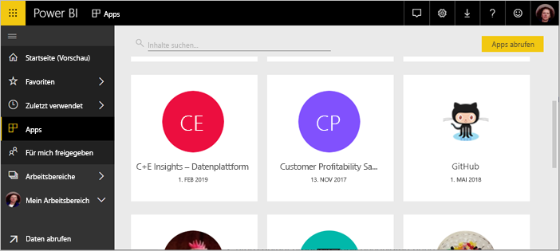
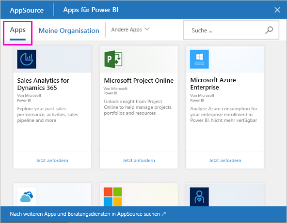
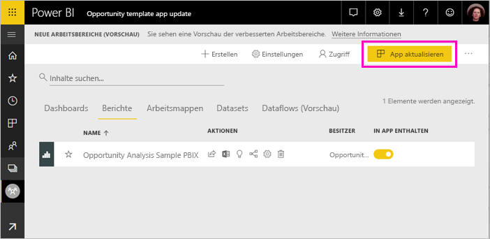
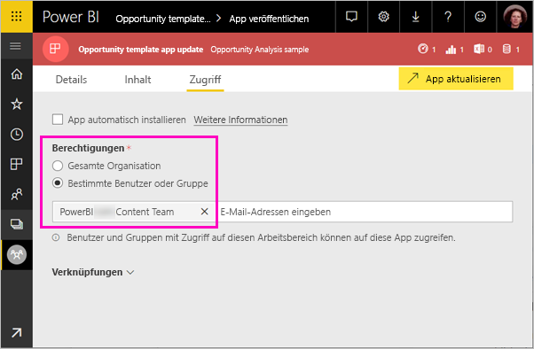

# Power BI (Vorschau): Installieren und Verteilen von Vorlagen-Apps in Ihrer Organisation

Sind Sie ein Power BI-Analyst? Wenn also in diesem Artikel wird erläutert, wie Sie installieren *Vorlage apps* für die Verbindung viele Dienste Sie verwenden, um Ihre Geschäfte, z. B. Salesforce, Microsoft Dynamics und Google Analytics. Sie können die Dashboards und Berichte für die Bedürfnisse Ihrer Organisation zu ändern und sie dann an Ihre Kollegen als Verteilen einer *app*. 

Wenn Sie daran interessiert sind, Ihre eigenen Vorlagen-Apps zu erstellen und zu verteilen, finden Sie Informationen dazu unter [Create a template app in Power BI (Erstellen einer Vorlagen-App in Power BI)](service-template-apps-create.md). Power BI-Partner können Power BI-apps mit nur wenig oder gar keinen Code erstellen und diese in Power BI-Kunden bereitstellen. 

## Voraussetzungen  

Dies sind die Anforderungen zum Installieren, Anpassen und Verteilen einer Vorlagen-App: 

- Eine [Power BI Pro-Lizenz](service-self-service-signup-for-power-bi.md)
- Vertrautheit mit den [grundlegenden Konzepten von Power BI](service-basic-concepts.md)
- Ein gültiger Installationslink vom Hersteller der Vorlagen-App oder von AppSource. 
- Berechtigungen zum Installieren von Vorlagen-Apps 

## Installieren einer Vorlagen-App

Entweder Sie erhalten einen Link zu einer Vorlagen-App oder Sie suchen in AppSource nach einer Vorlagen-App, die Sie interessiert. In beiden Fällen können Sie sie nach der Installation anpassen und in Ihrer Organisation verteilen.

### Durchsuchen von AppSource im Browser

Klicken Sie im Browser auf den folgenden Link, um AppSource mit einem Filter für Power BI-Apps zu öffnen:

- https://appsource.microsoft.com/marketplace/apps?product=power-bi

### Durchsuchen von AppSource über den Power BI-Dienst

1. Klicken Sie im linken Navigationsbereich des Power BI-Diensts auf **Apps** > **Apps abrufen**.

    

2. Klicken Sie in AppSource auf **Apps**.

    

3. Suchen Sie nach einer App, und klicken Sie dann auf **Jetzt holen**.

2. Klicken Sie im Dialogfeld auf **Installieren**.

    Wenn Sie über eine Power BI Pro-Lizenz verfügen, wird die App mit dem zugehörigen App-Arbeitsbereich installiert. Sie können die App im zugehörigen Arbeitsbereich anpassen.

    Nach der Installation wird eine Benachrichtigung angezeigt, die angibt, dass Ihre App bereit ist. 

3. Klicken Sie auf **Zu App wechseln**.
4. Wählen Sie unter **Erste Schritte mit Ihrer neuen App** eine der drei Optionen aus:

    

    - **App erkunden:** Grundlegendes Beispiel für das Durchsuchen von Daten. Beginnen Sie hiermit, um sich mit der App vertraut zu machen. 
    - **Daten verbinden:** Hiermit können Sie die Datenquelle für die Beispieldaten in Ihre eigene Datenquelle ändern. Sie können die Datasetparameter und die Anmeldeinformationen für die Datenquelle neu definieren. Weitere Informationen finden Sie im Abschnitt [Known limitations (Bekannte Einschränkungen)](service-template-apps-tips.md#known-limitations) im Artikel mit Tipps zu Vorlagen-Apps. 
    - **Zu Arbeitsbereich wechseln** (die umfangreichste Option): Sie können beliebige Änderungen vornehmen, die vom App-Ersteller erlaubt werden.

    Alternativ können Sie dieses Dialogfeld überspringen und direkt über **Arbeitsbereiche** im linken Navigationsbereich auf den zugehörigen Arbeitsbereich zugreifen.   
 
5. Bevor Sie die App für Ihre Kollegen freigeben, sollten Sie sie mit Ihren eigenen Daten verbinden. Möglicherweise sollten Sie den Bericht oder das Dashboard für Ihre Organisation anpassen. Zu diesem Zeitpunkt können Sie außerdem andere Berichte oder Dashboards hinzufügen.

## Aktualisieren und Verteilen der App

Nachdem Sie die App für Ihre Organisation aktualisiert haben, können Sie sie veröffentlichen. Die Schritte gleichen dem Veröffentlichen jeder anderen App. 

1. Wenn Sie die Anpassung abgeschlossen haben, klicken Sie in oberen rechten Ecke der Arbeitsbereichslistenansicht auf **App aktualisieren**.  

    

2. Unter **Details** können Sie die Beschreibung und Hintergrundfarbe anpassen.

   

3. Unter **Inhalt** können Sie das Dashboard oder den Bericht als Landing Page auswählen.

   

4. Unter **Zugriff** können Sie ausgewählten Benutzern oder Ihrer gesamten Organisation Zugriff erteilen.  

   

5. Klicken Sie auf **App aktualisieren**. 

6. Nachdem die App erfolgreich veröffentlicht wurde, können Sie den Link kopieren und den Personen mitteilen, denen Sie den Zugriff erteilt haben. Wenn Sie die App für sie freigegeben haben, wird sie ihnen auf der Registerkarte **Meine Organisation** in AppSource angezeigt.

## Nächste Schritte 

[Gemeinsames Erstellen von Arbeitsbereichen mit Ihren Kollegen in Power BI](service-create-workspaces.md)

 

 
