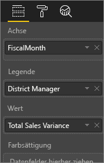
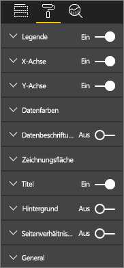
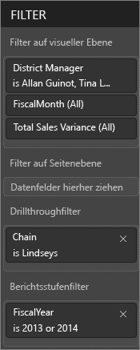

# Berichts-Editor – Verschaffen Sie sich einen Überblick
## Bearbeiten von Berichten im Power BI-Dienst und in Power BI Desktop
Der Berichts-Editor im Power BI-Dienst und der Berichts-Editor in Power BI Desktop sind sich sehr ähnlich. Im Video wird der Berichts-Editor in Power BI Desktop gezeigt, und in diesem Artikel wird der Berichts-Editor im Power BI-Dienst gezeigt. 

## Der Unterschied zwischen einem *Ersteller* und einem *Anwender* von Berichten
Die Möglichkeit zum Erstellen und Bearbeiten eines Berichts ist auf die Besitzer (d.h. *Ersteller*) eines Berichts eingeschränkt. Wenn Sie einen Bericht *verwenden*, der für Sie freigegeben wurde, können Sie den Bericht weiterhin [nur in der Leseansicht](service-reading-view-and-editing-view.md) des Power BI-Diensts öffnen und mit ihm interagieren. In diesem Fall haben Sie jedoch keinen Zugriff auf die stabilen und umfangreichen Features, die dem Berichtsersteller zur Verfügung stehen.  

Weitere Informationen zur Leseansicht eines Berichts finden Sie unter [Leseansicht und Bearbeitungsansicht für Berichte im Power BI-Dienst](service-reading-view-and-editing-view.md). 

<iframe width="560" height="315" src="https://www.youtube.com/embed/IkJda4O7oGs" frameborder="0" allowfullscreen></iframe>

Im Power BI-Dienst ist der *Berichts-Editor* nur in der [Bearbeitungsansicht](service-reading-view-and-editing-view.md) verfügbar. Wenn Sie einen Bericht in der Bearbeitungsansicht öffnen möchten, müssen Sie Besitzer oder Ersteller des Berichts sein.

Der Power BI-Berichts-Editor besteht aus drei Abschnitten:  

1. den Bereichen **Felder**, **Visualisierungen** und **Filter**
2. den oberen Navigationsleisten    
3. dem Zeichenbereich für den Bericht     

## 1. Die Bereiche des Berichts-Editors

Wenn Sie einen Bericht öffnen, sehen Sie drei Bereiche: Visualisierungen, Filter und Felder. Die Bereiche auf der linken Seite (Visualisierungen und Filter) steuern das Aussehen Ihrer Visualisierungen: Typ, Farben, Filter, Format.  Im Bereich auf der rechten Seite (Felder) werden die zugrunde liegenden Daten verwaltet, die in den Visualisierungen verwendet werden. 

Der im Berichts-Editor angezeigte Inhalt variiert je nach ausgewählten Optionen, die Sie im Berichtszeichenbereich vornehmen.  Wenn Sie z. B. ein einzelnes visuelles Element auswählen, 

|  |  |
| --- | --- |
|  |<ul><li>wird am Anfang des Bereichs „Visualisierung“ der Typ des verwendeten visuellen Elements angegeben; in diesem Beispiel ein gruppiertes Säulendiagramm.  </li> <li>werden am Ende des Bereichs „Visualisierung“ (möglicherweise müssen Sie nach unten scrollen) die vom visuellen Element verwendeten Felder angezeigt. In diesem Diagramm werden „FiscalMonth“, „DistrictManager“ und „Total Sales Variance“ verwendet.   </li><li>werden im Bereich „Filter“ (möglicherweise müssen Sie nach unten scrollen) alle Filter angezeigt, die angewendet wurden.   </li><li>werden im Bereich „Felder“ die verfügbaren Tabellen und, wenn Sie den Namen einer Tabelle erweitern, die Felder aufgelistet, die diese Tabelle bilden. An gelber Schrift können Sie erkennen, dass mindestens ein Feld aus dieser Tabelle in der Visualisierung verwendet wird.  </li><li> Klicken Sie auf das Farbrollensymbol, um den Formatierungsbereich der ausgewählten Visualisierung anzuzeigen.  </li><li> Klicken Sie auf das Lupensymbol, um den Analysebereich anzuzeigen.</ul> |

## Bereich „Visualisierungen“ (von oben nach unten)

Hier wählen Sie den Typ der Visualisierung aus. Die kleinen Bilder werden als *Vorlagen* bezeichnet. In der Abbildung oben wurde ein gestapeltes Balkendiagramm ausgewählt. Wenn Sie am Anfang keinen Visualisierungstyp auswählen, sondern eine Visualisierung durch Auswählen von Feldern erstellen, wählt Power BI den Visualisierungstyp aus. Sie können die Auswahl von Power BI übernehmen oder den Typ ändern, indem Sie eine andere Vorlage auswählen. Wechseln Sie den Visualisierungstyp beliebig oft, bis Sie den Typ gefunden haben, mit dem Ihre Daten am besten dargestellt werden.

### Steuern der im Visual verwendeten Felder

Die in diesem Bereich angezeigten Buckets (auch als *Bereiche* bezeichnet) variieren je nach Typ der ausgewählten Visualisierung.  Wenn Sie z. B. ein Balkendiagramm ausgewählt haben, werden Buckets für Folgendes angezeigt: Werte, Achse und Legende. Wenn Sie ein Feld auswählen oder in den Zeichenbereich ziehen, fügt Power BI dieses Feld zu einem der Buckets hinzu.  Sie können die Felder aus der Liste „Felder“ auch direkt in die Buckets ziehen.  Einige Buckets sind auf bestimmte Datentypen beschränkt.  **Werte** akzeptiert beispielsweise keine nicht numerischen Felder. Wenn Sie also das Feld **Mitarbeitername** in das Bucket **Werte** ziehen, ändert sich das Feld für Power BI in **Anzahl von Mitarbeitername**.

### Entfernen von Feldern
Um ein Feld aus der Visualisierung zu entfernen, klicken Sie auf das **X** rechts neben dem Feldnamen.

Weitere Informationen finden Sie unter [Hinzufügen von Visualisierungen zu einem Power BI-Bericht](power-bi-report-add-visualizations-i.md).

### Formatieren von visuellen Elementen
Wählen Sie das Farbrollen-Symbol aus, um den Formatierungsbereich anzuzeigen. Die verfügbare Option hängt vom ausgewählten Visualisierungstyp ab.

Ihnen stehen nahezu unbegrenzt viele Formatierungsmöglichkeiten zur Verfügung.  Wenn Sie mehr Informationen benötigen, untersuchen Sie den Bereich selbst weiter oder lesen Sie die folgenden Artikel:

* [Anpassen von Visualisierungstitel, Hintergrund und Legende](power-bi-visualization-customize-title-background-and-legend.md)
* [Farbformatierung](service-getting-started-with-color-formatting-and-axis-properties.md)
* [Anpassen der Eigenschaften der X- und Y-Achse](power-bi-visualization-customize-x-axis-and-y-axis.md)

### Hinzufügen von Analysen in Visualisierungen
Wählen Sie das Lupensymbol aus, um den Analysebereich anzuzeigen. Die verfügbare Option hängt vom ausgewählten Visualisierungstyp ab.

    
Mit dem Bereich „Analyse“ im Power BI-Dienst können Sie Visualisierungen dynamische Bezugslinien hinzufügen und wichtige Trends und Erkenntnisse identifizieren. Weitere Informationen finden Sie unter [Analysebereich im Power BI-Dienst](service-analytics-pane.md) oder [Analysebereich in Power BI Desktop](desktop-analytics-pane.md).

- - -
## Bereich „Filter“
Über den Bereich „Filter“ können Sie persistente Filter für Ihre Berichte auf Seiten-, Berichts-, Drillthrough- und visueller Ebene anzeigen, setzen und ändern. Ja, Sie können eine Ad-hoc-Filterung auf Berichtsseiten und in visuellen Elementen durchführen. Hierzu wählen Sie visuelle Elemente aus oder verwenden Werkzeuge wie „Datenschnitt“, aber wenn Sie den Filterbereich verwenden, wird der Zustand der Filter mit dem Bericht gespeichert. 

Der Bereich „Filter“ verfügt über ein weiteres leistungsstarkes Feature: das Filtern mithilfe eines Felds, ***das nicht bereits in einem der visuellen Elemente in Ihrem Bericht verwendet wird***. Mit anderen Worten: Bei der Erstellung einer Berichtsseite fügt Power BI automatisch alle Felder hinzu, die Sie in Ihren Visualisierungen für den Filterbereich der visuellen Ebene im Bereich „Filter“ verwenden.  Möglicherweise möchten Sie einen Filter für ein visuelles Element, eine Seite, einen Drillthrough oder einen Bericht mithilfe eines Felds festlegen. Wenn der betreffende Inhalt derzeit nicht in einer Visualisierung verwendet wird, ziehen Sie ihn einfach auf einen der Filterbuckets.   

Weitere Informationen finden Sie unter [Hinzufügen von Filtern zu Berichten](power-bi-report-add-filter.md).

- - -
## Bereich „Felder“
Im Bereich „Felder“ werden die Tabellen und Felder angezeigt, die in den Daten vorhanden sind und zum Erstellen von Visualisierungen verwendet werden können.

|  |  |
| --- | --- |
|  |<ul><li>Ziehen Sie ein Feld auf die Seite, um eine neue Visualisierung zu starten.  Sie können auch ein Feld auf eine vorhandene Visualisierung ziehen, um das Feld zu dieser Visualisierung hinzuzufügen.  </li> <li>Wenn Sie das Kontrollkästchen neben einem Feld aktivieren, fügt Power BI dieses Feld zur aktiven (oder neuen) Visualisierung hinzu. Außerdem legt Power BI fest, in welchem Bucket dieses Feld platziert werden soll.  Soll das Feld beispielsweise als Legende, Achse oder Wert verwendet werden? Power BI trifft eine bestmögliche Annahme, und Sie können das Feld ggf. aus diesem Bucket in einen anderen verschieben.   </li><li>In beiden Fällen wird das jeweils ausgewählte Feld im Berichts-Editor zum Bereich „Visualisierungen“ hinzugefügt.</li></ul> |

**HINWEIS:** Wenn Sie Power BI Desktop verwenden, finden Sie auch Optionen zum Ein- und Ausblenden von Feldern, Hinzufügen von Berechnungen usw.

### Bedeutung der Feldsymbole
* **∑ Aggregate** Ein Aggregat ist ein numerischer Wert, mit dem z.B. eine Summe oder ein Mittelwert gebildet wird. Aggregate werden mit den Daten importiert (definiert im Datenmodell, auf dem der Bericht basiert).
  Weitere Informationen finden Sie unter [Aggregate in Power BI-Berichten](service-aggregates.md).
*  **Berechnete Measures (auch berechnete Felder genannt)**  
   Jedes berechnete Feld verfügt über eine eigene hartcodierte Formel. Die Berechnung kann nicht geändert werden, d. h. eine Summe bleibt eine Summe. Weitere Informationen finden Sie unter [Grundlegendes zu Measures](desktop-measures.md).
*  **Eindeutige Felder**  
   Felder mit diesem Symbol wurden aus Excel importiert und sind so eingestellt, dass sie alle Werte anzeigen, auch wenn sie Duplikate aufweisen. Ihre Daten können z. B. zwei Datensätze für Personen namens „Johan Hofman“ enthalten, die jeweils eindeutig behandelt werden, d. h. es wird keine Summe gebildet.  
* ** Geografische Felder**  
   Mithilfe der Felder für Ortsangaben können Kartenvisualisierungen erstellt werden. 
* ** Hierarchie**  
   Wählen Sie den Pfeil aus, um die Felder anzuzeigen, die die Hierarchie bilden. 

- - -
## 2. Die obere Navigationsleiste
Die in der oberen Navigationsleiste verfügbaren Aktionen sind zahlreich, und es werden kontinuierlich neue Aktionen hinzugefügt. Informationen zu einer bestimmten Aktion finden Sie im Inhaltsverzeichnis oder im Suchfeld der Power BI-Dokumentation.

## 3. Der Zeichenbereich des Berichts
Im Zeichenbereich des Berichts wird Ihre Arbeit angezeigt. Wenn Sie in den Bereichen „Felder“, „Filter“ und „Visualisierungen“ Visuals erstellen, werden diese im Zeichenbereich des Berichts erstellt und angezeigt. Jede Registerkarte am unteren Rand des Zeichenbereichs entspricht einer Seite im Bericht. Wählen Sie eine Registerkarte aus, um die entsprechende Seite zu öffnen. 

## Nächste Schritte:
[Erstellen eines Berichts](service-report-create-new.md)

Lesen Sie mehr zu Berichten im [Power BI-Dienst](service-reports.md), in [Power BI Desktop](desktop-report-view.md) und [Power BI Mobile](mobile-apps-view-phone-report.md).

[Power BI – Grundkonzepte](service-basic-concepts.md)

Weitere Fragen? [Wenden Sie sich an die Power BI-Community](http://community.powerbi.com/)

