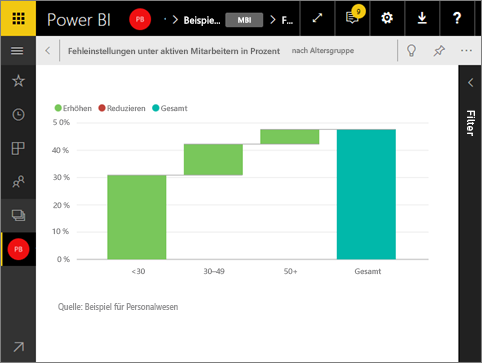

# Anzeigen einer Dashboardkachel im Vollbildmodus
Kacheln müssen in den [Fokusmodus](service-focus-mode.md) versetzt werden, bevor sie im Vollbildmodus angezeigt werden können.

## Was ist der Vollbildmodus?
Zeigen Sie Ihre [Dashboards, Berichte](service-fullscreen-mode.md) und Kacheln ohne störende Menüs und Navigationsschaltflächen an.  Sie erhalten eine aufgeräumte vollständige Ansicht Ihres Unternehmens auf einen Blick – zu jeder Zeit. Dies wird gelegentlich auch als TV-Modus bezeichnet.

Einige Verwendungsmöglichkeiten des Vollbildmodus:

* Präsentieren von Kacheln in einer Besprechung oder Konferenz
* Anzeigen der Kacheln in einem Büro auf einem dedizierten großen Bildschirm oder Projektor
* Betrachten der Kachel auf einem kleinen Bildschirm
* Überprüfen Ihrer Kachel im gesperrten Modus – Sie können den Bildschirm berühren oder mit dem Mauszeiger auf die Kachel zeigen, ohne den zugrunde liegenden Bericht zu öffnen.

## So aktivieren (bzw. deaktivieren) Sie den Vollbildmodus
1. [Klappen Sie die Kachel auf, und zeigen Sie sie im Fokusmodus an](service-focus-mode.md).
   
    
   
    Die Kachel füllt den Zeichenbereich aus, sodass Sie mehr Details sehen. Sie können im Fokusmodus für eine Dashboardkachel die Filter anzeigen und ändern, die beim Erstellen dieser Kachelvisualisierung angewendet wurden.
   
    
2. Wählen Sie in der oberen Menüleiste dieses Symbol  aus, um die Kachel im Vollbildmodus anzuzeigen.
3. Im Vollbildmodus füllt die Kachel den gesamten Bildschirm aus und wird ohne störende Menüs und Navigationssymbole angezeigt.  Sie erhalten eine aufgeräumte vollständige Ansicht Ihrer Kachel auf einen Blick – zu jeder Zeit. Dies wird gelegentlich auch als TV-Modus bezeichnet.
   
   
4. Wenn Sie die Maus bewegen, wird ein Menü angezeigt. Das Menü wird in der rechten unteren Ecke angezeigt, bis Sie den Vollbildmodus beenden. Wenn es nicht mehr angezeigt wird, bewegen Sie einfach den Cursor, oder tippen Sie auf den Bildschirm.
   
    
   
   * Kehren Sie mit der Schaltfläche **Zurück** zur vorherigen Seite in Ihrem Browser zurück. Wenn die vorherige Seite eine Power BI-Dienstseite war, wird sie im Vollbildmodus angezeigt.  Der Vollbildmodus bleibt bestehen, bis Sie ihn beenden.
   * Klicken Sie zum Drucken einer Kachel aus dem Vollbildmodus auf das Symbol „Drucken“.
     
   * Um den Vollbildmodus zu beenden, klicken Sie auf das Symbol **Ganzer Bildschirm schließen**.

## Nächste Schritte
[Dashboards in Power BI](service-dashboards.md)

[Vollbildmodus für Dashboards und Berichte](service-fullscreen-mode.md)

[Fokusmodus in Power BI](service-focus-mode.md)

Weitere Fragen? [Wenden Sie sich an die Power BI-Community](http://community.powerbi.com/)

