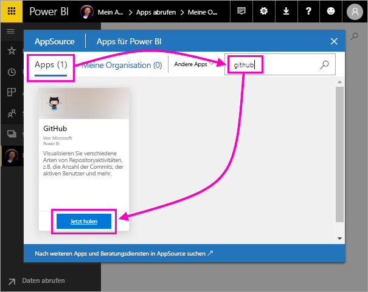
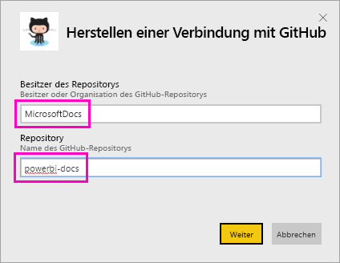
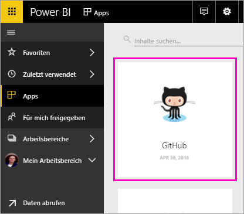
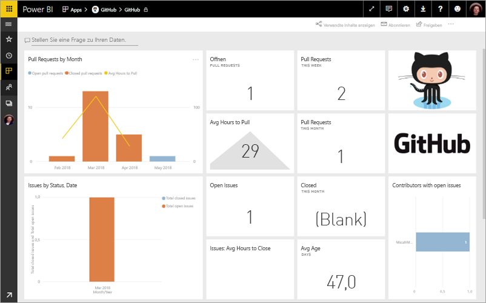
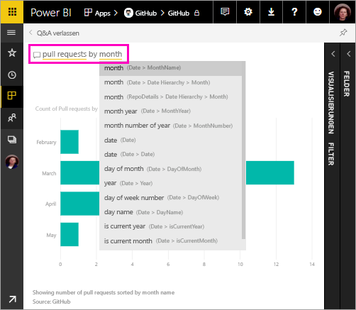
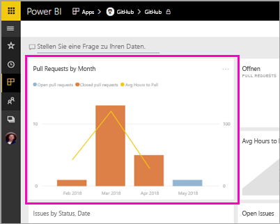
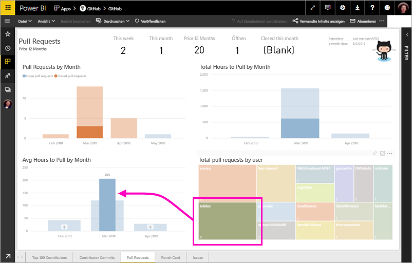

# Tutorial: Herstellen einer Verbindung zu einem GitHub-Beispiel mit Power BI
In diesem Tutorial stellen Sie mit Power BI eine Verbindung mit realen Daten im GitHub-Dienst her. Anschließend erstellt Power BI automatisch Dashboards und Berichte. Sie verbinden sich mit dem öffentlichen *Repository* mit Power BI-Inhalten und sehen dort Informationen, wie z.B. die Anzahl der Mitwirkenden an öffentlichen Power BI-Inhalten. Sie erfahren, wer sich am aktivsten beteiligt und am welchen Tag der Woche es die meisten Beiträge gab. Außerdem finden Sie Antworten auf weitere Fragen. 

In diesem Tutorial führen Sie die folgenden Schritte aus:

> [!div class="checklist"]
> * Registrieren für ein GitHub-Konto, falls Sie noch keines haben 
> * Anmelden bei Ihrem Power BI-Konto oder sich dafür registrieren, falls Sie noch keines haben
> * Öffnen des Power BI-Diensts
> * Navigieren zur GitHub-App
> * Eingeben der Informationen für das öffentliche GitHub-Repository von Power BI
> * Anzeigen des Dashboards und Berichts mit GitHub-Daten
> * Bereinigen von Ressourcen durch Löschen der App

Wenn Sie noch nicht bei Power BI registriert sind, müssen Sie sich zuerst für eine [kostenlose Testversion registrieren](https://app.powerbi.com/signupredirect?pbi_source=web).

## Voraussetzungen

Für dieses Tutorial benötigen Sie ein GitHub-Konto, falls Sie noch keines haben. 

- Registrieren für ein [GitHub-Konto](https://docs.microsoft.com/contribute/get-started-setup-github)

## Herstellen der Verbindung
1. Melden Sie sich beim Power BI-Dienst (http://powerbi.com)) an. 
2. Wählen Sie im linken Navigationsbereich **Apps** und dann **Apps abrufen** aus.
   
    

3. Wählen Sie **Apps** aus, geben Sie **github** in das Suchfeld ein, und klicken Sie dann auf **Jetzt anfordern**.
   
    

4. Geben Sie den Namen und Besitzer des Repositorys ein. Die URL für dieses Repository ist https://github.com/MicrosoftDocs/powerbi-docs, sodass **MicrosoftDocs** der **Besitzer des Repositorys** und **Powerbi-Docs** das **Repository** ist. 
   
    

5. Geben Sie die GitHub-Anmeldeinformationen ein, die Sie erstellt haben. Power BI überspringt diesen Schritt möglicherweise, wenn Sie bereits in Ihrem Browser bei GitHub angemeldet sind. 

6. Wählen Sie als **Authentifizierungsmethode** die Option **oAuth2** \> **Anmelden** aus.

7. Befolgen Sie die Anweisungen auf den Bildschirmen der Github-Authentifizierung. Erteilen Sie den GitHub-Daten die Berechtigung für Power BI.
   
   Jetzt kann Power BI eine Verbindung mit GitHub und den Daten herstellen.  Die Daten werden einmal täglich aktualisiert.

8. Nachdem Power BI die Daten importiert hat, sehen Sie die neue GitHub-Kachel. 
 
    

8. Klicken Sie auf das Symbol für die globale Navigation, um den linken Navigationsbereich zu minimieren, damit Sie mehr Platz haben.

    

10. Wählen Sie die GitHub-Kachel aus Schritt 8 aus. 
    
    Das GitHub-Dashboard wird geöffnet. Dies sind Livedaten, weshalb die angezeigten Werte ggf. anders sind.

    

    

## Frage stellen

11. Platzieren Sie den Cursor in **Stellen Sie eine Frage zu Ihren Daten**, und wählen Sie dann **Pull Requests** aus. 

    

12. Geben Sie **by month** ein.
 
    

     Power BI erstellt ein Balkendiagramm, das die Anzahl der Pull Requests pro Monat zeigt.

13. Klicken Sie auf **Q&A verlassen**.

## Anzeigen des GitHub-Berichts 

1. Wählen Sie im GitHub-Dashboard die Kombination aus Spalten- und Liniendiagramm **Pull Requests by month** aus, um den zugehörigen Bericht zu öffnen.

    

2. Wählen Sie im Diagramm **Total pull requests by user** einen Benutzernamen aus. Sie sehen in diesem Beispiel, dass die durchschnittliche Anzahl der Stunden höher ist als der Gesamtdurchschnitt für März.

    

3. Wählen Sie die Registerkarte **Punktekarte** aus, um die nächste Seite im Bericht anzuzeigen. 
 
    

    Anscheinend ist dienstags 15:00 Uhr der häufigste Zeitpunkt für *Commits*, wenn Mitarbeiter ihre Arbeit einchecken.

## Bereinigen von Ressourcen

Nachdem Sie das Tutorial abgeschlossen haben, können Sie die GitHub-App löschen. 

1. Wählen Sie auf der linken Navigationsleiste **Apps** aus.
2. Zeigen Sie auf die GitHub-Kachel, und klicken Sie auf das Symbol **Löschen**.

    

## Nächste Schritte

In diesem Tutorial haben Sie eine Verbindung mit einem öffentlichen GitHub-Repository hergestellt und Daten abgerufen, die Power BI in einem Dashboard und einem Bericht formatiert hat. Sie haben einige Fragen zu den Daten beantwortet, indem Sie das Dashboard und den Bericht untersucht haben. Jetzt können Sie mehr über das Herstellen einer Verbindung mit anderen Diensten wie Salesforce, Microsoft Dynamics und Google Analytics erfahren. 
 
> [!div class="nextstepaction"]
> [Herstellen einer Verbindung mit von Ihnen verwendeten Onlinediensten](./service-connect-to-services.md)

