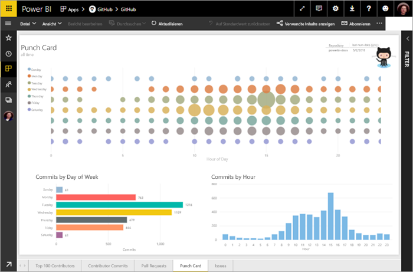
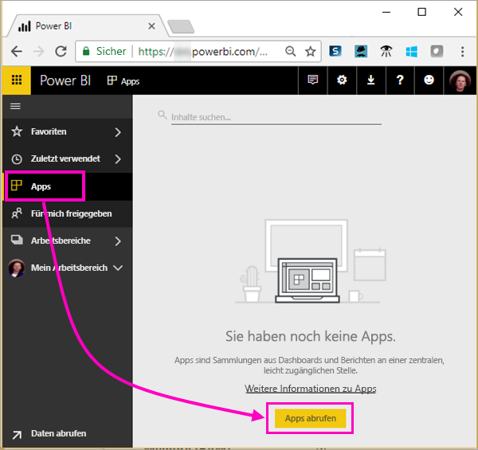
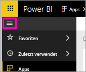
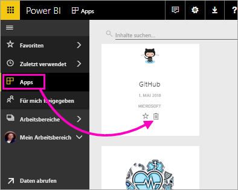

# Tutorial: Verbinden Sie mit einem GitHub-Repository mit Power BI
In diesem Tutorial stellen Sie mit Power BI eine Verbindung mit realen Daten im GitHub-Dienst her. Anschließend erstellt Power BI automatisch Dashboards und Berichte. Sie eine Verbindung mit dem öffentlichen Repository mit Power BI Content (auch bekannt als eine *Repository*) und finden Sie Antworten auf Fragen wie: die Anzahl der Mitwirkenden an öffentlichen Power BI-Inhalten. Sie erfahren, wer sich am aktivsten beteiligt und am welchen Tag der Woche es die meisten Beiträge gab. Und weitere Fragen. 

In diesem Tutorial führen Sie die folgenden Schritte aus:

> [!div class="checklist"]
> * Registrieren für ein GitHub-Konto, falls Sie noch keines haben 
> * Anmelden bei Ihrem Power BI-Konto oder sich dafür registrieren, falls Sie noch keines haben
> * Öffnen des Power BI-Diensts
> * Navigieren zur GitHub-App
> * Eingeben der Informationen für das öffentliche GitHub-Repository von Power BI
> * Anzeigen des Dashboards und Berichts mit GitHub-Daten
> * Bereinigen von Ressourcen durch Löschen der App

Wenn Sie noch nicht bei Power BI registriert sind, müssen Sie sich zuerst für eine [kostenlose Testversion registrieren](https://app.powerbi.com/signupredirect?pbi_source=web).

## Voraussetzungen

Für dieses Tutorial benötigen Sie ein GitHub-Konto, falls Sie noch keines haben. 

- Melden Sie sich für eine [GitHub-Konto](https://docs.microsoft.com/contribute/get-started-setup-github).

## Herstellen der Verbindung
1. Melden Sie sich beim Power BI-Dienst (https://app.powerbi.com)) an. 
2. Wählen Sie im linken Navigationsbereich **Apps** und dann **Apps abrufen** aus.
   
    

3. Wählen Sie **Apps**, Typ **GitHub** in das Suchfeld > **jetzt**.
   
    

4. In **dieses Power BI-App installieren?** wählen **installieren**.
5. In **Ihre neue app ist startbereit**Option **wechseln Sie zur app**.
6. In **beginnen Sie mit der neuen app**Option **Verbindungsdaten**.

    

7. Geben Sie den Namen und Besitzer des Repositorys ein. Die URL für dieses Repository ist https://github.com/MicrosoftDocs/powerbi-docs, sodass **MicrosoftDocs** der **Besitzer des Repositorys** und **Powerbi-Docs** das **Repository** ist. 
   
    

5. Geben Sie die GitHub-Anmeldeinformationen ein, die Sie erstellt haben. Power BI überspringt diesen Schritt möglicherweise, wenn Sie bereits in Ihrem Browser bei GitHub angemeldet sind. 

6. Für **Authentifizierungsmethode**, behalten Sie **oAuth2** ausgewählten \> **Anmeldung**.

7. Führen Sie den Bildschirmen der GitHub-Authentifizierung. Erteilen Sie den GitHub-Daten die Berechtigung für Power BI.
   
   Jetzt kann Power BI eine Verbindung mit GitHub und den Daten herstellen.  Die Daten werden einmal täglich aktualisiert.

8. Nachdem Power BI die Daten importiert wurden, sehen Sie den Inhalt des neuen GitHub-Arbeitsbereichs. 
9. Wählen Sie in der linken Navigationsleiste auf den Pfeil neben der Name des Arbeitsbereichs. Sie sehen, dass der Arbeitsbereich ein Dashboard und einen Bericht enthält. 

    

10. Wählen Sie die Auslassungspunkte (...) neben dem Dashboardnamen > **umbenennen** > Typ **GitHub-Dashboard**.
 
     

8. Klicken Sie auf das Symbol für die globale Navigation, um den linken Navigationsbereich zu minimieren, damit Sie mehr Platz haben.

    

10. Wählen Sie Ihre GitHub-Dashboard.
    
    Das GitHub-Dashboard enthält live-Daten, damit die Werte, die Sie sehen möglicherweise abweicht.

    

    

## Frage stellen

1. Positionieren Sie den Cursor in **stellen Sie eine Frage zu Ihren Daten**. Power BI bietet **Fragen zu den ersten Schritten**. 

1. Wählen Sie **wie viele Benutzer stehen**.
 
    

13. In der Zwischenzeit **wie viele** und **Benutzer gibt es**, Typ **-pull Requests pro**. 

     Powerbi erstellt ein Balkendiagramm mit die Anzahl von Pull Requests pro Person.

    

13. Wählen Sie das anheftsymbol, klicken Sie dann auf Ihrem Dashboard anheften **Q & A verlassen**.

## Anzeigen des GitHub-Berichts 

1. Wählen Sie im GitHub-Dashboard das Säulendiagramm **Pull Requests nach Monat** zu den zugehörigen Bericht zu öffnen.

    

2. Wählen Sie einen Benutzernamen in der **Pull Requests insgesamt durch Benutzer** Diagramm. In diesem Beispiel sehen wir, dass die meisten ihrer Stunden im Februar wurden.

    

3. Wählen Sie die Registerkarte **Punktekarte** aus, um die nächste Seite im Bericht anzuzeigen. 
 
    

    Dienstag um 3 Uhr offensichtlich ist, die gemeinsame Zeit und den Wochentag für *führt einen Commit für*, wenn Benutzer ihre Arbeit einzuchecken.

## Bereinigen von Ressourcen

Nachdem Sie das Tutorial abgeschlossen haben, können Sie die GitHub-App löschen. 

1. Wählen Sie auf der linken Navigationsleiste **Apps** aus.
2. Zeigen Sie auf die GitHub-Kachel, und klicken Sie auf das Symbol **Löschen**.

    

## Nächste Schritte

In diesem Tutorial haben Sie eine Verbindung mit einem öffentlichen GitHub-Repository hergestellt und Daten abgerufen, die Power BI in einem Dashboard und einem Bericht formatiert hat. Sie haben einige Fragen zu den Daten beantwortet, indem Sie das Dashboard und den Bericht untersucht haben. Jetzt können Sie mehr über das Herstellen einer Verbindung mit anderen Diensten wie Salesforce, Microsoft Dynamics und Google Analytics erfahren. 
 
> [!div class="nextstepaction"]
> [Herstellen einer Verbindung mit von Ihnen verwendeten Onlinediensten](service-connect-to-services.md)

