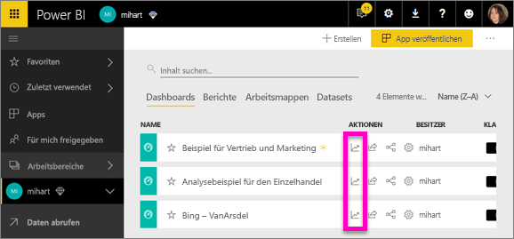
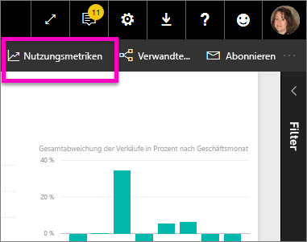
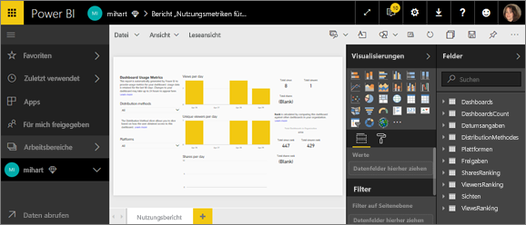
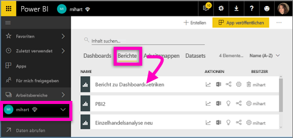
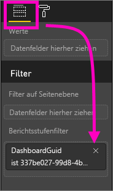
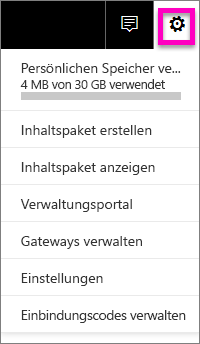
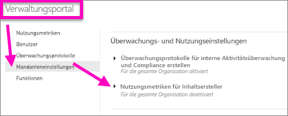
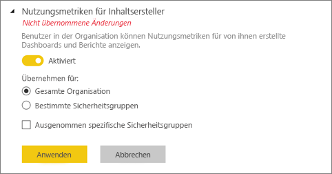

# Nutzungsmetriken für Dashboards und Berichte
Wenn Sie Dashboards und Berichte erstellen, können Sie mit Nutzungsmetriken nachvollziehen, wie diese sich auswirken. Wenn Sie entweder das Dashboard zu Nutzungsmetriken oder die Berichte zu Nutzungsmetriken ausführen, können Sie ermitteln, wie die Dashboards und Berichte in der gesamten Organisation verwendet werden. Was wurde von wem und zu welchem Zweck verwendet?  

> [!NOTE]
> Nutzungsmetriken verfolgen die Verwendung von Berichten nach, die in SharePoint Online eingebettet sind. Sie verfolgen auch das Einbetten von Dashboards und Berichten über die Workflows „Benutzer besitzt Anmeldeinformationen“ und „App besitzt Anmeldeinformationen“ nach. Nutzungsmetriken verfolgen nicht die Verwendung von Berichten nach, die über [Im Web veröffentlichen](service-publish-to-web.md) eingebettet wurden.

Diese Berichte zu Nutzungsmetriken sind schreibgeschützt. Sie können allerdings einen Bericht zu Nutzungsmetriken personalisieren, mithilfe von "Speichern unter". Dadurch wird ein völlig neues Dataset erstellt und der schreibgeschützte Bericht wird zu einem vollständigen Power BI-Bericht konvertiert, den Sie bearbeiten können. Der personalisierte Bericht enthält nicht nur Metriken für das ausgewählte Dashboard oder den ausgewählten Bericht, sondern Sie erhalten auch durch das Entfernen des Standardfilters Zugriff auf die Nutzungsmetriken für alle Dashboards oder alle Berichte im ausgewählten Arbeitsbereich.

## Weshalb sind Nutzungsmetriken wichtig für mich?
Wenn Sie wissen, wie Ihre Inhalte verwendet werden, können Sie die Relevanz veranschaulichen und Prioritäten setzen. Die Nutzungsmetriken können z.B. zeigen, dass einer Ihrer Berichte täglich durch eine Vielzahl von Mitarbeitern in der Organisation verwendet wird oder dass ein von Ihnen erstelltes Dashboard überhaupt nicht angezeigt wird. Diese Art von Feedback ist für Ihre Arbeit von großem Wert.

Die Ausführung von Berichten zu Nutzungsmetriken ist nur im Power BI-Dienst verfügbar.  Wenn Sie jedoch einen Bericht zu Nutzungsmetriken speichern oder diesen an ein Dashboard anheften, können Sie diesen Bericht auf mobilen Geräten öffnen und damit interagieren.

### Voraussetzungen
- Das Feature „Nutzungsmetriken“ erfasst Informationen zu allen Benutzern (Free und Pro). Allerdings ist eine Pro-Lizenz erforderlich, um auf die Nutzungsmetrikdaten zuzugreifen.
- Nutzungsmetriken sind in Dashboards oder Berichten im ausgewählten Arbeitsbereich bereitgestellt. Um Zugriff auf die Nutzungsmetriken für ein bestimmtes Dashboard oder einen bestimmten Bericht zu erhalten, benötigen Sie Folgendes:    
    • Bearbeitungszugriff auf das Dashboard oder den Bericht   
    • Eine Pro-Lizenz

## Informationen zum Bericht „Nutzungsmetriken“

Wenn Sie auf **Nutzungsmetriken** oder das Symbol  klicken, generiert Power BI einen vorgefertigten Bericht mit Nutzungsmetriken für den jeweiligen Inhalt für die letzten 90 Tage.  Der Bericht ähnelt den Power BI-Berichten, mit denen Sie bereits vertraut sind. Er dient jedoch nur zu Informationszwecken und ist nicht interaktiv. Basierend darauf, wie Ihre Endbenutzer Zugriff erhalten haben, können Sie unterteilen, egal ob Sie über das Web oder die mobile App usw. zugegriffen haben. So wie sich Ihre Dashboards und Berichte entwickeln, wird sich auch der Bericht zu Nutzungsmetriken entwickeln, der jeden Tag mit neuen Daten aktualisiert wird.  

Der Bericht zu Nutzungsmetriken wird nicht unter **Zuletzt verwendet**, **Arbeitsbereiche**, **Favoriten** oder in anderen Inhaltslisten angezeigt. Sie können nicht zu Apps hinzugefügt werden. Wenn Sie eine Kachel aus dem Bericht zu Nutzungsmetriken an ein Dashboard anheften, kann das Dashboard nicht zu einer App oder einem Inhaltspaket hinzugefügt werden.

Um in den Berichtsdaten bis ganz nach unten vorzudringen oder um Ihre eigenen Berichte aus dem Dataset zu erstellen, klicken Sie auf **Speichern unter** (weitere Informationen finden Sie unter [Save the Usage Metrics report as a full-featured Power BI report (Bericht zu Nutzungsmetriken als vollständigen Power BI-Bericht speichern)](#save-the-usage-metrics-report-as-a-full-featured-power-bi-report)).

## Öffnen des Berichts „Nutzungsmetriken“ für ein Dashboard oder einen Bericht
1. Starten Sie im Arbeitsbereich, der das Dashboard oder den Bericht enthält.
2. Klicken Sie entweder in der Inhaltsliste im Arbeitsbereich oder im Dashboard oder Bericht selbst auf das Symbol für **Nutzungsmetriken** .
   
    
   
    
3. Wenn Sie erstmals so vorgehen, erstellt Power BI den Bericht zu den Nutzungsmetriken und lässt Sie wissen, wenn er bereit ist.
   
        
4. Wählen Sie **Nutzungsmetriken anzeigen** aus, um die Ergebnisse zu öffnen.
   
    Nutzungsmetriken sind eine leistungsfähige Unterstützung bei der Bereitstellung und Verwaltung von Dashboards und Berichten von Power BI. Fragen Sie sich, welche Seiten des Berichts besonders hilfreich sind und welche Sie allmählich löschen sollten? Unterteilen Sie die **Berichtsseiten**, um dies herauszufinden. Fragen Sie sich, ob ein mobiles Layout für das Dashboard erstellt werden sollte? Unterteilen Sie die **Plattformen**, um zu ermitteln, wie viele Benutzer auf Ihre Inhalte über die mobilen Apps bzw. wie viele Benutzer auf Ihre Inhalte über den Webbrowser zugreifen.

5. Optional können Sie auf eine Visualisierung zeigen und das Anheftsymbol auswählen, um die Visualisierung einem Dashboard hinzuzufügen. Oder wählen Sie in der oberen Menüleiste **Live-Seite anheften** aus, um einem Dashboard die gesamte Seite hinzuzufügen. Über das Dashboard können Sie die Nutzungsmetriken leichter überwachen oder sie für andere Benutzer freigeben.
   
   > **HINWEIS**: Wenn Sie eine Kachel aus dem Bericht zu Nutzungsmetriken an ein Dashboard anheften, kann das Dashboard nicht zu einer App oder einem Inhaltspaket hinzugefügt werden.
   > 
   > 

  

## Welche Metriken werden gemeldet?
| Metrik | Dashboard | Report | Beschreibung |
| --- | --- | --- | --- |
| Datenschnitt „Verteilungsmethode“ |Ja |Ja |Wie Benutzer Zugriff auf den Inhalt erhalten haben. Es gibt drei Zugriffsmethoden: 1. Können Benutzer auf das Dashboard oder den Bericht als Mitglied eines [App-Arbeitsbereichs](service-the-new-power-bi-experience.md) zugreifen, 2. kann der Inhalt für sie [freigegeben](service-share-dashboards.md) werden, oder es kann 3. ein Inhaltspakets bzw. eine App installiert werden.  Beachten Sie, dass Aufrufe über eine App als „Inhaltspaket“ gelten. |
| Datenschnitt „Plattformen“ |Ja |Ja |Wurde auf das Dashboard oder den Bericht über den Power BI-Dienst (powerbi.com) oder ein mobiles Gerät zugegriffen? Unter „Mobil“ fallen alle unsere iOS-, Android- und Windows-Apps. |
| Datenschnitt „Berichtsseite“ |Nein |Ja |Wenn der Bericht mehr als eine Seite hat, segmentieren Sie den Bericht anhand der Seiten, die aufgerufen wurden. Wenn Sie eine Listenoption für „Blank“ sehen, bedeutet dies, dass vor Kurzem eine Berichtsseite hinzugefügt wurde (innerhalb von 24 Stunden wird der tatsächliche Name der neuen Seite in der Datenschnittliste angezeigt) bzw. dass Berichtsseiten gelöscht wurden. „Blank“ erfasst derartige Situationen. |
| Aufrufe pro Tag |Ja |Ja |Gesamtanzahl der Aufrufe pro Tag. Ein „Aufruf“ wird als Benutzervorgang zum Laden einer Berichtsseite oder eines Dashboards definiert. |
| Eindeutige Aufrufer pro Tag |Ja |Ja |Anzahl der *unterschiedlichen* Benutzer, die das Dashboard oder den Bericht (basierend auf dem AAD-Benutzerkonto) aufgerufen haben. |
| Aufrufe pro Benutzer |Ja |Ja |Anzahl der Aufrufe in den letzten 90 Tagen, aufgeschlüsselt nach einzelnen Benutzern. |
| Freigaben pro Tag |Ja |Nein |Häufigkeit, mit der das Dashboard für einen anderen Benutzer oder eine andere Gruppe freigegeben wurde. |
| Gesamtanzahl der Aufrufe |Ja |Ja |Anzahl von Aufrufe in den letzten 90 Tagen. |
| Gesamtanzahl der Aufrufer |Ja |Ja |Anzahl der eindeutigen Aufrufer in den letzten 90 Tagen. |
| Gesamtanzahl der Freigaben |Ja |Nein |Häufigkeit, mit der das Dashboard oder der Bericht in den letzten 90 Tagen freigegeben wurde. |
| Gesamtanzahl in der Organisation |Ja |Ja |Anzahl aller Dashboards oder Berichte in der gesamten Organisation, die mindestens einmal während der letzten 90 Tage aufgerufen wurden.  Wird zum Berechnen des Rangs verwendet. |
| Rang: Gesamtanzahl der Aufrufe |Ja |Ja |Der Rang dieses Dashboards oder Berichts in der Gesamtanzahl der Aufrufe aller Dashboards oder Berichte in der Organisation in den letzten 90 Tagen. |
| Rang: Gesamtanzahl der Freigaben |Ja |Nein |Der Rang dieses Dashboards oder Berichts in der Gesamtanzahl der Freigaben aller Dashboards in der Organisation in den letzten 90 Tagen. |

### Bericht „Nutzungsmetriken“ für Dashboards

### Bericht „Nutzungsmetriken“ für Berichte

## Speichern des Berichts „Nutzungsmetriken“ als Power BI-Bericht mit vollem Funktionsumfang (personalisiert)

Wählen Sie **Speichern unter**, um den Bericht „Nutzungsmetriken“ in einen Power BI-Bericht mit vollem Funktionsumfang umzuwandeln, der angepasst und freigegeben werden kann. Wenn Sie eine persönliche Kopie erstellt haben, erhalten Sie Vollzugriff auf das zugrunde liegende Dataset, was es Ihnen ermöglicht, einen Bericht zu den Nutzungsmetriken an Ihre speziellen Anforderungen anzupassen. Sie können auch Power BI Desktop zum Erstellen von benutzerdefinierten Berichten zu Nutzungsmetriken nutzen, indem Sie die [Liveverbindung mit der Funktion Power BI-Dienst](https://powerbi.microsoft.com/blog/connecting-to-datasets-in-the-power-bi-service-from-desktop) verwenden.

Das zugrunde liegende Dataset enthält sogar die Nutzungsdetails für alle Dashboards oder Berichte im Arbeitsbereich. Dies eröffnet viele weitere Möglichkeiten. Sie könnten z.B. einen Bericht erstellen, der alle Dashboards in Ihrem Arbeitsbereich basierend auf der Nutzung vergleicht. Oder Sie erstellen ein Dashboard „Nutzungsmetriken“ für Ihre Power BI-App, indem Sie Nutzungsdaten für alle Inhalte, die innerhalb dieser App verteilt sind, aggregieren.  Weitere Informationen finden Sie unter [Entfernen des Filters auf Seitenebene](#remove-the-filter-to-see-all-the-usage-metrics-data-in-the-workspace) unten.

### Was wird erstellt, wenn Sie „Speichern unter“ klicken?
Wenn Power BI den vollständigen Bericht erstellt, erstellt es auch ein neues Dataset, das sich **aus allen Dashboards oder allen Berichten, die im aktuellen Arbeitsbereich enthalten sind, zusammensetzt**, auf die innerhalb der letzten 90 Tagen zugegriffen wurde. Angenommen Sie haben einen Arbeitsbereich mit dem Namen „Umsätze“, der drei Dashboards und zwei Berichte enthält, und Sie erstellen einen Bericht zu Nutzungsmetriken auf dem Dashboard „Nordost“. Und anschließend klicken Sie auf **Speichern unter**, um ihn zu personalisieren und zu einem vollständigen Bericht zu konvertieren. Das Dataset für diesen neuen Bericht enthält die Nutzungsmetrik *nicht nur für dieses eine Dashboard mit dem Namen „Nordost“*, sondern auch für alle drei Dashboards im Arbeitsbereich „Umsätze“. Der Bericht zeigt standardmäßig Daten für das Dashboard „Nordost“, und Sie müssen einen [Filter entfernen](#remove-the-filter-to-see-all-the-usage-metrics-data-in-the-workspace) (Einzelklick), damit die Daten für alle drei Dashboards angezeigt werden.

### Erstellen Sie eine Kopie des Nutzungsberichts mithilfe von „Speichern unter“
Wenn Sie eine Kopie mithilfe von „Speichern unter“ erstellen (personalisieren), konvertiert Power BI den schreibgeschützten, vorab erstellten Bericht zu einem Bericht mit vollem Funktionsumfang.  Auf den ersten Blick sieht er genauso wie vorher aus. Allerdings können Sie den Bericht jetzt in der Bearbeitungsansicht öffnen, neue Visualisierungen, Seiten und Filter hinzufügen, vorhandene Visualisierungen ändern oder löschen und vieles mehr. Power BI speichert den neuen Bericht und das neue Dataset im aktuellen Arbeitsbereich. Im folgenden Beispiel lautet der aktuelle Arbeitsbereich **mihart**.

1. Klicken Sie im vorgefertigten Bericht „Nutzungsmetriken“ auf **Datei > Speichern unter**. Power BI konvertiert den Bericht „Nutzungsmetriken“ in einen Power BI-Bericht mit vollem Funktionsumfang. Hierbei spricht man von einem *personalisierten* Bericht zu Nutzungsmetriken. Der personalisierte Nutzungsbericht und das personalisierte Dataset werden im aktuellen Arbeitsbereich gespeichert, dessen Name **mihart* lautet.
   
    
2. Öffnen Sie den Bericht in der Bearbeitungsansicht, und [interagieren Sie mit ihm wie mit anderen Power BI-Berichten](service-interact-with-a-report-in-editing-view.md). Fügen Sie z.B. neue Seiten hinzu, erstellen Sie neue Visualisierungen, fügen Sie Filter hinzu, formatieren Sie die Schriftarten und Farben usw.
   
    
3. Alternativ können Sie mit dem neuen Dataset beginnen und einen Bericht von Grund auf neu erstellen.
   
    
4. Der neue Bericht wird im aktuellen Arbeitsbereich („mihart“) gespeichert und auch der Inhaltsliste **Zuletzt verwendet** hinzugefügt.
   
    

### Entfernen Sie den Filter, um ***alle*** Nutzungsmetrikdaten im Arbeitsbereich anzuzeigen.
Um die Metriken für alle Dashboards oder für alle Berichte im Arbeitsbereich angezeigt zu bekommen, müssen Sie einen Filter entfernen. Der personalisierte Bericht wird standardmäßig gefiltert, um nur Metriken für das Dashboard oder den Bericht anzuzeigen, das/der verwendet wurde, um ihn zu erstellen.

Wenn z.B. das Dashboard mit dem Namen „Umsätze Europa“ verwendet wurde, um diesen neuen personalisierten Bericht zu erstellen, werden nur Nutzungsdaten vom Dashboard „Umsätze Europa“ angezeigt. So können Sie den Filter entfernen und Daten aller Dashboards in diesem Arbeitsbereich aktivieren:

1. Öffnen Sie den personalisierten Bericht in der Bearbeitungsansicht.
   
    
2. Suchen Sie im Bereich „Filter“ den Bucket **Berichtsstufenfilter**, und entfernen Sie den Filter, indem Sie auf das „X“ klicken.
   
    
   
    Jetzt zeigt Ihr personalisierter Bericht Metriken für den gesamten Arbeitsbereich an.

## Administratorsteuerelemente für die Nutzungsmetriken für Power BI-Administratoren
Berichte zu Nutzungsmetriken sind ein Feature, das Power BI- oder Office 365-Administratoren aktivieren oder deaktivieren können. Administratoren können präzise steuern, welche Benutzer Zugang zu Nutzungsmetriken haben. In der Standardeinstellung sind diese für alle Benutzer in der Organisation auf EIN festgelegt.

1. Öffnen Sie das Verwaltungsportal, indem Sie rechts oben im Power BI-Dienst auf das Zahnradsymbol klicken und **Verwaltungsportal** auswählen.
   
    
2. Wählen Sie im Verwaltungsportal **Mandanteneinstellungen** und dann **Nutzungsmetriken für Inhaltsersteller** aus.
   
    
3. Aktivieren (oder deaktivieren) Sie Nutzungsmetriken, und wählen Sie **Übernehmen** aus.
   
    

Beim Deaktivieren von Nutzungsmetriken für die gesamte Organisation können Administratoren mit der Option **Alle vorhandenen Inhalte von Nutzungsmetriken löschen** alle vorhandenen Berichte und Dashboardkacheln löschen, die mit den Berichten und Datasets der Nutzungsmetriken erstellt wurden. Durch diese Option wird jeglicher Zugriff auf Nutzungsmetriken für alle Benutzer der Organisation entfernt, die diese möglicherweise bereits nutzen. Gehen Sie mit Bedacht vor, da das Löschen vorhandener Inhalte von Nutzungsmetriken nicht rückgängig gemacht werden kann.

## Überlegungen und Einschränkungen
F: Ich kann keine Nutzungsdaten auf einem Dashboard oder Bericht ausführen    
A: Sie können nur Nutzungsmetriken für Inhalte sehen, die Sie besitzen oder für die Sie über eine Berechtigung zum Bearbeiten verfügen.

F: Zeichnen Nutzungsmetriken Ansichten aus eingebetteten Dashboards und Berichten auf?     
A: Nutzungsmetriken unterstützen derzeit nicht das Aufzeichnen der Nutzung eingebetteter Dashboards und Berichte, einschließlich der Flows [Benutzer ist Besitzer der Daten](developer/integrate-report.md), [App ist Besitzer der Daten](developer/embed-sample-for-customers.md) und [Im Web veröffentlichen](service-publish-to-web.md). In diesen Fällen wird empfohlen, zum Nachverfolgen der Nutzung für die Host-App oder das Hostportal Webanalyseplattformen zu verwenden.

F: Ich kann für keine Inhalte Nutzungsmetriken erfassen.    
A1: Administratoren können diese Funktion für ihre Organisation deaktivieren.  Wenden Sie sich an Ihren Administrator, um festzustellen, ob dies der Fall ist.    
A2: Nutzungsmetriken sind eine Funktion von Power BI Pro.

F: Die Daten scheinen nicht aktuell zu sein. Beispielsweise werden Verteilungsmethoden nicht angezeigt, Berichtsseiten fehlen usw.   
A: Bis zur Aktualisierung der Daten kann es bis zu 24 Stunden dauern.

F: Es gibt vier Berichte im Arbeitsbereich, aber der Bericht zu den Nutzungsmetriken zeigt nur drei an.    
A: Der Bericht zu den Nutzungsmetriken enthält nur die Berichte (oder Dashboards), auf die in den vergangenen 90 Tagen zugegriffen wurde.  Wenn Ihnen ein Bericht (oder ein Dashboard) nicht angezeigt wird, wurde es wahrscheinlich seit mehr als 90 Tagen nicht verwendet.

## Nächste Schritte
[Hinzufügen von Dashboards als „Favoriten“](service-dashboard-favorite.md)

Weitere Fragen? [Wenden Sie sich an die Power BI-Community](http://community.powerbi.com/)

