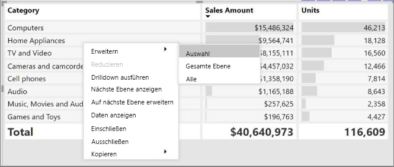
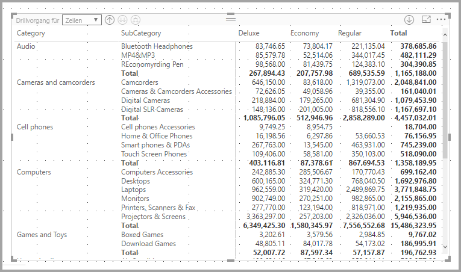
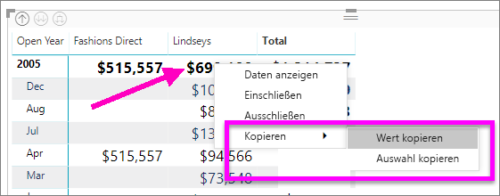
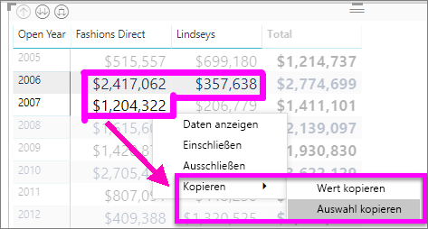

# Verwenden des Matrixvisuals in Power BI
Die **Matrix** visual ähnelt einem **Tabelle**.  Eine Tabelle unterstützt 2 Dimensionen und die Daten sind flach, Bedeutung doppelte Werte werden angezeigt und nicht aggregiert. Eine Matrix erleichtert es, Klassenmemberfunktionen Anzeigen von Daten über mehrere Dimensionen hinweg – es unterstützt ein abgestuftes Layout. Die Matrix aggregiert die Daten automatisch und ermöglicht einen Drilldown nach unten. 

Sie können matrixvisuals in erstellen **Power BI Desktop** und **Power BI-Dienst** Berichte und die kreuzhervorhebung von Elementen innerhalb der Matrix mit anderen visuellen Elementen auf dieser Berichtsseite. Angenommen, können Sie auswählen Zeilen, Spalten und sogar einzelne Zellen und hervorheben. Darüber hinaus können in andere Anwendungen einzelne Zellen und Auswahl von mehreren Zellen kopiert und eingefügt werden. 

Die Matrix bietet viele Features, die in den folgenden Abschnitten dieses Artikels erläutert werden.

## Erläuterung der Berechnung von Summen mit Power BI

Bevor Sie mit der Vorgehensweise für die Verwendung des Visuals **Matrix** fortfahren, ist es wichtig, ein Verständnis dafür zu entwickeln, wie Power BI die Werte für Summen und Teilsummen in Tabellen und Matrizen berechnet. Bei Zeilen mit Summen und Teilsummen wird das Measure für alle Zeilen der zugrunde liegenden Daten ausgewertet. Dabei handelt es sich *nicht* um eine einfache Addition der Werte in den sichtbaren oder angezeigten Zeilen. Das bedeutet, dass andere Werte als erwartet in der Zeile für die Gesamtsumme vorhanden sein können. 

Sehen Sie sich die folgenden matrixvisuals. 

In diesem Beispiel wird jede Zeile in der Matrix, die am weitesten rechts visuelle angezeigt der *Menge* für jede Kombination von Datum/Verkäufer. Da ein Verkäufer jedoch für mehrere Datumswerte angezeigt wird, können die Zahlen mehr als einmal angezeigt werden. Daher stimmen die genaue Summe der zugrunde liegenden Daten und die Summe der Addition der sichtbaren Werte nicht überein. Dabei handelt es sich um ein allgemeines Muster, wenn der Wert, dessen Summe Sie bilden, sich auf der Seite „1“ einer 1:n-Beziehung befindet.

Bedenken Sie bei Summen und Teilsummen, dass diese Werte auf den zugrunde liegenden Daten basieren, nicht nur auf den sichtbaren Werten. 

<!-- use Nov blog post video

## Expanding and collapsing row headers
There are two ways you can expand row headers. The first is through the right-click menu. You’ll see options to expand the specific row header you clicked on, the entire level or everything down to the very last level of the hierarchy. You have similar options for collapsing row headers as well.

You can also add +/- buttons to the row headers through the formatting pane under the row headers card. By default, the icons will match the formatting of the row header, but you can customize the icons’ color and size separately if you want. 
Once the icons are turned on, they work similarly to the icons from PivotTables in Excel.

The expansion state of the matrix will save with your report. It can be pinned to dashboards as well, but consumers will need to open up the report to change the state. Conditional formatting will only apply to the inner most visible level of the hierarchy. Note that this expand/collapse experience is not currently supported when connecting to AS servers older than 2016 or MD servers.

Watch the following video to learn more about expand/collapse in the matrix:

-->
## Verwenden einen Drilldown nach unten, mit dem matrixvisual
Mit dem matrixvisual können Sie alle Arten von interessante Drilldown-Aktivitäten durchführen, die zuvor nicht verfügbar waren. Hierzu zählt die Möglichkeit des Drilldowns auf Zeilen, Spalten und sogar einzelne Abschnitte und Zellen. Im Folgenden befassen Sie sich mit der Funktionsweise.

### Drilldown auf Zeilenüberschriften
Wenn Sie im Bereich **Visualisierungen** mehrere Felder zum Abschnitt **Zeilen** des Bereichs **Felder** hinzufügen, wird der Drilldown auf Zeilen in der Matrixvisualisierung aktiviert. Im Grunde erstellen Sie eine Hierarchie, durch deren Ebenen Sie sich dann per Drilldown (und Drillup) bewegen können, um die Daten der jeweiligen Ebene zu analysieren.

In der folgenden Abbildung ist die **Zeilen** Abschnitt enthält *Vertriebsphase* und *Grösse der Verkaufschance*, erstellen eine Gruppierung (oder Hierarchie) in die Zeilen, die Drillthrough möglich.

Wenn für die Visualisierung im Abschnitt **Zeilen** eine Gruppierung erstellt wurde, werden oben links in der Visualisierung selbst die Symbole für *Drill* und *Erweitern* angezeigt.

Mit diesen Schaltflächen können Sie in der Hierarchie einen Drilldown (oder Drillup) ausführen (das Verhalten gleicht dem in anderen Visualisierungen). In diesem Fall können die diagrammdarstellung aus *Vertriebsphase* zu *Grösse der Verkaufschance*, wie in der folgenden Abbildung ist dargestellt, in dem der Drilldown (das gabelpfeil) Symbol eine Ebene ausgewählt wurde.

Zusätzlich zur Verwendung dieser Symbole, können Sie beliebige Zeilenüberschrift auswählen und einen Drilldown durch Auswahl aus dem Kontextmenü, das angezeigt wird.

Das Menü enthält verschiedene Optionen, die zu unterschiedlichen Ergebnissen führen:

Auswählen von **Drilldown** erweitert die Matrix für *,* Zeilenebene, *ausschließen* alle anderen Zeilenüberschriften außer den Zeilenheader, die ausgewählt wurde. In der folgenden Abbildung **Vorschlag** > **Drilldown** ausgewählt wurde. Wie Sie sehen, werden andere Zeilen, die der höchsten Ebene angehören, nicht mehr in der Matrix angezeigt. Dieses nützliche Feature zum Ausführen von Drilldowns wird im Abschnitt **Kreuzhervorhebungen** genauer erläutert.

Wählen Sie die **Drillup** Symbol, um zur vorherigen Ansicht der obersten Ebene zurückzukehren. Wenn Sie dann auswählen, **Vorschlag** > **nächste Ebene anzeigen**, erhalten Sie eine aufsteigende Liste aller Elemente der nächsten Ebene (in diesem Fall die *Grösse der Verkaufschance* Feld), ohne die Kategorisierung der höheren Hierarchieebene.

Wählen Sie die **Drillup** Symbol in der oberen linken Ecke haben Sie die Matrix, die alle Kategorien der obersten Ebene, zeigen Sie dann auf **Vorschlag** > **auf nächste Ebene erweitern**zu finden Sie alle Werte für beide Ebenen der Hierarchie - *Vertriebsphase* und *Grösse der Verkaufschance*.

Sie können auch die **erweitern** Menüelement, um die Anzeige noch zu steuern.  Wählen Sie z. B. **Vorschlag** > **erweitern** > **Auswahl**. Powerbi zeigt eine Ergebniszeile für jeden *Vertriebsphase* und all die *Grösse der Verkaufschance* Optionen für *Vorschlag*.

### Drilldown auf Spaltenüberschriften
Ähnlich wie die Möglichkeit, um einen Drilldown für Zeilen, Sie können auch einen Drilldown auf **Spalten**. In der folgenden Abbildung sind zwei Felder in der **Spalten** erstellen Sie eine Hierarchie ähnelt, was wir für die Zeilen oben in diesem Artikel verwendet. In der **Spalten** Feldbereich lassen wir *Region* und *Segment*. Als das zweite Feld hinzugefügte **Spalten**, ein neues Dropdownmenü auf das visuelle Element angezeigt, die es derzeit zeigt **Zeilen**.

Um einen Drilldown für Spalten durchzuführen, wählen Sie **Spalten** aus der *Drillvorgang für* Menü, das in der oberen linken Ecke der Matrix gefunden werden kann. Wählen Sie die *Osten* Region, und wählen Sie **Drilldown**.

Bei der Auswahl **Drilldown**, die nächste Ebene der spaltenhierarchie von *Region > Osten* angezeigt, in diesem Fall *verkaufschancenanzahl*. Die andere Region zeigt, jedoch ausgegraut ist.

Der Rest der Menüelemente funktionieren für Spalten auf, auf die gleiche Weise wie für Zeilen (Siehe den vorigen Abschnitt **Drilldown auf Zeilenüberschriften**). Sie können **nächste Ebene anzeigen** und **auf nächste Ebene erweitern** mit Spalten, die genauso wie Sie Zeilen können.

> [!NOTE]
> Die Symbole für Drilldown und Drillup oben links im Matrixvisual gelten nur für Zeilen. Um einen Drilldown auf Spalten auszuführen, verwenden Sie das Kontextmenü.
> 
> 

## Abgestuftes Layout mit visuellen Matrixelementen
Beim **Matrixvisual** werden Unterkategorien in einer Hierarchie automatisch unter dem übergeordneten Element eingerückt. Dieser Einzug wird als **Abgestuftes Layout** bezeichnet.

In der *ursprünglichen* Version der Matrixvisualisierung wurden Unterkategorien in einer eigenen Spalte angezeigt. Dadurch beanspruchten sie deutlich mehr Platz in der Visualisierung. Im folgenden Bild wird die Tabelle im ursprünglichen **Matrixvisual** dargestellt. Beachten Sie die Unterkategorien in einer separaten Spalte.

In der Abbildung unten sehen Sie ein **Matrixvisual** mit aktiviertem **abgestuften Layout**. Bei der Kategorie *Computer* sind die Unterkategorien (Computerzubehör, Desktops, Laptops, Monitore usw.) leicht eingerückt und die Visualisierung ist klarer und prägnanter strukturiert.

Sie können die Einstellungen für das abgestufte Layout einfach anpassen. Erweitern Sie bei ausgewähltem **Matrixvisual** im Abschnitt **Format** (das Farbroller-Symbol) des Bereichs **Visualisierungen** den Abschnitt **Zeilenüberschriften**. Sie haben zwei Optionen: den Schalter **Abgestuftes Layout** (zum Ein-/Ausschalten des Layouts) und das Eingabefeld **Abgestufter Layouteinzug** (zum Festlegen des Einzugs in Pixel).

Wenn Sie die Option **Abgestuftes Layout** deaktivieren, werden die Unterkategorien nicht mehr unter dem übergeordneten Element eingerückt, sondern in einer eigenen Spalte angezeigt.

## Teilergebnisse mit Matrixvisuals
Sie können in Matrixvisuals Teilergebnisse sowohl für Zeilen als auch für Spalten aktivieren und deaktivieren. In der folgenden Abbildung sind die Teilergebnisse auf **Ein** festgelegt.

Erweitern Sie im Abschnitt **Format** des Bereichs **Visualisierungen** die Karte **Teilsummen**, und ziehen Sie den Schieberegler **Zeilenzwischensummen** auf **Aus**. Wenn Sie dies tun, werden die Teilergebnisse nicht angezeigt.

Dasselbe Verfahren wird für die Spaltenteilergebnisse angewendet.

## Kreuzhervorhebung mit visuellen Matrixelementen
Jedes Element im **Matrixvisual** kann als Basis für Kreuzhervorhebungen dienen. Wenn Sie in einem **Matrixvisual** eine Spalte auswählen, wird sie hervorgehoben (wie bei anderen Visuals auf der Berichtsseite). Diese Art von Kreuzhervorhebung ist ein Standardfeature in anderen Visuals und bei der Auswahl eines Datenpunkts, das jetzt auch im **Matrixvisual** unterstützt wird.

Auch wird STRG+Klicken jetzt für die Kreuzhervorhebung unterstützt. In der folgenden Abbildung sehen Sie eine Reihe von Unterkategorien, die im **Matrixvisual** ausgewählt wurden. Nicht ausgewählte Elemente sind abgeblendet (grau). Andere Visuals auf der Seite reflektieren die im **Matrixvisual** getroffene Auswahl.

## Kopieren von Werten aus Power BI zum Verwenden in anderen Anwendungen

Womöglich enthält Ihre Matrix oder Tabelle Inhalte, die Sie in anderen Anwendungen wie Dynamics CRM oder Excel oder sogar in anderen Power BI-Berichten verwenden möchten. Sie können in Power BI mit der rechten Maustaste auf eine einzelne Zelle oder eine Zellenauswahl klicken, um sie in die Zwischenablage zu kopieren und in die andere Anwendung einzufügen.

* Um den Wert einer einzelnen Zelle zu kopieren, wählen Sie die Zelle aus, klicken Sie mit der rechten Maustaste, und wählen Sie **Wert kopieren** aus. Der unformatierte Zellenwert befindet sich in der Zwischenablage und lässt sich nun in eine andere Anwendung einfügen.

    

* Um mehrere Zellen zu kopieren, markieren Sie einen Zellbereich, oder verwenden Sie die STRG-TASTE, um eine oder mehrere Zellen auszuwählen. Die Kopie enthält die Spalten- und Zeilenüberschriften.

    

## Schattierung und Schriftfarben für Matrixvisuals
Sie können mit dem matrixvisual anwenden **bedingte Formatierung** (Farben und Schattierung und Datenbalken) in den Hintergrund von Zellen in der Matrix und bedingte Formatierung anwenden auf den Text und die Werte selbst.

Um bedingte Formatierung anzuwenden, wählen Sie die Matrix visual und Öffnen der **Format** Bereich. Erweitern Sie die **bedingte Formatierung** Karte und **Hintergrundfarbe**, **Schriftfarbe**, oder **Datenbalken**, aktivieren Sie den Schieberegler, um **Auf**. Aktivieren auf eine der folgenden Optionen zeigt einen Link für *erweiterte Steuerelemente*, mit dem Sie die Farben und Werte für die farbformatierung anpassen.
  
  

Wählen Sie *erweiterte Steuerelemente* zum Anzeigen eines Dialogfelds, das Sie die Anpassungen vornehmen können. Dieses Beispiel zeigt das Dialogfeld zum **Datenbalken**.

## Nächste Schritte

[Punkt- und Blasendiagramme in Power BI](power-bi-visualization-scatter.md)

[Visualisierungstypen in Power BI](power-bi-visualization-types-for-reports-and-q-and-a.md)