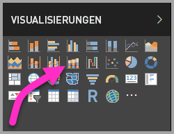
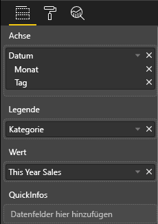
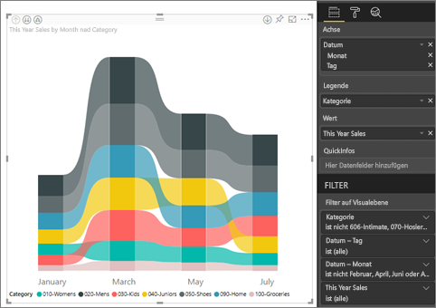
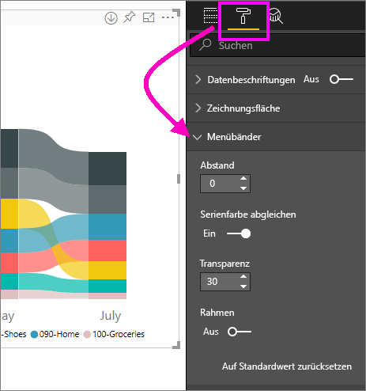
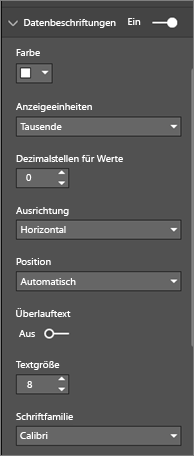

# Verwenden von Menübanddiagrammen in Power BI
Mit den Menübanddiagrammen können Sie Daten visualisieren und schnell feststellen, welche Kategorie von Daten den höchsten Rang (größten Wert) hat. Menübanddiagramme eignen sich gut zum Anzeigen von Rangänderungen, wobei der höchste Rang (Wert) immer für jeden Zeitraum oben angezeigt wird. 

## Erstellen eines Menübanddiagramms
Öffnen Sie zum besseren Verständnis den [Analysebericht für den Einzelhandel](../sample-retail-analysis.md). 

1. Wählen Sie zum Erstellen eines leeren Diagramms die Option **Menübanddiagramm** im Bereich **Visualisierungen** aus.

    

    Menübanddiagramme verknüpfen eine Kategorie von Daten über das visualisierte Zeitkontinuum mithilfe von Bändern, sodass Sie den Rang einer bestimmten Kategorie während der gesamten Spanne der X-Achse (in der Regel die Zeitachse) erkennen können.

2. Wählen Sie Felder für **Achse**, **Legende** und **Wert** aus.  In diesem Beispiel wurde Folgendes ausgewählt: **Datum**, **Kategorie** und **This Year Sales** (Verkäufe in diesem Jahr).  

    

    Da das Dataset nur die Daten eines Jahres enthält, wurde das Feld **Jahr** von der **Achse** entfernt. 

3. Auf dem Menübanddiagramm wird die Rangfolge in Schritten von je zwei Monaten angezeigt. Diese hat sich im Laufe der Zeit geändert.  Beispielsweise war die Kategorie „Home“ erst auf Platz drei, dann auf Platz vier und anschließend wieder auf Platz drei. Im Juli wechselte die Kategorie „Junior“ außerdem von Platz drei auf Platz fünf. 

    

## Formatieren eines Menübanddiagramms
Wenn Sie ein Menübanddiagramm erstellen, stehen Ihnen im Abschnitt **Format** des Bereichs **Visualisierungen** Formatierungsoptionen zur Verfügung. Die Formatierungsoptionen für Menübanddiagramme ähneln denen für ein gestapeltes Säulendiagramm, mit zusätzlichen speziellen Formatierungsoptionen für die Bänder.

Mit den Formatierungsoptionen für Menübanddiagramme können Sie Anpassungen vornehmen.

* Mit **Abstand** können Sie den Abstand zwischen Bändern anpassen. Die Zahl ist der Prozentwert der maximalen Höhe der Spalte.
* Mit **Serienfarbe abgleichen** können Sie die Farbe der Bänder an die Reihenfarbe anpassen. Wenn die Option auf **Aus** festgelegt ist, sind die Bänder grau.
* **Transparenz** gibt die Transparenz der Bänder an. Der Standardwert ist 30.
* Mit **Rand** können Sie am oberen und unteren Rand der Bänder einen dunklen Rahmen platzieren. „Rand“ ist standardmäßig deaktiviert.

Da die die y-Achse in dem Menübanddiagramm nicht beschriftet ist, sollten Sie Datenbeschriftungen hinzufügen. Klicken Sie dafür im Formatierungsbereich auf **Datenbeschriftungen**. 

Legen Sie Formatierungsoptionen für Ihre Datenbeschriftungen fest.  In diesem Beispiel wurde für die Textfarbe „weiß“, für die Dezimalstelle „0“ und für die Anzeigeeinheiten „Tausend“ festgelegt. 

## Nächste Schritte

[Punktdiagramme und Blasendiagramme in Power BI](power-bi-visualization-scatter.md)

[Visualisierungstypen in Power BI](power-bi-visualization-types-for-reports-and-q-and-a.md)