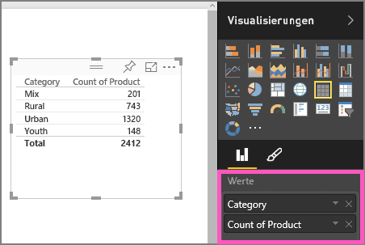
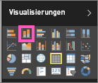

# Teil 1 – Hinzufügen von Visualisierungen zu einem Power BI-Bericht
Dieser Artikel enthält eine kurze Einführung in das Erstellen einer Visualisierung in einem Bericht mit dem Power BI-Dienst oder Power BI Desktop.  Für komplexere Inhalte sehen Sie sich bitte [Teil 2](power-bi-report-add-visualizations-ii.md) an. Sehen Sie, wie Amanda verschiedene Methoden zum Erstellen, Bearbeiten und Formatieren von Visuals im Berichtszeichenbereich demonstriert. Versuchen Sie es dann selbst, indem Sie das [Beispiel für Vertrieb und Marketing](../sample-datasets.md) verwenden, um einen eigenen Bericht zu erstellen.

<iframe width="560" height="315" src="https://www.youtube.com/embed/IkJda4O7oGs" frameborder="0" allowfullscreen></iframe>

## Öffnen eines Berichts und Hinzufügen einer neuen Seite
1. Öffnen Sie einen Bericht in der [Bearbeitungsansicht](../consumer/end-user-reading-view.md). In diesem Lernprogramm wird das [Beispiel für Vertrieb und Marketing](../sample-datasets.md) genutzt.
2. Wenn der Felderbereich nicht sichtbar ist, wählen Sie das Pfeilsymbol, um ihn zu öffnen. 
   
   
3. [Fügen Sie dem Bericht eine leere Seite hinzu](../power-bi-report-add-page.md).

## Hinzufügen von Visualisierungen zum Bericht
1. Erstellen Sie eine Visualisierung durch Auswahl eines Felds aus dem Bereich **Felder** .  
   
   **Beginnen Sie mit einem numerischen Feld** wie „SalesFact > Sales $“ (SalesFact > Verkäufe in $). Power BI erstellt ein Säulendiagramm mit einer einzelnen Spalte.
   
   
   
   **Oder Sie beginnen mit einem Kategoriefeld**, z.B. mit „Name“ oder „Produkt“: Power BI erstellt eine Tabelle und fügt das Feld dem Bereich **Werte** hinzu.
   
   
   
   **Oder Sie beginnen mit einem geografischen Feld** wie „Geo > Ort“. Power BI und Bing Maps erstellen eine Kartenvisualisierung.
   
   
2. Erstellen Sie eine Visualisierung, und ändern Sie deren Typ. Wählen Sie **Produkt > Kategorie** und **Produkt > Count of Product** (Anzahl Produkt) aus, um beide dem Bereich **Werte** hinzuzufügen.
   
   
3. Ändern Sie die Visualisierung in einem Säulendiagramm, indem Sie das entsprechende Symbol wählen.
   
   
4. Wenn Sie Visualisierungen in Ihrem Bericht erstellen, können Sie sie [an Ihr Dashboard anheften](../service-dashboard-pin-tile-from-report.md). Um die Visualisierung anzuheften, wählen Sie das Anheftsymbol .
   
   
  

## Nächste Schritte
 Fortfahren mit [Teil 2 – Hinzufügen von Visualisierungen zu einem Power BI-Bericht](power-bi-report-add-visualizations-ii.md)
   
   [Mit den Visualisierungen](../consumer/end-user-reading-view.md) im Bericht interagieren
   
   [Weiter Aktionen mit Visualisierungen ausführen](power-bi-report-visualizations.md)
   
   [Den Bericht speichern](../service-report-save.md)
