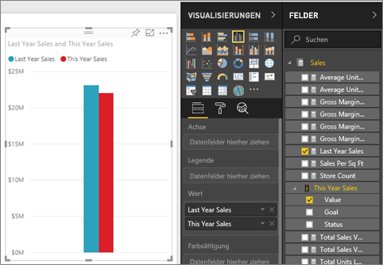
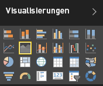

# Grundlegendes Flächendiagramm
Das grundlegende Flächendiagramm (d.h. überlappendes Flächendiagramm) basiert auf dem Liniendiagramm. Der Bereich zwischen der Achse und der Zeile ist mit Farben gefüllt, um Volumen anzuzeigen. 

Flächendiagramme betonen das Ausmaß von Veränderungen im Laufe der Zeit und können dazu genutzt werden, um den gesamten Wert über einen Trend hinweg hervorzuheben. Beispielsweise können Daten, die den Gewinn im Zeitverlauf darstellen, in ein Flächendiagramm gezeichnet werden, um den Gesamtgewinn zu verdeutlichen.

## Wann ein einfaches Flächendiagramm verwendet werden sollte
Einfache Flächendiagramme sind gut geeignet,

* um den Volumentrend über Zeit und Reihe hinweg anzuzeigen und zu vergleichen 
* für individuelle Reihen, die einen physisch zählbaren Satz darstellen

### Voraussetzungen
 - Power BI-Dienst
 - Retail Analysis sample

Melden Sie sich bei Power BI an, wählen Sie **Daten abrufen\> Beispiele \> Analysebeispiel für Einzelhandel > Verbinden** aus, und wählen Sie **Zum Dashboard wechseln**. 

## Erstellen eines grundlegenden Flächendiagramms
 

1. Wählen Sie im Dashboard „Analysebeispiel für Einzelhandel“ die Kachel **Läden gesamt** aus, um den Bericht „Analysebeispiel für Einzelhandel“ zu öffnen.
2. Wählen Sie **Bericht bearbeiten** , um den Bericht in der Bearbeitungsansicht zu öffnen.
3. Fügen Sie eine neue Berichtsseite hinzu, indem Sie das gelbe Pluszeichen (+) am unteren Rand des Berichts auswählen.
4. Erstellen Sie ein Flächendiagramm, das den Absatz des laufenden Jahres und den des Vorjahres pro Monat anzeigt.
   
   a. Wählen Sie im Bereich „FELDER“ die Option **Verkäufe \> Verkäufe im Vorjahr** und **Verkäufe in diesem Jahr > Wert** aus.

   

   b.  Konvertieren Sie das Diagramm in ein grundlegendes Flächendiagramm, indem Sie im Bereich „VISUALISIERUNGEN“ das Symbol „Flächendiagramm“ auswählen.

   
   
   c.  Wählen Sie **Zeit \> Monat**, um es dem Bereich **Achse** hinzuzufügen.   
   
   
   d.  Wählen Sie die Auslassungspunkte in der oberen, rechten Ecke der Visualisierung aus, und wählen Sie **Nach FiscalMonth sortieren**, um das Diagramm sortiert nach Monaten anzuzeigen.

## Hervorheben und Kreuzfiltern
Informationen zur Verwendung des Bereichs „FILTER“ finden Sie unter [Hinzufügen eines Filters zu einem Bericht in Power BI](../power-bi-report-add-filter.md).

Um einen bestimmten Bereich im Diagramm hervorheben, wählen Sie diesen Bereich oder seinen oberen Rahmen aus.  Im Gegensatz zu anderen Visualisierungstypen erfolgt durch Hervorheben eines grundlegenden Flächendiagramms keine Kreuzfilterung der anderen Visualisierungen auf der Berichtsseite (sofern auf derselben Seite weitere Visualisierungen vorhanden sind). Flächendiagramme sind jedoch ein Ziel für das Kreuzfiltern, das von anderen Visualisierungen auf der Berichtsseite ausgelöst wird. Weitere Informationen finden Sie unter [Interaktionen mit Visuals in einem Power BI-Bericht](../service-reports-visual-interactions.md)

## Zu beachtende Aspekte und Problembehandlung   
* [Den Bericht zugänglicher für Menschen mit Behinderungen machen](../desktop-accessibility.md)
* Grundlegende Flächendiagramme sind beim Vergleichen der Werte nicht effektiv, was am Einschluss der überlappenden Bereiche liegt. Power BI verwendet Transparenz, um die Überlappung von Bereichen anzuzeigen. Dies funktioniert jedoch nur mit zwei oder drei unterschiedlichen Bereiche gut. Wenn Sie den Trend für mehr als drei Measures vergleichen möchten, sollten Sie Liniendiagramme verwenden. Wenn Sie das Volumen für mehr als drei Measures vergleichen möchten, sollten Sie Treemaps verwenden.

## Nächste Schritte
[Berichte in Power BI](../service-reports.md)  
[Visualisierungen in Power BI-Berichten](power-bi-report-visualizations.md)  
[Power BI – Grundkonzepte](../service-basic-concepts.md)  
Weitere Fragen? [Wenden Sie sich an die Power BI-Community](http://community.powerbi.com/)

