# Bewährte Entwurfsmethoden für Berichte und Visualisierungen
<!-- Shared newnav Include -->
[!INCLUDE [newnavbydefault](../includes/newnavbydefault.md)]

## Einführung
Dieses Dokument enthält Informationen zu den bewährten Methoden zum Entwerfen von Berichten in Power BI. Ausgehend von der Planung werden Entwurfsgrundlagen und -verfahren beschrieben, die Sie für Ihre Berichte sowie für die Seiten und einzelnen visuellen Elemente des Berichts verwenden können.  Viele dieser bewährten Methoden gelten auch für das Entwerfen von Dashboards.

Wir hoffen, dass dieses Whitepaper eine gute Ausgangsbasis für Sie darstellt, indem Sie das Gelernte auf Ihre eigenen Berichte und Visualisierungen anwenden, und dass Sie sich unter „community.powerbi.com“ mit Beiträgen beteiligen. Das Entwerfen von BI-Berichten und die Nutzung von Visualisierungen ist gerade ein beliebtes Thema, und viele Vordenker, Blogger und Websites beschäftigen sich ausführlich damit (am Ende dieses Whitepapers sind einige davon aufgeführt).   

> [!NOTE]
> Die Empfehlungen in diesem Whitepaper sollen als Richtlinien dienen, die Sie anwenden können, wann und wo dies sinnvoll ist. Für jedes unten beschriebene Verfahren gibt es häufig auch Gründe für das „Brechen der Regeln“.
> 
> 

*Wir werden mit Informationen überhäuft. Es sind nicht zu viele Informationen, aber wir wissen nicht, wie wir sie bewältigen sollen.*
-- Stephen Few

## Betrachtung der Designlandschaft und Terminologie
In Power BI besteht ein Bericht aus mindestens einer Berichtsseite, und alle Seiten zusammen werden als Bericht bezeichnet. Die grundlegenden Elemente des Berichts sind visuelle Elemente (Visualisierungen), separate Abbildungen und Textfelder. Von den einzelnen Datenpunkten über die Berichtselemente bis zur Berichtsseite selbst gibt es viele verschiedene Formatierungsoptionen.

Wir beginnen mit der Phase der Berichtsplanung, fahren dann mit den Grundlagen des Berichtsentwurfs und den Grundlagen für den Entwurf von visuellen Elementen fort und beschreiben abschließend die bewährten Methoden für bestimmte Arten von visuellen Elementen.

Ausführliche Anleitungen und Hilfeinformationen zum Erstellen und Verwenden von Power BI-Berichten finden Sie unter **powerbi.com > Lernen**.

## Vor der Erstellung der ersten Visualisierung: Konzentration auf die Anforderungen
Die Erstellung eines Berichts beginnt vor dem Erstellen des ersten visuellen Elements, weil für einen guten Bericht auch eine gute Planung erforderlich ist.  Sie sollten wissen, mit welchen Daten Sie arbeiten müssen, und eine Liste mit den Anforderungen für den Bericht erstellen. Stellen Sie sich folgende Frage: „Wie lautet die geschäftliche Anforderung, und wie und von wem werden diese Daten genutzt?“ Eine wichtige Frage ist: „Welche Entscheidungen möchte der Leser anhand dieses Berichts treffen können?“

Die Antworten auf diese Fragen stellen die Grundlage Ihres Entwurfs dar. Mit jedem Bericht wird eine „Geschichte“ erzählt. Stellen Sie sicher, dass diese Geschichte an der geschäftlichen Anforderung ausgerichtet ist. Es kann verlockend sein, visuelle Elemente hinzuzufügen, mit denen eindrucksvolle Erkenntnisse veranschaulicht werden. Wenn diese Erkenntnisse aber nicht zur geschäftlichen Anforderung passen, ist der Bericht nicht hilfreich – und Benutzer werden durch die visuellen Elemente ggf. eher abgelenkt. Unter Umständen finden Sie auch heraus, dass die Informationen, die zum Treffen der Entscheidung benötigt werden, nicht aus den vorhandenen Daten ermittelt werden können. Kann dieser Bericht genutzt werden, um zu messen, was benötigt wird?

Berichte können zum Überwachen, Aufdecken, Nachverfolgen, Vorhersagen, Messen, Verwalten, Testen usw. verwendet werden. Wenn die geschäftliche Anforderung beispielsweise ein Umsatzbericht ist, mit dem die Leistung gemessen wird, können Sie einen Bericht entwerfen, der Folgendes leistet: Ermitteln des aktuellen Umsatzes, Vergleichen mit vorherigem Umsatz, Vergleichen mit Wettbewerbern und Nutzen von KPIs zum Auslösen von Warnungen.  Es kann beispielsweise sein, dass Leser die ausführlichen Verkaufszahlen anzeigen können, um sich über Geschäftsschließungen oder Lieferkettenprobleme zu informieren, die sich ggf. auf den Umsatz auswirken.  Eine weitere Drilldownoption kann darin bestehen, den Umsatz nach Geschäft, Region, Produkt, Jahreszeit usw. anzuzeigen.

Machen Sie sich klar, wer die „Kunden“ (also Empfänger) des Berichts sind. Entwerfen Sie einen Bericht, in dem vertraute Terminologie verwendet wird und der Daten mit dem Detail- bzw. Komplexitätsgrad enthält, der für den Wissensstand der Kunden geeignet ist. Gibt es mehrere Arten von Kunden? Ein Ansatz ist nicht immer für verschiedene Zielgruppen geeignet. Entwerfen Sie je nach Wissensstand separate Berichtsseiten, und wählen Sie für jede Seite eine eindeutige Bezeichnung, damit sie für Kunden selbsterklärend sind. Eine andere Möglichkeit ist die Verwendung von Datenschnitten (Slicern), damit Kunden die Seite je nach Bedarf anpassen können. Beziehen Sie Kunden in die Planungsphase ein, und vermeiden Sie es zu glauben, dass Sie bereits wissen, was benötigt wird.  Seien Sie darauf vorbereitet, neu anzufangen und den Prozess mehrfach zu durchlaufen.

Nachdem Sie die geschäftliche Anforderung, die Kunden und die einzubeziehenden Metriken ermittelt haben, umfasst der nächste Schritt das Auswählen der richtigen visuellen Elemente zum Erzählen der Geschichte und deren Darstellung auf möglichst effektive Weise. Dies ist ein weites Feld, und wir beginnen daher mit einigen Grundlagen des Berichtsentwurfs.

## Grundlagen des Berichtsentwurfs
Der Platz auf einer Berichtsseite ist begrenzt, und eine der schwierigsten Aufgaben besteht darin, alle gewünschten Elemente unterzubringen – und dies trotzdem auf leicht verständliche Weise. Begehen Sie außerdem nicht den Fehler, die Wirkung eines „schönen Designs“ zu unterschätzen. Das Ziel sollte sein, die richtige Balance zwischen „schön“ und „nützlich“ zu finden.

Als Nächstes geht es um die Punkte Layout, Klarheit und Ästhetik.

### Layout – Zeichenbereich des Berichts
Der Platz im Zeichenbereich (Canvas) des Berichts ist begrenzt.  Unterteilen Sie den Bericht in mehrere Seiten, falls nicht alle Elemente auf eine Berichtsseite passen.  Eine Berichtsseite kann wie folgt ausgerichtet sein: auf eine bestimmte Zielgruppe (z.B. HR, IT, Vertrieb, SLT), eine bestimmte geschäftliche Fragestellung (z.B. „Wie wirken sich Defekte auf unsere Ausfallzeit aus?“, „Wie wirkt sich unsere Marketingkampagne auf die Stimmung aus?“) oder als progressive Geschichte (z.B. erste Seite als Übersicht oder Mittel zur Gewinnung der Aufmerksamkeit, zweite Seite als Fortsetzung der Datengeschichte, dritte Seite mit ausführlicheren Details der Geschichte usw.).  Wenn der gesamte Bericht auf eine Seite passt: umso besser. Falls nicht, ist es ratsam, separate Berichtsseiten zu erstellen, auf denen der Inhalt in logische Blöcke unterteilt ist.  Denken Sie auch daran, für die Seiten aussagekräftige und hilfreiche Namen zu verwenden.

Stellen Sie sich dies wie die Einrichtung einer Kunstausstellung vor. Sie würden nicht 50 Kunstobjekte in einem kleinen Raum anordnen, Stühle aufstellen und jede Wand in einer anderen Farbe streichen. Als Kurator würden Sie jeweils nur die Objekte auswählen, die zusammenpassen, und sie so im Raum anordnen, dass die Besucher viel Platz zum Bewegen und Betrachten haben. Außerdem würden Sie Informationsschilder anbringen, auf denen die Objekte beschrieben werden. Und es hat einen Grund, warum die meisten modernen Galerien weiße bzw. einfarbige Wände haben.
In diesem Artikel beginnen wir mit einem Beispiel für einen Bericht, für den viele Arbeitsschritte erforderlich sind, um ein gutes Ergebnis zu erhalten.  Wenn wir nach und nach die bewährten Methoden und Entwurfsgrundlagen anwenden, verbessert sich die Qualität des Berichts.

**Abbildung 1:    Für diese wenig ansprechende Berichtsseite ist eine umfangreiche Bearbeitung erforderlich.**

Das obige Beispiel weist viele platzbezogene Entwurfsprobleme (Layoutprobleme) auf, die im Folgenden beschrieben werden:

* Ausrichtung, Reihenfolge und Abstände
* Fehlerhafte Nutzung des Platzes und der Sortierung
* Unübersichtlichkeit

### Ausrichtung, Reihenfolge und Abstände
Das Layout von Berichtselementen hat eine Auswirkung auf das Verständnis und leitet den Leser durch die Berichtsseite. Durch die Art und Weise der Anordnung und Positionierung von Elementen wird eine Geschichte erzählt.  Die Aussage kann beispielsweise „Hier beginnen und dann hier fortfahren“ oder „Diese drei Elemente gehören zusammen“ lauten.

* In den meisten Fällen lesen Benutzer von links nach rechts und von oben nach unten. Ordnen Sie das wichtigste Element oben links im Bericht an. Platzieren Sie die restlichen visuellen Elemente so, dass sich eine logische Navigation und ein logisches Verständnis der Informationen ergibt.
* Ordnen Sie Elemente, bei denen der Leser eine Wahl treffen muss, links von den Visualisierungen an, auf die sich die Wahl auswirkt, z.B. bei Datenschnitten.
* Ordnen Sie zusammengehörige Elemente nah beieinander an. Durch geringe Abstände wird vermittelt, dass die Elemente zusammengehören.
* Eine weitere Möglichkeit zum Vermitteln von Beziehungen ist das Einfügen eines Rahmens oder farbigen Hintergrunds für eine Gruppe von Elementen. Sie können auch eine Trennlinie einfügen, um die bessere Unterscheidung zwischen unterschiedlichen Abschnitten eines Berichts zu ermöglichen.
* Verwenden Sie Leerraum, um die einzelnen Abschnitte der Berichtsseite visuell abzutrennen.
* Füllen Sie die Berichtsseite aus. Falls Ihnen viel Leerraum zur Verfügung steht, ist es oft ratsam, die Visualisierungen größer oder den Zeichenbereich kleiner zu machen.
* Wählen Sie die Größe der Berichtselemente mit Bedacht. Lassen Sie nicht zu, dass die Größe einer Visualisierung automatisch durch die Menge des verfügbaren Platzes vorgegeben wird.
* Machen Sie wichtige Elemente größer als andere, oder fügen Sie visuelle Elemente ein, z.B. einen Pfeil, um die Aufmerksamkeit auf etwas zu lenken.
* Richten Sie die Elemente auf der Berichtsseite entweder symmetrisch oder absichtlich asymmetrisch aus.

Wir gehen nun näher auf die Ausrichtung ein.

#### Ausrichtung
Beim Ausrichten geht es nicht darum, dass die einzelnen Komponenten die gleiche Größe haben müssen oder dass in jeder Zeile des Berichts die gleiche Anzahl von Komponenten vorhanden ist. Ausrichtung bedeutet lediglich, dass die Seite eine Struktur hat, die die leichte Navigation und Lesbarkeit fördert.

Unten im aktualisierten Bericht ist zu erkennen, dass die Berichtskomponenten links und rechts ausgerichtet sind und jede Berichtszeile sowohl horizontal als auch vertikal ausgerichtet ist. Unsere Datenschnitte sind links von den visuellen Elementen angeordnet, auf die sie sich auswirken.

**Abbildung 2:    Unser Beispiel für einen wenig ansprechenden Bericht mit Layoutverbesserungen**

Power BI enthält Tools, die Sie beim Ausrichten der visuellen Elemente unterstützen. Wenn Sie in Power BI Desktop mehrere visuelle Elemente markiert haben, können Sie im Menüband auf der Registerkarte **Visuelle Elemente** die Optionen unter **Ausrichten oder verteilen** verwenden, um die Position von visuellen Elementen anzugleichen.

**Abbildung 3:    Ausrichten von Visuals in Power BI Desktop**

In Power BI Online und Power BI Desktop können Sie auch die Größe und Position von visuellen Elementen präzise steuern, indem Sie im Formatierungsbereich für alle Elemente die Registerkarte **Allgemein** verwenden:

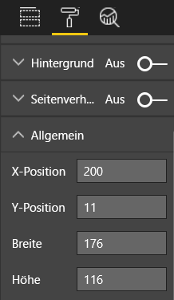

**Abbildung 4:    Festlegen der genauen Position für Ihr Visual**

Auf der Berichtsseite in unserem Beispiel (Abbildung 2) sind die beiden Karten und der große Rahmen nach der **X-Position** bei 200 ausgerichtet.

#### Anpassen an den vorhandenen Platz
Nutzen Sie den vorhandenen Platz so gut wie möglich.  Beachten Sie beim Entwerfen, wie der Bericht genutzt bzw. angezeigt wird, wenn Ihnen dies bekannt ist. Reduzieren Sie den leeren Platz, um den Zeichenbereich auszufüllen.  Versuchen Sie möglichst zu vermeiden, dass für einzelne visuelle Elemente Bildlaufleisten eingeblendet werden.  Füllen Sie den Platz aus, ohne dass die einzelnen visuellen Elemente zu stark eingeengt sind.

##### Anpassen der Seitengröße
Wenn Sie die Seitengröße verringern, erscheinen einzelne Elemente relativ zur gesamten Seite größer. Heben Sie hierfür die Markierung aller visuellen Elemente auf der Seite auf, und verwenden Sie im Formatierungsbereich die Registerkarte **Seitengröße**.  

Hier ist eine Berichtsseite dargestellt, für die einmal das Format 4:3 und dann das Format 16:9 gewählt wurde. Achten Sie darauf, dass 16:9 für das Layout deutlich besser geeignet ist. Es ist sogar so viel Platz vorhanden, dass die Bildlaufleiste für das zweite visuelle Element entfernt werden kann.

**Abbildung 5a:    Bericht mit einem Seitenverhältnis von 4:3**

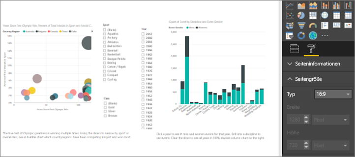

**Abbildung 5b:    Bericht mit einem Seitenverhältnis von 16:9**

Soll Ihr Bericht im Format 4:3, 16:9 oder einem anderen Format angezeigt werden? Auf kleinen oder großen Bildschirmen? Oder für alle möglichen Bildschirmformate und -größen?  Berücksichtigen Sie dies beim Entwerfen.

Unsere Berichtsseite im Beispiel ist etwas überladen. Öffnen Sie bei nicht ausgewählten Elementen den Formatierungsbereich, indem Sie das Symbol mit der Farbrolle auswählen. Erweitern Sie die Option **Seitengröße**, und ändern Sie **Höhe** in den Wert 900.

**Abbildung 6:    Vergrößern der Seitenhöhe**

#### Verringern der Unübersichtlichkeit
Eine unübersichtliche Berichtsseite ist nur schwer schnell zu erfassen und kann so überwältigend wirken, dass die Leser gleich aufgeben.  Entfernen Sie alle Berichtselemente, die nicht benötigt werden. Fügen Sie keine Ausschmückungen hinzu, die nicht der Förderung des Verständnisses oder der Navigation dienen. Ihre Berichtsseite sollte die Informationen so eindeutig, schnell und zusammenhängend wie möglich vermitteln.

Edward Tufte bezeichnet dies in seinem Buch *The Visual Display of Quantitative Information* (Die visuelle Darstellung von quantitativen Informationen) als „data to ink ratio“ (Verhältnis von Daten zu „Tinte“).  Dies bedeutet im Wesentlichen, dass alle unnötigen Elemente entfernt werden sollten.

Durch das Entfernen der überflüssigen Elemente wird die freie Fläche auf der Berichtsseite vergrößert, und Sie erhalten mehr Platz zum Anwenden der bewährten Methoden, die oben im Abschnitt „Ausrichtung, Reihenfolge und Abstände“ beschrieben wurden.

Hier sieht unser Beispiel schon besser aus. Wir haben die Unübersichtlichkeit beseitigt und Elemente durch die Verwendung passender Formen gruppiert.  Das Hintergrundbild ist nicht mehr vorhanden, der überflüssige Pfeil und das Textfeld wurden entfernt, ein visuelles Element wurde auf eine andere Seite des Berichts verschoben usw. Außerdem haben wir die Seite länger gemacht, um mehr freie Fläche zu erhalten.

**Abbildung 7:    Verbesserte Übersichtlichkeit des wenig ansprechenden Berichts**

### Eine ganze Geschichte auf einen Blick
Der ultimative Test ist: Eine Person ohne Vorkenntnisse muss den Bericht schnell verstehen können, ohne dass sie eine Erklärung erhält. Leser sollten auf den ersten Blick erkennen können, um was es auf der Seite und in den einzelnen Diagrammen und Tabellen geht.   

Beim Betrachten des Berichts sollten die Augen der Leser zu dem Element geleitet werden, das sie sich zuerst ansehen sollen, und anschließend verläuft die Leserichtung von links nach rechts und von oben nach unten.  Ändern Sie dieses Verhalten, indem Sie visuelle Anhaltspunkte wie Textfeldbeschriftungen, Formen, Rahmen und verschiedene Größen und Farben einsetzen.  

#### Textfelder
In einigen Fällen reichen die Titel der Visualisierungen nicht aus, um die Geschichte zu erzählen.  Fügen Sie Textfelder hinzu, um mit den Benutzern zu kommunizieren, die Ihre Berichte anzeigen.  Mit Textfeldern kann eine Berichtsseite, eine Gruppe von visuellen Elementen oder ein einzelnes visuelles Element beschrieben werden. Sie können zum Erläutern von Ergebnissen oder zum besseren Definieren eines visuellen Elements, der Komponenten in Elementen oder der Beziehungen zwischen den Elementen genutzt werden. Mithilfe von Textfeldern können Sie die Aufmerksamkeit anhand von verschiedenen Kriterien auf bestimmte Dinge lenken.

Wählen Sie im Power BI-Dienst oben in der Menüleiste die Option **Textfeld**. (In Power BI Desktop: Wählen Sie im Menüband im Bereich **Einfügen** die Option **Textfeld**.)

**Abbildung 8:    Hinzufügen eines Textfelds**

Geben Sie den Text in das Textfeld ein, und nutzen Sie dann die unten angeordneten Steuerelemente, um die Schriftart, die Größe, die Ausrichtung usw. festzulegen. Verwenden Sie die Ziehpunkte, um die Größe des Felds zu ändern.

**Abbildung 9:    Formatieren des Textfelds**

Es ist aber ratsam, hierbei nicht zu übertreiben. Zu viel Text im Bericht führt zu allgemeiner Ablenkung und Ablenkung von den visuellen Elementen. Falls sich herausstellt, dass sehr viel Text erforderlich ist, um Ihre Berichtsseite verständlich zu machen, sollten Sie neu anfangen.  Ist es möglich, ein anderes visuelles Element zu wählen, das mehr Aussagekraft hat? Können Sie die nativen Titel des Visuals verbessern, um die Verständlichkeit zu fördern?   

#### Text
Erstellen Sie eine Stilvorgabe für Text, und wenden Sie diese Regeln auf allen Seiten des Berichts an. Wählen Sie nur ein paar Schriftarten, Textgrößen und Farben.  Wenden Sie die Regeln der Stilvorgabe nicht nur auf Textelemente an, sondern auch auf die Schriftarten, die Sie für die Visualisierungen wählen (siehe „Titel und Beschriftungen in Visualisierungen“ weiter unten). Legen Sie Regeln für die Verwendung von Fettdruck, Kursivschrift, größeren Schriftgraden, bestimmten Farben usw. fest.  Versuchen Sie, Text in Großbuchstaben oder Unterstreichungen zu vermeiden.

#### Formen
Auch Formen können zu einer besseren Navigation und zum Verständnis beitragen. Verwenden Sie Formen, um zusammengehörige Informationen zu gruppieren und wichtige Daten hervorzuheben, und setzen Sie Pfeile ein, um die Augen beim Lesen zu leiten. Formen dienen als Hilfe für Leser, damit sie wissen, wo sie beginnen sollen und wie der Bericht zu interpretieren ist. In der Designsprache wird dies häufig als *Kontrast* bezeichnet.

**Abbildung 10a:    Formen im Power BI-Dienst**

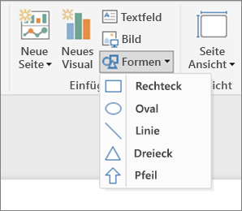

**Abbildung 10b:    Formen in Power BI Desktop**

Wie sieht unsere Beispielseite jetzt aus?  Abbildung 11 zeigt eine aufgeräumtere und übersichtlichere Seite mit einheitlicher Nutzung von Schriftarten, Schriftgrößen und Farben.  Der Seitentitel in der Ecke oben links informiert den Leser darüber, um was es auf der Seite geht.

**Abbildung 11:    Berichtsbeispiel mit angewendeten Texthinweisen und hinzugefügtem Titel**

Im Beispiel wurde oben links ein Titel für die Berichtsseite eingefügt, also an der Stelle, die sich Leser als Erstes ansehen. Der Schriftgrad ist 28, und die Schriftart ist Segoe Bold, damit der Text gegenüber den anderen Seitenelementen hervorgehoben ist.  In unserer Stilvorgabe wird Folgendes gefordert: keine Hintergründe, Titeltext in Schwarz, Legenden und Beschriftungen. Diese Vorgaben wurden auf alle visuellen Elemente der Seite angewendet, soweit dies möglich war (die Achsen und Beschriftungen des Kombinationsdiagramms sind nicht änderbar).  Außerdem wurde Folgendes durchgeführt:

* Karten: **Kategoriebeschriftung** auf „Aus“ und **Titel** auf „Ein“ festgelegt und „12 Pt., Schwarz, Zentriert“ ausgewählt.
* Titel von visuellen Elementen: Bei „Ein“ Auswahl von „12 Pt., Linksbündig“.
* Slicer: **Kopfzeile** auf „Aus“ und **Titel** auf „Ein“. Behalten Sie für **Elemente** > **Text** die Einstellung „Grau, 10 Pt.“ bei.
* Punkt- und Säulendiagramme: Schwarze Schrift für X- und Y-Achsen und Titel von X- und Y-Achsen, falls zutreffend.

#### Farbe
Verwenden Sie Farben, um die Einheitlichkeit sicherzustellen.  Auf diesen Punkt gehen wir unter „Grundlagen des Entwurfs von visuellen Elementen“ näher ein. Hierbei geht es darum, die Farben mit Bedacht auszuwählen, damit die Leser nicht abgelenkt werden und den Bericht schnell verstehen.  Zu viele grelle Farben können störend wirken. Dieser Abschnitt enthält eher Informationen dazu, was Sie in Bezug auf Farbe nicht tun sollten.

#### Hintergründe
Wählen Sie beim Festlegen von Hintergründen für Berichtsseiten keine Farben, die den Bericht verdüstern, die nicht zu den anderen Farben auf der Seite passen oder deren Anblick wehtut. Beachten Sie auch, dass einige Farben mit bestimmten Bedeutungen behaftet sind.  In den USA wird die Farbe Rot in einem Bericht normalerweise für etwas Negatives verwendet.

**Abbildung 12: Festlegen des Hintergrunds für den Bericht**

Die Aufgabe besteht nicht darin, ein Kunstwerk zu erstellen, sondern einen funktionellen Bericht. Wählen Sie eine Farbe, mit der die Lesbarkeit und Hervorhebung der Berichtselemente verbessert wird.  

Eine Studie zur Verwendung von Farben und Visualisierungen auf Webseiten hat ergeben, dass ein höherer Kontrast zwischen Farben das Verständnis fördert („The effect of text and background colour on visual search of Web pages“ (Auswirkung von Text- und Hintergrundfarben auf die visuelle Suche nach Webseiten) und **Determining Users’ Perception of Web Page Visual Complexity and Aesthetic Characteristics** (Ermittlung des Benutzereindrucks der visuellen Komplexität und ästhetischen Merkmale von Webseiten)).

Wir haben einige bewährte Methoden für den Einsatz von Farben auf unseren Beispielbericht angewendet (siehe Abbildungen 20 und 21 weiter unten). Der wichtigste Punkt ist, dass wir die Hintergrundfarbe in Schwarz geändert haben.  Gelb war zu grell und eine Belastung für die Augen.  Außerdem lief der gelbe Teil der Balken im Diagramm „Count of athlete name by year and class“ in den gelben Hintergrund.  Bei Verwendung eines schwarzen (oder weißen) Hintergrunds ist der Kontrast am größten, und die Aufmerksamkeit wird auf die visuellen Elemente geleitet.

Wir haben die folgenden zusätzlichen Schritte ausgeführt, um den Beispielbericht zu verbessern:

**Seitentitel**

Als wir den Hintergrund auf die Farbe Schwarz festgelegt haben, war der Titel nicht mehr zu sehen, weil im Textfeld nur schwarze Schrift zulässig ist.   Fügen Sie stattdessen einen Textfeldtitel ein, um dieses Problem zu beheben.  Löschen Sie bei markiertem Textfeld den Text, und wählen Sie auf der Registerkarte „Visualisierungen“ die Option **Titel**. Wählen Sie für diese Option „Ein“. Wählen Sie den Pfeil, um die Optionen unter **Titel** einzublenden. Geben Sie **Summer Olympic Games** in das Feld **Titeltext** ein, und wählen Sie die Farbe Weiß als **Schriftfarbe**.

**Abbildung 13: Hinzufügen eines Seitentitels**

**Karten**

Öffnen Sie für die visuellen Kartenelemente den Formatierungsbereich (Farbrollen-Symbol), und legen Sie **Hintergrund** auf „Ein“ fest. Wählen Sie die Farbe Weiß mit einer Transparenz von 0 %. Legen Sie anschließend **Titel** auf „Ein“ fest, und wählen Sie Weiß als **Schriftfarbe** und Schwarz als **Hintergrundfarbe** aus.

**Datenschnitte**

Die beiden Datenschnitte wiesen eine unterschiedliche Formatierung auf, was nicht sinnvoll ist. Ändern Sie die Hintergrundfarbe für beide Datenschnitte in „Aquamarin“.  Die Farbe Aquamarin ist eine gute Wahl, da sie in der Farbpalette der Seite enthalten ist. Sie ist im Flächenkartogramm, in der Strukturkarte und im Säulendiagramm zu sehen.

**Abbildung 14: Ändern der Hintergrundfarbe für den Slicer**

Fügen Sie einen dünnen weißen Rahmen hinzu.

**Abbildung 15: Hinzufügen eines Rahmens für den Slicer**

Die graue Farbe ist auf dem Aquamarin-Hintergrund nicht gut zu sehen. Ändern Sie die Farbe für **Elemente** daher in Weiß.

**Abbildung 16: Ändern der Schriftfarbe des Slicers**

Ändern Sie abschließend unter **Titel** die Option **Schriftfarbe** in Weiß, und legen Sie **Hintergrundfarbe** auf „Schwarz“ fest.

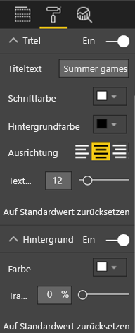

**Abbildung 17: Formatieren des Titels für den Slicer**

**Rechteckige Form**

Auch das Rechteck ist auf dem schwarzen Hintergrund nicht mehr sichtbar.  Wählen Sie die Form aus, und legen Sie im Bereich **Form formatieren** die Option **Hintergrund** auf „Ein“ fest.

**Abbildung 18: Formatieren der Form**

**Säulendiagramme, Blasendiagramm, Flächenkartogramm und Strukturkarte**

Fügen Sie den restlichen visuellen Elementen auf der Berichtsseite einen weißen Hintergrund hinzu. Erweitern Sie im Formatierungsbereich die Option **Linie**, und legen Sie die **Linienfarbe** auf „Weiß“ und die **Stärke** auf 3 fest.

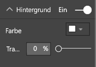

**Abbildung 19: Hinzufügen eines weißen Hintergrunds für die restlichen Visualisierungen**

**Abbildung 20: Berichtsbeispiel mit Anwendung von bewährten Methoden für Farbe (schwarzer Hintergrund)**

**Abbildung 21:    Berichtsbeispiel mit Anwendung von bewährten Methoden für Farbe (weißer Hintergrund)**
 

### Ästhetik
Viele Aspekte der Ästhetik wurden oben bereits genannt: Dinge wie Ausrichtung, Farbe, Schriftart und Übersichtlichkeit.  Es gibt aber noch einige andere bewährte Methoden für den Entwurf von Berichten, die erwähnenswert sind und das Gesamtbild des Berichts betreffen.  

Denken Sie daran, dass die Aufgabe des Berichts darin besteht, eine geschäftliche Anforderung zu erfüllen, und nicht darin, besonders hübsch auszusehen.  Ein gewisses Maß an gutem Design ist aber schon erforderlich. Dies gilt vor allem für den ersten Eindruck. Nashville-Berater Tony Bodoh meint: „Die Gefühlsregung tritt eine halbe Sekunde vor der logischen Erkenntnis ein.“  Leser reagieren auf Ihre Berichtsseite zuerst auf emotionaler Ebene, bevor sie sich die Zeit nehmen, tiefer einzusteigen. Wenn die Seite unorganisiert, verwirrend und unprofessionell aussieht, kann es gut sein, dass die Leser gar nicht erst erkennen, was für eine wichtige Geschichte erzählt wird.

Der TDI-Blogger und TechTarget-Branchenanalyst Wayne Eckerson hat hierzu eine schöne Analogie:  Das Entwerfen eines Berichts ist wie das Einrichten eines Zimmers.  Im Laufe der Zeit kaufen Sie eine Vase, ein Sofa, einen Beistelltisch und ein Gemälde.  Diese Elemente liegen Ihnen alle am Herzen. Aber auch wenn jedes einzelne Stück sinnvoll ist, kann es trotzdem sein, dass sie nicht zusammenpassen oder um die Aufmerksamkeit des Betrachters konkurrieren.

Konzentrieren Sie sich auf Folgendes:

* Erstellen eines einheitlichen Designs oder Erscheinungsbilds für den Bericht zur Anwendung auf alle Berichtsseiten
* Verwenden eigenständiger Bilder und anderer Grafiken zur Unterstützung der Geschichte – und nicht als Ablenkung
* Anwenden aller bewährten Methoden, die in diesem Artikel bisher beschrieben wurden

## Grundlagen des Entwurfs von visuellen Elementen
Wir haben die Grundlagen des Berichtsentwurfs beschrieben, nämlich das Organisieren der Berichtselemente mit der Zielsetzung, den Bericht schnell und leicht verständlich zu machen.  Nun geht es um die Entwurfsgrundlagen für die eigentlichen visuellen Elemente.  Im nächsten Abschnitt werden die einzelnen visuellen Elemente dann näher beschrieben und die bewährten Methoden für einige häufig verwendete Elemente erläutert.

In diesem Abschnitt lassen wir unser Beispiel für die Berichtsseite beiseite und sehen uns andere Beispiele an.  Nachdem wir die Grundlagen des Entwurfs von visuellen Elementen abgehandelt haben, kehren wir zur Berichtsseite aus dem Beispiel zurück und wenden das Gelernte an (mit Schritt-für-Schritt-Anleitungen).  

### Planung – Auswählen des richtigen visuellen Elements
Ebenso wichtig wie das Planen des Berichts vor dem Beginn der Erstellung ist das Planen der einzelnen visuellen Elemente.  Stellen Sie sich folgende Frage: „Welche Geschichte möchte ich mit diesem visuellen Element erzählen?“ Ermitteln Sie anschließend, welche Art von visuellem Element zum Erzählen der Geschichte am besten geeignet ist. Sie können den Fortschritt eines Verkaufszyklus zwar in Form eines Balkendiagramms ausdrücken, aber wäre ein Wasserfalldiagramm oder Trichterdiagramm nicht viel besser geeignet? Hilfe hierzu finden Sie im letzten Abschnitt „Arten von visuellen Elementen und bewährte Methoden“ dieses Whitepapers, in dem die bewährten Methoden für einige gängigere Arten beschrieben werden.  Wundern Sie sich nicht, wenn sich das zuerst ausgewählte visuelle Element nicht als beste Option herausstellt.  Probieren Sie mehr als eine Art von visuellem Element aus, um herauszufinden, womit die Aussage am besten vermittelt wird.

Machen Sie sich mit dem Unterschied zwischen Kategoriedaten und quantitativen Daten vertraut, und ermitteln Sie, welche Arten von visuellen Elementen für welche Arten von Daten am besten funktionieren. Quantitative Daten werden häufig als Kennzahlen bezeichnet und sind meist numerischer Art. Kategoriedaten werden häufig als Dimensionen bezeichnet und können klassifiziert werden. Unter „Wählen der richtigen Measures“ wird dies ausführlicher beschrieben.

Widerstehen Sie der Versuchung, ausgefallene oder komplexere visuelle Elemente mit dem Ziel zu verwenden, den Bericht eindrucksvoller erscheinen zu lassen. Ihr Ziel sollte darin bestehen, die einfachste Option zum Vermitteln Ihrer Geschichte zu finden. Mit horizontalen Balkendiagrammen und einfachen Liniendiagrammen lassen sich Informationen schnell vermitteln.  Sie sind Lesern vertraut und können meist leicht interpretiert werden.  Ein weiterer Vorteil ist, dass die meisten Personen von links nach rechts und von oben nach unten lesen und diese beiden Diagrammtypen deshalb schnell erfasst und verstanden werden können.

Muss für Ihre visuellen Elemente ein Bildlauf durchgeführt werden, um die Geschichte zu erzählen? Vermeiden Sie Bildläufe nach Möglichkeit.  Versuchen Sie es mit Filtern, und nutzen Sie Hierarchien bzw. Drilldown-Optionen. Falls sich der Bildlauf damit nicht vermeiden lässt, sollten Sie erwägen, ein anderes visuelles Element zu wählen. Wenn sich ein Bildlaufbalken gar nicht verhindern lässt, gilt als Faustregel, dass Leser horizontale Bildläufe eher als vertikale Bildläufe tolerieren.

Auch wenn Sie das beste visuelle Element für die Geschichte wählen, kann es sein, dass Sie für die Vermittlung trotzdem weitere Hilfsmittel benötigen.  An diesem Punkt kommen Beschriftungen, Titel, Menüs, Farben und verschiedene Größen ins Spiel. Diese Entwurfselemente werden später im Abschnitt „Entwurfselemente“ beschrieben.

### Wählen der richtigen Measures
Ist die Geschichte, die mit dem visuellen Element erzählt wird, ausreichend interessant? Hat sie Aussagekraft?  Erstellen Sie visuelle Elemente nicht nur um ihrer reinen Erstellung wegen. Sie sind vielleicht der Meinung, dass mit den Daten eine interessante Geschichte erzählt wird, aber es kann auch sein, dass dies nicht der Fall ist. Scheuen Sie sich nicht, neu anzufangen und nach einer interessanteren Geschichte zu suchen. Es kann auch sein, dass die Geschichte steht, aber andere Measures (Kennzahlen) erforderlich sind.

Angenommen, Sie möchten den Erfolg Ihrer Vertriebsleiter messen. Welches Measure würden Sie für diese Aufgabe verwenden?  Würden Sie sich den Gesamtumsatz oder -gewinn, die Steigerungsrate des letzten Jahres oder die Leistung anhand einer Zielvorgabe ansehen? Die Vertriebsmitarbeiterin Sally verfügt vielleicht über den höchsten Umsatz, und wenn Sie den Gesamtgewinn pro Vertriebsmitarbeiter in einem Balkendiagramm darstellen, sieht dies für Sally im Vergleich mit den Kolleginnen und Kollegen natürlich sehr gut aus.  Wenn Sally aber auch über hohe Vertriebskosten (Reisekosten, Lieferkosten, Fertigungskosten usw.) verfügt, ist die Aussagekraft nicht ausreichend, wenn allein der Umsatz betrachtet wird.

#### Realität widerspiegeln – nicht verzerren
Es ist möglich, ein visuelles Element zu erstellen, mit dem die Wahrheit verzerrt wird. Es gibt eine Website, auf der Datenspezialisten „schlechte“ visuelle Elemente austauschen. In den meisten Kommentaren wird bemängelt, dass ein Unternehmen das jeweilige fehlerhafte visuelle Element erstellt und veröffentlicht hat.  Die Botschaft ist, dass das Unternehmen nicht vertrauenswürdig ist.

Erstellen Sie also visuelle Elemente, mit denen die Realität nicht absichtlich verzerrt wird und die nicht manipuliert wurden, um einer Geschichte die gewünschte Richtung zu geben.  Beispiel:

**Abbildung 22:    Diagramm mit Verzerrung der Realität**

In diesem Beispiel wird der Eindruck erweckt, als ob zwischen den vier Unternehmen ein großer Unterschied besteht und als ob CorpB deutlich erfolgreicher als die anderen drei Unternehmen ist.  Beachten Sie aber, dass die X-Achse nicht bei Null beginnt und dass die Unterschiede zwischen den Unternehmen sich innerhalb des Fehlerquotenbereichs bewegen.  Unten sind die gleichen Daten in einem Diagramm dargestellt, bei dem die X-Achse bei Null beginnt.

**Abbildung 23:    Realistisches Diagramm**

Leser erwarten es und setzen es häufig als gegeben voraus, dass die X-Achse bei Null beginnt. Wenn bei Ihnen die X-Achse nicht bei Null beginnt, sollten Sie darauf achten, dass das Ergebnis nicht verzerrt wird. Erwägen Sie, einen visuellen Hinweis oder ein Textfeld einzufügen, um auf die Abweichung von der normalen Vorgehensweise hinzuweisen.  

### Entwurfselemente
Nachdem Sie einen Typ und ein Measure ausgewählt und das visuelle Element erstellt haben, ist es an der Zeit, die Darstellung zu optimieren, um eine maximale Effektivität zu erzielen.  In diesem Abschnitt wird Folgendes beschrieben:

* Layout, Abstände und Größen
* Textelemente: Beschriftungen, Anmerkungen, Menüs, Titel
* Sortierung
* Visuelle Interaktion
* Farbe

#### Optimieren von visuellen Elementen zur bestmöglichen Nutzung des Platzes
Wenn Sie mehrere Diagramme in einem Bericht unterbringen möchten, kann es hilfreich sein, das Verhältnis von Daten zu „Tinte“ zu erhöhen, um den Fokus auf die Geschichte zu legen. Wie bereits erwähnt, stammt die Bezeichnung „Verhältnis von Daten zu Tinte“ von Edward Tufte: Das Ziel besteht darin, so viele Hinweis- und Designelemente wie möglich aus einem Diagramm zu entfernen, ohne die Interpretation der Daten durch den Leser zu beeinträchtigen.

Die erste unten angegebene Gruppe von Diagrammen enthält redundante Achsenbeschriftungen (Jan 2014, Apr 2014 usw.) und Titel („by Date“). Für die Titel jedes Diagramms ist außerdem eigener Platz in horizontaler Richtung erforderlich. Indem wir die Diagrammtitel entfernen und einzelne Achsenbeschriftungen aktivieren, beseitigen wir einige Hinweis- und Designelemente und erzielen so eine bessere Nutzung des vorhandenen Platzes. Wir können die Achsenbeschriftungen für die oberen beiden Diagramme entfernen, um die Zahl der Hinweis- und Designelemente weiter zu reduzieren und einen größeren Teil des Platzes für Daten zu nutzen.

Falls Sie bestimmte Zeiträume besonders hervorheben möchten, können Sie Linien oder Rechtecke hinter allen Diagrammen als Anhaltspunkte für die Augen einzeichnen, um Vergleiche zu vereinfachen.

**Abbildung 24:    Vorher**

**Abbildung 25:    Nachher**

**So aktivieren bzw. deaktivieren Sie Achsentitel**

Markieren Sie das visuelle Element, um es zu aktivieren, und öffnen Sie den Formatierungsbereich. Erweitern Sie die Optionen für die **X-Achse** bzw. **Y-Achse**, und ziehen Sie den Schieberegler für **Titel** auf „Ein“ oder „Aus“.

**Abbildung 26:    Aktivieren und Deaktivieren von Achsentiteln**

**So aktivieren bzw. deaktivieren Sie Achsenbeschriftungen**

Markieren Sie das visuelle Element, um es zu aktivieren, und öffnen Sie den Formatierungsbereich. Neben den Optionen **X-Achse** und **Y-Achse** befinden sich jeweils Schieberegler.  Verschieben Sie den Schieberegler, um die Achsenbeschriftungen zu aktivieren bzw. zu deaktivieren.

**Abbildung 27: Aktivieren und Deaktivieren von Achsenbeschriftungen**

> [!TIP]
> Ein Fall, in dem Sie die Beschriftungen der Y-Achse deaktivieren können, ist die Nutzung von aktivierten **Datenbeschriftungen**.
> 
> 

**So entfernen Sie Titel von visuellen Elementen**

Markieren Sie das visuelle Element, um es zu aktivieren, und öffnen Sie den Formatierungsbereich. Legen Sie den Schieberegler für **Titel** auf „Aus“ fest.

**Abbildung 28:    Entfernen von Titeln von Visuals**

Überlegen Sie, wie die Leser den Bericht anzeigen, und stellen Sie sicher, dass die visuellen Elemente und Texte groß genug und dunkel genug sind, damit sie gut gelesen werden können. Falls die Seite ein überproportional großes visuelles Element enthält, gehen die Leser unter Umständen davon aus, dass es sich um das wichtigste Element handelt. Lassen Sie zwischen den visuellen Elementen genügend Platz, damit der Bericht nicht überladen und verwirrend aussieht.  Richten Sie die visuellen Elemente so aus, dass die Augen der Leser richtig geleitet werden.

**So ändern Sie die Größe eines visuellen Elements**

Wählen Sie das visuelle Element aus, um es zu aktivieren. Verschieben Sie einen der Ziehpunkte, um die Größe anzupassen.

**Abbildung 29: Ändern der Größe eines Visuals**

**So verschieben Sie ein visuelles Element**

Wählen Sie das visuelle Element aus, um es zu aktivieren. Ziehen Sie das visuelle Element mit dem Ziehelement oben in der Mitte bei gedrückter Maustaste an die neue Position.

**Abbildung 30: Verschieben eines Visuals**

#### Titel und Beschriftungen in Visualisierungen
Achten Sie darauf, dass Titel und Beschriftungen gut lesbar und selbsterklärend sind. Der Text von Titeln und Beschriftungen muss eine optimale Größe und eine auffällige Farbe haben (z.B. Schwarz anstelle der Standardeinstellung Grau). Erinnern Sie sich an unsere Stilvorgabe (siehe Abschnitt „Text“ weiter oben)? Begrenzen Sie die Anzahl unterschiedlicher Farben und Größen. Wenn zu viele verschiedene Schriftgrößen und Farben verwendet werden, sieht die Seite überladen und verwirrend aus.  Erwägen Sie, die gleiche Schriftfarbe und -größe für die Titel aller visuellen Elemente einer Berichtsseite zu nutzen, und wählen Sie die gleiche Ausrichtung für alle Titel einer Berichtsseite.  

**Formatierungsbereich**

Wählen Sie für alle unten aufgeführten Formatanpassungen jeweils das Farbrollen-Symbol, um den Formatierungsbereich zu öffnen.

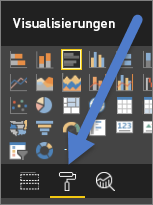

**Abbildung 31: Öffnen des Formatierungsbereichs**

Wählen Sie anschließend das anzupassende visuelle Element aus, und vergewissern Sie sich, dass „Ein“ festgelegt ist. Beispiele für visuelle Elemente: **X-Achse**, **Y-Achse**, **Titel**, **Datenbeschriftungen** und **Legende**. Im Beispiel unten wird das Element **Titel** verwendet.

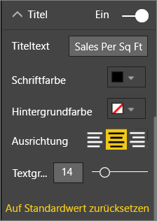

**Abbildung 32: Formatieren des Titels eines Visuals**

**Festlegen der Textgröße**

Die Textgröße kann für Titel und Datenbeschriftungen angepasst werden, aber nicht für X- oder Y-Achsen oder Legenden.  Probieren Sie speziell für Datenbeschriftungen verschiedene **Anzeigeeinheiten** und **Dezimalstellen** aus, bis Sie für die Anzeige im Bericht den optimalen Detailgrad ermittelt haben.   

**Festlegen der Textausrichtung**

Für die Titelausrichtung können Sie „Linksbündig“, „Rechtsbündig“ und „Zentriert“ wählen.  Entscheiden Sie sich für eine Option, und wenden Sie diese Einstellung für alle visuellen Elemente auf der Seite an.  

**Festlegen der Textposition**

Die Textposition kann für einige Y-Achsen und für die Legende angepasst werden.   Gehen Sie für die anderen Y-Achsen und Legenden der Seite genauso vor, nachdem Sie sich für eine Option entschieden haben.

**Festlegen der Länge für Titel und Beschriftungen**

Passen Sie die Länge der Titel, Achsentitel, Datenbeschriftungen und Legenden an. Wenn Sie sich für die Anzeige dieser Elemente entscheiden, wird durch das Anpassen der Länge (und der Textgröße) sichergestellt, dass nichts abgeschnitten wird. Für **Titel** und **Legende** lautet die Einstellung **Titeltext**. Hier geben Sie den eigentlichen Titel ein, der im visuellen Element angezeigt wird. Für **X-Achse** und **Y-Achse** lautet die Einstellung **Stil**, und Sie treffen Ihre Wahl in einer Dropdownliste. Für **Datenbeschriftungen** lauten die Einstellungen **Anzeige** und **Dezimal**. Verwenden Sie die Dropdownliste **Anzeige**, um die Maßeinheiten auszuwählen: Millionen, Tausende, Keine, Auto usw. Verwenden Sie das Feld **Dezimal**, um anzugeben, wie viele Dezimalstellen von Power BI angezeigt werden sollen.

**Festlegen der Textfarbe**

Die Textfarbe kann für Titel, Achsen und Datenbeschriftungen angepasst werden.  

#### Titel und Beschriftungen außerhalb von Visualisierungen
Weiter oben in diesem Whitepaper wurde das Einfügen von Textfeldern auf Berichtsseiten beschrieben. In einigen Fällen reichen die Titel der Visualisierungen nicht aus, um die Geschichte zu erzählen.  Fügen Sie Textfelder hinzu, um den Lesern Ihrer Berichte zusätzliche Informationen zu vermitteln.  
Damit die Berichtsseite nicht zu verwirrend oder voll aussieht, ist es ratsam, bei der Verwendung von Schriftarten, Schriftgrößen, Farben und der Ausrichtung einheitlich vorzugehen. Wählen Sie das Textfeld zum Vornehmen einer Anpassung am Text aus, um das Menü für die Formatierung zu öffnen.

**Abbildung 33: Formatieren der Schriftart in einem Textfeld**

#### Sortierung
Eine sehr einfache Möglichkeit zur Förderung des Verständnisses ist das Sortieren der visuellen Elemente. Wenn Sie Balkendiagramme beispielsweise anhand des Werts der Balken in absteigender oder aufsteigender Reihenfolge sortieren, können Sie signifikante inkrementelle Informationen schnell anzeigen, ohne dass mehr Platz verbraucht wird.

Wählen Sie zum Sortieren eines Diagramms die Auslassungspunkte (…) oben rechts im Diagramm und dann die Option **Sortieren**. Wählen Sie anschließend das Feld, nach dem sortiert werden soll, und die Richtung aus. Weitere Informationen finden Sie unter [Ändern der Sortierung eines Diagramms in einem Power BI-Bericht](../consumer/end-user-change-sort.md).

#### Interaktion und Zusammenwirken von Diagrammen
Eine der interessantesten Funktionen von Power BI ist die Möglichkeit zum Ändern der Art und Weise, wie Diagramme interagieren.  Standardmäßig funktionieren Hervorhebungen diagrammübergreifend: Wenn Sie einen Datenpunkt auswählen, werden die dazugehörigen Daten in anderen Diagrammen hervorgehoben und die nicht relevanten Daten abgeblendet. Sie können dieses Verhalten deaktivieren, um ein Diagramm als echten Filter zu verwenden und so Platz auf der Seite zu sparen. Wählen Sie hierzu in der Menüleiste die Option **Visuelle Interaktionen**.

**Abbildung 34: Visualinteraktionen**

Entscheiden Sie dann für jedes visuelle Element auf der Seite, ob das ausgewählte visuelle Element für die Filterung oder Hervorhebung verwendet werden oder ob keine Aktion durchgeführt werden soll. Nicht alle visuellen Elemente können hervorgehoben werden, und das Steuerelement für die Hervorhebung ist dann nicht verfügbar. Weitere Informationen finden Sie unter [Interaktionen mit Visualisierungen in einem Power BI-Bericht](../consumer/end-user-interactions.md).

> [!TIP]
> Für Leser, für die Power BI neu ist, ist das Klicken und Interagieren mit Berichten unter Umständen nicht gleich erkennbar. Fügen Sie Textfelder ein, damit verdeutlicht wird, worauf geklickt werden kann, um weitere Erkenntnisse zu gewinnen.
> 
> 

#### Verwendung von Farbe in visuellen Elementen
Weiter oben in diesem Whitepaper ging es um die Bedeutung eines Plans für den Einsatz von Farbe in einem Bericht. Einige Punkte werden hier wiederholt, aber im Wesentlichen geht es darum, wie Sie Farbe in den einzelnen visuellen Elementen einsetzen können. Es gelten auch wieder die gleichen Grundprinzipien: Nutzen Sie Farbe, um den Bericht konsistent zu machen, die Aufmerksamkeit auf wichtige Daten zu lenken und die Verständlichkeit des visuellen Elements für Leser zu fördern. Der Einsatz von zu vielen unterschiedlichen Farben lenkt ab und erschwert Lesern das Auffinden der gewünschten Informationen. Vermeiden Sie es, die Verständlichkeit auf Kosten des hübschen Designs zu reduzieren. Fügen Sie nur Farbe hinzu, wenn dies der Verständlichkeit dient.

> [!TIP]
> Stellen Sie sicher, dass Sie genau wissen, wie Ihre Zielgruppe aussieht und welche Regeln in Bezug auf Farben gelten.  In den USA steht Grün normalerweise für „positiv“ und Rot für „negativ“.
> 
> 

Dieses Thema ist in die folgenden Unterpunkte unterteilt:

1. Farben für Daten
2. Farben für Datenbeschriftungen
3. Farben für Kategoriewerte
4. Farben für Zahlenwerte

**Verwenden von Farben zum Hervorheben von interessanten Daten**

Die einfachste Möglichkeit zur Verwendung von Farben besteht darin, die Farbe von einem oder mehreren Datenpunkten zu ändern, um die Aufmerksamkeit darauf zu lenken. In diesem Beispiel ändert sich die Farbe an dem Punkt, an dem sich der Jahresrhythmus für die Olympischen Sommer- und Winterspiele geändert hat (abwechselnd alle zwei Jahre, anstatt alle vier Jahre).

**Abbildung 35:    Verwenden von Farben zum Erzählen einer Geschichte**

Sie können die Farbe von Datenpunkten im Formatierungsbereich auf der Registerkarte **Datenfarben** ändern. Stellen Sie sicher, dass **Alle anzeigen** auf „Ein“ festgelegt ist, wenn Sie jeden Datenpunkt einzeln anpassen möchten.

**Abbildung 36: Festlegen von Farben für Datenpunkte**

> [!NOTE]
> Power BI wendet ein Standarddesign auf die visuellen Elemente des Berichts an.  Die Designfarben wurden so gewählt, dass für Abwechslung und Kontrast gesorgt ist. Wählen Sie die Option **Benutzerdefinierte Farbe**, wenn Sie von der Palette mit den Standardfarben abweichen möchten.
> 
> 

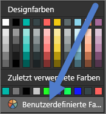

**Abbildung 37: Auswählen einer benutzerdefinierten Farbe**

In Power BI Desktop können Sie sogar Ausreißer oder einen bestimmten Abschnitt einer Linie hervorheben, indem Sie eine zweite Reihe verwenden:

**Abbildung 38:    Verwenden von Desktop zum Darstellen von Ausreißern**

Hier sind in der Reihe „Ausreißer“ nur Werte enthalten, wenn die Durchschnittstemperatur für den Monat August unter 15,5 °C (60 °F) gefallen ist. Hierfür wurde mit der folgenden Formel per DAX-Berechnung eine Spalte erstellt:

Outliers = if(Editions[Temp]<60, Editions[Temp], BLANK())

Unser Beispiel enthält drei Ausreißer: 1952, 1956 und 2000.

**Farben für Beschriftungen und Titel**

Wenn Sie sich alle verfügbaren Formatierungsoptionen ansehen, erkennen Sie die vielen Möglichkeiten zum Einfügen von Farbe für Titel und Legenden. Sie können beispielsweise die Farbe von Datenbeschriftungen und Achsentiteln ändern. Gehen Sie hierbei mit Bedacht vor.  Es ist meist ratsam, für alle Titel von visuellen Elementen die gleiche Farbe zu nutzen.  Wie für alle Regeln in diesem Whitepaper gilt auch hier, dass es immer Fälle und Gründe geben kann, die „Regeln zu brechen“. Wenn Sie sich zu diesem Schritt entschließen, sollten Sie dies aber aus einem guten Grund tun.

**Farben für Kategoriewerte**

Diagramme mit einer Datenreihe enthalten in der Legende normalerweise einen Kategoriewert. Jede Farbe in der unten angegebenen Legende steht für eine andere Kategorie im Bereich „Land/Region“.

**Abbildung 39: Angewendete Standardfarben**

Die Farben, die von Power BI standardmäßig verwendet werden, wurden speziell ausgewählt und sollen eine gute farbliche Trennung zwischen Kategoriewerten ermöglichen, damit sie gut unterschieden werden können. Es kann vorkommen, dass Benutzer diese Farben ändern, um sie an das im Unternehmen verwendete Schema anzupassen. Dies kann aber zu Problemen führen.

**Abbildung 40: Anwendung von Farbe in Form von Farbtönen einer bestimmten Farbe**

Indem nur ein einzelner Farbton verwendet und die Intensität der Farbe variiert wurde, wurde in diesem visuellen Element eine scheinbare Sortierung für die Kategorien erzielt. Es wird impliziert, dass die dunkleren Blasen auf einer Skala höher oder niedriger als die helleren Blasen angeordnet sind. Für diese Art von Kategoriewerten gilt normalerweise mit Ausnahme der alphabetischen Sortierung keine andere Sortierung.
Öffnen Sie zum Ändern der Standardfarben den Formatierungsbereich, und wählen Sie die Option **Datenfarben**.

**Farben für Zahlenwerte**

Für Felder, die über eine inhärente Reihenfolge und einen Zahlenwert verfügen, können Sie Datenpunkte auch basierend auf dem Wert mit einer Farbe versehen. Dies kann nützlich sein, um die Verteilung der Werte über die Daten hinweg darzustellen und zwei Variablen gemeinsam in einem Diagramm anzuzeigen. In diesem Diagramm wird beispielsweise verdeutlicht, dass China zwar die höchste Zahl von Medaillen errungen hat, aber dass Japan und Thailand an mehr Olympischen Spielen teilgenommen haben.

**Abbildung 41: Versehen von Datenpunkten mit Farbe basierend auf dem Wert**

Geben Sie zum Erstellen dieses Diagramms einen Wert in das Feld „Farbsättigung“ ein, und passen Sie die Farben dann im Formatierungsbereich an.

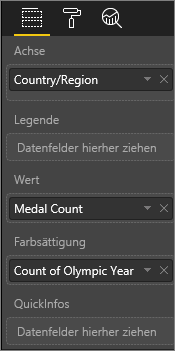

**Abbildung 42: Hinzufügen eines Felds für die Farbsättigung**

**Abbildung 43: Anpassen der für die Sättigung verwendeten Farben**

Farben können auch verwendet werden, um die Varianz für einen Hauptwert hervorzuheben. Ein Beispiel hierfür sind grüne positive Werte und rote negative Werte. Beachten Sie die kulturellen Unterschiede, wenn Sie positiven oder negativen Werten Farben zuweisen. Nicht überall wird die Farbe Rot für „negativ“ und Grün für „positiv“ verwendet!

**Abbildung 44:    Farbe zum Hervorheben der Varianz für einen Hauptwert**
 

### Grundlagen des Entwurfs von visuellen Elementen – Anwendung auf die Berichtsseite aus dem Beispiel
Nun wenden wir die oben beschriebenen Grundlagen für visuelle Element auf unseren Beispielbericht an.

Vorher

**Abbildung 45:    Beispielbericht (vorher)**

Nachher

**Abbildung 46: Beispielbericht (nachher)**

#### Was haben wir unternommen?
1. Datenschnitt: Wir haben die Leerstellen aus den Datenschnitten entfernt, indem wir einen Filter auf Seitenebene hinzugefügt und nur Gold, Silber und Bronze ausgewählt haben. Wir haben die Option **Auswahlsteuerelemente** für **Einfachauswahl** und **Alles auswählen** auf „Aus“ festgelegt.
2. Blase: Die Legende enthält so viele Elemente, dass nicht alle sichtbar sind.  Wir haben die Legende entfernt und stattdessen **Kategoriebeschriftungen** aktiviert. Kunden können den Mauszeiger auf die Blasen bewegen, um die Details anzuzeigen. Wir haben den Titel gekürzt und den Zusatz „by countryregion“ entfernt, weil dies offensichtlich ist. Wir haben die Achsenbeschriftungen jeweils auf „Ein“ festgelegt, damit das Diagramm leichter verständlich ist.
3. Flächenkartogramm: Wir haben die **Datenfarben** geändert, um eine bessere Hervorhebung zu erzielen. Wir haben **Abweichend** aktiviert und das **Minimum** auf „Rosa“ und das **Maximum** auf „Rot“ festgelegt.
4. Strukturkarte: Wir haben den Filter entfernt, der nur für die USA galt. Legen Sie für die **Datenbeschriftungen** eine Dezimalstelle fest. Für das visuelle Element wurde das Feld „Klasse“ verwendet. Dies ist nicht sehr nützlich, da der Wert fast immer 33 % (Gold/Silber/Bronze) beträgt.  Wir haben ein interessanteres Feld ausgewählt (Geschlecht). Aus Designgründen haben wir „Aquatics“ (Wassersport) in Blau und „Athletics“ (Leichtathletik) in Grau geändert.
5. Oberes Balkendiagramm: Wir haben den Titel verkürzt, die Datenbeschriftungen entfernt und den Legendentitel deaktiviert. Wir haben die Wortreihenfolge im Titel geändert, um sie an das Diagramm unten anzupassen.
6. Unteres Balkendiagramm: Wir haben aufsteigend nach dem Jahr sortiert, damit dies mit dem obigen Diagramm übereinstimmt. Wir haben die Farben geändert, damit sie mit der Klasse übereinstimmen. Der Titel wurde geändert. Wir haben die Legende deaktiviert, um mehr Platz für Daten zu erhalten. Wir haben die Datenbeschriftungen aktiviert, die im Bericht nicht angezeigt werden (da das visuelle Element zu klein ist und die Beschriftungen nicht lesbar wären), sondern nur, wenn das visuelle Element im Fokusmodus geöffnet wird. [Informationen zum Fokusmodus](../consumer/end-user-focus.md). Die Anzahl von (eindeutigen) Veranstaltungen wurde unter **QuickInfo** hinzugefügt. Wenn Sie mit der Maus jetzt auf eine gestapelte Säule zeigen, werden Sie über die QuickInfo nun auch darüber informiert, wie viele Veranstaltungen während des Jahres stattgefunden haben.
7. Visuelle Interaktionen: Wir haben die Interaktionen für beide Karten deaktiviert, da immer alle Spiele und Sportarten angezeigt werden sollen.

## Arten von visuellen Elementen und bewährte Methoden
In Power BI werden viele Arten von Visuals nativ bereitgestellt.  Wenn wir nun noch die benutzerdefinierten visuellen Elemente hinzufügen, die über Microsoft und die Power BI-Community verfügbar sind, werden die Optionen für visuelle Elemente zu zahlreich, um hier dokumentiert zu werden. Wir gehen aber auf die am häufigsten verwendeten nativen Visualtypen ein.  

### Liniendiagramme

Liniendiagramme sind eine gute Möglichkeit, um Daten in Abhängigkeit der Zeit darzustellen.  Wenn wir uns Daten in Tabellen ansehen, können die Augen sie nicht so schnell erfassen, wie dies bei den Spitzen, Tälern, Zyklen und Mustern dieser Diagrammdarstellung möglich ist.  
Im Beispiel unten sind die Trends bei der Anzahl von vergebenen Medaillen und der Anzahl von Athleten erkennbar, die diese Medaillen errungen haben.  

**Abbildung 47:    Liniendiagramme**

#### Bewährte Methoden
* Beim Ansehen von Liniendiagrammen fällt Benutzern zuerst die Form der Kurve auf.  Dies bedeutet, dass Sie eine X-Achse benötigen, damit die Kurve aussagekräftig ist, z.B. mit Zeit- oder Verteilungskategorien.  Wenn Sie auf der X-Achse Kategoriefelder wie „Produkt“ oder „Geografische Region“ anordnen, ist das Liniendiagramm uninteressant, da die Form der Kurve keine Aussagekraft hat.
* Wenn Sie mehrere Diagramme wie hier über- bzw. untereinander anordnen, sollten Sie die X-Achsen ausrichten, um das Vergleichen der Datenreihen zu vereinfachen. Verwenden Sie Filter, um sicherzustellen, dass der gleiche Filterbereich angezeigt wird.  Stellen Sie bei Datumsbereichen beispielsweise sicher, dass die gleichen Bereiche verwendet werden.  Beispiel: 1896 bis 2012 in beiden Diagrammen.
* Nutzen Sie den vorhandenen Platz auf bestmögliche Weise.  Gehen Sie wie folgt vor, sofern es für Ihre Daten sinnvoll ist: Legen Sie die Start- und Endpunkte für die Y-Achse so fest, dass oben und unten im Diagramm keine leeren Flächen entstehen und der Fokus auf den eigentlichen Datenpunkten liegt. Wählen Sie hierzu das Farbrollen-Symbol aus, um den Formatierungsbereich zu öffnen. Erweitern Sie den Bereich für die **Y-Achse**, und legen Sie die Punkte für **Start** und **Ende** fest.
  
  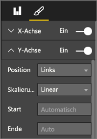
  
  **Abbildung 48: Festlegen der Start- und Endpunkte**
* Ein weiterer Grund dafür, warum die Start- und Endpunkte explizit festgelegt werden sollten, ist die Vergleichsmöglichkeit von zwei oder mehr Diagrammen auf einer Seite anhand des gleichen Felds der Y-Achse.  Wenn Sie sich beispielsweise kumulative Veranstaltungszahlen ansehen und die Zahlen für das Vereinigte Königreich von 1 bis 70 und für Australien von 1 bis 12 reichen, werden in den beiden Liniendiagrammen sehr unterschiedliche Y-Achsen angezeigt (Abbildung 49). Dies erschwert einen Vergleich auf den ersten Blick. Legen Sie die Diagramme stattdessen so fest, dass der gleiche Bereich für die Y-Achse verwendet wird (Abbildung 50).
  
  
  
  **Abbildung 49: Liniendiagramme mit unterschiedlichen Y-Achsen**
  
  
  
  **Abbildung 50: Liniendiagramme mit gleichen Y-Achsen**

Weitere Informationen finden Sie unter:

* [Customize the X and Y axes](power-bi-visualization-customize-x-axis-and-y-axis.md) (Anpassen der X- und Y-Achsen)
* [Line charts and irregular intervals](http://www.perceptualedge.com/articles/visual_business_intelligence/line_graphs_and_irregular_intervals.pdf) (Liniendiagramme und unregelmäßige Intervalle)
* [Line charts 101](http://www.columnfivemedia.com/data-visualization-101-line-charts) (Grundlagen von Liniendiagrammen)

### Balken-/Säulendiagramme

Wenn Liniendiagramme der Standard für die Darstellung von Daten in Abhängigkeit der Zeit sind, sind Balkendiagramme der Standard für die Darstellung eines bestimmten Werts für unterschiedliche Kategorien.  Wenn Sie die Balken anhand des Zahlenwerts sortieren, sind die höchsten Werte und die Verteilung sofort erkennbar.  Horizontale Balkendiagramme eignen sich gut für längere Beschriftungen.  

**Abbildung 51: Horizontales Balkendiagramm**

#### Bewährte Methoden
* Nutzen Sie Datenbeschriftungen für Werte.  Dies erleichtert Ihnen die Identifizierung von bestimmten Werten. Öffnen Sie hierfür den Formatierungsbereich, und legen Sie die Option **Datenbeschriftungen** auf „Ein“ fest.
  
  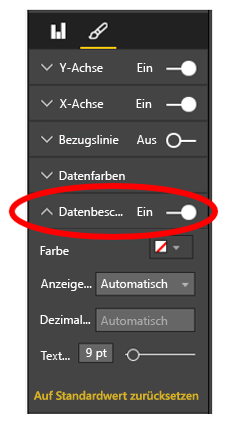
  
  **Abbildung 52: Aktivieren von Datenbeschriftungen**
* Das obige Balkendiagramm ist sehr gut geeignet, um ein Measure für **einen bestimmten Zeitpunkt** mit vielen anderen Measures zu vergleichen.  Während oben im Liniendiagramm der Trend in Abhängigkeit der Zeit verdeutlicht wurde, ist im Balkendiagramm der Trend für eine einzelne Kategorie zu einem bestimmten Zeitpunkt zu sehen.  In unserem Balkendiagramm ist sofort erkennbar, dass Spanien eine der weltweit höchsten Arbeitslosenquoten aufweist (25 %).
* Wenn der zugeordnete Platz für ein Balken- bzw. Säulendiagramm nicht ausreicht, werden in Power BI Bildlaufleisten eingefügt. Bauen Sie das visuelle Element und den Bericht – sofern dies möglich und sinnvoll ist – so auf, dass Diagramme vollständig zu sehen sind, damit die Leser sich einen Überblick über die gesamte Verteilung verschaffen können.  Aufgrund der hohen Zahl von Ländern der Welt ist dies in unserem Beispiel leider nicht möglich.
  
  Eine Möglichkeit zur Begrenzung der einbezogenen Werte ist die Verwendung eines Filters. Fügen Sie beispielsweise einen Filter auf visueller Ebene hinzu, damit ein Land nur angezeigt wird, wenn die Arbeitslosenquote über 20 % liegt.
* Für Balken-/Säulendiagramme kann ein Drilldown (und anschließend ein Drillup) durchgeführt werden.  Dies ist eine hervorragende Möglichkeit, um mehr Informationen in einem visuellen Element unterzubringen, ohne dass mehr Platz belegt wird.  Das folgende Beispiel enthält eine Hierarchie für „Regionen“ > „Länder“.  Wenn Sie auf den Balken für eine Region klicken, wird ein Drilldown zu den Ländern durchgeführt, die sich in der Region befinden.  Weitere Informationen zu Drilldown- und Drillup-Vorgängen finden Sie unter [Drilldown in einer Visualisierung in Power BI](../consumer/end-user-drill.md).
  
  
  
  **Abbildung 53: Drilldown ausführen**

Ausführlichere Informationen zu Balken- und Säulendiagrammen finden Sie auf den folgenden Seiten:

* [Bar charts 101](http://blog.newscred.com/article/data-visualization-101-bar-charts) (Grundlagen von Balkendiagrammen)
* [Data Visualization Catalogue: Bar Chart](http://www.datavizcatalogue.com/methods/bar_chart.html#.VYV-hY3bLJw) (Katalog für Datenvisualierungen: Balkendiagramm)
* [Data Visualization Catalogue: Multi-Set Bar Chart](http://www.datavizcatalogue.com/methods/multiset_barchart.html#.VYV_gI3bLJw) (Katalog für Datenvisualierungen: Multiset-Balkendiagramm)

### Gestapelte Balken-/Säulendiagramme

Fügen Sie Ihren Balken-/Säulendiagrammen eine weitere Dimension hinzu, indem Sie verschiedene Kategorien im Balken oder in der Säule stapeln.  Mit dem Diagramm werden dann nicht nur Informationen zu einem Haupttrend vermittelt (basierend auf Höhe/Länge), sondern es wird auch der Einfluss der Kategorien auf diesen Trend dargestellt. Im Diagramm unten wird die Umsatzsteigerung von Fußball-Spitzenteams auf Beträge von über 6 Milliarden im Jahr 2014 veranschaulicht.

**Abbildung 54: Gestapeltes Säulendiagramm**

Dieses gestapelte Säulendiagramm verdeutlicht, dass sich der Gesamtumsatz im Laufe der Zeit erhöht und dass die Werte in den Kategorien „Commercial“ und „Broadcasting“ stetig zunehmen – und so zur Steigerung des Gesamtumsatzes beitragen.  Mit diesem Diagramm ist es aber nicht ohne Weiteres möglich, die Auswirkungen zu vergleichen, die die drei Kategorien jeweils aufeinander haben. Beispiel: Wie verhält sich die Steigerung in der Kategorie „Commercial“ zur Steigerung in den Kategorien „Broadcasting“ oder „Match Day“?  Eine bessere Wahl für diese Daten oder für ein begleitendes visuelles Element wäre ein Liniendiagramm.  

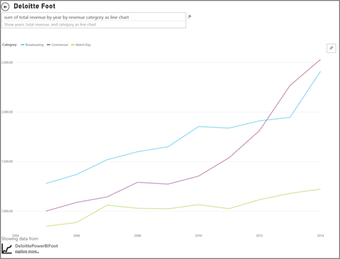

**Abbildung 55: Konvertieren in ein Liniendiagramm**

In diesem Liniendiagramm ist leicht erkennbar, dass der Umsatzanstieg für „Commercial“ am höchsten war, gefolgt von „Broadcasting“ und „Match Day“.

#### Bewährte Methoden
* Wie bei Balken-/Säulendiagrammen auch, können Sie die horizontale oder die vertikale Anzeige wählen.   Die horizontale Anzeige ist die bessere Wahl, wenn Sie lange Beschriftungen verwenden, und die vertikale Anzeige hat Vorteile, wenn Sie Zeitreihendaten verwenden.  
* Vermeiden Sie die Nutzung von gestapelten Balken-/Säulendiagrammen, wenn Sie Trends und andere Veränderungsmuster in Abhängigkeit der Zeit darstellen möchten.  Andere Diagramme, z.B. Liniendiagramme, sind für diese Aufgabe deutlich besser geeignet.
* Sie können das Diagramm auch so einrichten, dass die Verteilung auf dem Gesamtvolumen oder einem Prozentsatz des Gesamtwerts basiert.  
* Wie Stephen Few angemerkt hat *, ist es schwierig, die Segmente eines gestapelten Balkens zu vergleichen. Wenn die Segmente nebeneinander angeordnet werden und alle von der gleichen Grundlinie aus nach oben verlaufen, kann die Höhe leicht verglichen werden. Dies ist aber schwierig, wenn sie gestapelt werden. Außerdem ist zwar relativ leicht erkennbar, wie sich der Umsatz von Monat zu Monat geändert hat, aber es nicht einfach zu sehen, wie sich der Umsatz in anderen Kategorien geändert hat*.  
* Diagramme vom Typ „Gestapelt (100 %)“ sind eine gute Wahl, wenn Sie Prozentsätze verwenden, die zusammen den Wert 100 ergeben.  Im Beispiel unten ist die Kategorieverteilung nach Team zu sehen.  Die Prozentsätze sind relativ und ermöglichen das Erkennen von Mustern auf einen Blick. Der Umsatz von Everton stammt hauptsächlich aus der Kategorie „Broadcasting“ (über 70 %), während PSG nur 20 % seines Umsatzes in dieser Kategorie erzielt.  Wenn die horizontale Anzeige gewählt wird, ist mehr Platz für die Namen der Teams vorhanden, und die Auswirkung der Umsatzart ist besser erkennbar.
  
  
  
  **Abbildung 56: Horizontales gestapeltes Diagramm**

Weitere Informationen zu gestapelten Diagrammen:

* [Data Visualization Catalogue: Stacked bar graphs](http://www.datavizcatalogue.com/methods/stacked_bar_graph.html#top) (Katalog für Datenvisualisierungen: Gestapelte Balkendiagramme)
* [When are 100% stacked bar graphs useful?](http://www.perceptualedge.com/blog/?p=2239) (Wann sind „Gestapelte Balkendiagramme (100 %)“ sinnvoll?)

### Kombinationsdiagramme (Balken/Säulen)

In Power BI können Sie Säulen- und Liniendiagramme zu einem Kombinationsdiagramm kombinieren. Die Optionen sind: „Linien- und gestapeltes Säulendiagramm“ und „Linien- und gruppiertes Säulendiagramm“. Sparen Sie wertvollen Platz im Zeichenbereich, indem Sie zwei separate visuelle Elemente kombinieren.

Die beiden Screenshots unten zeigen den Zustand vorher und nachher.  Die erste Seite enthält zwei separate visuelle Elemente: ein Säulendiagramm mit der Bevölkerungszahl in Abhängigkeit der Zeit und ein Liniendiagramm mit dem Bruttoinlandsprodukt (BIP) in Abhängigkeit der Zeit. Diese Diagramme sind ein guter Kandidat für ein Kombinationsdiagramm, weil sie über die gleiche X-Achse (Jahr) und die gleichen Werte (2002 bis 2012) verfügen.  Warum kombinieren wir die Diagramme nicht, um die beiden Trends in einem visuellen Element gemeinsam anzuzeigen und zu vergleichen?  Die Kombination dieser beiden Diagramme ermöglicht einen schnelleren Vergleich der Daten.

Die neue Berichtsseite enthält nur noch ein visuelles Element: ein Linien- und gestapeltes Säulendiagramm. Wir hätten auch ein Linien- und gruppiertes Säulendiagramm erstellen können.  Es ist jetzt leichter möglich, nach einer Beziehung zwischen den beiden Trends zu suchen.   Wir sehen, dass der Trend für die Bevölkerungszahl und das BIP bis 2008 ähnlich verlaufen sind. Ab 2009 flachte die Zunahme der Bevölkerung ab, und das BIP wurde volatiler.  

 **Abbildung 57: Zwei separate Diagramme**

 **Abbildung 58: Einzelnes Kombinationsdiagramm**

#### Bewährte Methoden
Kombinationsdiagramme funktionieren am besten, wenn beide visuellen Elemente mindestens eine gleiche Achse aufweisen.

Achten Sie auf die Achsen! Lässt sich Ihr Kombinationsdiagramm leicht lesen und interpretieren?  Oder werden unterschiedliche Bereiche und Werte verwendet? Wenn der Maßstab der Y-Achse des Säulendiagramms beispielsweise deutlich kleiner als der Maßstab der Y-Achse des Liniendiagramms ist, ist das Kombinationsdiagramm nicht aussagekräftig.  Sehen Sie sich beispielsweise die dritte Zeile (Farbe „Aquamarin“) ganz unten an.

   

   **Abbildung 59: Ungeeignetes Liniendiagramm**

Das Kombinationsdiagramm ist auch nicht aussagekräftig, wenn für das Säulendiagramm und das Liniendiagramm zwei verschiedene Measures verwendet werden und Sie nicht zwei Achsen erstellen.  Beispiel: US-Dollar und Prozent. Binden Sie beide Achsen ein, damit die Leser das Diagramm besser verstehen können, und erwägen Sie auch, Achsenbeschriftungen zu verwenden.

Öffnen Sie hierzu den Formatierungsbereich, erweitern Sie die **Y-Achse**, und legen Sie die Option **Sekundäre anzeigen** auf „Ein“ fest (falls nicht bereits aktiviert). Diese Einstellung ist manchmal nicht leicht zu finden. Erweitern Sie die Option **Y-Achse (Spalte)** , und scrollen Sie nach unten, bis die Option **Sekundäre anzeigen** zu sehen ist. Legen Sie außerdem den **Titel** für „Y-Achse (Spalte)“ auf „Ein“ und den **Titel** für „Y-Achse (Linie)“ auf „Ein“ fest.

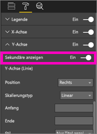

**Abbildung 60: Anzeigen der Sekundärachse**

**Abbildung 61: Erstellen eines Kombinationsdiagramms als Alternative**

* Nutzen Sie die Vorteile von zwei Achsen. Dies ist eine gute Möglichkeit, um mehrere Measures mit verschiedenen Wertebereichen zu vergleichen. Außerdem können so die Zusammenhänge von zwei Measures in einem visuellen Element dargestellt werden.

Weitere Informationen:

* [Kombinationsdiagramm in Power BI](power-bi-visualization-combo-chart.md)
* [The danger of dual-scaled axes in visuals](http://www.perceptualedge.com/articles/visual_business_intelligence/dual-scaled_axes.pdf) (Die Gefahr von Achsen mit unterschiedlichem Maßstab in visuellen Elementen)

### Punktdiagramm

In einigen Fällen sind viele Variablen vorhanden, die zusammen dargestellt werden sollen. Ein Punktdiagramm kann sehr nützlich sein, um sich einen Gesamtüberblick zu verschaffen.  Mit Punktdiagrammen werden Beziehungen zwischen zwei (Punktdiagramm) oder drei (Blasendiagramm) quantitativen Measures dargestellt.  Ein Punktdiagramm weist immer zwei Wertachsen auf, sodass ein Satz von numerischen Daten entlang einer horizontalen Achse und ein anderer Satz von numerischen Werten entlang einer vertikalen Achse angezeigt werden. Das Diagramm zeigt Schnittpunkte von x- und y-Zahlenwerten an, wobei diese Werte in jeweils einem einzelnen Punkt kombiniert werden. Diese Datenpunkte können in Abhängigkeit von den Daten gleichmäßig oder ungleichmäßig auf der horizontalen Achse verteilt sein.

In einem Blasendiagramm werden die Datenpunkte durch Blasen ersetzt, wobei die Blasengröße eine zusätzliche Datendimension darstellt.

Das unten angegebene Blasendiagramm gilt für Südamerika und enthält einen Vergleich des BIP pro Kopf (Y-Achse), der BIP-Summe (X-Achse) und der Bevölkerung nach Land in Südamerika.  Die Größe der Blasen steht für die Gesamtbevölkerung eines Lands. Brasilien weist die höchste Bevölkerungszahl (Blasengröße) und den größten Anteil am BIP von Südamerika auf (höchster Wert auf der X-Achse).  Beachten Sie aber, dass das BIP pro Kopf für Uruguay, Chile und Argentinien höher als für Brasilien ist (höhere Werte auf der Y-Achse).

**Abbildung 62: BIP und Bevölkerung für Südamerika als Blasendiagramm**

Wenn Sie eine Wiedergabeachse hinzufügen, können Sie so tun, als ob Sie Hans Rosling sind, und die Geschichte erzählen (https://www.youtube.com/watch?v=PbaDBJWCeD4). Ziehen Sie zum Hinzufügen einer Wiedergabeachse ein datetime-Feld in den Bereich **Wiedergabeachse**.

#### Bewährte Methoden
* Punkt- und Blasendiagramme eignen sich gut zum Erzählen von Geschichten. Für das Untersuchen von Daten sind sie dagegen nicht so nützlich.  Auf diesen Punkt weist Stephen Few im Absatz unten hin.*Die Stärke dieses Ansatzes ist die Verwendung zum Erzählen einer Geschichte. Wenn Hans Rosling kommentiert, was im Diagramm passiert, während sich die Blasen bewegen und ihre Werte ändern, und auf die interessanten Aspekte hinweist, werden die Informationen zum Leben erweckt. Animierte Blasendiagramme sind aber deutlich weniger effektiv, was das Untersuchen und Interpretieren der Daten betrifft, wenn Sie dies allein versuchen. Vermutlich setzt Hans Rosling diese Methode nicht zum Ermitteln der Geschichten ein, sondern nur zum Erzählen, nachdem die Geschichte bereits steht. Wir können nicht auf mehr als eine Blase gleichzeitig achten, während sie sich bewegen. Also müssen wir die Animation immer wieder abspielen und versuchen, die Geschehnisse zu erfassen. Wir können Spuren für ausgewählte Blasen hinzufügen, damit wir den gesamten Weg der Blasen verfolgen können. Aber wenn die Spuren für eine höhere Zahl von Blasen aktiviert werden, wird das Diagramm schnell unübersichtlich. Mit diesen Informationen möchte ich im Wesentlichen darauf hinweisen, dass dies nicht die beste Möglichkeit ist, um diese Informationen zu Untersuchungs- und Analysezwecken anzuzeigen.*
* Fügen Sie Beschriftungen für die X- und Y-Achsen ein, damit mehr Informationen zum Vermitteln der Geschichte vorhanden sind.  Besonders bei Blasendiagrammen sind viele Komponenten involviert, und Beschriftungen tragen zum besseren Verständnis des visuellen Elements bei.
* Fügen Sie Datenbeschriftungen ein, damit das visuelle Element leichter interpretiert werden kann.  Vor allem bei Blasendiagrammen kann es schwierig sein, zwischen ähnlichen Farben zu unterscheiden, wenn die Legende viele Einträge enthält.  Im obigen visuellen Element sind die Legendenfarben für Suriname, Kolumbien und Ecuador sehr ähnlich.
* Haben Sie ein Punktdiagramm erstellt, und sehen Sie nur einen Datenpunkt, unter dem alle Werte auf der X- und der Y-Achse zusammengefasst sind? Oder werden im Diagramm alle Werte auf einer einzelnen horizontalen oder vertikalen Linie zusammengefasst?  Gehen Sie wie folgt vor, um dieses Problem zu beheben: Fügen Sie im Bereich **Details** ein Feld hinzu, damit Power BI erkennt, wie die Werte gruppiert werden sollen. Das Feld muss für jeden Punkt, der dargestellt werden soll, eindeutig sein. Hilfe finden Sie unter [Tutorial: Punktdiagramme und Blasendiagramme in Power BI](power-bi-visualization-scatter.md).

### Strukturdiagramme

Strukturdiagramme können sehr nützlich sein, um einen guten Überblick über die relative Größe verschiedener Komponenten zu erhalten, die ein Ganzes bilden – besonders wenn eine Gruppierung nach Kategorien möglich ist.  Immer wenn ich versuche, einen neuen Geschäftsansatz zu verstehen, kann ein Strukturdiagramm mit den Hauptkomponenten sehr nützlich dabei sein, die Gesamtverteilung darzustellen.

Im ersten der unten angegebenen Diagramme sehen Sie sofort, dass Brasilien ungefähr die Hälfte des BIP von Südamerika beisteuert und dass Venezuela und Argentinien ungefähr die gleiche Größe haben.

Wenn Sie einen weiteren Kontext benötigen und trotzdem die Auswirkungen der Länder mit den höchsten Anteilen sehen möchten, können Sie visuelle Hierarchien erstellen, in denen die Elemente der Kategorie (Länder) in den Regionen geschachtelt sind. Im zweiten Strukturdiagramm sehen wir vor allem die relative Größe der Regionen und können in den einzelnen Regionen erkennen, welche Länder den größten Teil beitragen. Wir sehen, dass es drei sehr große Regionen gibt (Europa, Asien und Nordamerika), und die jeweiligen wichtigsten Länder bzw. Regionen sind gut zu erkennen.

Die wichtigste Einschränkung eines Strukturdiagramms ist, dass die unterschiedlichen Rechtecke über die obersten Rechtecke hinaus nur schwer verglichen werden können.  Das Diagramm ist gut geeignet, um sich einen Überblick zu verschaffen. Balken- und Säulendiagramme sind aber meist die bessere Wahl, wenn es um präzise Informationen zur relativen Größe von unterschiedlichen Komponenten geht.
 
Im ersten Strukturdiagramm erhalten Sie grobe Informationen zur Reihenfolge der BIP-Anteile, aber es ist nicht einfach, spezifische Unterschiede zwischen den Ländern auszumachen – besonders für die kleineren Felder ohne Beschriftung. Für diese Daten, bei denen eine einzelne Gruppierung verglichen werden soll, ist ein Balken- oder Säulendiagramm wahrscheinlich besser geeignet.

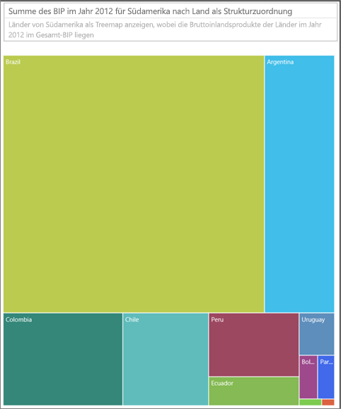

**Abbildung 63: Vergleich des BIP für Südamerika per Strukturdiagramm**

Hier haben wir eine zusätzliche Datenebene (Region) hinzugefügt und sehen den gesamten BPI-Beitrag nach Regionen sowie die relative Auswirkung in den Regionen. Beachten Sie Folgendes: Bei Verwendung von nicht summativen Measures (z.B. Durchschnittswerten) stellt die Summe der Details unter Umständen nicht den tatsächlichen Wert auf Aggregatebene dar.

**Abbildung 64: BIP nach Region und Land als Strukturdiagramm**

Weitere Informationen zu Strukturdiagrammen finden Sie unter den unten angegebenen Links.

* [Treemaps overview](http://www.perceptualedge.com/articles/b-eye/treemaps.pdf) (Übersicht über Strukturdiagramme)
* [Data Visualization Catalogue: Tree maps](http://www.datavizcatalogue.com/methods/treemap.html#.VYhylI3bL7Y) (Katalog für Datenvisualisierungen: Strukturkarten)

### Andere Diagramme
#### Kreis- oder Ringdiagramme

Im Allgemeinen reichen Balken-, Säulen- und Liniendiagramme für die meisten Zwecke aus. Es ist bekannt, dass Kreis- und Ringdiagramme von Menschen nur schwer richtig interpretiert werden können und dass die Daten häufig verzerrt sind. Vermeiden Sie es nach Möglichkeit, diese Diagramme zu verwenden. Stephen Few hat einen hervorragenden Artikel zur Geschichte und zu den Gefahren verfasst: [Save the Pies for Dessert]([www.percetualedge.com/articles/08-21-07.pdf](http://www.perceptualedge.com/articles/08-21-07.pdf)).

Er beschreibt einen Fall, in dem Kreisdiagramme nützlich sein können: beim Vergleichen der Beziehungen von Teilen zum Ganzen. Aber auch dieser Ansatz liefert nur in seltenen Fällen deutlich bessere Ergebnisse als ein Diagramm vom Typ „Gestapeltes Balkendiagramm (100 %)“.

Einen weiteren interessanten Artikel (und eine Animation) zu Kreisdiagrammen finden Sie auf der [Darkhorse Analytics-Website](http://www.darkhorseanalytics.com/blog/salvaging-the-pie).

#### Radiale Messgeräte und KPIs

Radiale Messgeräte scheinen gute visuelle Elemente zu sein, um die Leistung gegenüber einem Zielwert anzuzeigen, und sind in Dashboards für Führungskräfte sehr beliebt. Sie haben allerdings zwei entscheidende Nachteile. Wie bei Kreisdiagrammen auch, ist es nicht einfach, den Winkel des schattierten Bereichs gegenüber dem vollständigen 180-Grad-Bogen oder der Ziellinie zu interpretieren. Außerdem wird viel Platz verbraucht, um eine einzelne Metrik anzuzeigen.

Eine gute Alternative ist ein einfaches visuelles KPI-Element.

Mit KPIs werden der Wert, der Status, der Zielwert und die Abweichung vom Zielwert und Trend gemeinsam in einem Bereich angezeigt. Die grüne Farbe ändert sich in Rot, wenn das Ziel nicht erreicht wird, oder ggf. in Gelb, wenn ein Zwischenziel erreicht wird. Das KPI-Element kann viel einfacher als das Messgerät gelesen und interpretiert werden.

Weitere Informationen finden Sie unter:

* [Radialmessgerät-Diagramme in Power BI](power-bi-visualization-radial-gauge-charts.md)
* [KPIs in Power BI](power-bi-visualization-kpi.md)

## Fazit
Sie können diese bewährten Methoden jetzt in der Praxis testen.  Bleiben Sie mit uns in Kontakt. Wir würden uns freuen, wenn Sie uns über Ihre bewährten Methoden informieren würden. Sind Sie anderer Meinung, oder haben Sie einen guten Grund, die „Regeln zu brechen“?  Auch an diesen Informationen sind wir interessiert.  

### Buchempfehlungen
Es sind viele gute Bücher erhältlich, mit denen sich Teams über Entwurfstechniken für visuelle Elemente informieren können. Ein wichtiges Buch ist *Information Dashboard Design* von Stephen Few. In zwei anderen Büchern, *Show Me the Numbers* und *Now You See It* geht er mehr ins Detail. Stephen Few und andere haben sich von Edward R. Tufte inspirieren lassen, dessen Buch *The Visual Display of Quantitative Information* als Klassiker in diesem Bereich angesehen wird. Weitere Bücher von Edward R. Tufte sind *Visual Explanations*, *Envisioning Information* und *Beautiful Evidence*. Das neue Buch von Andy Kirk, *Data Visualization: A Handbook for Data Driven Design* ist eine weitere hervorragende Option. Die folgenden Autoren werden ebenfalls empfohlen: Lachlan James, William McKnight und Boris Evelson (Forrester), Darkhorse Analytics.

Weitere Fragen? [Wenden Sie sich an die Power BI-Community](http://community.powerbi.com/)

