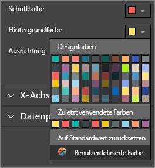
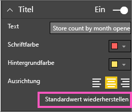
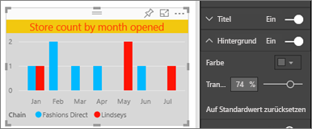
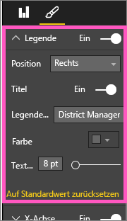

# Anpassen der Titel, Legenden und Hintergründe von Visualisierungen
In diesem Tutorial lernen Sie einige verschiedene Möglichkeiten zum Anpassen von Visualisierungen kennen.   Es gibt eine Vielzahl von Optionen zum Anpassen von Visualisierungen. Diese lernen Sie am besten im Formatierungsbereich kennen (wählen Sie das Farbrollersymbol aus).  Um Ihnen den Einstieg zu erleichtern, wird in diesem Artikel das Anpassen des Titels, der Legende und des Hintergrunds einer Visualisierung erläutert.  

Nicht alle Visualisierungen können benutzerdefiniert angepasst werden. [Hier finden Sie eine vollständige Liste](#list).  

Sehen Sie sich an, wie Amanda Visualisierungen in ihrem Bericht anpasst (Schnellvorlauf zu 4:50 im Video). Befolgen Sie anschließend die Anweisungen unter dem Video, um es mit Ihren eigenen Daten selbst auszuprobieren.

<iframe width="560" height="315" src="https://www.youtube.com/embed/IkJda4O7oGs" frameborder="0" allowfullscreen></iframe>

### Voraussetzungen
- Power BI-Dienst oder Power BI Desktop
- Retail Analysis sample

## Anpassen der Visualisierungstitel in Berichten
Melden Sie sich beim Power BI-Dienst (app.powerbi.com) an, und [öffnen Sie das Analysebeispiel für den Einzelhandel](../sample-datasets.md) in der [Bearbeitungsansicht](../service-interact-with-a-report-in-editing-view.md).

> [!NOTE]
> Wenn Sie eine Visualisierung an ein Dashboard anheften, wird sie zu einer Dashboardkachel.  Die Kacheln können auch in Bezug auf [Titel und Untertitel, Hyperlinks und Größe](../service-dashboard-edit-tile.md) angepasst werden.
> 
> 

1. Navigieren Sie zur Berichtsseite „Neue Läden“, und wählen Sie das Säulendiagramm „Anzahl offener Läden nach Öffnungsmonat...“.
2. Wählen Sie im Bereich „Visualisierungen“ das Farbrollersymbol aus, um die Formatierungsoptionen anzuzeigen.  Wählen Sie **Titel** aus, um diesen Abschnitt zu erweitern.  

   
3. Mithilfe des Schiebereglers für „Ein“ und „Aus“ aktivieren bzw. deaktivieren Sie den **Titel**. Belassen Sie die Einstellung vorerst bei **Ein**.  

   
4. Ändern Sie den **Titeltext** , indem Sie im Textfeld **Ladenanzahl nach Öffnungsmonat** eingeben.  
5. Ändern Sie **Schriftfarbe** in Orange und **Hintergrundfarbe** in Gelb.

   * Wählen in der Dropdownliste aus **Designfarben**, **Zuletzt verwendete Farben**, oder **Benutzerdefinierte Farbe**eine Farbe aus.
   * Wählen Sie die Dropdownliste aus, um das Farbfenster zu schließen.  
     

   Durch Auswahl von **Standardwert wiederherstellen** im Fenster „Farbe“ können Sie jederzeit die Standardfarben wiederherstellen.
6. Vergrößern Sie die Textgröße auf 12.
7. Richten Sie dann wir den Diagrammtitel in der Mitte der Visualisierung aus. Standardmäßig wird der Titel links ausgerichtet.  
   

    Nun sollte der **Titel** des Säulendiagramms etwa wie folgt aussehen:  
    

    Wenn Sie die Anpassungen am Titel zurücksetzen möchten, wählen Sie **Standardwert wiederherstellen**unten im Anpassungsbereich des **Titels** aus.  
    

## Anpassen der Hintergründe von Visualisierungen
Erweitern Sie im gleichen Säulendiagramm die Hintergrundoptionen.

1. Mithilfe des Schiebereglers für „Ein“ und „Aus“ aktivieren bzw. deaktivieren Sie den Hintergrund. Belassen Sie die Einstellung vorerst bei **Ein**.
2. Ändern Sie die Hintergrundfarbe in Grau, 74 %.

   * Wählen Sie die Dropdownliste aus, und wählen Sie aus **Designfarben**, **Zuletzt verwendete Farben** oder **Benutzerdefinierte Farbe** eine graue Farbe aus.
   * Ändern Sie die Transparenz zu 74 %.   
     

   Wenn Sie sämtliche Anpassungen des Hintergrunds zurücksetzen möchten, wählen Sie **Standardwert wiederherstellen**unten im Anpassungsbereich für den **Hintergrund** .

## Anpassen der Legenden von Visualisierungen
1. Öffnen Sie die Berichtsseite **Übersicht** , und wählen Sie das Diagramm „Gesamtabweichung Verkäufe nach Geschäftsmonat und Regionalmanager“ aus.
2. Wählen Sie auf der Registerkarte „Visualisierung“ das Pinsel-Symbol, um den Bereich „Formatierung“ zu öffnen.  
3. Erweitern Sie die Optionen von **Legende** .

      
4. Mithilfe des Schiebereglers für „Ein“ und „Aus“ aktivieren bzw. deaktivieren Sie die Legende. Belassen Sie die Einstellung vorerst bei **Ein**.
5. Verschieben Sie die Legende auf die linke Seite der Visualisierung.    
6. Fügen Sie einen Legendentitel hinzu, indem Sie für den **Titel** die Option **Ein** auswählen und im Feld **Legendenname** den Namen **Manager**eingeben.
   

   Um die Anpassungen der Legende zurückzusetzen, wählen Sie unten im Anpassungsbereich der **Legende****Standardwert wiederherstellen** aus.

## Anpassbare Visualisierungstypen

| Visualisierung | Titel | Hintergrund | Legende |
|:--- |:--- |:--- |:--- |
| Bereich |Ja |Ja |Ja |
| Balken |Ja |Ja |Ja |
| Infokarte |Ja |Ja |n/v |
| Mehrzeilige Infokarte |Ja |Ja |n/v |
| Säulendiagramm |Ja |Ja |Ja |
| Verbunddiagramm |Ja |Ja |Ja |
| Ringdiagramm |Ja |Ja |Ja |
| Flächenkartogramm |Ja |Ja |Ja |
| Trichterdiagramm |Ja |Ja |n/v |
| Tachometerdiagramm |Ja |Ja |n/v |
| KPI |Ja |Ja |n/v |
| Liniendiagramm |Ja |Ja |Ja |
| Zuordnung |Ja |Ja |Ja |
| Matrix |Ja |Ja |n/v |
| Kreisdiagramm |Ja |Ja |Ja |
| Punktdiagramm |Ja |Ja |Ja |
| Datenschnitt |Ja |Ja |n/v |
| Tabelle |Ja |Ja |n/v |
| Textfeld |Nein |Ja |n/v |
| Treemap |Ja |Ja |Ja |
| Wasserfalldiagramm |Ja |Ja |Ja |

## Nächste Schritte
[Anpassen der x- und y-Achse](power-bi-visualization-customize-x-axis-and-y-axis.md)  
[Anpassen von Farben und Achseneigenschaften](service-getting-started-with-color-formatting-and-axis-properties.md)  
[Power BI – Grundkonzepte](../service-basic-concepts.md)  
Weitere Fragen? [Wenden Sie sich an die Power BI-Community](http://community.powerbi.com/)

